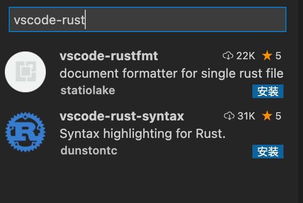

# 1. 安装rust

```
curl https://sh.rustup.rs -sSf | sh

输入1

Current installation options:


   default host triple: aarch64-apple-darwin
     default toolchain: stable (default)
               profile: default
  modify PATH variable: yes

1) Proceed with installation (default)
2) Customize installation
3) Cancel installation
>1
```

[其他方法](https://forge.rust-lang.org/infra/other-installation-methods.html)

验证

```
Rust is installed now. Great!

To get started you may need to restart your current shell.
This would reload your PATH environment variable to include
Cargo's bin directory ($HOME/.cargo/bin).

To configure your current shell, run:
source $HOME/.cargo/env
```

```
执行
source $HOME/.cargo/env

rustc -version

rustc --version        
rustc 1.58.1 (db9d1b20b 2022-01-20)
```

卸载

```
rustup self uninstall
```

# 2.  rustup安装

rustup 是rust官方的版本管理工具。应当作为安装 Rust 的首选。

项目主页是: https://github.com/rust-lang-nursery/rustup.rs

卸载

```
rustup self uninstall
```

# 3. 安装vscode编译器

下载 VScode
请打开官网 https://code.visualstudio.com/ 下载编辑器。

依赖
如本章第一节所述，准备好 racer，rust 源代码，rustfmt，rls 这四样东西，并且配置好相应的环境变量，此不赘述。

安装 Rust 扩展 Rust
打开 VScode 编辑器；
按 Ctrl + p 打开命令面板；
在编辑器中上部浮现出的输入框中，输入 ext install vscode-rust，会自动搜索可用的插件，搜索出来后，点击进行安装；使用VScode打开任意一个.rs文件，插件首次启动会自动引导用户完成配置。
注:推荐使用RLS模式，即使用Rust Langular Server提供各项功能支持




安装完毕

```
$ cargo new code
     Created binary (application) `code` package
$ cargo build   
   Compiling code v0.1.0 (/Users/xxx/Desktop/rust/code)
    Finished dev [unoptimized + debuginfo] target(s) in 1.15s
$ cargo run  
    Finished dev [unoptimized + debuginfo] target(s) in 0.00s
     Running `target/debug/code`
Hello, world!
```

# 4. Cargo 教程

## 4.1 Cargo 是什么

Cargo 是 Rust 的构建系统和包管理器。

Rust 开发者常用 Cargo 来管理 Rust 工程和获取工程所依赖的库。在上个教程中我们曾使用 cargo new greeting 命令创建了一个名为 greeting 的工程，Cargo 新建了一个名为 greeting 的文件夹并在里面部署了一个 Rust 工程最典型的文件结构。这个 greeting 文件夹就是工程本身。

## 4.2 Cargo 功能

Cargo 除了创建工程以外还具备构建（build）工程、运行（run）工程等一系列功能，构建和运行分别对应以下命令：

```
cargo build 
cargo run 
```

Cargo 还具有获取包、打包、高级构建等功能，详细使用方法参见 Cargo 命令。


# 5. 运行代码方式

## 5.1 cargo

不用生成二进制文件的

```不用生成二进制文件的
cargo build
cargo build —release # 这个属于优化编译
cargo run 可直接运行
cargo run # 编译和运行合在一起
```

## 5.2 rustc

生成二进制文件的

```
rustc helloworld.rs
rustc helloworld.rs -O # 也可以选择优化编译
```

## 5.3 使用cargo创建项目

* 创建项目 hellorust

```
ps: cargo new hellorust —bin
```


* 查看目录结构

```
ps: tree # win10 powershell 自带有 tree 查看文件目录结构的功能  
└─hellorust  
——└─src
```


这里显示的目录结构，在hellorust目录下有 src 文件夹和 Cargo.toml 文件，同时这个目录会初始化为 git 项目

* 查看Cargo.toml文件

```
ps: cat Cargo.toml  
[package]  
name = “hellorust”  //包名
version = “0.1.”  //包的版本
authors = [“YourName “]  //作者
edition = "2021" //rust的发布版本
[dependencies]//依赖的包
```


* 编辑src目录下的main.rs文件

```
ps: subl ./src/main.rs
```


cargo 创建的项目，在src目录下会有一个初始化的main.rs文件，内容为：

```
fn main() {
println!("Hello, world!");
}
```


现在我们编辑这个文件，改为：

```
fn main() {
let rust = "Rust";
println!("Hello, {}!", rust);
}
```

这里的 `let rust = "Rust"` 是把 rust 变量绑定为 “Rust” ，  
`println!("Hello, {}!", rust);`里把 rust 变量的值代入到`"Hello, {}!"`中的`{}`。

* 编译和运行

```
ps: cargo build  
ps: cargo build —release # 这个属于优化编译  
ps: ./target/debug/hellorust.exe  
ps: ./target/release/hellorust.exe # 如果前面是优化编译，则这样运行  
ps: cargo run # 编译和运行合在一起  
ps: cargo run —release # 同上，区别是是优化编译的
```

## 5.4 cargo run
会直接运行
```
cargo run  
    Finished dev [unoptimized + debuginfo] target(s) in 0.03s
     Running `target/debug/cargo_new`
```
如果没有改遍会直接运行
如果有改变会编译在运行

## 5.5 cargo check
此命令是检测程序是否有错误的，和buil的的区别在于，此命令不回进行编译，因此更快
```
$ cargo check
    Checking cargo_new v0.1.0 (/Users/zql/Desktop/rust/cargo_new)
    Finished dev [unoptimized + debuginfo] target(s) in 0.41s
```

## 5.6 为发布构建

```
cargo build --ralease
```
会进行代码优化，编译较慢，但是程序运行较快，进行代码优化
会在target/release下生成可执行文件，不是target/debug


## 5.7 猜数游戏 
```
use std::io;

//use 是引入库
//std 标准库 的io

fn main() {
    println!("猜数游戏!");

    //let 是定义变量
    //mut 是可引用的 
    //: String 是数据类型，自动推导的
    //任何变量是不可变的 immutable 加上mut是可变的
    // let mut foo = 1;
    // let bar = foo;
    // foo = 2;//cannot mutate immutable variable `foo`
    // foo= 2; 加上mut 是可变的

    //String utf8 可自懂扩展大小 标准库
    let mut guess = String::new();

    //io stdin 是控制台输入  read
    io::stdin().read_line(&mut guess).expect("无法读取行");//不使用expect 也可以，会提示为对异常进行处理
    //mut 是可变的 &引用默认也是不可变的，只能引用&mut 就是引用可变的
    //如果不用use 引入 可以这样写// &mut 引用可变对象，否则是错误的
    // std::io::stdin().read_line(guess).expect("错误信息并且推出")

    //read_line返回的是io::Result 枚举类型
    //io::Result Ok Err 也可以写成这昂
   match  std::io::stdin().read_line(&mut guess){
        Ok(n)=>{
            println!("{n} byte read" )
        }
        Err(error)=>{
            println!("read{error}")
        }
   }
    

    println!("你猜测的数是 {}",guess);
}
```
## 5.8 包的crate的管理
在cargo.toml中引入
```
rand = "0.3.14"
rand = "^0.3.14"
^代表和此版本兼容的所有版本都可以
```
然后会在cargo build的下载 https://crates.io/search?q=rand


修改下载源
```
首先进入电脑的cargo目录，MAC OS 默认安装在 ~/.cargo下：

cd ~/.cargo

创建一个config文件，这里使用vim编辑器：

vim config

进到编辑界面后，键入i，切换到插入模式

将下面的代码贴进去：

[source.crates-io]

registry = "https://github.com/rust-lang/crates.io-index"

replace-with = 'ustc'

[source.ustc]

registry = "git://mirrors.ustc.edu.cn/crates.io-index"

此步骤相当于修改了crates的下载源，切换到国内镜像。

按esc退出编辑模式，键入:wq，表示保存并退出即可。

再次尝试，就可以愉快的下载安装依赖啦~！
```

## 5.9 cargo.lock
是符合本项目的包的版本
如果存在会优先使用
如果想升级的话在cargo.toml中国呢指定版本 运行
```
cargo update
```
或者直接执行cargo build 会自动进行升级
升级会覆盖cargo.lock

## 5.10 生成随机数
```
use std::io;

use rand::Rng;//trait 相当于interface
fn main(){
    println!("猜数游戏-rand");

    let mut guess = String::new();

    let rand_num = rand::thread_rng().gen_range(1, 101);
    println!("s随机数为{}",rand_num);
    
    match io::stdin().read_line(&mut guess) {
        Ok(n)=>{
            println!("read {n} byte" );
        }
        Err(error)=>{
            println!("read {error}")
        }
        
    }
    println!("猜的数字为{}",guess)
}
```

## 5.11 比较输入和随机数大小
```

use rand::Rng;
fn main(){
    println!("猜数游戏");

    let rand_num = rand::thread_rng().gen_range(1, 100);
    println!("生成的随机数是{}",rand_num);


//loop是循环
loop {
    let mut guess = String::new();

    match std::io::stdin().read_line(&mut guess){
        Ok(n)=>println!("read {n} byte"),
        Err(error)=>println!("read err:{error}")
    }

    let guess:u32 = match  guess.trim().parse() {
        Ok(n)=>n,
        Err(error)=>{
            println!("error - err {error}");
            //continue是跳出当前
           continue;
        },
        
    };

    println!("输入的参数是{} rand的📖是{}",guess,rand_num);

    match guess.cmp(&rand_num){
        //break是终止loop循环
        //返回的是Ordering类型
        std::cmp::Ordering::Equal => {println!("win");break},
        std::cmp::Ordering::Greater=> println!("is max"),
        std::cmp::Ordering::Less =>  println!("is less"),
        //都没匹配
        // Other => {println!("other")},
    }
}
   
}
```

# 变量声明
声明变量let
默认是不可变的
如果想让变量可变 在前面加上mut
## 常量
- 常量也是不可变的，是永久不可变的
- const 声明常量
- 常量作用域 在全局有效
- 规范是全部大写 MAX_POINTS
```
const MAX_POINT :u32 = 100_00;
```

- 如果不使用let关键字，那么重新给非mut的变量赋值会报错，因为好似不可变的
- 使用let声明的关键字，也是不可变的
```


fn main(){
    //虽然是不同类型 但是是重新声明了变量是可以的
    let space = " ";
    let space = space.len();

    let space1= " ";
    //space1 = space1.len()
    //   |              ^^^^^^^^^^^^ expected `&str`, found `usize`
    //是如同一个变量，是那hi改变了类型，会报错
    // space1 = space1.len()

   
}
```

# 6. 数据类型

### 整数型（Integer）

整数型简称整型，按照比特位长度和有无符号分为一下种类：

| 位长度     | 有符号   | 无符号   |
| ------- | ----- | ----- |
| 8-bit   | i8    | u8    |
| 16-bit  | i16   | u16   |
| 32-bit  | i32   | u32   |
| 64-bit  | i64   | u64   |
| 128-bit | i128  | u128  |
| arch    | isize | usize |

isize 和 usize 两种整数类型是用来衡量数据大小的，它们的位长度取决于所运行的目标台，如果是 32 位架构的处理器将使用 32 位位长度整型。

整数的表述方法有以下几种：

| 进制            | 例           |
| ------------- | ----------- |
| 十进制           | 98_222      |
| 十六进制          | 0xff        |
| 八进制           | 0o77        |
| 二进制           | 0b1111_0000 |
| 字节(只能表示 u8 型) | b'A'        |

很显然，有的整数中间存在一个下划线，这种设计可以让人们在输入一个很大的数字时更容易判断数字的值大概是多少。


整数溢出
 - u8的范围是0-255，如果把一个u8变量值变为256，那么
 - 调试模式下编译 rust会检测证书溢出，如果溢出就会报错
 - 发布模式下 --release 编译不会检测panic发生 如果发生溢出 就会 发生环绕操作
 - 256 变为 0 257 变为1 但是程序不回panic

## 6.1 浮点数型（Floating-Point）

Rust 与其它语言一样支持 32 位浮点数（f32）和 64 位浮点数（f64）。默认情况下，64.0 将表示 64 位浮点数，因为现代计算机处理器对两种浮点数计算的速度几乎相同，但 64 位浮点数精度更高。
float64精度更高，也是默认类型

#### 实例

```
fn main() {  
 let x = 2.0; // f64  
 let y: f32 = 3.0; // f32  
}
```

## 6.2 布尔型

布尔型用 bool 表示，值只能为 true 或 false。

## 6.3 字符型

字符型用 char 表示。

Rust的 char 类型大小为 4 个字节，代表 Unicode标量值，这意味着它可以支持中文，日文和韩文字符等非英文字符甚至表情符号和零宽度空格在 Rust 中都是有效的 char 值。

<mark>**注意** 由于中文文字编码有两种（GBK 和 UTF-8），所以编程中使用中文字符串有可能导致乱码的出现，这是因为源程序与命令行的文字编码不一致，所以在 Rust 中字符串和字符都必须使用 UTF-8 编码，否则编译器会报错。</mark>

```
fn main() {

// string types
let str = "Hello, world!";
let  strings  = str.to_string();//to_string转换为队字符串
// let  mut strings  = str.to_string();//加了mut 后 warning: variable does not need to be mutable 因为String就是可变的，不需要加mut
println!("{}",str);
println!("{}",strings);
}
```


## 6.4 字符串类型

最底层的是不定长类型`str`，更常用的是字符串切片`&str`和堆分配字符串`String`

<mark>其中字符串切片是静态分配的，有固定的大小，并且不可变，而堆分配字符串是可变的。</mark>

```
fn main() {


// tuples
let tuple: (i32, &str) = (50, "hello");
println!("{}",tuple.0);
println!("{}",tuple.1);
let (fifty, _) = tuple;
println!("{}",fifty);
let hello = tuple.1;
println!("{}",hello);

let mut to_str = hello.to_string();

to_str.pop();//尾部推出一个元素
println!("{}",to_str);
to_str.clear();//清空元素
to_str.push_str("string");

println!("{}",to_str);
}
```


## 6.5 元组

具有固定大小的有序列表，每个元素都有自己的类型，通过解构或者索引来获得每个元素的值。
- 元组不可修改，长度不可修改
- 元组的数据访问使用tup.0 tup.1

```

fn main() {
    let tup: (i32, f64, u8) = (500, 6.4, 1);
// tup.0 等于 500
// tup.1 等于 6.4
// tup.2 等于 1
println!("{},{},{}",tup.0,tup.1,tup.2);
let (x,y,z) = tup;
// y 等于 6.4
println!("{},{},{}",x,y,z)
}
```


```
500,6.4,1
500,6.4,1
```

## 6.6 数组

具有固定大小，并且元素都是同种类型，可表示为`[T; N]`。
- 数组的长度不可变
- 数组访问用下标
- 数据存在stack上 不是堆上
- vector 也是数组 长度可变
- 数组类型[类型;长度]
- 超过索引的范围编译不会报错，运行会报错

```
fn main() {
   let a = [1,2,3,4,5];//a 是一个长度为 5 的整型数组
   println!("{}",a[0]);//注意此处和元组的访问方式不一样，元组是.

   let b = ["aaa","bbb","ccc"];//b 是一个长度为 3 的字符串数组
   println!("{}",b[1]);

   let c:[i32; 5] = [1,2,3,4,5];//c 是一个长度为 5 的 i32 数组
   println!("{}",c[2]);

   let d:[i32;5] = [3;5];//等同于 let d = [3, 3, 3, 3, 3];
   println!("{}",d[3]);

   let first = a[0];
   let second = a[1];

   println!("{}",first);
   println!("{}",second);

//    a[1]= 123;//错误，不可变元素
   let mut  a = [1,2,3];
   a[0]= 4;//正确
   println!("{}",a[0])

}
```


```
1
bbb
3
3
1
2
4
```

## 6.7 切片

引用一个数组的部分数据并且不需要拷贝，可表示为`&[T]`。

```
fn main() {


let a = [0, 1, 2, 3, 4];
let mut middle = &a[1..4];
// middle[2] = 10; middle` is a `&` reference, so the data it refers to cannot be written 切片是引用类型，不能重写原来的
println!("{}",middle[2]);

// let mut ten_zeros: [i64; 10] = [0; 10];//数组是不可变的，如果后边没有改变行为最好不要用mut，warning: variable does not need to be mutable
let  mut ten_zeros: [i64; 10] = [0; 10];//数组是不可变的，不能用mut

println!("{}",ten_zeros[0]);
ten_zeros[0] = 9;
println!("{}",ten_zeros[0]);


    //注意要&用 用1..2  go的是1:2 但是都是前闭后开的
    let arr = &arr[1..2];

    println!("{}",arr[0]);
    // println!("{}",arr[1]);//thread 'main' panicked at 'index out of bounds: the len is 1 but the index is 1', src/main.rs:13:19
   
}
```

```
3
0
9

2
```

## 6.8 指针和引用

* 解除引用使用  `*`
* 构析使用 `&`, `ref`, 和 `ref mut`

```
fn main() {


// raw pointers
let x = 5;
let raw = &x as *const i32;

let x1 = "hello";
let raw1 = &x1;
println!("{}",x1);//hello
println!("{}",*raw1);//hello 和go一样 可以识别第一层 但是第二层就是数据的地址了
println!("{}",raw1);//hello 和go一样 可以识别第一层 但是第二层就是数据的地址了

let points_at = unsafe { *raw };
let points_at1 =  *raw1 ;
println!("{}",points_at);
println!("{}",points_at1)
// // functions
// fn foo(x: i32) -> i32 { x }
// let bar: fn(i32) -> i32 = foo;

}
```


```
hello
hello
5
hello
```


## 6.9 函数

：具有函数类型的变量实质上是一个函数指针
- 声明使用fn
- 使用蛇形命令_ 分割
- 形参数必须指明类型

- 语句是执行动作的一些指令
- 表达式会计算产生一个值

```
fn main(){
    let x = 5;

    let y = {
        let x= 1;
        //如果没加;就是一个表达式
        //加了就是一个语句，是没有值的 是 `()`
        //语句没有返回值，是一些指令的操作
        //表达式才会产生结果
        x+3
    };
    println!("y is {}",y)
   
}
```

返回返回值
- 函数->符号声明返回值的类型，但是不恶意为返回值命名 ，和go是有区别的
- 在rust 返回值就是最后一个表达值的值
- 如果想提前返回 使用return

```
fn main(){
 let five = five();
 println!("return value is {}",five);

}


fn five()->i32{
    //此时是一个表达式
    5

    //return 也可以,有return的时候是可以加;的 
    // return 5;
    // return 5

    //此时是一个语句,返回时（）
    // 5;
}
```

# 注释
- 文档注释

# if 表达式
```
if five ==3 {

    }else if five == 4 {
        
    }else{
        
    }
```

如果代码的if esle 比较多 使用match 会比较整洁

## match 重构
```
fn main(){
    let five = five();

    match five {
        3 => println!("is 3"),
        4 => println!("is 4"),
	//都不满足走 相当于else
        _ => println!("is 5 good")
    }

    println!("return value is {}",five);

}


fn five()->i32{
    //此时是一个表达式
    5

    //return 也可以,有return的时候是可以加;的 
    // return 5;
    // return 5

    //此时是一个语句,返回时（）
    // 5;
}
```

## 在let 中使用if
因为if是一个表达式，所以可以将它放在let的右边
```
fn main(){
    let value = if true { 5} else{6};
    println!("{}",value);

}
```

# 循环
rust 提供了三种循环 loop while for

loop 循环珂使用break 终止循环 return 也是可以的 ,可以使用
```
fn main(){
    
    let mut i = 0;
    let num = loop {
        i += 1;

        if i == 2{
            println!("is continue {}",i);
            continue;
        }else if i == 3{
        println!("is break {}",i);

            break i * 10;
            //return也可以
        }
        println!("is loop {}",i);
        
    };
    println!("is num {}",num);

}

s loop 1
is continue 2
is break 3
is num 30
```

while 
每次循环之前判断一次条件，符合预期才会执行
```
fn main(){
    
    let mut i = 3;
    
    // while 是没有返回值的 因为条件先判断了
    // let num = while i != 3 {
    //     i -= 1;
    // };


     while i != 0 {
        i -= 1;
    };

}
```

for 遍历集合

range
指定开始和结束数字，但是不包含结束数字
rev 可以反转range
```
fn main(){
    
    //实现倒计时

    let num = [1,2,3];

    for v in num.iter(){
        println!("for in {}",v)
    }
    //for in 1
    // for in 2
    // for in 3

    //rev可以反转
    for num in (1..4).rev(){
        println!("for in  () {}",num)

    }
    //for in  () 3
    //for in  () 2
    //for in  () 1

}
```
# 所有权
- 每个值都有一个变量，这个变量是这个值的所有者
- 每个值同时只有一个所有者
- 当超出所有者作用域（scope）时候，该值被删除

## String
- 分配在heap上
- 是可变的
- from 创建
	```
	fn main(){

	   let mut s = String::from("Hello ");
	   s.push_str("word");

	   println!("{}",s)

	}
	
	Hello word
	```
- 可需改原因
	- 字符串字面值在编译的时候就知道大小，被硬编码到可执行文件中，速度更快
	- String 为支持其可变性，需要在heap分配内存
	- Rust 的String 是所有者原则，当内存数据在不需要的时候就会立即释放，自动调用drop自动释放

## 数据mave
- 多个数据可以使用同一种方式来move 例如 x的变量的所有权交给y
	```
	let y = 5;
	x= 5
	```
因为是基本类型 都会被压入stack
- String 是在堆上分配
- stack 上的数据是复制，基本数据类型
	```
	fn main(){
    
		let y = 5;
		let x= 5;

		println!("y is {},x is {}",y,x);
		//y is 5,x is 5

		let s = String::from("string");
		let z1 = s.clone();
		println!("za is {}",z1);
		//za is string 如果同时使用两个 可以使用clone 在heap上重新clone一份

		let z = s;


		//println!("s is {}, z is {}",s,z);// ^ value borrowed here after move s把所有权给了z 所有s被清楚了，在打印就会报错

	}

```


- 基本数据类型都是可以copy的
- 整数类型、char、bool、元组tpule，也是不可变的，但是全部是才可以


# 所有权与函数
- 在语义上，将值传给函数或者赋值给变量是一样的
- 将值传递给函数也会发生**移动**或者**复制**
- 返回值也会发生所有权的move
```
fn main(){
    let s = String::from("Hello World");
    println!("s is {}",s);

    let s1 = take_ownership(s);

    /*
         - move occurs because `s` has type `String`, which does not implement the `Copy` trait
...
5  |     let s1 = take_ownership(s);
   |                             - value moved here
6  |     println!("s is {}",s);
   |                        ^ value borrowed here after move
     */
    //println!("s is {}",s);//报错 因为 s在调用函数的时候已经发生移动，此处不能使用
    println!("s1 is {}",s1);//s1可以使用是在函数处理完毕后 将变量的所有权交给了s1


    let i1 : i32 = 5;//i32是基本类型 自动实现了copy trait的这个copy接口 所以要所有权还在 只是在stakcopy了一份
    makes_copy(i1);
    println!("i1 is {}",i1);
}

//返回值也会发生所有权的move
fn take_ownership(str:String)->String{
    println!("take_ownership str {}",str);
    str
}

fn makes_copy(i:i32){
    println!("makes_copy i is {}",i);
}

//s is Hello World
//take_ownership str Hello World
//s1 is Hello World
//makes_copy i is 5
//i1 is 5
```


# 引用和借用
## 引用
- 引用就是获取某些值但是不获取变量的所有权
- 引用是&,相当于是取址操作
```
fn main(){
    let s = String::from("Hello world");
    println!("引用之前的s-{}",s);
    //次数的函数调用传入的& 引用 就是取址操作 
    let l = calculate_length(&s);
    println!("引用之后s-{}，长度是-{}",s,l);

}

fn calculate_length(s :&String)->usize{
    s.len()
}

引用之前的s-Hello world
引用之后s-Hello world，长度是-11
```

## 借用
-把引用给函数参数的这个行为就是借用 &操作
- 是否可以修改 借用的值？
```
fn main(){
    let s = String::from("Hello world");
    println!("引用之前的s-{}",s);
    //次数的函数调用传入的& 引用 就是取址操作 
    let l = calculate_length(&s);
    println!("引用之后s-{}，长度是-{}",s,l);

}

fn calculate_length(s :&String)->usize{
    //s.push_str("!!");
    //     ^^^^^^^^^^^^^^^^ `s` is a `&` reference, so the data it refers to cannot be borrowed as mutable
    // s.push_str("!!");

    //借用是不可以修改这个值的 ,
    s.len()
}
```
## 可变引用
- 可变引用 就是引用的变量是可变的 就可以修改
- 变量为可变mut 其次是& 传参和入参 都是&mut
- 可变引用另一种 此值就是可变的，也是不可以的，这种属于借用，借用和引用都是不可以的，只有可变引用才可以 &mut
- 在一个作用域内只能有一个可变引用，好处是在编译就能保证不会产生data race
- 不同的作用域是可以同时有两个可变引用的
- 不可以同时拥有一个可变引用和一个不可变引用，保证不可变引用数据的一致性
```
fn main(){
    let mut s = String::from("Hello world");
    println!("引用之前的s-{}",s);
    //次数的函数调用传入的& 引用 就是取址操作 

    //传参，首先是可变变量 mut 其次是& 或者直接是可变变量传入String 本身就是可变的 所有不回加mut
    let l = calculate_length(&mut s);
    println!("引用之后s-{}，长度是-{}",s,l);

    //引用之前的s-Hello world
    //引用之后s-Hello world!!，长度是-13      

    let s1 = String::from("可变的变量");

}

//注意此处是&mut 传参的时候也是这样
fn calculate_length(s :&mut String)->usize{
    //s.push_str("!!");
    //     ^^^^^^^^^^^^^^^^ `s` is a `&` reference, so the data it refers to cannot be borrowed as mutable
    s.push_str("!!");

    //借用是不可以修改这个值的 ,
    s.len()
}

fn ke_bian(s:String)->usize{

    //因为即使没加引用 这个是借用的变量 也是不能修改的
    //s.push_str("，可变的变量的后缀");//s.push_str("，可变的变量的后缀");
    // |     ^^^^^^^^^^^^^^^^^^^^^^^^^^^^^^^^ cannot borrow as mutable
    s.len()
}

```

同一作用域只能有一个可变引用
不同作用域的同时存在的可变引用
```
fn main(){
    let mut s = String::from("Hello world");
    println!("引用之前的s-{}",s);
    
    {
        let s1 =&mut s;
    }

    let s2 = &mut s;

}
```
{}是一个作用域

不可以同时拥有一个可变引用和一个不可变引用
保证不可变引用的数据一致性
```
fn main(){
    let mut s = String::from("Hello world");
    println!("引用之前的s-{}",s);

    //同一作用域
    let s1 =&s;
    let s3 =&s;
    //s2.push_str("string");
    // 10 |     println!("引用之后的s-{}",s);
    // |                               ^ immutable borrow occurs here
    // let s2 = &mut s;//前面有不变引用 ，此处如果有可变引用 保证不了引用的数据一致性
    s2.push_str("string");
    println!("引用之后的s-{}",s);
    
    println!("s-{},s1-{},s3-{},s2-{}",s,s1,s3,s2);

}
```
# 悬空引用 dangling references
- 一个指针引用了内存中的某个地址，但是这块地址已经释放给别人使用了
- 在rust 保证永远不会产生悬空引用
```
fn main(){
    let s = dangle();

}
fn dangle()->String{
    let mut s = String::from("Hello world");
    //^^ expected struct `String`, found `&String`
    &s //因为在返回返回的时候会把变量move到新的变量上 s是个空 在引用的话会出现悬空引用
}
```


## 6.10 元类型

：即`()`，其唯一的值也是`()`

## 6.11  <mark>总结</mark>

有几点是需要特别注意的：

* 数值类型可以使用`_`分隔符来增加可读性。
* Rust还支持单字节字符`b'H'`以及单字节字符串`b"Hello"`，仅限制于ASCII字符。  
  此外，还可以使用`r#"..."#`标记来表示原始字符串，不需要对特殊字符进行转义。
* 使用`&`符号将`String`类型转换成`&str`类型很廉价，  
  但是使用`to_string()`方法将`&str`转换到`String`类型涉及到分配内存，  
  除非很有必要否则不要这么做。
* 数组的长度是不可变的，动态的数组称为Vec (vector)，可以使用宏`vec!`创建。
* 元组可以使用`==`和`!=`运算符来判断是否相同。
* 不多于32个元素的数组和不多于12个元素的元组在值传递时是自动复制的。
* Rust不提供原生类型之间的隐式转换，只能使用`as`关键字显式转换。
* 可以使用`type`关键字定义某个类型的别名，并且应该采用驼峰命名法。

```
// explicit conversion
let decimal = 65.4321_f32;
let integer = decimal as u8;
let character = integer as char;
// type aliases
type NanoSecond = u64;
type Point = (u8, u8);
```


## 6.12 数组、动态数组、字符串

### 6.12.1 数组 array

Rust 使用数组存储相同类型的数据集。  
`[T; N]`表示一个拥有 T 类型，N 个元素的数组。数组的大小是固定。

**例子：**

```
fn main() {
    let mut array: [i32; 3] = [0; 3];
    array[1] = 1;
    array[2] = 2;
   assert_eq!([1, 2], &array[1..]);
    // This loop prints: 0 1 2
    for x in &array {
    println!("{} ", x);
    }
}

0
1
2
```


### 6.12.2 动态数组 Vec

动态数组是一种基于堆内存申请的连续动态数据类型，拥有 O(1) 时间复杂度的索引、压入（push）、弹出（pop)。

**例子：**

```
fn main() {
    //创建空Vec
    let v: Vec<i32> = Vec::new();
    println!("{:#?}",v);

    //使用宏创建空Vec
    let v: Vec<i32> = vec![];
    println!("{:#?}",v);

    //创建包含5个元素的Vec
    let v = vec![1, 2, 3, 4, 5];
    println!("{}",v[1]);

    //创建十个零
    let v = vec![0; 10];
    println!("{:#?}",v[2]);

    //创建可变的Vec，并压入元素3
    let mut v = vec![1, 2];
    v.push(3);
    println!("{:#?}",v);

    //创建拥有两个元素的Vec，并弹出一个元素
    let mut v = vec![1, 2];
    let two = v.pop();
    println!("{:#?}",two);

    //创建包含三个元素的可变Vec，并索引一个值和修改一个值
    let mut v = vec![1, 2, 3];
    let three = v[1];
    println!("{}",three);
    v[1] = v[1] + 5;
    println!("{:#?}",v);
    println!("{}",three);
}
```


```
     Running `target/debug/code`
[]
[]
2
0
[
    1,
    2,
    3,
]
Some(
    2,
)
2
[
    1,
    7,
    3,
]
2
```

## 6.13字符串

Rust 里面有两种字符串类型。`String` 和 `str`。

### 6.13.1 &str

`str` 类型基本上不怎么使用，通常使用 `&str` 类型，它其实是 `[u8]` 类型的切片形式 `&[u8]`。这是一种固定大小的字符串类型。  
常见的的字符串字面值就是 `&'static str` 类型。这是一种带有 `'static` 生命周期的 &str 类型。

**例子：**

```
fn main() {
// 字符串字面值
let hello = "Hello, world!";
println!("{}",hello);

// 附带显式类型标识
let hello1: &'static str = "Hello, world1!";
println!("{}",hello1);
}
```


### 6.13.2 String

`String` 是一个带有的 `vec:Vec<u8>` 成员的结构体，你可以理解为 `str` 类型的动态形式。  
它们的关系相当于 `[T]` 和 `Vec<T>` 的关系。  
显然 `String` 类型也有压入和弹出。

**例子：**

```
fn main() {
    // 创建一个空的字符串
    let mut s = String::new();
    s.push('c');
    println!("{:#?}",s);

    // 从 `&str` 类型转化成 `String` 类型
    let mut hello = String::from("Hello, ");
    // 压入字符和压入字符串切片
    hello.push('w');
    hello.push_str("orld!");
    // 弹出字符。
    let mut s = String::from("foo");
    assert_eq!(s.pop(), Some('o'));
    assert_eq!(s.pop(), Some('o'));
    assert_eq!(s.pop(), Some('f'));
    assert_eq!(s.pop(), None);
}

```


### 6.13.3 static

<font color=red>`'static` 生命周期是可能的生命周期中最长的，它会在整个程序运行的时期中 存在。`<mark>'static` 生命周期也可被强制转换成一个更短的生命周期。有两种方式使变量 拥有 `'static` 生命</mark>周期，它们都把数据保存在可执行文件的只读内存区：</font>

* 使用 `static` 声明来产生常量（constant）。
* 产生一个拥有 `&'static str` 类型的 `string` 字面量。

看下面的例子，了解列举到的各个方法：

```
// 产生一个拥有 `'static` 生命周期的常量。
static NUM: i32 = 18;

// 返回一个指向 `NUM` 的引用，该引用不取 `NUM` 的 `'static` 生命周期，
// 而是被强制转换成和输入参数的一样。
fn coerce_static<'a>(_: &'a i32) -> &'a i32 {
    &NUM
}

fn main() {
    {
        // 产生一个 `string` 字面量并打印它：
        let static_string = "I'm in read-only memory";
        println!("static_string: {}", static_string);

        // 当 `static_string` 离开作用域时，该引用不能再使用，不过
        // 数据仍然存在于二进制文件里面。
    }
    // println!("static_string: {}", static_string);//报错 static_string 已经离开作用域了
    
    {
        // 产生一个整型给 `coerce_static` 使用：
        let lifetime_num = 9;

        // 将对 `NUM` 的引用强制转换成 `lifetime_num` 的生命周期：
        let coerced_static = coerce_static(&lifetime_num);

        println!("coerced_static: {}", coerced_static);
    }
    
    println!("NUM: {} stays accessible!", NUM);
}

```

# 7. 结构体

- 结构体 (struct) 是一种记录类型，所包含的每个域 (field) 都有一个名称。  

- 每个结构体也都有一个名称，通常以大写字母开头，使用驼峰命名法。  

- 元组结构体 (tuple struct) 是由元组和结构体混合构成，元组结构体有名称，  

- 但是它的域没有。当元组结构体只有一个域时，称为新类型 (newtype)。  

- 没有任何域的结构体，称为类单元结构体 (unit-like struct)。  

- 结构体中的值默认是不可变的，需要给结构体加上`mut`使其可变。

```
use std::ops::Shr;

 // structs
 struct Point {
    x: i32,
    y: i32,
}

fn main() {
  
    let point = Point { x: 0, y: 10 };
    println!("{:#?},{}",point.x,point.y);

    // tuple structs 元组结构体
    struct Color(u8, u8, u8);
    let android_green = Color(0xa4, 0xc6, 0x39);
    let Color(red, green, blue) = android_green;
    println!("{}",red);
    println!("{}",green);
    println!("{}",blue);

    // A tuple struct’s constructors can be used as functions.
    struct Digit(i32);
    let v = vec![0, 1, 2];

    let d: Vec<Digit> = v.into_iter().map(Digit).collect();

    // newtype: a tuple struct with only one element
    struct Inches(i32);
    let length = Inches(10);
    let Inches(integer_length) = length;
   

    // unit-like structs
    struct EmptyStruct;
    let empty = EmptyStruct;
}
```

# 8. Rust 结构体

Rust 中的结构体（Struct）与元组（Tuple）都可以将若干个类型不一定相同的数据捆绑在一起形成整体，但结构体的每个成员和其本身都有一个名字，这样访问它成员的时候就不用记住下标了。元组常用于非定义的多值传递，而结构体用于规范常用的数据结构。结构体的每个成员叫做"字段"。

## 8.1 结构体定义

这是一个结构体定义：

```
struct Site {
    domain: String,
    name: String,
    nation: String,
    found: u32
}
```


注意：如果你常用 C/C++，请记住在 Rust 里 struct 语句仅用来定义，不能声明实例，结尾不需要 ; 符号，而且每个字段定义之后用 , 分隔。

## 8.2 结构体实例

Rust 很多地方受 JavaScript 影响，在实例化结构体的时候用 JSON 对象的 key: value 语法来实现定义：

实例

```
let runoob = Site {
    domain: String::from("www.runoob.com"),
    name: String::from("RUNOOB"),
    nation: String::from("China"),
    found: 2013
};
```


如果你不了解 JSON 对象，你可以不用管它，记住格式就可以了：

```
结构体类名 {
    字段名 : 字段值,
    ...
}
```


这样的好处是不仅使程序更加直观，还不需要按照定义的顺序来输入成员的值。

如果正在实例化的结构体有字段名称和现存变量名称一样的，可以简化书写：

实例

```
let domain = String::from("www.runoob.com");
let name = String::from("RUNOOB");
let runoob = Site {
    domain,  // 等同于 domain : domain,
    name,    // 等同于 name : name,
    nation: String::from("China"),
    traffic: 2013
};
```


有这样一种情况：你想要新建一个结构体的实例，其中大部分属性需要被设置成与现存的一个结构体属性一样，仅需更改其中的一两个字段的值，可以使用结构体更新语法：

```
let site = Site {
    domain: String::from("www.runoob.com"),
    name: String::from("RUNOOB"),
    ..runoob
};
```


注意：..runoob 后面不可以有逗号。这种语法不允许一成不变的复制另一个结构体实例，意思就是说至少重新设定一个字段的值才能引用其他实例的值。

## 8.3 元组结构体

有一种更简单的定义和使用结构体的方式：**元组结构体**。

元组结构体是一种形式是元组的结构体。

与元组的区别是它有名字和固定的类型格式。它存在的意义是为了处理那些需要定义类型（经常使用）又不想太复杂的简单数据：

```
struct Color(u8, u8, u8);
struct Point(f64, f64);

let black = Color(0, 0, 0);
let origin = Point(0.0, 0.0);
```


"颜色"和"点坐标"是常用的两种数据类型，但如果实例化时写个大括号再写上两个名字就为了可读性牺牲了便捷性，Rust 不会遗留这个问题。元组结构体对象的使用方式和元组一样，通过 . 和下标来进行访问：

实例

```
fn main() {
    struct Color(u8, u8, u8);
    struct Point(f64, f64);

    let black = Color(0, 0, 0);
    let origin = Point(0.0, 0.0);

    println!("black = ({}, {}, {})", black.0, black.1, black.2);
    println!("origin = ({}, {})", origin.0, origin.1);
}
```

运行结果：

black = (0, 0, 0) origin = (0, 0)

## 8.4 结构体所有权

结构体必须掌握字段值所有权，因为结构体失效的时候会释放所有字段。

这就是为什么本章的案例中使用了 String 类型而不使用 &str 的原因。

但这不意味着结构体中不定义引用型字段，这需要通过"生命周期"机制来实现。

但现在还难以说明"生命周期"概念，所以只能在后面章节说明。

### 8.4.1 输出结构体

调试中，完整地显示出一个结构体实例是非常有用的。但如果我们手动的书写一个格式会非常的不方便。所以 Rust 提供了一个方便地输出一整个结构体的方法：

实例

```
#[derive(Debug)]

struct Rectangle {
    width: u32,
    height: u32,
}

fn main() {
    let rect1 = Rectangle { width: 30, height: 50 };

    println!("rect1 is {:?}", rect1);
}
```


如第一行所示：一定要导入调试库 **#[derive(Debug)]** ，之后在 println 和 print 宏中就可以用 {:?} 占位符输出一整个结构体：

```
rect1 is Rectangle { width: 30, height: 50 }
```

如果属性较多的话可以使用另一个占位符 {:#?} 。

输出结果：

```
rect1 is Rectangle {
    width: 30,
    height: 50
}
```


## 8.5 结构体方法

方法（Method）和函数（Function）类似，只不过它是用来操作结构体实例的。

如果你学习过一些面向对象的语言，那你一定很清楚函数一般放在类定义里并在函数中用 this 表示所操作的实例。

Rust 语言不是面向对象的，从它所有权机制的创新可以看出这一点。但是面向对象的珍贵思想可以在 Rust 实现。

结构体方法的第一个参数必须是 &self，不需声明类型，因为 self 不是一种风格而是关键字。

计算一个矩形的面积：

实例

```
struct Rectangle {
    width: u32,
    height: u32,
}
   
impl Rectangle {
    fn area(&self) -> u32 {
        self.width * self.height
    }
}

fn main() {
    let rect1 = Rectangle { width: 30, height: 50 };
    println!("rect1's area is {}", rect1.area());
}
```


输出结果：

```
rect1's area is 1500
```

请注意，在调用结构体方法的时候不需要填写 self ，这是出于对使用方便性的考虑。

一个多参数的例子：

实例

```
struct Rectangle {
    width: u32,
    height: u32,
}

impl Rectangle {
    fn area(&self) -> u32 {
        self.width * self.height
    }

    fn wider(&self, rect: &Rectangle) -> bool {
        self.width > rect.width
    }
}

fn main() {
    let rect1 = Rectangle { width: 30, height: 50 };
    let rect2 = Rectangle { width: 40, height: 20 };

    println!("{}", rect1.wider(&rect2));
}
```

运行结果：

```
false
```

这个程序计算 rect1 是否比 rect2 更宽。

---

## 8.6 结构体关联函数

之所以"结构体方法"不叫"结构体函数"是因为"函数"这个名字留给了这种函数：它在 impl 块中却没有 &self 参数。

这种函数不依赖实例，但是使用它需要声明是在哪个 impl 块中的。

一直使用的 String::from 函数就是一个"关联函数"。

实例

```
#[derive(Debug)]
struct Rectangle {
    width: u32,
    height: u32,
}

impl Rectangle {
    fn create(width: u32, height: u32) -> Rectangle {
        Rectangle { width, height }
    }
}

fn main() {
    let rect = Rectangle::create(30, 50);
    println!("{:?}", rect);
}
```


运行结果：

```
Rectangle { width: 30, height: 50 }
```


<mark>贴士：</mark>结构体 impl 块可以写几次，效果相当于它们内容的拼接！

### 单元结构体

结构体可以只作为一种象征而无需任何成员：

```
struct UnitStruct;
```

我们称这种没有身体的结构体为单元结构体（Unit Struct）。


# 9. enum枚举类

```
#[derive(Debug)]

enum Book {
    Papery, Electronic
}

fn main() {
    let book = Book::Papery;
    println!("{:?}", book);
    println!("{:?}",Book::Electronic)
}
```


```
Electronic
```

书分为纸质书（Papery book）和电子书（Electronic book）。

如果你现在正在开发一个图书管理系统，你需要描述两种书的不同属性（纸质书有索书号，电子书只有 URL），你可以为枚举类成员添加元组属性描述：

```

#[derive(Debug)]

enum Book {
    Papery(u32),
    Electronic(String),
}

fn main() {
    let book = Book::Papery(100);
    println!("{:?}", book);
    println!("{:?}",Book::Electronic(String::from("url://....")))
}


Papery(100)
Electronic("url://....")
```


如果你想为属性命名，可以用结构体语法：

```

#[derive(Debug)]

enum Book {
    Papery{
        index:  u32,
        index1:isize,
    },
    Electronic{
        url:String,
        url1: &'static str,
    },
}

fn main() {

    let index :u32 = 100;
    let index1 :isize = 101;

    let url :String = String::from("utl://...");
    let url1 :&'static str = "url://....1";

    //虽然可以如此命名，但请注意，并不能像访问结构体字段一样访问枚举类绑定的属性。访问的方法在 match 语法中。

    let book = Book::Papery{
        index:index,
        index1:index1,
    };

    match book {
        Book::Papery{index,index1} =>{
            println!("{}-1",index);
            println!("{}-1",index1);
        },
        Book::Electronic { url, url1 } => {
            println!("{}",url);
            println!("{}",url1);
        },
    }

    let elaec = Book::Electronic{
        url,
        url1,
    };

    match elaec {
        Book::Papery{index,index1}=>{
            println!("{}",index);
            println!("{}",index1);
        },

        Book::Electronic{url,url1}=>{
            println!("{}-2",url1);
            println!("{}-2",url);
        }
        
    }
    

    // println!("{:?}", book);
    // println!("{:?}",elaec)
}


```


```
100-1
101-1
url://....1-2
utl://...-2
```


match 块也可以当作函数表达式来对待，它也是可以有返回值的：

```
match 枚举类实例 {
    分类1 => 返回值表达式,
    分类2 => 返回值表达式,
    ...
}
```

但是所有返回值表达式的类型必须一样！

如果把枚举类附加属性定义成元组，在 match 块中需要临时指定一个名字：

```

#[derive(Debug)]

enum Book {
    Papery(u32),
    Electronic {url: String},
}

fn main() {

    let book = Book::Papery(1001);
    let elac = Book::Electronic{url:String::from("url://....")};

    match book {
        Book::Papery(i) => {
            println!("{}", i+5);
        },
        Book::Electronic { url } => {
            println!("{}", url);
        }
    }

    match elac {
        Book::Papery(i) => {
            println!("{}", i);
        },
        Book::Electronic { url } => {
            println!("{}", url);
        }
    }
}


1006
url://....

```


<font color=red>match 除了能够对枚举类进行分支选择以外，还可以对整数、浮点数、字符和字符串切片引用（&str）类型的数据进行分支选择。其中，浮点数类型被分支选择虽然合法，但不推荐这样使用，因为精度问题可能会导致分支错误。</font>

对非枚举类进行分支选择时必须注意处理例外情况，即使在例外情况下没有任何要做的事 . 例外情况用下划线 _ 表示：

```

// #[derive(Debug)]

fn main() {
    let t = "abc";
    match t {
        // "abc" => println!("Yes"),
        _ => {},
    }
}


```

# 10. Option 枚举类

Option 是 Rust 标准库中的枚举类，这个类用于填补 Rust 不支持 null 引用的空白。

许多语言支持 null 的存在（C/C++、Java），这样很方便，但也制造了极大的问题，null 的发明者也承认这一点，"一个方便的想法造成累计 10 亿美元的损失"。

null 经常在开发者把一切都当作不是 null 的时候给予程序致命一击：毕竟只要出现一个这样的错误，程序的运行就要彻底终止。

为了解决这个问题，很多语言默认不允许 null，但在语言层面支持 null 的出现（常在类型前面用 ? 符号修饰）。

Java 默认支持 null，但可以通过 @NotNull 注解限制出现 null，这是一种应付的办法。

Rust 在语言层面彻底不允许空值 null 的存在，但无奈null 可以高效地解决少量的问题，所以 Rust 引入了 Option 枚举类：

```
enum Option<T> {
    Some(T),
    None,
}
```

如果你想定义一个可以为空值的类，你可以这样：

```
let opt = Option::Some("Hello");
```


如果你想针对 opt 执行某些操作，你必须先判断它是否是 **Option::None**：

相当于是应用了范形

```

#[derive(Debug)]
enum Option<T> {
    Some(T),
    None,
}
fn main() {
    let opt = Option::Some("Hello");
    match opt {
        Option::Some(something) => {
            println!("{}", something);
        },
        Option::None => {
            println!("opt is nothing");
        }
    }
}

Hello
```

如果你的变量刚开始是空值，你体谅一下编译器，它怎么知道值不为空的时候变量是什么类型的呢？

所以初始值为空的 Option 必须明确类型：

```
fn main() {
    let opt: Option<&str> = Option::None;
    match opt {
        Option::Some(something) => {
            println!("{}", something);
        },
        Option::None => {
            println!("opt is nothing");
        }
    }
}
opt is nothing
```


```

#[derive(Debug)]
enum Option<T> {
    // Some(T),
    None(T),
}
fn main() {
    let opt: Option<&str> = Option::None("something");
    match opt {
        Option::None(something) => {
            println!("opt is nothing{}",something);
        }
    }
}

opt is nothingsomething
```

这种设计会让空值编程变得不容易，但这正是构建一个稳定高效的系统所需要的。由于 Option 是 Rust 编译器默认引入的，在使用时可以省略 Option:: 直接写 None 或者 Some()。

Option 是一种特殊的枚举类，它可以含值分支选择：

```
#[derive(Debug)]
enum Option<T> {
    Some(T),
    None,
}
fn main() {
    let opt = Option::Some("Hello");
    match opt {
        Option::Some(something) => {
            println!("{}", something);
        },
        Option::None => {
            println!("opt is nothing");
        }
    }
}

#[derive(Debug)]
enum Option<T> {
    Some(T),
    // None,
}
fn main() {
    let opt = Option::Some("Hello");
    match opt {
        Option::Some(something) => println!("{}", something),
        // Option::None => println!("opt is nothing"),
        
    }
}

//可以不写{}


#[derive(Debug)]
enum Option<T> {
    Some(T),
    None,
}
fn main() {
    let t = Some(64);
    match t {
            Some(a) => println!("Yes{}-->",&a),
            _ => println!("No"),
    }
}


```

# 11. 常量

Rust 有两种常量，可以在任意作用域声明，包括全局作用域。这两种常量都要显式地标注：

* `const`： 不可改变的值（常用类型）。
* `static`： 在 [`'static`](https://llever.com/rust-by-example-cn/custom_types/scope/lifetime/static_lifetime.html) 生命周期内可能发生改变的变量。

有个特例就是 `"string"` 原始类型。可以给它直接赋一个不可改变的 `static` 变量，是因为它的 类型标记：`&'static str` 包含了生命周期 `'static`。其他的引用类型都必须特别注明从而拥有 `'static` 生命周期。这似乎是无关紧要的，因为所需的显式标记会隐藏差异（This may seem minor though because the required explicit annotation hides the distinction.）。

## 11.1 const

对于const，常量贯穿于整个程序的生命周期。更具体的，Rust 中的常量并没有固定的内存地址。这是因为实际上它们会被内联到用到它们的地方。为此对同一常量的引用并不能保证引用到相同的内存地址。

```
const N: i32 = 5;    //定义一个整型常量
```


一个常量可以理解为是一个C语言中的#define，它有元数据开销但无运行时开销。

## 11.2 static

对于static，Rust以静态量的方式提供了类似“全局变量”的功能。它们与常量类似，不过静态量在使用时并不内联。这意味着对每一个值只有一个实例，并且位于内存中的固定位置。

```
static N: i32 = 5;
static NAME: &'static str = "Steve";     //静态量贯穿于整个程序的生命周期，因此任何存储在常量中的引用有一个'static生命周期

//因为这是可变的，一个线程可能在更新N同时另一个在读取它，导致内存不安全。
//因此访问和改变一个static mut是不安全（unsafe）的，因此必须在unsafe块中操作
static mut NUM: i32 = 10;
unsafe {
	NUM=NUM+1;
}

```


如果想赋予一个非常量表达式，可以参考用第三方库lazy_static（A macro for declaring lazily evaluated statics in Rust.）解决。

## 11.3 区别

* <font color=red>定义方式类型，一个使用 static，一个使用 const；</font>

* <font color=red>名称都要求使用大写，否则会报 Warning；</font>

* <font color=red>都必须明确指定类型；</font>

* <font color=red>两者都要求必须使用常量表达式进行赋值，即必须是编译期能计算出的值；</font>

但和常量也有一些重要的区别：

* <font color=green>常量在编译时被内联，但静态变量不会。在整个程序中静态变量只有一个实例，也就是说所有引用都指向同一个地址。</font>

* <font color=green>常量不可变，而静态变量和普通变量一样，默认不可变，但可以通过 mut 关键字定义为可变。</font>

也正是因为全局变量有可变特性，导致多个线程同时访问时，可能引发数据竞争，导致内存安全问题。因此，对于全局可变变量的访问和修改必须放在 unsafe 块中进行。以下代码编译不通过：

```
static mut NUM: i32 = 10;

fn main() {
    NUM += 1;
    println!("{}", NUM);
}

```

编译器提示：

> error[E0133]: use of mutable static is unsafe and requires unsafe function or block

改为这样就可以了：

```
static mut NUM: i32 = 10;

fn main() {
    unsafe {
        NUM += 1;
        println!("{}", NUM);
    }
}
```

unsafe，Go 程序员应该很熟悉。在 Go 中一般也建议别用它。

如果不用 unsafe，也就是静态变量别定义为可变，那这和常量似乎没啥区别，直接使用 const 更好。


## 11.4 实例

```
// 在所有的作用域外声明全局变量。
static LANGUAGE: &'static str = "Rust";
const  THRESHOLD: i32 = 10;

fn is_big(n: i32) -> bool {
    // 在一般函数中访问常量
    n > THRESHOLD
}


//因此访问和改变一个static mut是不安全（unsafe）的，因此必须在unsafe块中操作
//可变静态变量
static mut N: i32 = 5;


fn main() {
    let n = 16;

    // 在 main 函数(主函数)中访问常量
    println!("This is {}", LANGUAGE);

    println!("The threshold is {}", THRESHOLD);
    println!("{} is {}", n, if is_big(n) { "big" } else { "small" });

    // 报错！不能修改一个 `const` 常量。
    // THRESHOLD = 5;
    // 改正 ^ 注释掉此行

    //全局可变变量的访问和修改必须放在 unsafe 块中进行
    unsafe {
        N += 1;
        println!("N: {}", N);
    }
}


```


```
This is Rust
The threshold is 10
16 is big
N: 6
```

# 12. 变量绑定

Rust 通过静态类型确保类型安全。变量绑定可以在声明变量时标注类型。不过在多数情况下，编译器能够 从字面内容推导出变量的类型，大大减少了标注类型的负担。

使用 `let` 绑定操作可以将值（像具体数据）绑定到变量中。

```
fn main() {
    let an_integer = 1u32;
    let a_boolean = true;
    let unit = ();

    // 将 `an_integer` 复制到 `copied_integer`
    let copied_integer = an_integer;

    println!("An integer: {:?}", copied_integer);
    println!("A boolean: {:?}", a_boolean);
    println!("Meet the unit value: {:?}", unit);

    // 编译器会对未使用变量绑定产生警告；可在变量名加上下划线的前缀来消除这些警告内容。
    let _unused_variable = 3u32;

    let noisy_unused_variable = 2u32;
    // 改正 ^ 在变量名加上下划线前缀消除警告
}

```


```
An integer: 1
A boolean: true
Meet the unit value: ()
```


## 12.1 可变变量

变量绑定默认是不可变的，但加上 `mut` 修饰语后变量就可以改变。

```
fn main() {
    let _immutable_binding = 1;
    let mut mutable_binding = 1;

    println!("Before mutation: {}", mutable_binding);

    // 正确代码
    mutable_binding += 1;

    println!("After mutation: {}", mutable_binding);

    // 错误！
    //cannot assign twice to immutable variable
    // _immutable_binding += 1;
    // 改正 ^ 将此行注释掉
}

```


```
Before mutation: 1
After mutation: 2
```


## 12.2 作用域和隐藏

变量绑定有一个作用域，并且限定在一个**代码块**（block）中存活（live）。代码块是一个被 `{}` 包围的 语句集合。另外也允许[变量隐藏](https://en.wikipedia.org/wiki/Variable_shadowing)。

```
fn main() {
    // 此绑定存在于 main 函数中
    let long_lived_binding = 1;

    // 这是一个代码块，比 main 函数拥有一个更小的作用域
    {
        // 此绑定只存在于本代码块
        let short_lived_binding = 2;

        println!("inner short: {}", short_lived_binding);

        // 此绑定*隐藏*了外面的绑定
        let long_lived_binding = 5_f32;

        println!("inner long: {}", long_lived_binding);
    }
    // 代码块结束

    // 报错！`short_lived_binding` 在此作用域上不存在
    //println!("outer short: {}", short_lived_binding);
//    |                                 ^^^^^^^^^^^^^^^^^^^ help: a local variable with a similar name exists: `long_lived_binding
    // println!("outer short: {}", short_lived_binding);
    // 改正 ^ 注释掉这行

    println!("outer long: {}", long_lived_binding);

    // 此绑定同样*隐藏*了前面的绑定
    let long_lived_binding = 'a';

    println!("outer long: {}", long_lived_binding);
}

```


```
inner short: 2
inner long: 5
outer long: 1
outer long: a
```


## 12.3 变量先声明

Rust 语言可以先声明变量绑定，后面才将它们初始化。但是这种情况用得很少，因为这样很可能导致使用未 初始的变量。

```
fn main() {
    // 声明一个变量绑定
    let a_binding;
    // a_binding = 5;

    {
        let x = 2;

        // 初始化一个绑定
        a_binding = x * x;
    }

    //初始化，未赋值的变量 作用域不同也可以
    println!("a binding: {}", a_binding);

    let another_binding;

    // 报错！使用了未初始化的绑定
    //编译器禁止使用未经初始化的变量，因为这会产生未定义行为（undefined behavior）。
    //use of possibly-uninitialized `another_binding` 未初始化
    // println!("another binding: {}", another_binding);
    // 改正 ^ 注释掉此行

    another_binding = 1;

    println!("another binding: {}", another_binding);
}

```


```
a binding: 4
another binding: 1
```

# 13. 类型转换

Rust 在基本类型之间没有提供隐式类型转换（强制类型转换）（implicit type conversion，coercion ）。不过使用 `as` 关键字进行显式类型转换（explict type conversion，casting）。

一般来说，Rust 的整型类型的转换规则遵循 C 语言的惯例，除了那些在 C 语言是未定义行为的情况。在 Rust 中，所有的整型类型转换的行为都得到了很好的定义。

```
// 消除会溢出的类型转换的所有警告。
#![allow(overflowing_literals)]

fn main() {
    let decimal = 65.4321_f32;

    // 报错！不能隐式转换类型
    // error ^^^^^^^ expected `u8`, found `f32`
    // let integer: u8 = decimal;
    // 改正 ^ 注释掉此行

    // 显式转换类型
    let integer = decimal as u8;
    let character = integer as char;

    println!("Casting: {} -> {} -> {}", decimal, integer, character);

    // 当将任意整数值转成无符号类型（unsigned 类型） T 时，
    // 将会加上或减去 std::T::MAX + 1，直到值符合新的类型

    // 1000 原本就符合 u16 类型
    println!("1000 as a u16 is: {}", 1000 as u16);

    // 1000 - 256 - 256 - 256 = 232
    // 在计算机底层会截取数字的低8位（the least significant bit，LSB），
    // 而高位（the most significant bit，MSB）数字会被抛掉。
    // （译注：此操作是按二进数存储的数字位进行）
    println!("1000 as a u8 is : {}", 1000 as u8);
    // -1 + 256 = 255
    println!("  -1 as a u8 is : {}", (-1i8) as u8);

    // 对正数来说，上面的类型转换操作和取模效果一样
    println!("1000 mod 256 is : {}", 1000 % 256);

    // 当将整数值转成有符号类型（signed 类型）时，同样要先将（二进制）数值
    // 转成相应的无符号类型（译注：如 i32 和 u32 对应，i16 和 u16对应），
    // 然后再求此值的补码（two's complement）。如果数值的最高位是 1，则数值
    // 是负数。

    // 除非值本来就已经符合所要转的类型。
    println!(" 128 as a i16 is: {}", 128 as i16);
    // 128 as u8 -> 128，再求数字128的8位二进制补码得到：
    println!(" 128 as a i8 is : {}", 128 as i8);

    // 重复上面的例子
    // 1000 as u8 -> 232
    println!("1000 as a i8 is : {}", 1000 as i8);
    // 232 的补码是 -24
    println!(" 232 as a i8 is : {}", 232 as i8);
}

```


```
Casting: 65.4321 -> 65 -> A
1000 as a u16 is: 1000
1000 as a u8 is : 232
  -1 as a u8 is : 255
1000 mod 256 is : 232
 128 as a i16 is: 128
 128 as a i8 is : -128
1000 as a i8 is : -24
 232 as a i8 is : -24
```


## 字面量

数字字面量可以加上类型标记作为后缀来标注类型。举个例子，要指定字面量 `42` 为 `i32` 类型，可以写成 `42i32`。

未加上后缀的数字字面量的类型视使用它们的情况而定。如果没有限定，编译器会将整型定为 `i32` 类型，将浮点数定为 `f64` 类型。

```
fn main() {
    // 有后缀的字面量，它们的类型在初始化时就确定
    let x = 1u8;
    let y = 2u32;
    let z = 3f32;

    // 无后缀的字面量，它们的类型视使用情况而定
    let i = 1;
    let f = 1.0;

    // `size_of_val` 返回变量的大小，以字节（byte）为单位
    println!("size of `x` in bytes: {}", std::mem::size_of_val(&x));
    println!("size of `y` in bytes: {}", std::mem::size_of_val(&y));
    println!("size of `z` in bytes: {}", std::mem::size_of_val(&z));
    println!("size of `i` in bytes: {}", std::mem::size_of_val(&i));
    println!("size of `f` in bytes: {}", std::mem::size_of_val(&f));


    //后缀可以用_表明类型
    let x_ = 1_u8;
    let y_ = 2_u32;
    let z_ = 3_f32;

    // 无后缀的字面量，它们的类型视使用情况而定
    let i_ = 1_;
    let f_ = 1.6_;

    // `size_of_val` 返回变量的大小，以字节（byte）为单位
    println!("size of `x_` in bytes: {},val of  {}", std::mem::size_of_val(&x_),x_);
    println!("size of `y_` in bytes: {},val of  {}", std::mem::size_of_val(&y_),y_);
    println!("size of `z_` in bytes: {},val of  {}", std::mem::size_of_val(&z_),&z_);
    println!("size of `i_` in bytes: {},val of  {}", std::mem::size_of_val(&i_),i_);
    println!("size of `f_` in bytes: {},val of  {}", std::mem::size_of_val(&f_),f_);


}

```


```
size of `x` in bytes: 1
size of `y` in bytes: 4
size of `z` in bytes: 4
size of `i` in bytes: 4
size of `f` in bytes: 8
size of `x_` in bytes: 1,val of  1
size of `y_` in bytes: 4,val of  2
size of `z_` in bytes: 4,val of  3
size of `i_` in bytes: 4,val of  1
size of `f_` in bytes: 8,val of  1.6
```

前面代码中用了一些尚未解释过的概念，这里列出一些简短的说明：

* `fun(&foo)` 是**通过引用**传参给一个函数，而不是通过值来传参（`fun(foo)`）。更多内容参见 [借用](https://llever.com/rust-by-example-cn/cast/scope/borrow.html)（borrowing）。
* `std::mem::size_of_val` 是一个函数，不过是通过**完整的路径**调用的。代码可以划分到称为 **模块**（module）的逻辑单元中。在这个例子中，`size_of_val` 函数是定义在 `mem` 模块的， `mem` 模块是定义在 `std` 包（crate）中。更多内容参考[模块](https://llever.com/rust-by-example-cn/cast/mod.html) 和 [crate](https://llever.com/rust-by-example-cn/cast/crates.html)。


## 类型推导

类型推导引擎是相当智能的。它不仅仅在初始化期间分析[右值](https://en.wikipedia.org/wiki/Value_%28computer_science%29#lrvalue)的类型，还会通过分析变量在后面是 怎么使用的来推导该变量的类型。这里给出一个类型推导的高级例子：


```
fn main() {
    // 借助类型标注，编译器知道 `elem` 具有 u8 类型。
    let elem = 5u8;
    let elem1 = 6_u16;

    // 创建一个空 vector（可增长数组）。
    let mut vec = Vec::new();
    // 此时编译器并未知道 `vec` 的确切类型，它只知道 `vec` 是一个含有某种类型
    // 的 vector（`Vec<_>`）。

    // 将 `elem` 插入 vector。
    vec.push(elem);
    //expected `u8`, found `u16`
    // vec.push(elem1);
    // Aha！现在编译器就知道了 `vec` 是一个含有 `u8` 类型的 vector(`Vec<u8>`)
    // 试一试 ^ 尝试将 `vec.push(elem)` 那行注释掉
    //error cannot infer type for type parameter `T`

    //先推入什么，数据就是什么类型

    println!("{:?}", vec);
}

```


```
[5]
```

## 别名

<font color=red>`type` 语句可以给一个已存在类型起一个新的名字。类型必须要有 `CamelCase`（驼峰方式）的名称，否则 编译器会产生一个警告。~~对规则为例外的是基本类型： `usize`，`f32`等等。</font>~~

实验证明，usize f32也是可以的

```
// `NanoSecond` 是 `u64` 的新名字。
type NanoSecond = u64;
type Inch = u64;

// 使用一个属性来忽略警告。
#[allow(non_camel_case_types)]
type u64_t = u64;
// 试一试 ^ 试着删掉属性。

type Us = usize;
type F32 = f32;


fn main() {
    // `NanoSecond` = `Inch` = `u64_t` = `u64`.
    let nanoseconds: NanoSecond = 5 as u64_t;
    let nanoseconds1: NanoSecond = 5 ;
    let inches: Inch = 2 as u64_t;

    // 注意类型的别名*没有*提供任何额外的类型安全，因为别名*不是*新的类型
    println!("{} nanoseconds + {} inches = {} unit?",
             nanoseconds,
             inches,
             nanoseconds + inches);

    println!("{} nanoseconds1 + {} inches = {} unit?",
             nanoseconds1,
             inches,
             nanoseconds + inches);

    println!();

    let us :Us = 45;
    let f32 :F32 = 56.67;

    println!("{},{}",us,f32)


}

```


```
5 nanoseconds + 2 inches = 7 unit?
5 nanoseconds1 + 2 inches = 7 unit?

45,56.67
```

别名的主要作用是减少按键，举个例子，`IoResult<T>` 类型是 `Result<T, IoError>` 类型的别名。


# 表达式

Rust 程序（大部分）由一系列语句构成：

```
fn main() {
    // 语句
    // 语句
    // 语句
}
```


Rust 有多种语句。最普遍的语句类型有两种：一种是绑定变量，另一种是表达式带上分号：

```
fn main() {
    // 变量绑定
    let x = 5;

    // 表达式;
    x;
    x + 1;
    15;
}
```

代码块也是表达式，所以它们在赋值操作中可以充当[右值（r-values）](https://en.wikipedia.org/wiki/Value_%28computer_science%29#lrvalue)。代码块中的最后一条 表达式将赋给[左值（l-value）](https://en.wikipedia.org/wiki/Value_%28computer_science%29#lrvalue)。需要注意的是，如果代码块最后一条表达式结尾处有分号，那 么返回值将变成 `()`。（译注：代码块中的最后一条语句是代码块中**实际执行**的最后一条语句，而不一 定是代码块中最后一行的语句。）

```
fn main() {
    let x = 5u32;

    let y = {
        let x_squared = x * x;
        let x_cube = x_squared * x;

        // 将此表达式赋给 `y`
        x_cube + x_squared + x
    };

    let z = {
        // 分号结束了这个表达式，于是将 `()` 赋给 `z`
        2 * x;
    };

    println!("x is {:?}", x);
    println!("y is {:?}", y);
    println!("z is {:?}", z);
}
```


# 流程控制

任何编程语言都包含的一个必要部分就是改变控制流程：`if`/`else`，`for`等。让我们讲述 Rust 语言中 的这部分内容。


## `if/else`

`if`-`else`分支判断和其他语言类似。与很多语言不同的是，Rust 语言中的布尔判断条件不用小括号包住， 每个判断条件后连着一个代码块。`if`-`else`条件选择是一个表达式，<font color=red>并且所有分支都必须返回相同的类型。</font>

```
fn main() {
    let n = 5;

    if n < 0 {
        print!("{} is negative", n);
    } else if n > 0 {
        print!("{} is positive", n);
    } else {
        print!("{} is zero", n);
    }

    let big_n =
        if n < 10 && n > -10 {
            println!(", and is a small number, increase ten-fold");

            // 这条表达式返回一个 `i32` 类型。
            10 * n
        } else {
            println!(", and is a big number, reduce by two");

            // 这条表达式也必须返回一个 `i32` 类型。
            n / 2
            // 试一试 ^ 试着加上一个分号来结束这条表达式。
            //`if` and `else` have incompatible types
        };
    //   ^ 不要忘记在这里加上一个分号！所有的 `let` 绑定都需要它。

    println!("{} -> {}", n, big_n);
}
```


```
5 is positive, and is a small number, increase ten-fold
5 -> 50
```


## loop 循环

Rust 提供了 `loop` 关键字来实现一个无限循环。

可以使用 `break` 语可以在任何时刻退出一个循环，另外可用 `continue` 跳过迭代的剩余部分并重新开始 一轮循环。

<font color=red>只能跳出所在层的循环</font>

```
fn main() {
    let mut count = 0u32;

    println!("Let's count until infinity!");

    loop {
        count += 1;

        if count == 3 {
            println!("three");

            // 跳过这次迭代的剩下内容
            continue;
        }

        println!("{}", count);

        if count == 5 {
            println!("OK, that's enough");

            // 退出循环
            break;
        }
    }

    println!("----------------");


    // // 无限循环
    // loop {
    //     loop {
    //         count += 1;
    
    //         if count == 3 {
    //             println!("three");
    
    //             // 跳过这次迭代的剩下内容
    //             continue;
    //         }
    
    //         println!("{}", count);
    
    //         if count == 5 {
    //             println!("OK, that's enough");
    
    //             // 退出循环
    //             break;
    //         }
    //     }
    //     println!("================")
    // }
    
}
```


```
Let's count until infinity!
1
2
three
4
5
OK, that's enough
----------------
```

### label嵌套循环和标签

在处理嵌套循环的时候可以`中断（break）`或`继续（continue）`外层循环。在这类情形中，循环必须用一 些`'label`（标签）来注明，并且标签传递给 `break`/`continue` 语句。

- break是跳出继续执行

- continue是跳出后从label处再次执行，无限循环

- rust可以使用标签 `'label_name:` (`单引号+标签名+冒号`) 来指定你的 `break` 或 `continue` 语句作用的循环。


```
fn main() {
    let mut count = 0u32;

    println!("Let's count until infinity!");

    'outer: loop {
        count += 1;

        if count == 3 {
            println!("three");

            // 跳过这次迭代的剩下内容
            continue;
        }

        println!("{}", count);

        if count == 5 {
            println!("OK, that's enough");

            // 退出循环
            break 'outer;
        }
    }

    println!("----------------") 
}


Let's count until infinity!
1
2
three
4
5
OK, that's enough
----------------
```


```
#![allow(unreachable_code)]

fn main() {
    'outer: loop {
        println!("Entered the outer loop");

        'inner: loop {
            println!("Entered the inner loop");

            // 这只是中断内部的循环
            //break;

            // 这会中断外层循环
            // break 'outer;
            break 'inner;
        }

        println!("This point will never be reached");
    }

    println!("Exited the outer loop");
}


```


# 从 loop 循环中返回

`loop` 有个用途是尝试一个操作直到成功为止。若操作返回一个值，则可能需要将其传递给代码的其余部分：将该值放在 `break` 之后，并由 `loop` 表达式返回。


# 流程

## while 循环

`while` 关键字可以用作当型循环（当条件满足时循环）。

让我们用 `while` 循环写一个不怎么出名的 [FizzBuzz](http://en.wikipedia.org/wiki/Fizz_buzz) 程序。

```
fn main() {
    // 计数器变量
    let mut n = 1;

    // 当 `n` 小于 101 时进入循环操作
    while n < 101 {
        if n % 15 == 0 {
            println!("fizzbuzz");
        } else if n % 3 == 0 {
            println!("fizz");
        } else if n % 5 == 0 {
            println!("buzz");
        } else {
            println!("{}", n);
        }

        // 计数器值加1
        n += 1;
    }
}
```


```
1
2
fizz
4
buzz
fizz
7
8
fizz
buzz
11
fizz
13
14
fizzbuzz
16
17
fizz
19
buzz
fizz
22
23
fizz
buzz
26
fizz
28
29
fizzbuzz
31
32
...
```


## for 循环和区间

`for in` 结构可以通过一个计数器来迭代。创建计算器的一个最简便的方法就是使用区间标记 `a..b`。这 会生成从 `a`（包含此值） 到 `b` （不含此值）增幅为 1 的一系列值。

让我们使用 `for` 代替 `while` 来写 FizzBuzz 程序。

```

fn main() {
    // `n` 将从 1, 2, ..., 100 这些值依次获取进行每次循环
    for n in 1..101 {
        if n % 15 == 0 {
            println!("fizzbuzz");
        } else if n % 3 == 0 {
            println!("fizz");
        } else if n % 5 == 0 {
            println!("buzz");
        } else {
            println!("{}", n);
        }
    }

    for v in [1,2,3,4,5,6]{
        println!("{}",v)
    }
}
```


```
1
2
fizz
4
buzz
fizz
7
8
fizz
buzz
11
fizz
13
14

...
1
2
3
4
5
6
```

## match 匹配

Rust 通过 `match` 关键字来提供模式匹配，用法和 C 语言的的 `switch` 类似。

```
fn main() {
    let number = 13;
    // 试一试 ^ 将不同的值赋给 `number`

    println!("Tell me about {}", number);
    match number {
        // 匹配单个值
        1 => println!("One!"),
        // 匹配多个值
        2 | 3 | 5 | 7 | 11 => println!("This is a prime"),
        // 匹配一个闭区间范围
        //... 变为..=了 版本 rustc 1.58.1 (db9d1b20b 2022-01-20)
        13..=19 => println!("A teen"),
        // 处理其他情况
        _ => println!("Ain't special"),
    }

    let boolean = true;
    // match 也是一个表达式
    let binary = match boolean {
        // match 分支必须覆盖所有可能的值
        false => 0,
        true => 1,
        // 试一试 ^ 试着将其中一条分支注释掉
    };

    println!("{} -> {}", boolean, binary);
}
```


```
Tell me about 13
A teen
true -> 1
```

### 解构

`match` 代码块可以以多种方式解构内容。

#### 元组

元组可以在 `match` 中解构，如下所示：

```
fn main() {
    let pair = (0, -2);
    // 试一试 ^ 将不同的值赋给 `pair`

    println!("Tell me about {:?}", pair);
    // match 可以解构一个元组
    match pair {
        // 绑定到第二个元素
        (0, y) => {
            println!("First is `0` and `y` is `{:?}`", y)
        },
        (x, 0) => println!("`x` is `{:?}` and last is `0`", x),
        _      => println!("It doesn't matter what they are"),
        // `_` 表示不将值绑定到变量
    }
}
```


```
Tell me about (0, -2)
First is `0` and `y` is `-2`
```

- 注意只走了一个分支，选择了一个分支就不会再走了

- 可以加代码块`{}`也可以不加

#### 枚举

和前面相似，解构 `enum` 方式如下：

```
// 需要 `allow` 来消除警告，因为只使用了一个变量。
#[allow(dead_code)]
enum Color {
    // 这三者仅由它们的名字来表示。
    Red,
    Blue,
    Green,
    // 这些元组含有类似的 `u32` 元素，分别对应不同的名字：颜色模型（color models）。
    RGB(u32, u32, u32),
    HSV(u32, u32, u32),
    HSL(u32, u32, u32),
    CMY(u32, u32, u32),
    CMYK(u32, u32, u32, u32),
}

fn main() {
    let color = Color::RGB(122, 17, 40);
    // 试一试 ^ 将不同的值赋给 `color`

    println!("What color is it?");
    // 可以使用 `match` 来解构 `enum`。
    match color {
        Color::Red   => println!("The color is Red!"),
        Color::Blue  => println!("The color is Blue!"),
        Color::Green => println!("The color is Green!"),
        Color::RGB(r, g, b) =>
            println!("Red: {}, green: {}, and blue: {}!", r, g, b),
        Color::HSV(h, s, v) =>
            println!("Hue: {}, saturation: {}, value: {}!", h, s, v),
        Color::HSL(h, s, l) =>
            println!("Hue: {}, saturation: {}, lightness: {}!", h, s, l),
        Color::CMY(c, m, y) =>
            println!("Cyan: {}, magenta: {}, yellow: {}!", c, m, y),
        Color::CMYK(c, m, y, k) =>
            println!("Cyan: {}, magenta: {}, yellow: {}, key (black): {}!",
                c, m, y, k),
        // 不需要其它分支，因为所有的情形都已覆盖
        _ => println!("is empty")
    }
}
```


```
What color is it?
Red: 122, green: 17, and blue: 40!
```

- <font color=red>如果所有的分支都覆盖了，就不需要其他分支的情况了</font>

#### 指针和引用

对指针来说，解构（destructuring）和解引用（dereferencing）要区分开， 因为这两者的概念是不同的，和 `C` 那样的语言用法不一样。

* 解引用使用 `*`
* 解构使用 `&`，`ref`， 和 `ref mut`

```
fn main() {
    // 获得一个 `i32` 类型的引用。`&` 表示获取一个引用。
    let reference = &4;

    match reference {
        // 如果 `reference` 是对 `&val` 进行模式匹配，则会产生如下比较行为：
        // `&i32`
        // `&val`
        // ^ 我们看到，如果匹配的 `&` 都去掉了，那么就是 `i32` 赋给 `val`。
        &val1 => println!("Got a value via destructuring: {:?}", val1),
    }

    // 为了避免 `&` 的使用，需要在匹配前解引用。
    match *reference {
        val => println!("Got a value via dereferencing: {:?}", val),
    }

    // 如果没有一个引用头部（以 & 开头）会是怎样？ `reference` 是一个 `&`，
    // 因为右边已经是一个引用。
    // 下面这个不是引用，因为右边不是。
    let number = 13;

    match number {
        1 => println!("values"),
        _ => println!("other")
    }
    // Rust 对这种情况提供了 `ref`。它更改了赋值行为，使得可以对具体值
    // 创建引用。这将得到一个引用。
    let ref _is_a_reference = 3;

    match _is_a_reference {
        3 => println!("{}",_is_a_reference),
        _ => println!("other")
    }

    //match 不适用ref的
    // match  _is_a_reference {
        
    // }

    // 相应地，定义两个非引用的值，通过 `ref` 和 `mut` 可以取得引用。
    let value = 5;
    let mut mut_value = 6;

    // 使用 `ref` 关键字来创建引用。
    match value {
        ref r => println!("Got a reference to a value: {:?}", r),
    }

    // 类似地使用 `ref mut`。
    match mut_value {
        ref mut m => {
            // 获得一个引用。在增加内容之前，要先得到解引用（Gotta
            // dereference it before we can add anything to it）。
            *m += 10;
            println!("We added 10. `mut_value`: {:?}", m);
        },
    }
}
```


```
Got a value via destructuring: 4
Got a value via dereferencing: 4
other
3
Got a reference to a value: 5
We added 10. `mut_value`: 16
```

#### 结构体

类似地，解构 `struct` 如下所示：

```
// #[derive(Debug)]
// #[derive(Debug)]

fn main() {
    struct Foo { x: (u32, u32), y: u32 }


    // 解构结构体的成员
    let foo = Foo { x: (1, 2), y: 3 };
    match foo {
        ref _val => println!("print"),
    }
    let Foo { x: (a, b), y } = foo;

    println!("a = {}, b = {},  y = {} ", a, b, y);

    // 可以解构结构体并重命名变量，成员顺序是不重要的

    let Foo { y: i, x: j } = foo;
    println!("i = {:?}, j = {:?}", i, j);

    // 也可以忽略某些变量
    let Foo { y, .. } = foo;
    println!("y = {}", y);

    // 这将得到一个错误：模式中没有提及 `x` 字段
    // let Foo { y } = foo;
}
```


```
print
a = 1, b = 2,  y = 3 
i = 3, j = (1, 2)
y = 3
```

- 可以做结构的转换操作等


### 守卫

可以加上 `match` **守卫**（guard） 来过滤分支。

```
fn main() {
    let pair = (2, -2);
    // 试一试 ^ 将不同的值赋给 `pair`

    println!("Tell me about {:?}", pair);
    match pair {
        (x, y) if x == y => println!("These are twins"),
        // ^ `if condition`(if 条件)部分是一个守卫
        (x, y) if x + y == 0 => println!("Antimatter, kaboom!"),
        (x, _) if x % 2 == 1 => println!("The first one is odd"),
        _ => println!("No correlation..."),
    }
}
```

```
Tell me about (2, -2)
Antimatter, kaboom!
```

### 变量绑定

间接地访问一个变量不可能在分支中使用这个没有重新绑定的变量。 `match` 提供了 `@` 符号来绑定变量到名称：

```
// `age` 函数，返回一个 `u32` 值。
fn age() -> u32 {
    15
}

fn main() {
    println!("Tell me type of person you are");

    match age() {
        0             => println!("I'm not born yet I guess"),
        // 不能直接 `匹配（match）` 1 ... 12，但是孩子是几岁呢？
        // 相反，将 1 ... 12 序列绑定到 `n` 。现在年龄就可以读取了。
        n @ 1  ..= 12 => println!("I'm a child of age {:?}", n),
        n @ 13 ..= 19 => println!("I'm a teen of age {:?}", n),
        // 没有绑定。返回结果。
        n             => println!("I'm an old person of age {:?}", n),
    }
}
```

```
Tell me type of person you are
I'm a teen of age 15
```

# if let

在一些例子中，`match` 使用起来并不优雅。比如：

```
#![allow(unused_variables)]
fn main() {
// 将 `optional` 定为 `Option<i32>` 类型
let optional = Some(7);

match optional {
    Some(i) => {
        println!("This is a really long string and `{:?}`", i);
        // ^ 行首需要2个缩进，就这样可以从 option 类型中对 `i`
        // 进行解构
    },
    _ => {},
    // ^ 必需内容，因为 `match` 需要覆盖全部情况。难道不觉得冗余吗？
};

}
```


```
This is a really long string and `7`
```

`if let` 对这样的用法要简洁得多，并且允许指明特定的各种不同的失败可选项 内容（options）：

```
fn main() {
    // 全部都是 `Option<i32>` 类型
    let number = Some(7);
    let letter: Option<i32> = None;
    let emoticon: Option<i32> = None;

    // `if let` 结构解读：若 `let` 将 `number` 解构成 `Some(i)`，则执行
    // 语句块（`{}`）
    if let Some(i) = number {
        println!("Matched {:?}!", i);
    }

    // 如果要指明失败情形，就使用 else：
    if let Some(i) = letter {
        println!("Matched {:?}!", i);
    } else {
        // 解构失败。换到失败情形（Change to the failure case）。
        println!("Didn't match a number. Let's go with a letter!");
    };

    // 提供一个改变的失败条件（Provide an altered failing condition）。
    let i_like_letters = false;

    if let Some(i) = emoticon {
        println!("Matched {:?}!", i);
    // 解构失败。执行 `else if` 条件来判断轮到的失败分支是否需要执行
    } else if i_like_letters {
        println!("Didn't match a number. Let's go with a letter!");
    } else {
        // 条件执行错误。这是默认的分支：
        println!("I don't like letters. Let's go with an emoticon :)!");
    };
}
```

```
Matched 7!
Didn't match a number. Let's go with a letter!
I don't like letters. Let's go with an emoticon :)!
```


# while let

和 `if let` 类似，`while let` 会产生更加难看的 `match` 的一连串内容。 考虑下面的有关增量 `i` 的一连串内容：

```

#![allow(unused_variables)]
fn main() {
// 将 `optional` 设为 `Option<i32>` 类型
let mut optional = Some(0);

// Repeatedly try this test.
// 重复运行这个测试。
loop {
    match optional {
        // 如果 `optional` 解构成功，就执行下面语句块。
        Some(i) => {
            if i > 9 {
                println!("Greater than 9, quit!");
                optional = None;
            } else {
                println!("`i` is `{:?}`. Try again.", i);
                optional = Some(i + 1);
            }
            // ^ 需要三个缩进！
        },
        // 当解构失败时退出循环：
        _ => { break; }
        // ^ 为什么要这样的语句呢？肯定有更优雅的处理方式！
    }
}
}
```

```
`i` is `0`. Try again.
`i` is `1`. Try again.
`i` is `2`. Try again.
`i` is `3`. Try again.
`i` is `4`. Try again.
`i` is `5`. Try again.
`i` is `6`. Try again.
`i` is `7`. Try again.
`i` is `8`. Try again.
`i` is `9`. Try again.
Greater than 9, quit!
```

使用 `while let` 可以使这一连串内容变得更加优雅：

```
fn main() {
    // 将 `optional` 设为 `Option<i32>` 类型
    let mut optional = Some(0);

    // 分析：当 `let` 将 `optional` 解构成 `Some(i)` 时，就
    // 执行语句块（`{}`）。否则中断退出（`break`）。
    while let Some(i) = optional {
        if i > 9 {
            println!("Greater than 9, quit!");
            optional = None;
        } else {
            println!("`i` is `{:?}`. Try again.", i);
            optional = Some(i + 1);
        }
        // ^ 使用的缩进更少，并且不用显式地处理失败情况。
    }
    // ^ `if let` 有额外可选的 `else`/`else if` 分句，
    // 而 `while let` 没有。
}
```

```
`i` is `0`. Try again.
`i` is `1`. Try again.
`i` is `2`. Try again.
`i` is `3`. Try again.
`i` is `4`. Try again.
`i` is `5`. Try again.
`i` is `6`. Try again.
`i` is `7`. Try again.
`i` is `8`. Try again.
`i` is `9`. Try again.
Greater than 9, quit!
```

# 函数

- 函数使用 `fn` 关键字来声明。

- 函数的参数需要标注类型，就和变量一样

- 另外如果 函数返回一个值(只能返回一个值)，返回类型必须在箭头 `->` 之后特别指出来。

函数最后的表达式将作为返回值。或者在函数内使用 `return` 语句来提前返回值， 甚至在循环或 `if` 内部使用。

让我们使用函数来重写 FizzBuzz 函数吧！

```
// 和 C/C++ 不一样，Rust 的函数定义位置是没有限制的
fn main() {
    // 我们在这里使用函数，并在后面的其他位置定义它
    fizzbuzz_to(100);
}

// 函数返回一个布尔（boolean）值
fn is_divisible_by(lhs: u32, rhs: u32) -> bool {
    // 极端情况，提前返回（Corner case, early return）
    if rhs == 0 {
        return false;
    }

    // 这是一个表达式，这里可以不用 `return` 关键字
    lhs % rhs == 0
}

// 函数不返回值，而实际上是返回一个单元类型 `()`
fn fizzbuzz(n: u32) -> () {
    if is_divisible_by(n, 15) {
        println!("fizzbuzz");
    } else if is_divisible_by(n, 3) {
        println!("fizz");
    } else if is_divisible_by(n, 5) {
        println!("buzz");
    } else {
        println!("{}", n);
    }
}

// 当函数返回 `()` 时，可以从标记中删除返回类型
fn fizzbuzz_to(n: u32) {
    for n in 1..n + 1 {
        fizzbuzz(n);
    }
}
```


```
1
2
fizz
4
buzz
fizz
7
8
fizz
buzz
...
```


## 方法

方法是从属于对象的函数(Mathods are functions attached to objects)。这些方法通过 关键字 `self` 来访问对象中的数据和其他方法。方法在 `impl` 代码块下定义。

```
struct Point {
    x: f64,
    y: f64,
}

// 实现的代码块，所有的 `Point` 方法都在这里给出
impl Point {
    // 这是一个静态方法（static method）
    // 静态方法不需要通过实例来调用
    // 这类方法一般用作构造器（constructor）
    fn origin() -> Point {
        Point { x: 0.0, y: 0.0 }
    }

    // 另外一个静态方法，带有两个参数：
    fn new(x: f64, y: f64) -> Point {
        Point { x: x, y: y }
    }
}

struct Rectangle {
    p1: Point,
    p2: Point,
}

impl Rectangle {
    // 这是实例方法（instance method）
    // `&self` 是 `self: &Self` 的语法糖（sugar），其中 `Self` 是所调用对象
    // 的类型。在这个例子中 `Self` = `Rectangle`
    fn area(&self) -> f64 {
        // `self` 通过点运算符来访问结构体字段
        let Point { x: x1, y: y1 } = self.p1;
        let Point { x: x2, y: y2 } = self.p2;

        // `abs` 是一个 `f64` 类型的方法，返回调用者的绝对值
        ((x1 - x2) * (y1 - y2)).abs()
    }

    fn perimeter(&self) -> f64 {
        let Point { x: x1, y: y1 } = self.p1;
        let Point { x: x2, y: y2 } = self.p2;

        2.0 * ((x1 - x2).abs() + (y1 - y2).abs())
    }

    // 这个方法要求调用者对象是可变的
    // `&mut self` 为 `self: &mut Self` 的语法糖
    fn translate(&mut self, x: f64, y: f64) {
        self.p1.x += x;
        self.p2.x += x;

        self.p1.y += y;
        self.p2.y += y;
    }
}

// `Pair` 含有的资源：两个堆分配的整型
struct Pair(Box<i32>, Box<i32>);

impl Pair {
    // 这个方法“消费”调用者对象的资源
    // `self` 为 `self: Self` 的语法糖
    fn destroy(self) {
        // 解构 `self`
        let Pair(first, second) = self;

        println!("Destroying Pair({}, {})", first, second);

        // `first` 和 `second` 离开作用域后释放
    }
}

fn main() {
    let rectangle = Rectangle {
        // 静态方法使用双重冒号来调用
        p1: Point::origin(),
        p2: Point::new(3.0, 4.0),
    };

    // 实例方法通过点运算符来调用
    // 注意第一个参数 `&self` 是隐式传递的，比如：
    // `rectangle.perimeter()` === `Rectangle::perimeter(&rectangle)`
    println!("Rectangle perimeter: {}", rectangle.perimeter());
    println!("Rectangle area: {}", rectangle.area());

    let mut square = Rectangle {
        p1: Point::origin(),
        p2: Point::new(1.0, 1.0),
    };

    // 报错！ `rectangle` 是不可变的，但这方法需要一个可变对象
    //rectangle.translate(1.0, 0.0);
    // 试一试 ^ 将此行注释去掉

    // 正常运行！可变对象可以调用可变方法
    square.translate(1.0, 1.0);

    let pair = Pair(Box::new(1), Box::new(2));

    pair.destroy();

    // 报错！前面的 `destroy` 调用“消费了” `pair`
    // pair.destroy();
    // 试一试 ^ 将此行注释去掉
    //use of moved value: `pair`
}
```


```
Rectangle perimeter: 14
Rectangle area: 12
Destroying Pair(1, 2)
```


## 闭包

闭包（closure）在 Rust 中也称为 lambda，是一类捕获封闭环境的函数。例如，一个可以捕获 x 变量的闭包如下：

`|val| val + x` 

它们的语法和能力使它们在临时（on the fly）使用相当方便。调用一个闭包和调用一个函数完全相同。然而，输入和返回类型两者都**可以**自动推导，<font color=red>且输入变量名**必须**指明。</font>

其他的特点包括：

* 使用 `||` 替代 `()` 将输入变量括起来。
* 区块定界符（`{}`）对于单条表达式是可选的，其他情况必须加上。
* 有能力捕获到外部环境变量。

```
fn main() {
    // 通过闭包和函数实现增量。
    fn  function            (i: i32) -> i32 { i + 1 }

    // 闭包是匿名的，这里我们将它们绑定到引用。
    // 类型标注和函数的一样，不过类型标注和使用 `{}` 来围住代码都是可选的。
    // 这些匿名函数（nameless function）赋值给合适命名的变量。
    let closure_annotated = |i: i32| -> i32 { i + 1 };
    let closure_inferred  = |i     |          i + 1  ;

    let i = 1;
    // 调用函数和闭包。
    println!("function: {}", function(i));
    println!("closure_annotated: {}", closure_annotated(i));
    println!("closure_inferred: {}", closure_inferred(i));

    // 没有参数的闭包，返回一个 `i32` 类型。
    // 返回类型是自动推导的。
    let one = || 1;
    println!("closure returning one: {}", one());
}
```


### 捕获

闭包本身是相当灵活的，可以实现所需功能来让闭包运行而不用类型标注（原文：Closures are inherently flexible and will do what the functionality requires to make the closure work without annotation）。这允许变量捕获灵活地适应使用 情况，有时是移动（moving）有时是借用（borrowing）（原文：This allows capturing to flexibly adapt to the use case, sometimes moving and sometimes borrowing.）。闭包可以捕获变量：

* 通过引用：`&T`
* 通过可变引用：`&mut T`
* 通过值：`T`

它们更倾向于通过引用来捕获变量并且只在需要时才用后面用法（原文：They preferentially capture variables by reference and only go lower when required.）。

```
fn main() {
    use std::mem;
    
    let color = "green";

    // 闭包打印 `color`，它会马上借用（`&`）`color` 并将该借用和闭包存储
    // 到 `print` 变量中。它会一保持借用状态直到 `print` 离开作用域。
    // `println!` 只需要`通过引用`，所以它没有采用更多任何限制性的内容。
    // （原文：`println!` only requires `by reference` so it doesn't
    // impose anything more restrictive.）
    let print = || println!("`color`: {}", color);

    // 使用借用来调用闭包。
    print();
    print();

    let mut count = 0;

    // 闭包使 `count` 值增加，可以使用 `&mut count` 或者 `count`，
    // 但 `&mut count` 限制更少，所以采用它。立刻借用 `count`。
    // （原文： A closure to increment `count` could take either
    // `&mut count` or `count` but `&mut count` is less restrictive so
    // it takes that. Immediately borrows `count`.）
    //
    // `inc` 前面需要加上 `mut`，因为存储了一个'&mut'里面。因此，调用闭包会改变需要
    // 因此，调用该闭包转变成需要一个 `mut` 的闭包。
    // （原文：A `mut` is required on `inc` because a `&mut` is stored
    // inside. Thus, calling the closure mutates the closure which requires
    // a `mut`.）
    let mut inc = || {
        count += 1;
        println!("`count`: {}", count);
    };

    // 调用闭包。
    inc();
    inc();

    let reborrow = &mut count;
    println!("{}",reborrow);
    // ^ 试一试： 将此行注释去掉。
    
    // 不可复制类型（non-copy type）。
    let movable = Box::new(3);

    // `mem::drop` requires `T` so this must take by value. A copy type
    // would copy into the closure leaving the original untouched.
    // 
    // `mem::drop` 要求 `T`，所以这必须通过值来实现（原文：`mem::drop`
    // requires `T` so this must take by value.）。可复制类型将会复制
    // 值到闭包而不会用到原始值。不可复制类型必须移动（move），从而
    // `可移动`（movable） 立即移动到闭包中（原文：A non-copy must
    // move and so `movable` immediately moves into the closure）。
    let consume = || {
        println!("`movable`: {:?}", movable);
        mem::drop(movable);
    };

    // `consume` 消费（consume）了该变量，所以这只能调用一次。
    consume();
    //value used here after moverustc(E0382)
    // consume();
    // ^ 试一试：将此行注释去掉。
}
```


```
`color`: green
`color`: green
`count`: 1
`count`: 2
2
`movable`: 3
```


### 作为输入参量

虽然 Rust 在捕获临时变量的方式大多选择不带标注，但在编写函数时，这种不确定性是不允许的。当以闭包作为输入参数时，闭包的完整类型必须使用以下的其中一种 `trait` 来标注。它们的受限程度依次递减，依次是（原文：In order of decreasing restriction, they are）：

* `Fn`：闭包需要通过引用（`&T`）捕获
* `FnMut`：闭包需要通过可变引用（`&mut T`）捕获
* `FnOnce`：闭包需要通过值（`T`）捕获

在值传值（variable-by-variable）的基础上，编译器将以限制最少的方式来捕获变量。

例如考虑一个标注为 `FnOnce` 的参量。这意味着闭包可能通过 `&T`，`&mut T` 或 `T` 来捕获，但是编译器将根据所捕获变量在闭包的使用情况做出最终选择。

这是因为若移动语义（move）可能的话，则任意借用类型也应该是可行的。注意反过来就不再成立：如果参量是 `Fn`，那么通过 `&mut T` 或 `T` 捕获的情况就不允许了。

在下面的例子中，试着换换 `Fn`、`FnMut` 和 `FnOnce` 的使用，看看会发生什么：

```
use std::fmt::{self, Display, Formatter};
// 将闭包作为参数并调用它的函数。
fn apply<F>(f: F) where
    // 闭包没有输入值和返回值。
    F: FnOnce() {
    // ^ 试一试：将 `FnOnce` 换成 `Fn` 或 `FnMut`。

    f();
}

// 使用闭包并返回一个 `i32` 整型的函数。
fn apply_to_3<F>(f: F) -> i32 where
// 闭包处理一个 `i32` 整型并返回一个 `i32` 整型。
    F: Fn(i32) -> i32 {

    f(3)
}
struct V(u8);

impl Display for V {
    fn fmt(&self, f: &mut Formatter<'_>) -> fmt::Result {
        write!(f, "{}", self.0)
    }
}

fn main() {
    let v1 = V(0);
    let mut v2 = V(0);
    let v3 = V(0);
    let f = || {
        // `v1` 通过引用操作，闭包为 `Fn`
        println!("{}", v1);

        // `v2` 通过可变引用操作，闭包为 `FnMut`，所有权移动至闭包内
        v2.0 += 1;

        // `v3` 通过值操作，闭包为 `FnOnce`，所有权移动至闭包内
        drop(v3)
    };
    println!("{}", v1);
    println!("v2---------{}", v2); // 正常
    // println!("{}", v3); // 报错


    use std::mem;
    
    let greeting = "hello";
    // 不可复制的类型。
    // `to_owned` 从借用的数据创建属于自己的数据。
    let mut farewell = "goodbye".to_owned();

    // 捕获 2 个变量：通过引用方式的 `greeting` 和
    // 通过值方式的 `farewell`。
    let diary = || {
        // `greeting` 使用引用方式：需要 `Fn`。
        println!("I said {}.", greeting);

        // 改变迫使 `farewell` 变成了通过可变引用来捕获。
        // （原文：Mutation forces `farewell` to be
        // captured by mutable reference.）
        // 现在需要 `FnMut`。
        farewell.push_str("!!!");
        println!("Then I screamed {}.", farewell);
        println!("Now I can sleep. zzzzz");

        // 手动调用 drop 将 `farewell` 强制转成通过值来捕获。
        // （原文：Manually calling drop forces `farewell` to
        // be captured by value. Now requires `FnOnce`.）
        // 现在需要 `FnOnce`。
        mem::drop(farewell);
    };

    // 调用处理闭包的函数（原文：Call the function
    // which applies the closure）。
    apply(diary);

    // `double` 满足 `apply_to_3` 的 trait 限定。
    let double = |x| 2 * x;

    println!("3 doubled: {}", apply_to_3(double));
}
```


```
0
v2---------0
I said hello.
Then I screamed goodbye!!!.
Now I can sleep. zzzzz
3 doubled: 6
```

- `where`是限制闭包函数的类型的

- 注意Fn、MutFn、FnOnce等的特点


### 类型匿名

闭包从封闭的作用中域捕获变量简单明了。这样会有某些后果吗？当然会。观察一下使用闭包作为函数参量的方式是要求为[泛型](https://llever.com/rust-by-example-cn/fn/closures/generics.html)的，它们定义的方式决定了这是必要的（原文：Observe how using a closure as a function parameter requires [generics](https://llever.com/rust-by-example-cn/fn/closures/generics.html), which is necessary because of how they are defined）：

```

#![allow(unused_variables)]
fn main() {
    // `F` 必须是泛型。
    fn apply<F>(f: F) where
        F: FnOnce() {
        f();
    }
}


#![allow(unused_variables)]
fn main() {
    // `F` 必须是泛型。
    fn apply<F>(f: F) 
    where
        F: FnOnce() {
        f();
    }
}
```


当定义一个闭包时，编译器将隐式地创建一个新的匿名结构体来存储内部的捕获变量， 同时针对此未知类型通过其中的一种 `trait`：`Fn`，`FnMut`，或 `FnOnce` 来实现功能 （原文：implementing the functionality via one of the `traits`: `Fn`, `FnMut`, or `FnOnce` for this unknown type）。这个类型被赋给所存储的变量直到调用（原文： This type is assigned to the variable which is stored until calling）。

由于这个新类型是未知的类型，所以在函数中的任何用法都要求是泛型。然而， 未限定的类型参量 `<T>` 仍然是不明确的并且是不允许的。因此通过其中一种 `trait`：`Fn`，`FnMut`，或 `RnOnce`（已经实现）就足以指明它的类型。

```
// `F` 必须针对一个没有输入参数和返回值的闭包实现 `Fn`
// —— 确切地讲是 `print` 要求的类型。
fn apply<F>(f: F) where
    F: Fn() {
    f();
}

fn main() {
    let x = 7;


    // 捕获的 `x` 成为一个匿名类型并为它实现 `Fn`。
    // 将它存储到 `print` 中。
    let print = || println!("{}", x);

    apply(print);
}
```


```
7
```


### 输入函数

既然闭包可以作为参数，你很可能想知道函数是否也可以呢。确实可以！如果你声明一个接受闭包作为参数的函数，那么任何满足该闭包的 trait 约束的函数都可以作为参数传递。

```
// 定义一个函数，可以接受一个由 `Fn` 限定的泛型 `F` 参数并调用它。
fn call_me<F: Fn()>(f: F)
where F:Fn()
{
    f()
}

// 定义一个满足 `Fn` 限定的装包函数（wrapper function）。
fn function() {
    println!("I'm a function!");
}

fn main() {
    // 定义一个满足 `Fn` 限定的闭包。
    let closure = || println!("I'm a closure!");
    
    call_me(closure);
    call_me(function);
}
```


```
I'm a closure!
I'm a function!
```


### 作为输出参量

闭包作为输入参量是可能的，所以返回闭包作为输出参量（output parameter）也应该是可能的。然而返回的闭包类型会有问题，因为目前的 Rust 只支持返回具体（非泛型）的类型。按照定义匿名的闭包类型是未知的，所以想要返回一个闭包只有使它变成具体的类型。通过 box 操作可以实现这点。

关于返回值的有效的 trait 和前面的略有不同：

* `Fn`：和前面的一样（normal）
* `FnMut`：和前面的一样
* `FnOnce`：这里运行会有些独特的地方（There are some unusual things at play here），所以目前需要 [`FnBox`](http://doc.rust-lang.org/std/boxed/trait.FnBox.html) 类型，这属于不稳定的内容。此处预计将来会发生改变。

除此之外，还必须使用 `move` 关键字，它表明了通过值来产生全部的捕获（which signals that all captures occur by value）。这是必需的，因为在函数退出的同时任何通过引用捕获的值将被丢弃（dropped），在闭包中留下无效的引用。

```
fn create_fn() -> Box<dyn Fn()> {
    let text = "Fn".to_owned();

    Box::new(move || println!("This is a: {}", text))
}

fn create_fnmut() -> Box<dyn FnMut()> {
    let text = "FnMut".to_owned();

    Box::new(move || println!("This is a: {}", text))
}

fn main() {
    let fn_plain = create_fn();
    let mut fn_mut = create_fnmut();

    fn_plain();
    fn_mut();
}
```


```
This is a: Fn
This is a: FnMut
```

### Iterator::any 迭代器

`Iterator::any` 是一个函数，在处理一个迭代器（iterator）时，当其中任一元素符合条件（predicate）时将返回 `true`，否则返回 `false`。它的原型如下：

```
pub trait Iterator {
    // 迭代相关的类型（原文：The type being iterated over）。
    type Item;

    // `any` 接受 `&mut self` 作为调用者可能被借用和修改，但不会消费掉。
    // （原文： `any` takes `&mut self` meaning the caller may be
    // borrowed and modified, but not consumed.）
    fn any<F>(&mut self, f: F) -> bool where
        // `FnMut` 表示任意捕获变量很可能都被修改，而非消费。
        // `Self::Item` 表明了通过值来接受闭包类型参数。
        // （原文：`FnMut` meaning any captured variable may at 
        // most be modified, not consumed. `Self::Item` states it
        // takes arguments to the closure by value.）
        F: FnMut(Self::Item) -> bool {}
}

```


```
fn main() {
    let vec1 = vec![1, 2, 3];
    let vec2 = vec![4, 5, 6];

    // 对 vec 的 `iter()` 产出 `&i32`（原文：`iter()` for vecs yields
    // `&i32`）。解构成 `i32` 类型。
    println!("2 in vec1: {}", vec1.iter()     .any(|&x| x == 2));
    // 对 vec 的 `into_iter()` 产出 `i32` 类型。无需解构。
    println!("2 in vec2: {}", vec2.into_iter().any(| x| x == 2));

    let array1 = [1, 2, 3];
    let array2 = [4, 5, 6];

    // 对数组（array）的 `iter()` 产出 `&i32`。
    println!("2 in array1: {}", array1.iter()     .any(|&x| x == 2));
    // 对数组的 `into_iter()` 通常产出 `&i32`。
    println!("2 in array2: {}", array2.into_iter().any(|x| x == 2));
}
```


```
2 in vec1: true
2 in vec2: false
2 in array1: true
2 in array2: false
```

### Iterator::find  迭代器返回枚举option

`Iterator::find` 是一个函数，在处理一个迭代器（iterator）时，将返回第一个满足条件的元素作为一个 `Option` 类型。它的原型如下：

```
pub trait Iterator {
    // 迭代相关的类型。
    type Item;

    // `find` 接受 `&mut self` 作为调用者可能被借用和修改，但不会消费掉。
    // （原文：`find` takes `&mut self` meaning the caller may be borrowed
    // and modified, but not consumed.）
    fn find<P>(&mut self, predicate: P) -> Option<Self::Item> where
        // `FnMut` 表示任意捕获变量很可能都被修改，而非消费。
        // `&Self::Item` 表明了通过引用接受闭包类型的参数。
        // （原文：`FnMut` meaning any captured variable may at most be
        // modified, not consumed. `&Self::Item` states it takes
        // arguments to the closure by reference.）
        P: FnMut(&Self::Item) -> bool {}
}
```


```
fn main() {
    let vec1 = vec![1, 2, 3];
    let vec2 = vec![4, 5, 6];

    // 对 vec 产出 `&i32` 类型。
    let mut iter = vec1.iter();
    // 对 vec 产出 `i32` 类型。
    let mut into_iter = vec2.into_iter();

    // 产出内容的引用是 `&&i32` 类型。解构成 `i32` 类型。
    println!("Find 2 in vec1: {:?}", iter     .find(|&&x| x == 2));
    // 产出内容的引用是 `&i32` 类型。解构成 `i32` 类型。
    println!("Find 2 in vec2: {:?}", into_iter.find(| &x| x == 2));

    let array1 = [1, 2, 3];
    let array2 = [4, 5, 6];

    // 对数组 `iter()`  产出 `&i32`。
    println!("Find 2 in array1: {:?}", array1.iter()     .find(|&&x| x == 2));
    // 对数组的 `into_iter()` 通常产出 `&i32``。
    println!("Find 2 in array2: {:?}", array2.into_iter().find(|&x| x == 2));
}
```


```
Find 2 in vec1: Some(2)
Find 2 in vec2: None
Find 2 in array1: Some(2)
Find 2 in array2: None
```

## 高阶函数


Rust 提供了高阶函数（Higher Order Function, HOF）。执行一个或多个函数来产生一个用处更大的函数。HOF 和惰性迭代器（lazy iterator）给 Rust 带来了函数式的风格（英文原文：HOFs and lazy iterators give Rust its functional flavor.）。

```
fn is_odd(n: u32) -> bool {
    n % 2 == 1
}

fn main() {
    println!("Find the sum of all the squared odd numbers under 1000");
    let upper = 1000;

    // 命令式方式（imperative approach）
    // 声明累加器变量
    let mut acc = 0;
    // 重复：0，1, 2, ... 到无穷大
    for n in 0.. {
        // 数字的平方
        let n_squared = n * n;

        if n_squared >= upper {
            // 若大于上限（upper limit）则退出循环
            break;
        } else if is_odd(n_squared) {
            // 如果是奇数就累加值
            acc += n_squared;
        }
    }
    println!("imperative style: {}", acc);

    // 函数式方式（functional approach）
    let sum_of_squared_odd_numbers: u32 =
        (0..).map(|n| n * n)             // 所有自然数的平方
             .take_while(|&n| n < upper) // 小于上限
             .filter(|&n| is_odd(n))     // 为奇数
             .fold(0, |sum, i| sum + i); // 最后其后
    println!("functional style: {}", sum_of_squared_odd_numbers);
}
```


```
Find the sum of all the squared odd numbers under 1000
imperative style: 5456
functional style: 5456
```

[Option](http://doc.rust-lang.org/core/option/enum.Option.html) 和 [迭代器](http://doc.rust-lang.org/core/iter/trait.Iterator.html) 实现了它们自己的高阶函数（英语原文：Option and Iterator implement their fair share of HOFs.）。


# 模块

Rust 提供了一套强大的模块系统，可以将代码按层次分成多个逻辑单元（模块），并在这些模块之间管理可见性（公开 public/私有 private）。

模块是一系列项的集合：函数，结构体，trait，`impl` 块，甚至其它模块。


## 可见性

项（item）默认情况下拥有私有的可见性（private visibility），不过可以加上 `pub` （public 的前 3 个字母）修饰语（modifier）来改变默认行为。一个模块之外的作用域只能访问该模块里面的公有项（public item）。


```
// 一个名为 `my` 的模块
mod my {
    // 在模块中的项默认带有私有可见性。
    fn private_function() {
        println!("called `my::private_function()`");
    }

    // 使用 `pub` 修饰语来改变默认可见性。
    pub fn function() {
        println!("called `my::function()`");
    }
    
    // 在同一模块中，项可以访问其它项，即使是私有属性。
    pub fn indirect_access() {
        print!("called `my::indirect_access()`, that\n> ");
        private_function();
    }

    // 项也可以嵌套。
    pub mod nested {
        pub fn function() {
            println!("called `my::nested::function()`");
        }

        #[allow(dead_code)]
        fn private_function() {
            println!("called `my::nested::private_function()`");
        }
    }
    
    // 嵌套项的可见性遵循相同的规则。
    mod private_nested {
        #[allow(dead_code)]
        pub fn function() {
            println!("called `my::private_nested::function()`");
        }
    }
}

fn function() {
    println!("called `function()`");
}

fn main() {
    // 模块允许在拥有相同名字的项之间消除歧义。
    function();
    my::function();
    
    // 公有项，包括内部嵌套的公有项，可以在父级的模块中访问到。
    my::indirect_access();
    my::nested::function();

    // 一个模块中的私有项不能被直接访问，即使私有项嵌套在公有的模块中：

    // 报错！`private_function` 是私有的。
    //my::private_function();
    // 试一试 ^ 将此行注释去掉

    // 报错！ `private_function` 是私有的。
    //my::nested::private_function();
    // 试一试 ^ 将此行注释去掉    

    // 报错！ `private_nested` 是私有的模块。
    //my::private_nested::function();
    // 试一试 ^ 将此行注释去掉    

}
```


```
called `function()`
called `my::function()`
called `my::indirect_access()`, that
> called `my::private_function()`
called `my::nested::function()`
```


## 结构体的可见性

结构体对字段的可见性有额外的规定（Structs have an extra level of visibility with their fields）。其可见性默认为私有，也可以加上 `pub` 修饰语来改变默认属性。只有当从定义在外部的模块访问一个结构体时，这可见性才显得重要，并具有隐藏信息的目的（封装，encapsulatoin）（原文：This visibility only matters when a struct is accessed from outside the module where it is defined, and has the goal of hiding information (encapsulation)）。

```
mod my {
    // 一个公有的结构体，带有一个公有的泛型类型 `T` 的字段
    pub struct WhiteBox<T> {
        pub contents: T,
    }

    // 一个公开的结构体，带有一个私有的泛型类型 `T` 的字段    
    #[allow(dead_code)]
    pub struct BlackBox<T> {
        contents: T,
    }

    impl<T> BlackBox<T> {
        // 一个公有的构造器方法
        pub fn new(contents: T) -> BlackBox<T> {
            BlackBox {
                contents: contents,
            }
        }
    }
}

fn main() {
    // 带有公有字段的公有的结构体，可以像平常一样构造
    let white_box = my::WhiteBox { contents: "public information" };

    // 并且它们的字段可以正常访问到。
    println!("The white box contains: {}", white_box.contents);

    // 带有私有字段的公有结构体不能使用字段名来构造。
    // 报错！`BlackBox` 含有私有字段。
    //let black_box = my::BlackBox { contents: "classified information" };
    // 试一试 ^ 将此行注释去掉


    // 不过带有私有字段的结构体可以使用公有的构造器来创建。
    let _black_box = my::BlackBox::new("classified information");

    // 并且一个结构体中的私有字段不能访问到。
    // 报错！`content` 字段是私有的。
    //println!("The black box contains: {}", _black_box.contents);
    // 试一试 ^ 将此行注释去掉    

}
```


```
The white box contains: public information
```


## `use` 声明

`use` 声明可以将一个完整的路径绑定到一个新的名字，从而更容易访问。

```
// 将 `deeply::nested::function` 路径绑定到 `other_function`。
use deeply::nested::function as other_function;

fn function() {
    println!("called `function()`");
}

mod deeply {
    pub mod nested {
        pub fn function() {
            println!("called `deeply::nested::function()`")
        }
    }
}

fn main() {
    // 更容易访问 `deeply::nested::funcion`
    other_function();

    println!("Entering block");
    {
        // 这和 `use deeply::nested::function as function` 等价。
        // 此 `function()` 将覆盖掉的外部同名函数。
        use deeply::nested::function;
        function();

        // `use` 绑定拥有局部作用域。在这个例子中，`function()`
        // 的覆盖只限定在这个代码块中。
        println!("Leaving block");
    }

    function();
}
```


```
called `deeply::nested::function()`
Entering block
called `deeply::nested::function()`
Leaving block
called `function()`
```


## `super` 和 `self`

在路径上使用 `super` （父级）和 `self`（自身）关键字，可以在访问项时消除歧义和防止不必要的路径的硬编码。

```
fn function() {
    println!("called `function()`");
}

mod cool {
    pub fn function() {
        println!("called `cool::function()`");
    }
}

mod my {
    fn function() {
        println!("called `my::function()`");
    }
    
    mod cool {
        pub fn function() {
            println!("called `my::cool::function()`");
        }
    }
    
    pub fn indirect_call() {
        // 让我们从这个作用域中访问所有名为 `function` 的函数！
        print!("called `my::indirect_call()`, that\n> ");
        
        // `self` 关键字表示当前的模块作用域——在这个例子是 `my`。
        // 调用 `self::function()` 和直接访问 `function()` 两者都得到相同的结果，
        // 因为他们表示相同的函数。
        self::function();
        function();
        
        // 我们也可以使用 `self` 来访问 `my` 内部的另一个模块：
        self::cool::function();
        
        // `super` 关键字表示父级作用域（在 `my` 模块外面）。
        super::function();
        
        // 这将在 *crate* 作用域内绑定 `cool::function` 。
        // 在这个例子中，crate 作用域是最外面的作用域。
        {
            use cool::function as root_function;
            root_function();
        }
    }
}

fn main() {
    my::indirect_call();
}
```


```
called `my::indirect_call()`, that
> called `my::function()`
called `my::function()`
called `my::cool::function()`
called `function()`
called `my::cool::function()`
```

## 文件分层

模块可以分配到文件/目录的层次结构中。让我们将[可见性小节例子](https://llever.com/rust-by-example-cn/mod/mod/visibility.html) 的代码拆开分到多个文件中：


```
tree
.
├── main.rs
└── my
    ├── inaccessible.rs
    ├── libnested.rlib
    ├── mod.rs
    └── nested.rs

1 directory, 5 files
```


main

```
// 此声明将会查找名为 `my.rs` 或 `my/mod.rs` 的文件，并将该文件的内容插入到
// 此作用域名为 `my` 的模块里面。
mod my;

fn function() {
    println!("called `function()`");
}

fn main() {
    my::function();

    function();

    my::indirect_access();

    my::nested::function();
}

```

在 `my/mod.rs` 文件：

```
// 类似地，`mod inaccessible` 和 `mod nested` 将找到 `nested.rs` 和
// `inaccessible.rs` 文件，并在它们各自的模块中插入它们的内容。
mod inaccessible;
pub mod nested;

pub fn function() {
    println!("called `my::function()`");
}

fn private_function() {
    println!("called `my::private_function()`");
}

pub fn indirect_access() {
    print!("called `my::indirect_access()`, that\n> ");

    private_function();
}
```

在 `my/nested.rs` 文件：

```
pub fn function() {
    println!("called `my::nested::function()`");
}

#[allow(dead_code)]
fn private_function() {
    println!("called `my::nested::private_function()`");
}
```


在 `my/inaccessible.rs` 文件：

```
#[allow(dead_code)]
pub fn public_function() {
    println!("called `my::inaccessible::public_function()`");
}
```


我们看到代码仍然正常运行，就和前面的一样：

```
called `my::function()`
called `function()`
called `my::indirect_access()`, that
> called `my::private_function()`
called `my::nested::function()`
```


# crate

crate（中文有“包，包装箱”之意）是 Rust 中的编译单元。不管什么时候调用 `rustc some_file.rs`，`some_file.rs` 都被当作 **crate 文件**。如果 `some_file.rs` 里面含有 `mod` 声明，那么模块文件的内容将在运行编译器之前与 crate 文件合并。换句话说， 模块**不会**单独进行编译，只有 crate 文件进行了编译（英文：modules do *not* get compiled individually, only crates get compiled）。

crate 可以编译成二进制可执行文件（binary）或库文件（library）。默认情况下，`rustc` 将从 crate 产生库文件。这种行为可以通过 `rustc` 的选项 `--crate-type` 覆盖。


## 库

让我们创建一个库，然后看看如何把它链接到另一个 crate。

```
pub fn public_function() {
    println!("called rary's `public_function()`");
}

fn private_function() {
    println!("called rary's `private_function()`");
}

pub fn indirect_access() {
    print!("called rary's `indirect_access()`, that\n> ");

    private_function();
}

```


```
rustc --crate-type=lib rary.rs
$ ll
total 40
-rw-r--r--  1 xxxxx  staff    14K  2 21 17:55 library.rlib
-rw-r--r--  1 xxxx  staff   273B  2 21 17:51 rary.rs
```

库的前缀为 “lib”，默认情况下它们跟随着 crate 文件命名（原文：by default they get named after their crate file），但此默认名称可以使用 [`crate_name` 属性](https://llever.com/rust-by-example-cn/crates/attribute/crate.html) 覆盖。


## `extern crate`

链接一个 crate 到这个新库，必须使用 `extern crate` 声明。这不仅会链接库，还会导入与库名相同的模块里面的所有项。适用于模块的可见性规则也适用于库。

```
$ tree
.
├── ku
│   ├── library.rlib
│   └── rary.rs
├── main
├── main.rs
└── my
    ├── inaccessible.rs
    ├── libnested.rlib
    ├── mod.rs
    └── nested.rs

2 directories, 8 files
```


```
rustc main.rs --extern rary=/Users/xxx/Desktop/rust/code/src/ku/library.rlib  && ./main

called rary's `public_function()`
called rary's `indirect_access()`, that
> called rary's `private_function()`
```


# 属性

属性是应用于某些模块、crate 或项的元数据（metadata）。这元数据可以用来：

* [代码的条件编译][cfg] 
* [设置 crate 名称、版本和类型（二进制文件或库）][crate] 
*  禁用 [lint][lint] （警告） 
* 启用编译器的特性（宏、全局导入（glob import））等] 
* 链接到一个非 Rust 语言的库 
* 标记函数作为单元测试（unit test） 
* 标记作为基准某个部分的函数

当属性用于一个完整的 crate 时，它们的语法为 `#![crate_attribute]`，当它们用于模块或项时，语法为 `#[item_attribute]`（注意少了感叹号 `!`）。

属性可以接受参数，有不同的语法形式：

* `#[attribute = "value"]`
* `#[attribute(key = "value")]`
* `#[attribute(value)]`


## 死代码 `dead_code`

编译器提供了 `dead_code`（死代码，无效代码） [*lint*](https://en.wikipedia.org/wiki/Lint_%28software%29)，这会对未使用的函数产生警告。可以加上**属性**来抑制这个 lint。

```
fn used_function() {}

// `#[allow(dead_code)]` 属性可以抑制 `dead_code` lint
#[allow(dead_code)]
fn unused_function() {}

fn noisy_unused_function() {}
// 改正 ^ 增加一个属性来消除警告

fn main() {
    used_function();
}
```


```
function is never used: `noisy_unused_function`
```


## `crate`

`crate_type` 属性可以告知编译器 crate 是一个二进制的可执行文件还是一个库（甚至是哪种类型的库），`crate_time` 属性可以设定 crate 的名称。

```
// 这个 crate 是一个库文件
#![crate_type = "lib"]
// 库的名称为 “rary”
#![crate_name = "rary"]

pub fn public_function() {
    println!("called rary's `public_function()`");
}

fn private_function() {
    println!("called rary's `private_function()`");
}

pub fn indirect_access() {
    print!("called rary's `indirect_access()`, that\n> ");

    private_function();
}
```

当用到 `crate_type` 属性时，就不再需要给 `rustc` 命令加上 `--crate-type` 标记。


```
$ rustc lib.rs
$ ls lib*
library.rlib
```


## `cfg`

条件编译可能通过两种不同的操作：

* `cfg` 属性：在属性位置中使用 `#[cfg(...)]`
* `cfg!` 宏：在布尔表达式中使用 `cfg!(...)`

两种形式使用参数的语法都相同。


```
// 这个函数仅当操作系统是 Linux 的时候才会编译
#[cfg(target_os = "linux")]
fn are_you_on_linux() {
    println!("You are running linux!")
}

// 而这个函数仅当操作系统**不是** Linux 时才会编译
#[cfg(not(target_os = "linux"))]
fn are_you_on_linux() {
    println!("You are *not* running linux!")
}

fn main() {
    are_you_on_linux();
    
    println!("Are you sure?");
    println!("{:?}",cfg!(target_os = "linux"));
    if cfg!(target_os = "linux") {
        println!("Yes. It's definitely linux!");
    } else {
        println!("Yes. It's definitely *not* linux!");
    }
}
```


```
You are *not* running linux!
Are you sure?
false
Yes. It's definitely *not* linux!
```


### 自定义条件

有部分条件如 `target_os` 在使用 `rustc` 时会隐式地提供，但是自定义条件必须使用 `--cfg` 标记来传给 `rustc`。


```
#[cfg(some_condition)]
fn conditional_function() {
    println!("condition met!")
}

fn main() {
    conditional_function();
}


```


不使用自定义的 `cfg` 标记：

```
rustc ./main.rs && ./main 
error[E0425]: cannot find function `conditional_function` in this scope
 --> ./main.rs:7:5
```


使用自定义的 `cfg` 标记：

```
$ rustc --cfg some_condition main.rs && ./main  
condition met!
```

# 泛型

**泛型**（generic）可以泛化类型和功能，以扩大适用范围。减少代码的重复是相当重要的，这可以通过多种方式实现，不过需要相当繁琐的语法。也就是说，用到泛型需要特别谨慎地指出哪种类型对于泛型类型来说是有效的。使用泛型最简单且最常见的方式就是用到类型参量（type parameter）。（本段原文： *Generics* is the topic of generalizing types and functionalities to broader cases. This is extremely useful for reducing code duplication in many ways, but can call for rather involving syntax. Namely, being generic requires taking great care to specify over which types a generic type is actually considered valid. The simplest and most common use of generics is for type parameters.）

类型参量指定为泛型要使用尖括号和 [CamelCase](https://en.wikipedia.org/wiki/CamelCase)（驼峰式命名）：`<Aaa, Bbb, ...>` 。“泛型类型参量”一般用 `<T>` 来表示。在 Rust 中，“泛型”也表示可以接受一个或多个泛型类型参量 `<T>` 的任何内容。任何指定为泛型类型参量的类型都是泛型，其他的都是具体类型（非泛型）。

例如定义一个名为 `foo` 的 **泛型函数**，可接受一个任意类型的参数 `T`：

```
fn foo<T>(T) { ... }
```


因为 `T` 被指定为一个使用 `<T>` 的泛型类型参量，所以在这里用到的 `(T)` 会变成泛型 。即使 `T` 在前面被定义为 `struct` 也是如此。

```
// 具体的类型 `A`。
struct A;

// 在定义类型 `Single` 时，在 `A` 的首次使用之前没有出现 `<A>`。
// 因此，`Single` 是一个具体的类型，`A` 在上面已经定义。
// （原文：In defining the type `Single`, the first use of `A` is not preceded
// by `<A>`. Therefore, `Single` is a concrete type, and `A` is defined as above.）
struct Single(A);
//            ^ 这里是 `Single` 对类型 `A` 的第一次使用。

// 此处 `<T>` 在第一次使用 `T` 前出现，所以 `SingleGen` 是一个泛型类型。
// 因为类型参量 `T` 是泛型，所以它可以是任何类型，包括在上面定义的具体类型 `A`。
struct SingleGen<T>(T);

fn main() {
    // `Single` 是具体类型并显式地接受 `A`。
    let _s = Single(A);
    
    // 创建一个 `SingleGen<char>` 类型的变量 `_char`，并给一个 `SingleGen('a') 值。
    // 这里的 `SingleGen` 拥有显式指定的类型参量。
    let _char: SingleGen<char> = SingleGen('a');

    // `SingleGen` 也可以拥有隐式指定的类型参量：
    let _t    = SingleGen(A); // 使用在上面定义的 `A`。
    let _i32  = SingleGen(6); // 使用 `i32` 类型。
    let _char = SingleGen('a'); // 使用 `char`。
    
}

```


## 函数

同样的规则也可以适用于函数：在使用前给出 `<T>` 后，类型 `T` 就变成了泛型。

使用泛型函数有时需要显式地指明类型参量。这种可能的情况包括，调用返回类型是泛型的函数，或者编译器没有足够的信息来推导类型参量。

函数调用使用显式指定的类型参量，如下所示： `fun::<A, B, ...>()`.

```
struct A;          // 具体类型 `A`。
struct S(A);       // 具体类型 `S`。
struct SGen<T>(T); // 泛型类型 `SGen`。

// 下面全部函数都得到了变量的所有权，传递给函数的变量在离开作用域时立即释放。
// （原文：The following functions all take ownership of the variable passed
// into them and immediately go out of scope, freeing the variable.）

// 定义一个函数 `reg_fn`，接受一个 `S` 类型的参数 `_s`。
// 因为没有 `<T>`，所以这不是泛型函数。
fn reg_fn(_s: S) {}

// 定义一个函数 `gen_spec_t`，接受一个 `SGen<T>` 类型的参数 `_s`。
// 这里显式地给出了类型参量 `A`，但因为 `A` 没有被指明为针对 `gen_spec_t` 的
// 泛型类型参量，所以这不是一个泛型。
fn gen_spec_t(_s: SGen<A>) {}

// 定义一个函数 `gen_spec_i32`，接受一个 `SGen<i32>` 类型的参数 `_s`。
// 这里显式地给出了类型参量 `i32`，而 `i32` 是一个具体类型。
// 由于 `i32` 不是一个泛型类型，所以这个函数也不是泛型。
fn gen_spec_i32(_s: SGen<i32>) {}

// 定义一个函数 `generic`，接受一个 `SGen<T>` 类型的参数 `_s`。
// 因为 `SGen<T>` 之前给定了 `<T>`，所以这个函数是关于 `T` 的泛型。
fn generic<T>(_s: SGen<T>) {}

fn main() {
    // 使用非泛型函数
    reg_fn(S(A));          // 具体类型。
    gen_spec_t(SGen(A));   // 隐式地指定类型参量 `A`。
    gen_spec_i32(SGen(6)); // 隐式地指定类型参量 `i32`。

    // 显式地指定类型参量 `char` 传给 `generic()`。
    generic::<char>(SGen('a'));
    generic::<char>(SGen('b'));

    // 隐式地指定类型参量 `char` 传给 `generic()`。
    generic(SGen('c'));
}
```

- 注意显式的使用范型函数指明参数类型`generic::(SGen('a'));`

- 使用范型函数为显式的指明类型`generic(SGen('c'));`


## 实现

和函数类似，实现（implementation）也需要关注保持泛型。（原文：Similar to functions, implementations require care to remain generic.）

```

#![allow(unused_variables)]
fn main() {
    struct S; // 具体类型 `S`
    struct GenericVal<T>(T,); // 泛型类型 `GenericVal`

    // GenericVal 的实现，此处我们显式地指定了类型参量：
    impl GenericVal<f32> {} // 指定 `f32` 类型
    impl GenericVal<S> {} // 指定为上面定义的 `S`

    // `<T>` 必须在类型之前给出来以保持泛型。
    // （原文：`<T>` Must precede the type to remain generic）
    impl <T> GenericVal<T> {}
}

```


<font color=red>注意：范型的impl要在实现前面加上<T>`impl GenericVal {}`</font>


```
struct Val {
    val: f64
}

struct GenVal<T>{
    gen_val: T
}

// Val 的实现（impl）
impl Val {
    fn value(&self) -> &f64 { &self.val }
}

// GenVal 针对泛型类型 `T` 的实现
impl <T> GenVal<T> {
    fn value(&self) -> &T { &self.gen_val }
}

fn main() {
    let x = Val { val: 3.0 };
    let y = GenVal { gen_val: 3i32 };
    
    println!("{}, {}", x.value(), y.value());
}
```


```
3, 3
```

<font color=red>注意：`impl GenVal`的实现，返回类型也要保持统一</font>


## 特性 trait

当然 `trait` 也可以是泛型。我们在这里定义了一个实现 `Drop` 的 `trait`，作为泛型方法来 `drop`（丢弃） 它本身和输入参数。

- trait 为定义一个接口  
- 可以有参数和返回值，没有函数体  
- 通过具体类去实现  
- 相当于go的`interface`,php的`extends`

```
// 不可复制的类型。
struct Empty;
struct Null;

// `T` 的泛型 trait。
trait DoubleDrop<T> {
    // 定义一个调用者的方法，接受一个额外的参数 `T`，但不对它做任何事。
    fn double_drop(self, _: T);
}

// 对泛型的调用者类型 `U` 和任何泛型类型 `T` 实现 `DoubleDrop<T>` 。
impl<T, U> DoubleDrop<T> for U {
    // 此方法获得两个传入参数的所有权，并释放它们。
    fn double_drop(self, _: T) {}
}

// 首先 FnOnce/FnMut/Fn 这三个东西被称为 Trait,
// 默认情况下它们是交给rust编译器去推理的, 大致的推理原则是:
//     FnOnce: 当指定这个Trait时, 匿名函数内访问的外部变量必须拥有所有权.
//     FnMut: 当指定这个Trait时, 匿名函数可以改变外部变量的值.
//     Fn: 当指定这个Trait时, 匿名函数只能读取(borrow value immutably)变量值.

// Fn：表示捕获方式为通过引用（&T）的闭包
// FnMut：表示捕获方式为通过可变引用（&mut T）的闭包
// FnOnce：表示捕获方式为通过值（T）的闭包


fn main() {
    let empty = Empty;
    let null  = Null;

    // 释放 `empty` 和 `null`。
    empty.double_drop(null);

    //empty;
    //null;
    // ^ 试一试：去掉这两行的注释。
}
```


```
area = 32.97
```

## 约束

在使用泛型时，类型参数常常必须使用 trait 作为**约束**（bound）来明确规定 类型应实现哪些功能。例如下面的例子用到了 `Display` trait 来打印，所以它用 `Display` 来约束 `T`，也就是说 `T` **必须**实现 `Display`。

```
// 定义一个函数 `printer`，接受一个类型为泛型 `T` 的参数，
// 其中 `T` 必须实现 `Display` trait。
fn printer<T: Display>(t: T) {
    println!("{}", t);
}
```

约束把泛型类型限制为符合约束的类型。请看：

```
struct S<T: Display>(T);

// 报错！`Vec<T>` 未实现 `Display`。此次泛型具体化失败。
let s = S(vec![1]);
```

```
// 定义一个函数 `printer`，接受一个类型为泛型 `T` 的参数，
// 其中 `T` 必须实现 `Display` trait。
fn printer<T: Display>(t: T) {
    println!("{}", t);
}

//约束把泛型类型限制为符合约束的类型。请看：
struct S<T: Display>(T);

// 报错！`Vec<T>` 未实现 `Display`。此次泛型具体化失败。
let s = S(vec![1]);
```

没有实现

限定的另一个作用是泛型实例允许访问在指定在限定中的 trait 的方法。例如：

```


//限定的另一个作用是泛型实例允许访问在指定在限定中的 trait 的方法。例如：
// 这个 trait 实现了打印标记：`{:?}`。
use std::fmt::Debug;

trait HasArea {
    fn area(&self) -> f64;
}

impl HasArea for Rectangle {
    fn area(&self) -> f64 { self.length * self.height }
}


#[derive(Debug)]
struct Rectangle { length: f64, height: f64 }

#[allow(dead_code)]

// #[derive(Debug)]
struct Triangle  { length: f64, height: f64 }

// impl  HasArea for Triangle{
//     fn area(&self) -> f64 { self.length * self.height }
// }

// 泛型 `T` 必须实现 `Debug`。不管什么类型，都可以正常工作。
fn print_debug<T: Debug>(t: &T) {
    println!("{:?}", t);
}

// `T` 必须实现 `HasArea`。任意符合限定的函数都可以访问
// `HasArea` 的 `area` 函数。
fn area<T: HasArea>(t: &T) -> f64 { t.area() }

fn main() {
    let rectangle = Rectangle { length: 3.0, height: 4.0 };
    let _triangle = Triangle  { length: 3.0, height: 4.0 };

    print_debug(&rectangle);

    //rectangle 实现了HasArea 所以调用area的时候没有问题
    println!("Area: {}", area(&rectangle));

    // print_debug(&_triangle);Triangle boud Debug


    //Triangle 没有实现 HasArea
    // println!("Area: {}", area(&_triangle));
    // ^ 试一试：将上述语句的注释去掉。
    // | 报错：未实现 `Debug` 或 `HasArea`。
}
```


```
Rectangle { length: 3.0, height: 4.0 }
Area: 12
```

额外补充内容，某些情况下为了提高代码的表现力，[`where`](https://llever.com/rust-by-example-cn/generics/generics/where.html) 从句也可以在限定上使用。


### 测试实例：空限定

限定的工作机制有一个效果是，即使一个 `trait` 不包含任何功能，你仍然可以使用它作为一个限定。在标准库中的 `Eq` 和 `Ord` 就是这样的例子。


```
struct Cardinal;
struct BlueJay;
struct Turkey;

trait Red {}
trait Blue {}

impl Red for Cardinal {}
impl Blue for BlueJay {}

// 这些函数只对实现了相应的 trait 的类型有效。实际情况中 trait 内部
// 是否为空都无所谓。
fn red<T: Red>(_: &T)   -> &'static str { "red" }
fn blue<T: Blue>(_: &T) -> &'static str { "blue" }

fn main() {
    let cardinal = Cardinal;
    let blue_jay = BlueJay;
    let _turkey   = Turkey;

    // 由于限定，`red()` 不能调用 blue_jay （蓝松鸟），
    // 反过来也一样。
    println!("A cardinal is {}", red(&cardinal));
    println!("A blue jay is {}", blue(&blue_jay));

    //报错 Turkey没有实现trait的Red
    // println!("A turkey is {}", red(&_turkey));
    // ^ 试一试：将此行注释去掉。
}
```


```
A cardinal is red
A blue jay is blue
```


## 多重限定

使用多重限定（multiple bounds）可以用 `+` 连接。和平常一样，不同的类型使用 `,` 隔开。

多重限定是必须实现规定的所有的

```
use std::fmt::{Debug, Display};

//使用多重限定（multiple bounds）可以用 + 连接。和平常一样，不同的类型使用 , 隔开。
fn compare_prints<T: Debug + Display>(t: &T) {
    println!("Debug: `{:?}`", t);
    println!("Display: `{}`", t);
}

fn compare_types<T: Debug, U: Debug>(t: &T, u: &U) {
    println!("t: `{:?}", t);
    println!("u: `{:?}", u);
}

fn compare_type<T: Debug, U: Debug>(t: &T, u: &U) {
    println!("t: `{:?}", t);
    println!("u: `{:?}", u);
}

fn main() {
    let string = "words";
    let array = [1, 2, 3];
    let array1 = [1, 2, 3];
    let vec = vec![1, 2, 3];

    compare_prints(&string);
    compare_type(&array,&array1);

    // compare_prints(&array);
    // 试一试 ^ 将此行注释去掉。

    compare_types(&array, &vec);
}
```


```
Debug: `"words"`
Display: `words`
t: `[1, 2, 3]
u: `[1, 2, 3]
t: `[1, 2, 3]
u: `[1, 2, 3]
```


## where 从句

限定也可以使用 `where` 从句来表达，这样可以让限定写在 `{` 紧邻的前面，而不需写在类型第一次提到的位置上。另外 `where` 从句可以用于任意类型的限定，而不局限于类型参量。

`where` 在一些情况下有很用：

* 当分开指定泛型类型和限定时更清晰情况：

```
impl <A: TraitB + TraitC, D: TraitE + TraitF> MyTrait<A, D> for YourType {}

// 使用 `where` 从句来表达限定
impl <A, D> MyTrait<A, D> for YourType where
    A: TraitB + TraitC,
    D: TraitE + TraitF {}

```

* 当使用 `where` 从句比正常语法更富表现力的情况。要是没有 `where` 从句的话，例子中的 `impl` 就不能直接表达出来：

所有类型都实现打印的功能


```
use std::fmt::Debug;

trait PrintInOption {
    fn print_in_option(self);
}

// 这里需要一个 `where` 从句，否则就要表达成 `T: Debug`
// 或使用另一种间接的方法。
impl<T> PrintInOption for T where
    Option<T>: Debug {
    // 我们要将 `Option<T>: Debug` 作为限定，因为那是要打印的内容。
    // 不这样做的话，很可能就用到错误的限定。
    fn print_in_option(self) {
        println!("{:?}", Some(self));
    }
}

fn main() {
    let vec = vec![1, 2, 3];

    vec.print_in_option();
    let str = "plki";
    str.print_in_option()
}
```


## 关联项

“关联项”（associted items）是指一系列有关各种变量类型的 [`item`](http://doc.rust-lang.org/reference.html#items)（项） 的规则。它是 `trait` 泛型的扩展（extension），允许 `trait` 在内部定义新的项。

**关联类型**（*associated type*）就是这种项的其中一个。当 `trait` 在其容器类型（container type）上是泛型时，关联类型提供了更简单的使用模式。（原文：One such item is called an *associated type*, providing simpler usage patterns when the `trait` is generic over its container type.）


### 存在问题

对容器类型为泛型的 `trait` 有类型规范需要——`trait` 的成员**必须**指出全部关于它的泛型类型。

在下面例子中，`Contains` `trait` 允许使用泛型类型 `A` 或 `B`。然后这个 trait 针对 `Container` 类型实现，指定 `i32` 为 `A` 和 `B`，因而它可以用到 `fn difference()`。（本段原文：In the example below, the `Contains` `trait` allows the use of the generic types `A` and `B`. The trait is then implemented for the `Container` type, specifying `i32` for `A` and `B` so that it can be used with `fn difference()`.）

因为 `Contains` 是泛型，所以我们被迫显式地指出了针对 `fn difference()` 的所有泛型类型。实际上，我们只想要一种方式来表示由**输入**的 `C` 确定的 `A` 和 `B`。正如你就要看到的下一节内容，关联类型正好提供了这方面能力。


```
struct Container(i32, i32);

// 这个 trait 检查 2 个项是否存到 Container（容器）中。
// 还会获得第一个值或最后一个值。
trait Contains<A, B> {
    fn contains(&self, a:&A, b:&B) -> bool; // 显式指出需要 `A` 和 `B`
    fn first(&self) -> i32; // 未显式指出需要 `A` 或 `B`
    fn last(&self) -> i32;  // 未显式指出需要 `A` 或 `B`
}

impl Contains<i32, i32> for Container {
    // 如果存储的数字相等则为真。
    fn contains(&self, number_1: &i32, number_2: &i32) -> bool {
        (&self.0 == number_1) && (&self.1 == number_2)
    }

    // 得到第一个数字。
    fn first(&self) -> i32 { self.0 }

    // 得到最后一个数字。
    fn last(&self) -> i32 { self.1 }
}

// `C` 包含 `A` 和 `B` 。鉴于此，必须重复表达 `A` 和 `B` 真麻烦。
fn difference<A, B, C>(container: &C) -> i32 where
    C: Contains<A, B> {
    container.last() - container.first()
}

fn main() {
    let number_1 = 3;
    let number_2 = 10;

    let container = Container(number_1, number_2);

    println!("Does container contain {} and {}: {}",
        &number_1, &number_2,
        container.contains(&number_1, &number_2));
    println!("First number: {}", container.first());
    println!("Last number: {}", container.last());

    println!("The difference is: {}", difference(&container));
}
```


```
Does container contain 3 and 10: true
First number: 3
Last number: 10
The difference is: 7
```


## 关联类型

使用“关联类型”可以增强代码的可读性，其方式是移动内部类型到一个 trait 作为*output*（输出）类型。这个 `trait` 的定义的语法如下：

```

#![allow(unused_variables)]
fn main() {
// `A` 和 `B` 在 trait 里面通过`type` 关键字来定义。
// （注意：此处的 `type` 不同于用作别名时的 `type`）。
trait Contains {
    type A;
    type B;

    // 通常提供新语法来表示这些新的类型。
    // （原文：Updated syntax to refer to these new types generically.）
    fn contains(&self, &Self::A, &Self::B) -> bool;
}
}
```

注意到上面函数用到了 Contains trait，再也不需要表达 A 或 B：

```
// 不使用关联类型
fn difference<A, B, C>(container: &C) -> i32 where
    C: Contains<A, B> { ... }

// 使用关联类型
fn difference<C: Contains>(container: &C) -> i32 { ... }
```


```
struct Container(i32, i32);

// 这个 trait 检查 2 个项是否存到 Container（容器）中。
// 还会获得第一个值或最后一个值。
trait Contains {
    // 在这里定义可以被方法利用的泛型类型。
    type A;
    type B;

    fn contains(&self, a : &Self::A, b : &Self::B) -> bool;
    fn first(&self) -> i32;
    fn last(&self) -> i32;
}

impl Contains for Container {
    // 指出 `A` 和 `B` 是什么类型。如果 `input`（输入）类型
    // 为 `Container(i32, i32)`，那么 `output`（输出）类型
    // 会被确定为 `i32` 和 `i32`。
    type A = i32;
    type B = i32;

    // `&Self::A` 和 `&Self::B` 在这里也是有效的。
    fn contains(&self, number_1: &i32, number_2: &i32) -> bool {
        (&self.0 == number_1) && (&self.1 == number_2)
    }

    // 得到第一个数字。
    fn first(&self) -> i32 { self.0 }

    // 得到最后一个数字。
    fn last(&self) -> i32 { self.1 }
}

fn difference<C: Contains>(container: &C) -> i32 {
    container.last() - container.first()
}

fn main() {
    let number_1 = 3;
    let number_2 = 10;

    let container = Container(number_1, number_2);

    println!("Does container contain {} and {}: {}",
        &number_1, &number_2,
        container.contains(&number_1, &number_2));
    println!("First number: {}", container.first());
    println!("Last number: {}", container.last());
    
    println!("The difference is: {}", difference(&container));
}
```


```
Does container contain 3 and 10: true
First number: 3
Last number: 10
The difference is: 7
```

 和上边的差异是是

```
fn difference<A, B, C>(container: &C) -> i32 where
    C: Contains<A, B> {
    container.last() - container.first()
}
```


## 虚位类型参量

虚位类型参量（phantom type parameter）是一种在运行时（runtime）不出现，而在（且只在）编译期进行静态方式检查的参量。

数据类型可以使用额外的泛型类型参量来充当标记或在编译期执行类型检查。这些额外的参量没有存储值，且没有运行时行为（runtime behavior）。

在下面例子中，我们把 [std::marker::PhantomData](https://doc.rust-lang.org/std/marker/struct.PhantomData.html) 和虚位类型参量概念结合起来创建包含不同数据类型的元组。


```
use std::marker::PhantomData;

// 虚位元组结构体，这是一个带有 `A` 和隐藏参量（hidden parameter） `B` 的泛型。
#[derive(PartialEq)] // 允许这种类型进行相等测试（equality test）。
struct PhantomTuple<A, B>(A,PhantomData<B>);

// 模型元组结构体，这是一个带有 `A` 和隐藏参量 `B` 的泛型。
#[derive(PartialEq)] // 允许这种类型进行相等测试。
struct PhantomStruct<A, B> { first: A, phantom: PhantomData<B> }

// 注意：对于泛型 `A` 会分配存储空间，但 `B` 不会。
//       因此，`B` 不能参与运算。

fn main() {
    // 这里的 `f32` 和 `f64` 是隐藏参量。
    // 被指定为 `<char, f32>` 的虚位元组（PhantomTuple）类型。
    let _tuple1: PhantomTuple<char, f32> = PhantomTuple('Q', PhantomData);
    // 被指定为 `<char, f64>` 的虚位元组。
    let _tuple2: PhantomTuple<char, f64> = PhantomTuple('Q', PhantomData);

    // 被指定为 `<char, f32>` 的类型。
    let _struct1: PhantomStruct<char, f32> = PhantomStruct {
        first: 'Q',
        phantom: PhantomData,
    };
    // 被指定为 `<char, f64>` 的类型。
    let _struct2: PhantomStruct<char, f64> = PhantomStruct {
        first: 'Q',
        phantom: PhantomData,
    };
    
    // 编译期（compile-time）报错！类型不匹配，所以这些值不能够比较：
    //println!("_tuple1 == _tuple2 yields: {}",
    //          _tuple1 == _tuple2);
    
    // 编译期报错！类型不匹配，所以这些值不能够比较：
    //println!("_struct1 == _struct2 yields: {}",
    //          _struct1 == _struct2);
}
```


### 测试实例：单位阐明

单位转换（unit conversion）中的一个有效方法可以通过实现 `Add` trait 来检验，其中 `Add` 带有虚位类型参量（原文：A useful method of unit conversions can be examined by implementing `Add` with a phantom type parameter）。用作检验 `Add` `trait` 的代码如下：

```
// 这个结构得到加强：`Self + RHS = Output`，其中 RHS 要
// 是没有给出特定实现的话会默认成为 Self。
pub trait Add<RHS = Self> {
    type Output;

    fn add(self, rhs: RHS) -> Self::Output;
}

// `Output` 必须是 `T<U>` 类型，所以 `T<U> + T<U> = T<U>`。
impl<U> Add for T<U> {
    type Output = T<U>;
    ...
}
```


```
use std::ops::Add;
use std::marker::PhantomData;

/// 创建空枚举来定义单位类型。
#[derive(Debug, Clone, Copy)]
enum Inch {}
#[derive(Debug, Clone, Copy)]
enum Mm {}

/// `Length` 是一个带有虚位类型参量的 `Unit`（单位），
/// 而且不是关于长类型（即 `f64`）的泛型。
///
/// `f64` 已经实现了 `Clone` 和 `Copy` trait.
#[derive(Debug, Clone, Copy)]
struct Length<Unit>(f64, PhantomData<Unit>);

/// `Add` trait 定义了 `+` 运算符的行为。
impl<Unit> Add for Length<Unit> {
     type Output = Length<Unit>;

    // add() 返回一个全新的包含总和的 `Length` 结构体。
    fn add(self, rhs: Length<Unit>) -> Length<Unit> {
        // `+` 调用了针对 `f64` 类型的 `Add` 实现。
        Length(self.0 + rhs.0, PhantomData)
    }
}

fn main() {
    // 指出 `one_foot` 拥有虚位类型参量 `Inch`。
    let one_foot:  Length<Inch> = Length(12.0, PhantomData);
    // `one_meter` 拥有虚位类型参量 `Mm`。
    let one_meter: Length<Mm>   = Length(1000.0, PhantomData);

    // `+` 调用了 `add()` 方法，该方法对 `Length<Unit>` 进行了实现。
    //
    // 由于 `Length` 了实现了 `Copy`，于是 `add()` 不会消费 `one_foot`
    // 和 `one_meter`，但会复制它们到 `self` 和 `rhs`。
    let two_feet = one_foot + one_foot;
    let two_meters = one_meter + one_meter;

    // 加法正常执行。
    println!("one foot + one_foot = {:?} in", two_feet.0);
    println!("one meter + one_meter = {:?} mm", two_meters.0);

    // 无意义的操作将会失败，因为它们会导致：
    // 编译期报错：类型不匹配（Compile-time Error: type mismatch.）。
    //let one_feter = one_foot + one_meter;
}

```


```
one foot + one_foot = 24.0 in
one meter + one_meter = 2000.0 mm
```


# 作用域规则

作用域在所有权（ownership）、借用（borrowing）和生命周期（lifetime）中起着重要作用。也就是说，当借用有效，当资源可以释放，还有当变量被创建或销毁时，作用域都在指导编译器（原文：That is, they indicate to the compiler when borrows are valid, when resources can be freed, and when variables are created or destroyed.）。


## RAII

Rust 的变量不只是在栈中保存数据：它们也**占有**资源，比如 `Box<T>` 占有堆中的内存。Rust 强制实行 [RAII](http://en.wikipedia.org/wiki/Resource_Acquisition_Is_Initialization)（Resource Acquisition Is Initiallization，资源获取即初始化），所以任何一个对象在离开作用域时，它的析构器（destructor）都被调用以及它的资源都被释放。

这种行为避免了**资源泄露**（*resource leak*）的错误，所以你再也不用手动释放内存或者担心内存泄露（memory leak）！下面是个快速入门示例：

```
// raii.rs
fn create_box() {
    // 在堆上分配一个整型数据
    let _box1 = Box::new(3i32);

    // `_box1` 在这里销毁，而且内存得到释放
}

fn main() {
    // 在堆上分配一个整型数据    
    let _box2 = Box::new(5i32);

    // 嵌套作用域：
    {
        // 在堆上分配一个整型数据
        let _box3 = Box::new(4i32);

        // `_box3` 在这里销毁，而且内存得到释放        
    }

    // 创建很多 box，纯属娱乐。
    // 完全不需要手动释放内存！
    for _ in 0u32..1_000 {
        create_box();
    }

    // `_box2` 在这里销毁，而且内存得到释放    
}
```

当然我们可以使用 [`valgrind`](http://valgrind.org/info/) 对内存错误进行仔细检查：

[valgrind安装使用](https://zhuanlan.zhihu.com/p/75416381)

```
$ rustc raii.rs && valgrind ./raii
==26873== Memcheck, a memory error detector
==26873== Copyright (C) 2002-2013, and GNU GPL'd, by Julian Seward et al.
==26873== Using Valgrind-3.9.0 and LibVEX; rerun with -h for copyright info
==26873== Command: ./raii
==26873==
==26873==
==26873== HEAP SUMMARY:
==26873==     in use at exit: 0 bytes in 0 blocks
==26873==   total heap usage: 1,013 allocs, 1,013 frees, 8,696 bytes allocated
==26873==
==26873== All heap blocks were freed -- no leaks are possible
==26873==
==26873== For counts of detected and suppressed errors, rerun with: -v
==26873== ERROR SUMMARY: 0 errors from 0 contexts (suppressed: 2 from 2)
```


## 所有权和移动

因为变量要负责释放它们拥有的资源，所以资源只能拥有一个所有者。这也防止了资源的重复释放。注意并非所有变量都拥有资源（例如 references）。  

在进行赋值（let x = y）或通过值来传递函数参数的时候，资源的所有权（ownership)会发生转移（transfer）。按照 Rust 的说法，这种方式被称为移动（move）。  

在移动资源之后，原来的所有者不能再使用，这可避免悬垂指针的产生。

```
// 此函数取到堆分配的内存的所有权
fn destroy_box(c: Box<i32>) {
    println!("Destroying a box that contains {}", c);

    // `c` 被销毁且内存得到释放
}

fn main() {
    // 栈分配的整型
    let x = 5u32;

    // 将 `x` **复制**（*Copy*）到 `y`——不存在资源移动
    let y = x;

    // 两个值都可以独立地使用
    println!("x is {}, and y is {}", x, y);

    // `a` 是一个指向堆分配的整型的指针
    let a = Box::new(5i32);

    println!("a contains: {}", a);

    // **移动**（*Move*) `a` 到 `b`
    let b = a;
    // 把 `a` 的指针地址（非数据）复制到 `b`。现在两者都是指向
    // 同一个堆分配的数据，但是现在是 `b` 占有它。
    
    // 报错！`a` 再也不能访问数据，因为它不再拥有堆上的内存。
    //println!("a contains: {}", a);
    // 试一试 ^ 将此行注释去掉

    // 此函数从 `b` 中取得栈分配的内存的所有权
    destroy_box(b);

    // 此时堆上的内存已经释放掉，而这个操作会导致解引用已释放的内存，
    // 但这种情况会被编译器会禁止。
    // 报错！和前面出错的原因一样。
    //println!("b contains: {}", b);
    // 试一试 ^ 将此行注释去掉
}
```


```
x is 5, and y is 5
a contains: 5
Destroying a box that contains 5
```

<font color=red>GC是发生在堆上的</font>

### 可变性

当所有权转移时，数据的可变性可能发生改变。

```
fn main() {
    let immutable_box = Box::new(5u32);

    println!("{:p},",immutable_box);

    println!("immutable_box contains {}", immutable_box);

    // 可变性错误
    //*immutable_box = 4;

    // **移动** box，改变所有权（和可变性）
    let mut mutable_box = immutable_box;
    
    println!("{:p},",mutable_box);

    println!("mutable_box contains {}", &mutable_box);

    // 修改 box 的内容
    *mutable_box = 4;

    println!("mutable_box now contains {}", mutable_box);
}
```


```
0x600002534040,
immutable_box contains 5
0x600002534040,
mutable_box contains 5
mutable_box now contains 4
```

可以看到内存地址发生了变动


## 借用

多数情况下，我们更希望访问数据本身而不需要取得它的所有权。为实现这点，Rust 使用了**借用**（*borrowing*）机制。对象可以通过引用（`&T`）来传递，从而取代通过值（`T`）来传递。

编译器静态地保证了（通过借用检查器）引用**总是**（*always*）指向有效的对象。也就是说，当存在引用指向一个对象时，该对象不能被销毁。

```
// 此函数拥有 box 的所有权并销毁它
fn eat_box_i32(boxed_i32: Box<i32>) {
    println!("Destroying box that contains {}", boxed_i32);
}

// 此函数借用了一个 i32 类型
fn borrow_i32(borrowed_i32: &i32) {
    println!("This int is: {}", borrowed_i32);
    println!("This int adress is: {:p}", borrowed_i32);
    // `borrowed_i32` is a `&` reference, so the data it refers to cannot be written
    // *borrowed_i32 = 9;
}

fn main() {
    // 创建一个装箱的 i32 类型，以及一个存在栈中的 i32 类型。
    let boxed_i32 = Box::new(5_i32);
    let stacked_i32 = 6_i32;

    println!("boxed_i32 adress is {:p}",boxed_i32);
    println!("stacked_i32 adress is {:p}",&stacked_i32);

    // 借用了  box 的内容，但没有取得所有权，所以 box 的内容可以
    // 再次借用。
    borrow_i32(&boxed_i32);
    borrow_i32(&stacked_i32);
    println!("boxed_i32 1 adress is {:p} value {}",boxed_i32,boxed_i32);

    println!("stacked_i32 1 adress is {:p} value {}",&stacked_i32,stacked_i32);

    {
        // 给出一个指向 box 里面所包含数据的引用//借用不用转移所有权，
        let _ref_to_i32: &i32 = &boxed_i32;
        println!("_ref_to_i32 adress is {:p}",_ref_to_i32);

        // 报错！
        // 当 `boxed_i32` 里面的值被借用时，不能销毁 `boxed_int`。
        println!("boxed_i32 ----- adress is {:p} value {}",boxed_i32,boxed_i32);
        eat_box_i32(boxed_i32);
   
        //cannot move out of `boxed_i32` because it is borrowed
        //如果下面又使用原来的动作，就不能释放掉
        // 改正 ^ 注释掉此行
        // println!("_ref_to_i32 adress is {:p}",_ref_to_i32);
        // `_ref_to_i32` 离开作用域且不再被借用。
    }
    //所有全已经被转移了，不能在使用
    // println!("boxed_i32 adress is {:p}",boxed_i32);//borrow of moved value: `boxed_i32`
    println!("stacked_i32 adress is {:p}",&stacked_i32);

    // box 现在可以放弃 `eat_i32` 的所有权且可以销毁
    // eat_box_i32(boxed_i32);
}

```


```
boxed_i32 adress is 0x600003f6c000
stacked_i32 adress is 0x16dd26b9c
This int is: 5
This int adress is: 0x600003f6c000
This int is: 6
This int adress is: 0x16dd26b9c
boxed_i32 1 adress is 0x600003f6c000 value 5
stacked_i32 1 adress is 0x16dd26b9c value 6
_ref_to_i32 adress is 0x600003f6c000
boxed_i32 ----- adress is 0x600003f6c000 value 5
Destroying box that contains 5
stacked_i32 adress is 0x16dd26b9c
```

### 可变性

可变数据可以使用 `&mut T` 进行可变借用。这叫做**可变引用**（*mutable reference*），并赋予了借用者读/写访问能力。相反，`&T` 通过不可变引用（immutable reference）来借用数据，借用者可以读数据而不能更改数据：


```
#[allow(dead_code)]
#[derive(Clone, Copy)]
struct Book {
    // `&'static str` 是一个指向分配在只读内存区的字符串的引用
    author: &'static str,
    title: &'static str,
    year: u32,
}

// 此函数接受一个指向图书 Book 的引用
fn borrow_book(book: &Book) {
    println!("I immutably borrowed {} - {} edition", book.title, book.year);
}

// 此函数接受一个指向可变的图书 Book 的引用，同时把年份 `year` 改为 2004 年
fn new_edition(book: &mut Book) {
    book.year = 2014;
    println!("I mutably borrowed {} - {} edition", book.title, book.year);
}

fn main() {
    // 创建一个名为 `immutabook` 的不可变的图书 Book
    let immutabook = Book {
        // 字符串字面量拥有 `&'static str` 类型
        author: "Douglas Hofstadter",
        title: "Gödel, Escher, Bach",
        year: 1979,
    };
    println!("immutabook address {:#p}",&immutabook);
    //0x000000016f902bd8

    let num = 45_u32;
    println!("{}",num);

    let _num1 = num;

    println!("{}",_num1);
    println!("{}",num);
        // 创建一个 `immutabook` 的可变拷贝，命名为 `mutabook`
    //此时immutabook 的所有权 转移到 mutabook
    let mut mutabook = immutabook;
    println!("mutabook address {:#p}",&mutabook);
    //0x000000016f902d38
    println!("immutabook address {:#p}",&immutabook);
    //0x000000016f902bd8

    println!("{:#?}",immutabook.year);
    
    // 不可变地借用一个不可变对象
    borrow_book(&immutabook);

    // 不可变地借用一个可变对象
    borrow_book(&mutabook);
    
    // 借用一个可变对象作为可变类型
    new_edition(&mut mutabook);
    
    // 报错！不能借用一个不可变对象来充当可变类型
    // new_edition(&mut immutabook);
    // 改正 ^ 注释掉此行
}
```


```
immutabook address 0x000000016f902bd8
45
45
45
mutabook address 0x000000016f902d38
immutabook address 0x000000016f902bd8
1979
I immutably borrowed Gödel, Escher, Bach - 1979 edition
I immutably borrowed Gödel, Escher, Bach - 1979 edition
I mutably borrowed Gödel, Escher, Bach - 2014 edition
```

资源都被转移了，为什么还能使用 ？

```
#[derive(Clone, Copy)]
```

因为所有权, move语义, 用来对内存资源流动方向的管理.

Copy是简单的内存拷贝.一般是在栈上比如:int, bool...在执行完函数后就没了.
但堆上数据呢? Vec何时释放? 函数执行完? 
每个变量名对应一个内存资源. 在不消耗原有内存资源的情况下实现内存资源的转移.
必须显示指定资源的流向. 因此需要显示使用Clone.

<font color=red size=5x>总结</font>


- Copy内部没有方法，Clone内部有两个方法。


<font color=red size=5x>用法</font>

- Copy trait 是给编译器用的，告诉编译器这个类型默认采用 copy 语义，而不是 move 语义。

- Clone trait 是给程序员用的，我们必须手动调用clone方法，它才能发挥作用。
  实现

- Copy trait不是你想实现就实现，它对类型是有要求的，有些类型就不可能 impl Copy例如: String。

- Clone trait 没有什么前提条件，任何类型都可以实现unsized 类型除外。

- Copy trait规定了这个类型在执行变量绑定、函数参数传递、函数返回等场景下的操作方式。即这个类型在这种场景下，必然执行的是简单内存拷贝操作，这是由编译器保证的，程序员无法控制。

- Clone trait 里面的 clone 方法究竟会执行什么操作，则是取决于程序员自己写的逻辑。一般情况下，clone 方法应该执行一个“深拷贝”操作，但这不是强制的，如果你愿意，也可以在里面启动一个人工智能程序，都是有可能的。


如果你确实需要Clone trait执行“深拷贝”操作，编译器帮我们提供了一个工具，我们可以在一个类型上添加#[derive(Clone)]，来让编译器帮我们自动生成那些重复的代码。


实现了Copy后, Clone含义也要符合Copy语义.Rust语言规定了当T: Copy的情况下，Clone trait代表的含义。即：当某变量let t: T;，符合T: Copy时， 它调用 let x = t.clone() 方法的时候，它的含义必须等同于“简单内存拷贝”。也就是说，clone的行为必须等同于let x = std::ptr::read(&t);，也等同于let x = t;。当T: Copy时，我们不要在Clone trait里面乱写自己的逻辑。所以，当我们需要指定一个类型是 Copy 的时候，最好顺便也指定它 Clone 的行为，就是编译器为我们自动生成的那个逻辑。正因为如此，在希望让一个类型具有 Copy 性质的时候，一般使用 #[derive(Copy, Clone)] 这种方式，这种情况下它们俩最好一起出现，避免手工实现 Clone 导致错误


### 冻结

当数据被不可变地借用时，它还会**冻结**（*freeze*）。**已冻结**（*frozen*）数据无法通过原始对象来修改，直到指向这些数据的所有引用离开作用域为止。

```
fn main() {
    let mut _mutable_integer = 7i32;

    {
        // 借用 `_mutable_integer`
        let _large_integer = &_mutable_integer;
        //cannot assign to `*_large_integer`, which is behind a `&` reference
        //consider borrowing here: `&9`
        // _large_integer = 9;

        println!( "address {:p},value {}",_large_integer,_large_integer);

        // 报错！`_mutable_integer` 在本作用域被冻结
        _mutable_integer = 50;
        println!( "address {:p},value {}",&_mutable_integer,_mutable_integer);
        // 改正 ^ 注释掉此行

        // `_large_integer` 离开作用域
    }

    println!( "address {:p},value {}",&_mutable_integer,_mutable_integer);
    // 正常运行！`_mutable_integer` 在这作用域没有冻结
    _mutable_integer = 3;
    println!( "address {:p},value {}",&_mutable_integer,_mutable_integer);
}
```


```
address 0x16f7c2c9c,value 7
address 0x16f7c2c9c,value 50
address 0x16f7c2c9c,value 50
address 0x16f7c2c9c,value 3
```

新老变量都是指向同一个地址，&T 只是借用


### 别名使用

数据可以进行多次不可变借用，但是在不可变借用的期间，原始数据不可进行可变借用。也就是说，在同一段时间内只允许**单独一个**可变借用。原始数据在可变引用离开作用域**之后**可再次被借用。

```
struct Point { x: i32, y: i32, z: i32 }

fn main() {
    let mut point = Point { x: 0, y: 0, z: 0 };

    {
        //可以借用多次，因为借用只能读不能改
        //可变借用只能借用一次 &mut T
        let borrowed_point = &point;
        let another_borrow = &point;

        // 通过引用和原始所有者来访问数据
        println!("Point has coordinates: ({}, {}, {})，address({:p},{:p},{:p})",
                 borrowed_point.x, another_borrow.y, point.z,borrowed_point,another_borrow,&point);

        //将point 给到可变借用
        let mutable_borrow = &mut point;
        println!("可变借用也可以 {} 地址是{:p}",mutable_borrow.x,mutable_borrow);

        mutable_borrow.x = 9;
        println!("可变借用也可以改变值 {}",mutable_borrow.x);
        //打开下面这行会报错
        //mut can be used in several situations. The first is mutable variables, which can be used anywhere you can bind a value to a variable name. Some examples:
        //因为在可变借用的赋值的时候，当前有改拜年原值的作为
        // println!("不可变借用目前的值 {}",another_borrow.x);

        // 不可变引用离开作用域
        //发现所有的地址都指向同一个
        //所以在可变借用之后不能在使用不可变借用了，因为地址赋值了其他变量
    }

    {
        let mutable_borrow = &mut point;
        // let mutable_borrow1 = &mut point;
        //不可进行多次可变借用的使用
        println!("{:p}",mutable_borrow);

        // 通过可变引用来改变数据
        mutable_borrow.x = 5;
        mutable_borrow.y = 2;
        mutable_borrow.z = 1;

        // 报错！不能借用 `point` 作为不可变内容，因为目前它已被借用成为可变内容。
        // let y = &point.y;
        //cannot borrow `point.y` as immutable because it is also borrowed as mutable
        // 动手试一试 ^ 将此行注释去掉。

        // 报错！不能打印，因为 `println!` 接受了一个不可变引用。
        //cannot borrow `point.z` as immutable because it is also borrowed as mutable
        // println!("Point Z coordinate is {}", point.z);
        // 动手试一试 ^ 将此行注释去掉。

        // 好！可变引用可以作为不可变的传给 `println!`。
        println!("Point has coordinates: ({}, {}, {})，adress({:p})",
                 mutable_borrow.x, mutable_borrow.y, mutable_borrow.z,mutable_borrow);

        // 可变引用离开作用域
    }

    // `point` 的不可变引用再次可用。
    let borrowed_point = &point;
    println!("Point now has coordinates: ({}, {}, {})",
             borrowed_point.x, borrowed_point.y, borrowed_point.z);
}
```


```
Point has coordinates: (0, 0, 0)，address(0x16bd3eafc,0x16bd3eafc,0x16bd3eafc)
可变借用也可以 0 地址是0x16bd3eafc
可变借用也可以改变值 9
0x16bd3eafc
Point has coordinates: (5, 2, 1)，adress(0x16bd3eafc)
Point now has coordinates: (5, 2, 1)
```

- <font color=red>可变借用 `&mut T` 和不可变借用 `let a= &b`指向的都是愿变量的地址，只是能不能改变而已，在可变借用之后，就不能使用之前的不可变借用的变量了，因为会发生改变，可变借用借用有了所有权</font>


### `ref` 模式

在通过 `let` 绑定来进行模式匹配或解构时，`ref` 关键字可用来接受结构体/元组的字段的引用。下面的例子展示了几个实例，可看到 `ref` 的作用：


```
#[derive(Clone, Copy)]
struct Point { x: i32, y: i32 }

fn main() {
    let c = 'Q';
    println!("c adress {:p}",&c);//0x16b43eb84

    // 赋值语句中左边的 `ref` 关键字等价右边的 `&` 符号。
    //同为不可变借用，只能读，不能改
    let ref ref_c1 = c;
    let ref_c2 = &c;

    println!("ref_c1 adress {:p}",ref_c1);//0x16b43eb84
    println!("ref_c2 adress {:p}",ref_c2);//0x16b43eb84

    // ref_c1 = 'b';
    //consider borrowing here: `&'b'`

    println!("ref_c1 equals ref_c2: {}", *ref_c1 == *ref_c2);

    let point = Point { x: 0, y: 0 };

    // 在解构一个结构体时 `ref` 同样有效。
    let _copy_of_x = {
        // `ref_to_x` 是一个指向 `point` 的 `x` 字段的引用。
        let Point { x: ref ref_to_x, y: _ } = point;

        // 返回一个 `point` 的 `x` 字段的拷贝。
        *ref_to_x
    };

    // `point` 的可变拷贝
    let mut mutable_point = point;

    {
        // `ref` 可以结合 `mut` 来接受可变引用。
        //mut_ref_to_y 是mutable_point 的y的可变引用
        let Point { x: _, y: ref mut mut_ref_to_y } = mutable_point;

        // 通过可变引用来改变 `mutable_point` 的字段 `y`。
        *mut_ref_to_y = 1;
        println!("{}",mut_ref_to_y)
    }

    println!("point is ({}, {})", point.x, point.y);
    println!("mutable_point is ({}, {})", mutable_point.x, mutable_point.y);//0,1
    //可变引用，肯定会改改变原来的值

    // 包含一个指针的可变元组
    let mut mutable_tuple = (Box::new(5u32), 3u32);
    
    {
        // 解构 `mutable_tuple` 来改变 `last` 的值。
        let (_, ref mut last) = mutable_tuple;
        *last = 2u32;
    }
    
    println!("tuple is {:?}", mutable_tuple);
}
```


```
c adress 0x16f5bab34
ref_c1 adress 0x16f5bab34
ref_c2 adress 0x16f5bab34
ref_c1 equals ref_c2: true
1
point is (0, 0)
mutable_point is (0, 1)
tuple is (5, 2)
```

<font color=red>`ref`相当于右边的&操作，`ref mut`相当于 `&mut T`的操作</font>


## 生命周期

**生命周期**（*lifetime*）是一个结构成分，编译器（也称为借用检查器）使用它来确保所有的借用都是有效的。确切地说，一个变量的生命周期在它创建的时候开始，在它销毁的时候结束。虽然命周期和作用域经常被一起提到，但它们并不相同。

例如考虑这种情况，我们通过 `&` 来借用一个变量。该借用拥有一个生命周期，此生命周期由它声明的所在地方决定。因此，只要在出借者（lender）被销毁前结束，借用都是有效的。而借用的作用域是由使用引用的位置决定的。

在下面的例子和本章节剩下的内容里，我们将看到生命周期和作用域的联系与区别。

```
// 下面使用连线来标注各个变量的生命周期的创建和销毁。
// `i` 的生命周期最长，因为它的作用域完全覆盖了 `borrow1` 和
// `borrow2` 两者。`borrow1` 和 `borrow2` 的周期没有关联，
// 因为它们各不相交。
fn main() {
    let i = 3; // `i` 的生命周期开始。─────────────────────┐
    //                                                     │
    { //                                                   │
        let borrow1 = &i; // `borrow1` 的生命周期开始。 ──┐│
        //                                                ││
        println!("borrow1: {}", borrow1); //              ││
    } // `borrow1` 结束。─────────────────────────────────┘│
    //                                                     │
    //                                                     │
    { //                                                   │
        let borrow2 = &i; // `borrow2` 生命周期开始。─────┐│
        //                                                ││
        println!("borrow2: {}", borrow2); //              ││
    } // `borrow2` 结束。─────────────────────────────────┘│
    //                                                     │
}   // 生命周期结束。 ─────────────────────────────────────┘
```


### 显示标注

借用检查器使用显式的生命周期来明确引用的有效时间应该持续多久。在生命周期没有省略[1](https://llever.com/rust-by-example-cn/scope/lifetime/explicit.html#1)的情况，Rust 需要显式标注来确定引用的生命周期应该是什么样的。对于显式地标注引用的生命周期的语法如下：

```
foo<'a>
// `foo` 带有一个生命周期参量 `'a`
```

和[闭包](https://llever.com/rust-by-example-cn/scope/lifetime/fn/closures/anonymity.html)类似，使用生命周期需要泛型。另外这个生命周期的语法也表明了 `foo` 的生命周期不能超出 `'a` 的周期。类型的显式标注有 `&'a T` 这样的形式，其中 `'a` 已引入。

In cases with multiple lifetimes, the syntax is similar: 对于多个生命周期的情况，语法是类似的：

```
foo<'a, 'b>
// `foo` 带有生命周期参量 `'a` 和 `'b`
```

在这种情形中，`foo` 的生命周期不能超出 `'a` 或 `'b` 的周期。

看下面的例子，了解显式生命周期标注的运用：

```
// 生命周期 `'a` 和 `'b`。这两个生命周期都必须至少要和 `print_refs`
// 函数的一样长。
fn print_refs<'a, 'b>(x: &'a i32, y: &'b i32) {
    println!("x is {} and y is {}", x, y);
}

// 不带参量的函数，不过有一个生命周期参量 `'a`。
fn failed_borrow<'a>() {
    let _x = 12;

    // 报错：`_x` 存活时间长度不够（`_x` does not live long enough）
    // let y: &'a i32 = &_x;
    // 尝试使用生命周期 `'a` 作为函数内部的显式类型标注将导致失败，因为
    // `&_x` 的生命周期比 `y` 的短。短生命周期不能强制转换成长生命周期。
}

fn main() {
    // 创建变量，给下面代码借用。
    let (four, nine) = (4, 9);
    
    // 两个变量的借用（`&`）都传进函数。
    print_refs(&four, &nine);
    // 任何借用得来的输入量都必须比借入者“活”得更长。
    // 也就是说，`four` 和 `nine` 的生命周期都必须比 `print_refs`
    // 的长。
    
    failed_borrow();
    // `failed_borrow` 未包含引用来迫使 `'a` 长于函数的生命周期，
    // 但 `'a` 寿命更长。因为该生命周期从未被约束，所以默认为 `'static`。
}
```


```
x is 4 and y is 9
```

### 函数

忽视[省略](https://llever.com/rust-by-example-cn/scope/lifetime/elision.html)（elision）情况，带上生命周期的函数签名（function signature）有一些限制：

* 任何引用**都必须**拥有标注好的生命周期。
* 任何被返回的引用**都必须**有一个和输入量相同的生命周期或是静态类型（`static`）。

另外要注意，若会导致返回的引用指向无效数据，则返回不带输入量的引用是被禁止的。下面例子展示了一些带有生命周期的函数的有效形式：

```
// 一个拥有生命周期 `'a` 的输入引用，其中 `'a` 的存活时间
// 至少与函数的一样长。
fn print_one<'a>(x: &'a i32) {
    println!("`print_one`: x is {}", x);
}

// 可变引用同样也可能拥有生命周期。
fn add_one<'a>(x: &'a mut i32) {
    *x += 1;
}

// 拥有不同生命周期的多个元素。对下面这种情形，两者即使拥有
// 相同的生命周期 `'a` 也没问题，但对一些更复杂的情形，可能
// 就需要不同的生命周期了。
fn print_multi<'a, 'b>(x: &'a i32, y: &'b i32) {
    println!("`print_multi`: x is {}, y is {}", x, y);
}

// 返回传递进来的引用也是可行的。
// 但必须返回正确的生命周期。
fn pass_x<'a, 'b>(x: &'a i32, _: &'b i32) -> &'a i32 { x }

fn invalid_output<'a>() -> &'a i32 { &7 }
// 上面代码是无效的：`'a` 存活的时间必须比函数的长。
// 这里的 `&7` 将会创建一个 `i32` 类型，跟在引用后面。
// 然后数据在离开作用域时删掉，留下一个指向无效数据的引用，
// 此引用将被返回。
//说的不太对呢

fn main() {
    let x = 7;
    let y = 9;
    
    print_one(&x);
    print_multi(&x, &y);
    
    let z = pass_x(&x, &y);
    print_one(z);

    let mut t = 3;
    add_one(&mut t);
    print_one(&t);

    println!("{}",invalid_output());
}
```


```
`print_one`: x is 7
`print_multi`: x is 7, y is 9
`print_one`: x is 7
`print_one`: x is 4
7
```

### 方法

方法的标注和函数类似：

```
struct Owner(i32);

impl Owner {
    // 标注生命周期，就像独立的函数一样。
    fn add_one<'a>(&'a mut self) { self.0 += 1; }
    fn print<'a>(&'a self) {
        println!("`print`: {}", self.0);
    }
}

fn main() {
    let mut owner  = Owner(18);

    owner.add_one();
    owner.print();
}
```


```
`print`: 19
```


### 结构体

在结构体中标注生命周期也和函数的类似：

```
// 一个 `Borrowed` 类型，含有一个指向 `i32` 类型的引用。
// 指向 `i32` 的引用必须比 `Borrowed` 寿命更长。
// （原望：A type `Borrowed` which houses a reference to an
// `i32`. The reference to `i32` must outlive `Borrowed`.）
#[derive(Debug)]
struct Borrowed<'a>(&'a i32);

// 和前面类似，这里的两个引用都必须比这个结构体长寿。
#[derive(Debug)]
#[warn(dead_code)]
struct NamedBorrowed<'a> {
    _x: &'a i32,
    _y: &'a i32,
}

// 一个枚举类型，不是 `i32` 类型就是一个指向某个量的引用。
//（原文： An enum which is either an `i32` or a reference to one.）
#[derive(Debug)]
enum Either<'a> {
    Num(i32),
    Ref(&'a i32),
}

fn main() {
    let x = 18;
    let y = 15;

    let single = Borrowed(&x);
    let double = NamedBorrowed { _x: &x, _y: &y };
    let reference = Either::Ref(&x);
    let number    = Either::Num(y);

    println!("x is borrowed in {:?}", single);
    println!("x and y are borrowed in {:?}", double);
    println!("x is borrowed in {:?}", reference);
    println!("y is *not* borrowed in {:?}", number);
}
```


```
x is borrowed in Borrowed(18)
x and y are borrowed in NamedBorrowed { _x: 18, _y: 15 }
x is borrowed in Ref(18)
y is *not* borrowed in Num(15)
```


### 限定

就如泛型类型能够被限定一样，生命周期（它们本身就是泛型）也可以使用限定。`:` 字符的意义在这里稍微有些不同，不过 `+` 是相同的。注意下面是怎么说明的：

1. `T: 'a`：在 `T` 中的**所有**引用都必须比生命周期 `'a` 活得更长。
2. `T: Trait + 'a`：`T` 类型必须实现 `Trait` trait，并且在 `T` 中的**所有**引用都必须比 `'a` 活得更长。

下面例子展示了上述语法的实际应用：


```
use std::fmt::Debug; // 用于限定的 trait。

#[derive(Debug)]
struct Ref<'a, T: 'a>(&'a T);
// `Ref` 包含一个指向指向泛型类型 `T` 的引用，其中 `T` 拥有
// 一个未知的生命周期 `'a`。`T` 是被限定的，从而在 `T` 中的
// 任何**引用**都必须比 `'a` 活得更长。另外 `Ref` 的生命周期
// 也不能超出 `'a`。

// 一个泛型函数，使用 `Debug` trait 来打印内容。
fn print<T>(t: T) where
    T: Debug {
    println!("`print`: t is {:?}", t);
}

// 这里接受一个指向 `T` 的引用，其中 `T` 实现了 `Debug` trait，
// 并且在 `T` 中的所有引用都必须比函数存活时间更长。
fn print_ref<'a, T>(t: &'a T) where
    T: Debug + 'a {
    println!("`print_ref`: t is {:?}", t);
}

fn main() {
    let x = 7;
    let ref_x = Ref(&x);

    print_ref(&ref_x);
    print(ref_x);
}
```


```
`print_ref`: t is Ref(7)
`print`: t is Ref(7)
```


### 强制转换

一个较长的生命周期可以强制转成一个较短的生命周期，使它在一个通常情况下不能工作的作用域内也能正常工作。这种形式出现在编译器推导强制转换的时候，也出现在声明生命周期不同的时候（原文：This comes in the form of inferred coercion by the Rust compiler, and also in the form of declaring a lifetime difference）：

```
// 在这里，Rust 推导了一个尽可能短的生命周期。
// 然后这两个引用都被强制转成这个生命周期。
fn multiply<'a>(first: &'a i32, second: &'a i32) -> i32 {
    first * second
}

// `<'a: 'b, 'b>` 理解为生命周期 `'a` 至少和 `'b` 一样长。
// 在这里我们我们接受了一个 `&'a i32` 类型并返回一个 `&'b i32` 类型，这是
// 强制转换得到的结果。
fn choose_first<'a: 'b, 'b>(first: &'a i32, _: &'b i32) -> &'b i32 {
    first
}

fn main() {
    let first = 2; // 较长的生命周期
    
    {
        let second = 3; // 较短的生命周期
        
        println!("The product is {}", multiply(&first, &second));
        println!("{} is the first", choose_first(&first, &second));
    };
}
```


```
The product is 6
2 is the first
```


### 静态

`'static` 生命周期在可能存在的生命周期中是最长的，并在运行程序的周期中持续存在。`static` 生命周期也可能被强制转换成一个更短的生命周期。有两种方式使变量拥有 `static` 生命周期，这两种方式都是保存在可执行文件的只读内存区：

* 使用 `static` 声明来产生常量（constant）。
* 产生一个拥有 `&'static str` 类型的 `string` 字面量。

看下面的例子，了解列举到的各个方法：

```
// 产生一个拥有 `'static` 生命周期的常量。
static NUM: i32 = 18;

// 返回一个指向 `NUM` 的引用，其中`NUM` 的 `'static`
// 生命周期被强制转换成和输入参数的一样。
fn coerce_static<'a>(_: &'a i32) -> &'a i32 {
    &NUM
}

fn main() {
    {
        // 产生一个 `string` 字面量并打印它：
        let static_string = "I'm in read-only memory";
        println!("static_string: {}", static_string);

        // 当 `static_string` 离开作用域时，该引用不能再使用，不过
        // 数据会保留在二进制文件里面。
    }
    
    {
        // 产生一个整型给 `coerce_static` 使用：
        let lifetime_num = 9;

        // 将 `NUM` 强制转换成 `lifetime_num` 的生命周期：
        let coerced_static = coerce_static(&lifetime_num);

        println!("coerced_static: {}", coerced_static);
    }
    
    println!("NUM: {} stays accessible!", NUM);
}
```


```
static_string: I'm in read-only memory
coerced_static: 18
NUM: 18 stays accessible!
```

### 省略

有些生命周期的模式太过普遍了，所以借用检查器将会隐式地添加它们来以减少字母输入和增强可读性。这种隐式添加生命周期的过程称为省略（elision）。在 Rust 使用省略仅仅是因为这些模式太普遍了。

下面代码展示了一些省略的例子。对于省略的详细描述，可以参考官方文档的 [生命周期省略](http://doc.rust-lang.org/book/lifetimes.html#lifetime-elision)。

```
// `elided_input` 和 `annotated_input` 本质上拥有相同的识别标志，是因为
// `elided_input` 的生命周期被编译器省略掉了：
fn elided_input(x: &i32) {
    println!("`elided_input`: {}", x)
}

fn annotated_input<'a>(x: &'a i32) {
    println!("`annotated_input`: {}", x)
}

// 类似地，`elided_pass` 和 `annotated_pass` 也拥有相同的识别标志，
// 是因为生命周期被隐式地添加进 `elided_pass`：
fn elided_pass(x: &i32) -> &i32 { x }

fn annotated_pass<'a>(x: &'a i32) -> &'a i32 { x }

fn main() {
    let x = 3;
    
    elided_input(&x);
    annotated_input(&x);

    println!("`elided_pass`: {}", elided_pass(&x));
    println!("`annotated_pass`: {}", annotated_pass(&x));
}
```


```
`elided_input`: 3
`annotated_input`: 3
`elided_pass`: 3
`annotated_pass`: 3
```


# 特性 trait

`trait` 是对未知类型定义的方法集：`Self`。它们可以访问同一个 trait 中定义的方法。

对任何数据类型实现 trait 都是可行的。在下面例子中，我们定义了包含一系列方法的 `Animal`。然后针对 `Sheep` 数据类型实现 `Animal` `trait`，允许使用来自带有 `Sheep` 的 `Animal` 的方法（原文：allowing the use of methods from `Animal` with a `Sheep`）。

```
struct Sheep {
    naked: bool,
    name: &'static str,
}

//`trait` 是对未知类型定义的方法集：`Self`。它们可以访问同一个 trait 中定义的方法。
//对任何数据类型实现 trait 都是可行的。在下面例子中，我们定义了包含一系列方法的 `Animal`。
// 然后针对 `Sheep` 数据类型实现 `Animal` `trait`，允许使用来自带有 `Sheep` 的 `Animal` 的方法（原文：allowing the use of methods from `Animal` with a `Sheep`）。

trait Animal {
    // 静态方法标记；`Self` 表示实现者类型（implementor type）。
    fn new(name: &'static str) -> Self;

    // 实例方法（instance method）标记；这些方法将返回一个字符串。
    fn name(&self) -> &'static str;
    fn noise(&self) -> &'static str;

    // trait 可以提供默认方法定义（method definition）。
    fn talk(&self) {
        println!("{} says {}", self.name(), self.noise());
    }
}

impl Sheep {
    fn is_naked(&self) -> bool {
        self.naked
    }

    fn shear(&mut self) {
        if self.is_naked() {
            // 实现者（implementor）可以使用实现者的 trait 方法。
            println!("{} is already naked...", self.name());
        } else {
            println!("{} gets a haircut!", self.name);

            self.naked = true;
        }
    }
}

// 对 `Sheep` 实现 `Animal` trait。
impl Animal for Sheep {
    // `Self` 是该实现者类型：`Sheep`。
    fn new(name: &'static str) -> Sheep {
        Sheep {
            name: name,
            naked: false,
        }
    }

    fn name(&self) -> &'static str {
        self.name
    }

    fn noise(&self) -> &'static str {
        //走这里是因为在上边调用了 dolly.shear();
        //是可变引用 改变了self.naked 变为true
        if self.is_naked() {
            "baaaaah?"
        } else {
            "baaaaah!"
        }
    }

    // 默认 trait 方法可以重载。
    fn talk(&self) {
        // 例如完们可以增加一些安静的沉思（quiet contemplation）。
        println!("{} pauses briefly... {}", self.name, self.noise());
    }
}

fn main() {
    // 这种情况需要类型标注。
    let mut dolly: Sheep = Animal::new("Dolly");

    // could not compile `code` due to previous error
    let mut dolly = Animal::new("Dolly");
    // 试一试 ^ 移除类型标注。

    dolly.talk();
    dolly.shear();
    dolly.talk();
}
```


```
$ RUST_BACKTRACE=full cargo run 
    Finished dev [unoptimized + debuginfo] target(s) in 0.02s
     Running `target/debug/code`
Dolly pauses briefly... baaaaah!
Dolly gets a haircut!
Dolly pauses briefly... baaaaah?
```


### 派生

通过 `#[derive]` [属性](https://llever.com/rust-by-example-cn/trait/attribute.html)，编译器能够提供一些对于 trait 的基本实现。如果需要一个更复杂的业务，这些 trait 仍然可以手动实现。（原文：The compiler is capable of providing basic implementations for some traits via the `#[derive]` [attribute](https://llever.com/rust-by-example-cn/trait/attribute.html). These traits can still be manually implemented if a more complex behavior is required.）

下面列举了 “derivable”（可派生的）trait：

* 比较 trait: [`Eq`](http://doc.rust-lang.org/std/cmp/trait.Eq.html), [`PartialEq`](http://doc.rust-lang.org/std/cmp/trait.PartialEq.html), [`Ord`](http://doc.rust-lang.org/std/cmp/trait.Ord.html), [`PartialOrd`](http://doc.rust-lang.org/std/cmp/trait.PartialOrd.html)
* [`Clone`](http://doc.rust-lang.org/std/clone/trait.Clone.html), 采用复制（copy）方式从 `&T` 创建 `T`。
* [`Copy`](https://doc.rust-lang.org/core/marker/trait.Copy.html)，给出“复制语义”（’copy semantics’）来替代“移动语义”（’move semantics’）。
* [`Hash`](http://doc.rust-lang.org/std/hash/trait.Hash.html)，从 `&T` 计算哈希值（hash）。
* [`Default`](http://doc.rust-lang.org/std/default/trait.Default.html), 创建数据类型的一个空实例。
* `Zero`，创建数字数据类型的一个零值实例（zero instance）。
* [`Debug`](http://doc.rust-lang.org/std/fmt/trait.Debug.html)，使用 `{:?}` 格式化程序（formatter）格式化一个值。

```
// `Centimeters`，可以比较的元组结构体
#[derive(PartialEq, PartialOrd)]
struct Centimeters(f64);

// `Inches`，可以打印的元组结构体
#[derive(Debug)]
struct Inches(i32);

impl Inches {
    fn to_centimeters(&self) -> Centimeters {
        //将self赋值给inches
        let &Inches(inches) = self;

        println!("{:#?}",inches as f64 * 2.54);

        Centimeters(inches as f64 * 2.54)

    }
}

// `Seconds`，不带附加属性的元组结构体
// #[derive(Debug)]
struct Seconds(i32);

fn main() {
    let _one_second = Seconds(1);

    // 报错：`Seconds` 不能打印；它没有实现 `Debug` trait
    // println!("One second looks like: {:?}", _one_second);
    //`Seconds` doesn't implement `Debug` (required by {:?})
    // 试一试 ^ 将此行注释去掉

    // 报错：`Seconds`不能比较；它没有实现 `PartialEq` trait
    // let _this_is_true = (_one_second == _one_second);
    // an implementation of `PartialEq<_>` might be missing for `Seconds`
    // 试一试 ^ 将此行注释去掉

    let foot = Inches(120);

    println!("One foot equals {:?}", foot);

    let meter = Centimeters(100.0);

    let cmp =
        if foot.to_centimeters() < meter {
            "smaller"
        } else {
            "bigger"
        };

    println!("One foot is {} than one meter.", cmp);
}
```


```
One foot equals Inches(120)
304.8
One foot is bigger than one meter.
```


### 运算符重载

在 Rust 中，大部分运算符都可以通过 trait 来重载。也就是说，这些运算符可以根据它们输入的参数来完成不同的任务。为什么这样做是可行的呢，是因为运算符是对方法调用的语法糖。例如，`a + b` 中的 `+` 运算符会调用 `add` 方法（也就是 `a.add(b)`）。这个 `add` 方法是 `Add` trait 的一部分。因此，`+` 运算符可以被 `Add` trait 的实现者（implementor）使用。

[点击这里](http://doc.rust-lang.org/core/ops/)查看列举的重载运算符 trait，比如 `Add`。（原文：A list of the traits, such as `Add`, that overload operators are available [here](http://doc.rust-lang.org/core/ops/).）

```
use std::ops;

struct Foo;
struct Bar;

#[derive(Debug)]
struct FooBar;

#[derive(Debug)]
struct BarFoo;

// `std::ops::Add` trait 在这里用来指明 `+` 的功能，我们给出 `Add<Bar>`——关于
// 加法的 trait，带有一个 `Bar` 类型的右操作数（RHS）。下面代码块实现了这样的
// 运算： Foo + Bar = FooBar。
impl ops::Add<Bar> for Foo {
    type Output = FooBar;

    fn add(self, _rhs: Bar) -> FooBar {
        println!("> Foo.add(Bar) was called");

        FooBar
    }
}

// 通过反转类型，我们以实现非交换的加法作为结束。
// 这里我们给出 `Add<Foo>`——关于加法的 trait，带有一个 `Foo` 类型的右操作数。
// 这个代码块实现了这样的操作：Bar + Foo = BarFoo。
impl ops::Add<Foo> for Bar {
    type Output = BarFoo;

    fn add(self, _rhs: Foo) -> BarFoo {
        println!("> Bar.add(Foo) was called");

        BarFoo
    }
}

fn main() {
    println!("Foo + Bar = {:?}", Foo + Bar);
    println!("Bar + Foo = {:?}", Bar + Foo);
}
```


```
> Foo.add(Bar) was called
Foo + Bar = FooBar
> Bar.add(Foo) was called
Bar + Foo = BarFoo
```


### Drop

[`Drop`](https://doc.rust-lang.org/std/ops/trait.Drop.html) trait 只有一个方法：`drop`，当一个对象离开作用域时会自动调用该方法。`Drop` trait 的主要作用是释放实现者实例拥有的资源。

`Box`，`Vec`，`String`，`File`，以及 `Process` 是一些实现了 `Drop` trait 来释放资源的类型的例子。`Drop` trait 也可以针对任意自定义数据类型手动实现。

下面示例给 `drop` 函数增加了打印到控制台的功能，用于宣布它在什么时候被调用。（原文：The following example adds a print to console to the `drop` function to announce when it is called.）


```
struct Droppable {
    name: &'static str,
}

// 这个简单的 `drop` 实现添加了打印到控制台的功能。
impl Drop for Droppable {
    fn drop(&mut self) {
        println!("> Dropping {}", self.name);
    }
}

fn main() {
    let _a = Droppable { name: "a" };

    // 代码块 A
    {
        let _b = Droppable { name: "b" };

        // 代码块 B
        {
            let _c = Droppable { name: "c" };
            let _d = Droppable { name: "d" };

            println!("Exiting block B");
        }
        println!("Just exited block B");

        println!("Exiting block A");
    }
    println!("Just exited block A");

    // 变量可以手动使用 `drop` 函数来销毁。
    drop(_a);
    // 试一试 ^ 将此行注释掉。

    println!("end of the main function");

    // `_a` **不会**在这里再次销毁，因为它已经被（手动）销毁。
}
```


```
没有注释掉drop(_a);
Exiting block B
> Dropping d
> Dropping c
Just exited block B
Exiting block A
> Dropping b
Just exited block A
> Dropping a
end of the main function


注释掉drop(a);
Exiting block B
> Dropping d
> Dropping c
Just exited block B
Exiting block A
> Dropping b
Just exited block A
end of the main function
> Dropping a
```


### Iterators

`Iterator` trait 用来实现关于集合（collection）类型（比如数组）的迭代器。

这个 trait 只需定义一个指向 `next`（下一个）元素的方法，这可手动在 `impl` 代码块中定义，或者自动定义（比如在数组或区间中）。

为方便起见，`for` 结构通常使用 [`.into_iterator()`](https://doc.rust-lang.org/std/iter/trait.IntoIterator.html) 方法将一些集合类型转换为迭代器。

下面例子展示了如何访问使用 `Iterator` trait 的方法，关于这方面的更多内容可[点击这里](http://doc.rust-lang.org/core/iter/trait.Iterator.html)查看。

```
use std::ops::Range;

struct Fibonacci {
    curr: u32,
    next: u32,
}

// 实现关于 `Fibonacci` （斐波那契）的 `Iterator`。
// `Iterator` trait 只需定义一个指向 `next`（下一个）元素的方法。
impl Iterator for Fibonacci {
    type Item = u32;

    // 我们在这里使用 `.curr` 和 `.next` 来定义数列（sequence）。
    // 返回类型为 `Option<T>`：
    //     * 当 `Iterator` 结束时，返回 `None`。
    //     * 其他情况，返回被 `Some` 包裹（wrapped）的下一个值。
    fn next(&mut self) -> Option<u32> {
        let new_next = self.curr + self.next;

        self.curr = self.next;
        self.next = new_next;

        // 既然斐波那契数列不存在终点，那么 `Iterator` 将不可能
        // 返回 `None`，而总是返回 `Some`。
        Some(self.curr)
    }
}

// 返回一个斐波那契数列生成器（generator）
fn fibonacci() -> Fibonacci {
    Fibonacci { curr: 1, next: 1 }
}

fn main() {
    // `0..3` 是一个 `Iterator`，会产生：0，1 和 2。
    let mut sequence:Range<i64> = 0..3;

    println!("Four consecutive `next` calls on 0..3");
    println!("> {:?}", sequence.next());
    println!("> {:?}", sequence.next());
    println!("> {:?}", sequence.next());
    println!("> {:?}", sequence.next());

    // `for` 通过 `Iterator` 进行工作，直到 `Iterator` 为 `None`。
    // 每个 `Some` 值都被解包（unwrap）且限定为一个变量（这里是 `i`）。
    println!("Iterate through 0..3 using `for`");
    for i in 0..3 {
        println!("> {}", i);
    }

    // `take(n)` 方法提取 `Iterator` 的前 `n` 项。
    println!("The first four terms of the Fibonacci sequence are: ");
    for i in fibonacci().take(4) {
        println!("> {}", i);
    }

    // `skip(n)` 方法通过跳过前 `n` 项缩短了 `Iterator` 。
    //take(4) 是在走几次
    println!("The next four terms of the Fibonacci sequence are: ");
    for i in fibonacci().skip(4).take(4) {
        println!("> {}", i);
    }

    let array = [1u32, 3, 3, 7];

    // `iter` 方法对数组/slice 产生一个 `Iterator`。
    println!("Iterate the following array {:?}", &array);
    for i in array.iter() {
        println!("> {}", i);
    }
}
```


```
Four consecutive `next` calls on 0..3
> Some(0)
> Some(1)
> Some(2)
> None
Iterate through 0..3 using `for`
> 0
> 1
> 2
The first four terms of the Fibonacci sequence are: 
> 1
> 2
> 3
> 5
The next four terms of the Fibonacci sequence are: 
> 8
> 13
> 21
> 34
Iterate the following array [1, 3, 3, 7]
> 1
> 3
> 3
> 7
```


### Clone

当处理资源时，默认的行为是在赋值或函数调用的同时将它们转移。但是我们有时候也需要得到一份资源的复制。

[`Clone`](https://doc.rust-lang.org/std/clone/trait.Clone.html) trait 正好帮助我们完成这任务。更普遍地，我们可以使用由 `Clone` trait 定义的方法。


```
// 不含资源的单元结构体
#[derive(Debug, Clone, Copy)]
struct Nil;

// 包含实现 `Clone` trait 的资源的元组结构体
#[derive(Clone, Debug)]
struct Pair(Box<i32>, Box<i32>);


fn main() {
    // 实例化 `Nil`
    let nil = Nil;
    // 复制 `Nil`，没有资源用于移动（move）
    let copied_nil = nil;

    //copy 是默认行为，copy是真的复制一份，两个不同的地址


    // 两个 `Nil` 都可以独立使用
    println!("original: {:?} address : {:p}", nil,&nil);
    println!("copy: {:?} address : {:p}", copied_nil,&copied_nil);

    // 实例化 `Pair`
    let pair = Pair(Box::new(1), Box::new(2));
    println!("original: {:?} address : {:p}", pair,&pair);

    // 将 `pair` 复制到 `moved_pair`，移动（move）了资源
    let moved_pair = pair;
    println!("copy: {:?} address : {:p}", moved_pair,&moved_pair);

    //#[derive(Clone, Debug)] Pair 未实现Copy 所以转移了就没了

    // 报错！`pair` 已失去了它的资源。
    //println!("original: {:?}", pair);
    // 试一试 ^ 将此行注释去掉。

    //clone 是将当前的数据所有权转移到新的变量上，地址发生变化
    
    println!("clone: {:?} address : {:p}", moved_pair,&moved_pair);
    // 将 `moved_pair` 克隆到 `cloned_pair`（包含资源）
    let cloned_pair = moved_pair.clone();
    // 使用 std::mem::drop 来销毁原始的 pair。
    drop(moved_pair);

    // 报错！`moved_pair` 已被销毁。
    // println!("copy: {:?}", moved_pair);
    // 试一试 ^ 将此行注释掉。

    // 由 .clone() 得来的结果仍然可用！
    println!("clone: {:?} address : {:p}", cloned_pair,&cloned_pair);
}
```


```
original: Nil address : 0x16d6227be
copy: Nil address : 0x16d6227bf
original: Pair(1, 2) address : 0x16d622890
copy: Pair(1, 2) address : 0x16d622910
clone: Pair(1, 2) address : 0x16d622910
clone: Pair(1, 2) address : 0x16d6229f0
```

<font color=red>copy是真的复制一份，两个不同的地址</font>

<font color=red>clone是将数据移到一个新的地址，然后释放原来变量的所有权</font>


# 使用 `macro_rules!` 来创建宏

Rust 提供了一个强大的宏系统，可进行元编程（metaprogramming）。正如你已经看过了前面章节，宏看起来和函数很像，除了名称末尾连着一个感叹号 `!` ，但宏并不产生一个函数调用，而是展开成源码并结合程序的其余代码一起进行编译。

宏是通过 `macro_rules!` 宏来创建的。

#### 样例一

```
// 这是一个简单简单的宏，名为 `say_hello`。
macro_rules! say_hello {
    // `()` 表示此宏不接受任何参数。
    () => (
        // 此宏将会展开成这个代码块里面的内容。
        println!("Hello!");
//次行去掉;号，不然会报note的
    )
}

fn main() {
    // 这个调用将会展开成 `println("Hello");`!
    say_hello!()
}

```


```
Hello!
```


#### 样例二

```
macro_rules! create_fn {
    ($fn_name:ident) => {
        fn $fn_name() {
            println!("{}", stringify!($fn_name));
        }
    };
}

create_fn!(foo);
create_fn!(bar);

macro_rules! print_result {
    ($expre:expr) => {
        println!("{} = {}", stringify!($expre), $expre);
    };
}

fn main() {
    foo();
    bar();
    print_result!(1+2);
    print_result!(2+2);
}
```


```
foo
bar
1 + 2 = 3
2 + 2 = 4
```


### 指示符

宏里面的参数使用一个美元符号 `$` 作为前缀，并使用一个**指示符**（*designator*）来注明类型：

```
macro_rules! create_function {
    // 此宏接受一个 `ident` 指示符参数，并创建一个名为 `$func_name`
    // 的函数。
    // `ident` 指示符用于变量名或函数名
    ($func_name:ident) => (
        fn $func_name() {
            // `stringify!` 宏把 `ident` 转换成字符串。
            println!("You called {:?}()",stringify!($func_name))
        }
    )
}

// 借助上述宏来创建名为 `foo` 和 `bar` 的函数。
create_function!(foo);
create_function!(bar);

macro_rules! print_result {
    // 此宏接受一个 `expr` 类型的表达式，将它转换成一个字符串，
    // 并伴随着表达式的结果。
    // `expr` 指示符用于表达式。
    ($expression:expr) => (
        // `stringify!` 把表达式转换成一个字符串，正如 stringify
        // （意思为“字符串化”） 所表达的意思那样。
        println!("{:?} = {:?}",
                 stringify!($expression),
                 $expression)
    )
}

fn main() {
    foo();
    bar();

    print_result!(1u32 + 1);

    // 回想一下，代码块也是表达式！
    print_result!({
        let x = 1u32;

        x * x + 2 * x - 1
    });
}
```


```
You called "foo"()
You called "bar"()
"1u32 + 1" = 2
"{ let x = 1u32; x * x + 2 * x - 1 }" = 2
```

<font color=red>`expr` 指示符用于表达式。</font>

<font color=red>`ident` 指示符用于变量名或函数名</font>

<font color=red>`stringify!($expression)`把表达式转换成一个字符串，正如 stringify</font>


### 重载

宏可以重载，从而接受参数的不同组合。`macro_rules!` 在这方面可以类似于匹配（match）代码块那样工作：

```
// `test!` 将以不同的方式来比较 `$left` 和 `$right`，
// 根据所调用的情况确定。
macro_rules! test {
    // 参数不需要使用逗号隔开。
    // 可以使用任意模板（原文：Any template can be used!）！
    ($left:expr; and $right:expr) => (
        println!("{:?} and {:?} is {:?}",
                 stringify!($left),
                 stringify!($right),
                 $left && $right)
    );
    // ^ 每个分支都必须以分号结束。
    ($left:expr; or $right:expr) => (
        println!("{:?} or {:?} is {:?}",
                 stringify!($left),
                 stringify!($right),
                 $left || $right)
    );
}

fn main() {
    //and可以没有，但是要匹配接收
    test!(1i32 + 1 == 2i32; and 2i32 * 2 == 4i32);
    test!(true; or false);
}
```


```
"1i32 + 1 == 2i32" and "2i32 * 2 == 4i32" is true
"true" or "false" is true
```


### 重复

宏在参数列表中可以使用 `+` 来表示一个参数可能出现一次或多次，使用 `*` 来表示该参数可能出现零次或多次。

在下面例子中，使用 `$(...),+` 包含的内容将匹配一个或多个表达式，使用逗号隔开。还注意到分号对于最后一种情形是可选的。

```
// `min!` 将求出任意数量的参数的最小值。
macro_rules! find_min {
    // 基本情形：
    ($x:expr) => ($x);
    // `$x` 后面跟着至少一个 `$y,`
    //($x:expr, $($y:expr),+) 表示多个函数
    ($x:expr, $($y:expr),+) => (
        // 对尾部的 `$y` 调用 `find_min!`
        std::cmp::min($x, find_min!($($y),+))
    )
}

fn main() {
    println!("{}", find_min!(1u32));
    println!("{}", find_min!(1u32 + 1 , 3u32));
    println!("{}", find_min!(7u32, 2u32 * 3, 8u32));
}
```


```
1
2
6
```


## DRY (不写重复代码

通过提取函数或测试单元的公共部分，宏允许编写 DRY 代码（DRY 是 Don’t Repeat Yourself 的缩写，意思为“不要写重复代码”）。这里给出一个例子，实现并测试了关于 `Vec<T>` 的 `+=`、`*=` 和 `-=` 等运算符。

```rust
use std::ops::{Add, Mul, Sub};

macro_rules! assert_equal_len {
    // `tt` （token tree，令牌树）指示符用于运算符和令牌。
    // （原文：The `tt` (token tree) designator is used for
    // operators and tokens.）
    ($a:ident, $b: ident, $func:ident, $op:tt) => (
        assert!($a.len() == $b.len(),
                "{:?}: dimension mismatch: {:?} {:?} {:?}",
                stringify!($func),
                ($a.len(),),
                stringify!($op),
                ($b.len(),));
    )
}

macro_rules! op {
    ($func:ident, $bound:ident, $op:tt, $method:ident) => (
        fn $func<T: $bound<T, Output=T> + Copy>(xs: &mut Vec<T>, ys: &Vec<T>) {
            assert_equal_len!(xs, ys, $func, $op);

            for (x, y) in xs.iter_mut().zip(ys.iter()) {
                *x = $bound::$method(*x, *y);
                // *x = x.$method(*y);
            }
        }
    )
}

// 实现 `add_assign`、`mul_assign` 和 `sub_assign` 等函数。
op!(add_assign, Add, +=, add);
op!(mul_assign, Mul, *=, mul);
op!(sub_assign, Sub, -=, sub);

mod test {
    use std::iter;
    macro_rules! test {
        ($func: ident, $x:expr, $y:expr, $z:expr) => {
            #[test]
            fn $func() {
                for size in 0usize..10 {
                    let mut x: Vec<_> = iter::repeat($x).take(size).collect();
                    let y: Vec<_> = iter::repeat($y).take(size).collect();
                    let z: Vec<_> = iter::repeat($z).take(size).collect();

                    super::$func(&mut x, &y);

                    assert_eq!(x, z);
                }
            }
        }
    }

    // 测试 `add_assign`、`mul_assign` 和 `sub_assign`
    test!(add_assign, 1u32, 2u32, 3u32);
    test!(mul_assign, 2u32, 3u32, 6u32);
    test!(sub_assign, 3u32, 2u32, 1u32);
}
```

# 16.错误处理

错误处理（error handling）是处理可能发生失败情况的过程。例如读取一个文件失败，然后继续使用这个**失效的**输入显然是有问题的。错误处理允许我们以一种显式的方式来发现并处理这类错误，避免了其余代码发生潜在的问题。


## 16.1`panic`

我们将要看到的最简单的错误处理机制就是 `panic`。它会打印一个错误消息，种子程序并退出程序。这里我们显式地在错误条件上调用 `panic`：

```rust
fn give_princess(gift: &str) {
    println!("I love {}s!!!!!", gift);

    // 公主讨厌蛇，所以如果公主表示厌恶的话我们要停止！
    if gift == "snake" { panic!("AAAaaaaa!!!!"); }

    println!("I love s!!!!!");
}

fn main() {
    // give_princess("teddy bear");
    give_princess("snake");
}
```


```
I love snakes!!!!!
```


## 16.2`Option` & `unwrap`

在上个例子中，我们显示出我们能够任意引入程序失败（program failure）。当公主收到蛇这件不合适的礼物时，我们就告诉程序产生 `panic`。但是，如果公主期待一件礼物却没收到呢？这同样是一件糟糕的事情，所以我们要想办法来解决这个问题！

我们**可以**检查空字符串（`""`），就像处理蛇那样的方式。既然我们使用了 Rust，那我们就让编译器指出没有礼物的情况。

在标准库（`std`）中有个叫做 `Option<T>` （option 中文意思是“选项”）的枚举类型，用于变量可能不存在的情景（原文：An `enum` called `Option<T>` in the `std` library is used when absence is a possibility. ）。它表现为以下两个 “options”（选项）中的其中一个：

- `Some(T)`：找到一个属于 `T` 类型的元素
- `None`：找不到相应元素

这些选项可以通过 `match` 显式地处理，或使用 `unwrap` 隐式地处理。隐式处理会返回内部元素或 `panic`。

请注意，手动使用 [expect](http://doc.rust-lang.org/std/option/enum.Option.html#method.expect) 方法自定义 `panic` 是可能的，而 `unwrap` 相比显式处理则留下不太有意义的输出。在下面例子中，显式处理得到更具可控性的结果，同时若需要的话，可将选项保留为 `panic`。（本段原文：Note that it’s possible to manually customize `panic` with [expect](http://doc.rust-lang.org/std/option/enum.Option.html#method.expect), but `unwrap` otherwise leaves us with a less meaningful output than explicit handling. In the following example, explicit handling yields a more controlled result while retaining the option to `panic` if desired. ）

```rust
// 平民（commoner）已经见过所有东西，并能妥善处理好各种情况。
// 所有礼物都通过手动使用 `match` 来处理。
fn give_commoner(gift: Option<&str>) {
    // 指出每种情况下的做法。
    match gift {
        Some("snake") => println!("Yuck! I'm throwing that snake in a fire."),
        Some(inner)   => println!("{}? How nice.", inner),
        None          => println!("No gift? Oh well."),
    }
}

// 我们受保护的公主见到蛇将会 `panic`（恐慌）。
fn give_princess(gift: Option<&str>) {
    // 使用 `unwrap`，当接收到 `None` 时返回一个 `panic`。
    let inside = gift.unwrap();
    if inside == "snake" { panic!("AAAaaaaa!!!!"); }

    println!("I love {}s!!!!!", inside);
}

fn main() {
    let food  = Some("chicken");
    let snake = Some("snake");
    let void  = None;

    give_commoner(food);
    give_commoner(snake);
    give_commoner(void);

    let bird = Some("robin");
    let nothing = None;

    give_princess(bird);
    give_princess(nothing);
}
```


```
chicken? How nice.
Yuck! I'm throwing that snake in a fire.
No gift? Oh well.
I love robins!!!!!
thread 'main' panicked at 'called `Option::unwrap()` on a `None` value', src/main.rs:15:23
stack backtrace:
...
```


###  16.2.1组合算子：`map`

`match` 是处理 `Option` 的一个有效方法。但是你最终会发现很多用例都相当繁琐，特别是操作只有一个有效输入的情况。在这些情况下，可以使用 [组合算子](https://doc.rust-lang.org/book/glossary.html#combinators)（combinator）以模块化方式来管理控制流。

`Option` 有一个内置方法 `map()`，这个组合算子可用于简单映射`Some -> Some` 和 `None -> None` 的情况。多个不同的 `map()` 调用可以更灵活地链式连接在一起。

在下面例子中，`process()` 轻松取代了前面的所有函数，且更加紧凑。

```rust
#![allow(dead_code)]

#[derive(Debug)] enum Food { Apple, Carrot, Potato }

#[derive(Debug)] struct Peeled(Food);
#[derive(Debug)] struct Chopped(Food);
#[derive(Debug)] struct Cooked(Food);

// 削水果皮。如果没有水果，就返回 `None`。
// 否则返回削好皮的水果。
fn peel(food: Option<Food>) -> Option<Peeled> {
    match food {
        Some(food) => Some(Peeled(food)),
        None       => None,
    }
}

// 和上面一样，我们要在切水果之前确认水果是否已经削皮。
fn chop(peeled: Option<Peeled>) -> Option<Chopped> {
    match peeled {
        Some(Peeled(food)) => Some(Chopped(food)),
        None               => None,
    }
}

// 和前面的检查类似，但是使用 `map()` 来替代 `match`。
fn cook(chopped: Option<Chopped>) -> Option<Cooked> {
    chopped.map(|Chopped(food)| Cooked(food))
}

// 另外一种实现，我们可以链式调用 `map()` 来简化上述的流程。
//此处像if的正向流程，如果满足|| 闭包函数函数
fn process(food: Option<Food>) -> Option<Cooked> {
    food.map(|f| {Peeled(f)})
        .map(|Peeled(f)| Chopped(f))
        .map(|Chopped(f)| Cooked(f))
}

// 在尝试吃水果之前确认水果是否存在是非常重要的！
fn eat(food: Option<Cooked>) {
    match food {
        Some(food) => println!("Mmm. I love {:?}", food),
        None       => println!("Oh no! It wasn't edible."),
    }
}

fn main() {
    let apple = Some(Food::Apple);
    let carrot = Some(Food::Carrot);
    let potato = None;

    let cooked_apple = cook(chop(peel(apple)));
    let cooked_carrot = cook(chop(peel(carrot)));
    // 现在让我们试试更简便的方式 `process()`。
    // （原文：Let's try the simpler looking `process()` now.）
    // （翻译疑问：looking 是什么意思呢？望指教。）
    let cooked_potato = process(potato);

    eat(cooked_apple);
    eat(cooked_carrot);
    eat(cooked_potato);
}
```


```
Mmm. I love Cooked(Apple)
Mmm. I love Cooked(Carrot)
Oh no! It wasn't edible.
```

<font color=red size=5x>`map`相当于是if的正向流程，传入的是闭包函数||，闭包函数可以省略{}</font>


### 16.2.2组合算子：`and_then`

`map()` 以链式调用的方式来简化 `match` 语句。然而，在返回类型是 `Option<T>` 的函数中使用 `map()` 会导致出现嵌套形式 `Option<Option<T>>`。多层链式调用也会变得混乱。所以有必要引入 `and_them()`，就像某些熟知语言中的 flatmap。

`and_then()` 使用包裹的值（wrapped value）调用其函数输入并返回结果。 如果 `Option` 是 `None`，那么它返回 `None`。

在下面例子中，`cookable_v2()` 会产生一个 `Option<Food>`。使用 `map()` 替代 `and_then()` 将会得到 `Option<Option<Food>>`，对 `eat()` 来说是一个无效类型。

```rust
#![allow(dead_code)]

#[derive(Debug)] enum Food { CordonBleu, Steak, Sushi }
#[derive(Debug)] enum Day { Monday, Tuesday, Wednesday }

// 我们没有原材料（ingredient）来制作寿司。
fn have_ingredients(food: Food) -> Option<Food> {
    match food {
        Food::Sushi => None,
        _           => Some(food),
    }
}

// 我们拥有全部食物的食谱，除了欠缺高超的烹饪手艺。
fn have_recipe(food: Food) -> Option<Food> {
    match food {
        Food::CordonBleu => None,
        _                => Some(food),
    }
}

// 做一份好菜，我们需要原材料和食谱这两者。
// 我们可以借助一系列 `match` 来表达相应的逻辑：
// （原文：We can represent the logic with a chain of `match`es:）
fn cookable_v1(food: Food) -> Option<Food> {
    match have_ingredients(food) {
        None       => None,
        Some(food) => match have_recipe(food) {
            None       => None,
            Some(food) => Some(food),
        },
    }
}

// 这可以使用 `and_then()` 方便重写出更紧凑的代码：
//and_then相当于是一个顺序连接的作用
//map 相当于多个match的操作
fn cookable_v2(food: Food) -> Option<Food> {
    have_ingredients(food).and_then(have_recipe)
}

fn eat(food: Food, day: Day) {
    match cookable_v2(food) {
        Some(food) => println!("Yay! On {:?} we get to eat {:?}.", day, food),
        None       => println!("Oh no. We don't get to eat on {:?}?", day),
    }
}

fn main() {
    let (cordon_bleu, steak, sushi) = (Food::CordonBleu, Food::Steak, Food::Sushi);

    eat(cordon_bleu, Day::Monday);
    eat(steak, Day::Tuesday);
    eat(sushi, Day::Wednesday);
}
```


```
Oh no. We don't get to eat on Monday?
Yay! On Tuesday we get to eat Steak.
Oh no. We don't get to eat on Wednesday?
```


## 16.3结果 `Result`

[`Result`](http://doc.rust-lang.org/std/result/enum.Result.html) 是 [`Option`](http://doc.rust-lang.org/std/option/enum.Option.html) 类型的更丰富的版本，描述的是可能的**错误**而不是可能的**不存在**。

也就是说，`Result<T，E>` 可以有两个结果的其中一个：

- `Ok<T>`：找到 `T` 元素
- `Err<E>`：发现错误，使用元素 `E` 表示（An error was found with element `E`）

按照约定，预期结果是 “Ok”，而意外结果是 “Err”。

和 `Option` 类似，`Result` 也有很多相关联的方法。例如 `unwrap（）`，能够产生元素 `T` 或 `panic`。 对于事件的处理，`Result` 和 `Option` 两者间有很多组合算子重叠。

使用 Rust 过程中，你可能会遇到返回 `Result` 类型的方法，例如 [`parse()`](https://doc.rust-lang.org/std/primitive.str.html#method.parse) 方法。 它在某些情况下可能不能将一个字符串解析为另一种类型，所以 `parse()` 返回一个 `Result` 表示可能的失败。

我们来看看当 `parse()` 字符串成功和失败时会发生什么：

```rust
fn double_number(number_str: &str) -> i32 {
    // 让我们尝试使用 `unwrap()` 把数字取出来。它会咬我们吗？
    // println!("{}",number_str.parse::<i32>().)
    //`Result<i32, ParseIntError>` doesn't implement `Display` (required by {})
    2 * number_str.parse::<i32>().unwrap()
}

fn main() {
    let twenty = double_number("10");
    println!("double is {}", twenty);

    let tt = double_number("t");
    println!("double is {}", tt);
}

// 在失败的情况下，parse() 留给我们一个错误，让 unwrap() 产生 panic
// （原文：parse() leaves us with an error for unwrap() to panic on）。
// 另外，panic 会退出我们的程序，并提供一个不愉快的错误消息。
//
// 为了改善错误消息的质量，我们应该更具体地了解返回类型并考虑显式地处理错误。
```


```
double is 20
thread 'main' panicked at 'called `Result::unwrap()` on an `Err` value: ParseIntError { kind: InvalidDigit }', src/main.rs:3:35
```

<font color=red size=5x>字符转数字` number_str.parse::<i32>().unwrap()`</font>

### 16.3.1关于 `Result` 的 `map`

前面关于 panic 例子，提供给我们的是一个无用的错误消息。为了避免这样，我们需要更具体地指定返回类型。在那个例子中，该常规元素为 `i32` 类型。

为了确定 `Err` 的类型，我们可以借助 [`parse()`](https://doc.rust-lang.org/std/primitive.str.html#method.parse)，它使用 [`FromStr`](http://doc.rust-lang.org/std/str/trait.FromStr.html) trait 来针对 [`i32`](http://doc.rust-lang.org/std/primitive.i32.html) 实现。结果是，`Err` 类型被指定为 [`ParseIntError`](http://doc.rust-lang.org/std/num/struct.ParseIntError.html)。

在下面例子中要注意，使用简单的 `match` 语句会导致更加繁琐的代码。事实证明，用到 `Option` 的 `map` 方法也对 `Result` 进行了实现。

幸运的是，`Option` 的 `map` 方法是对 `Result` 进行了实现的许多组合算子之一。 [`enum.Result`](http://doc.rust-lang.org/std/result/enum.Result.html) 包含一个完整的列表。

```rust
use std::num::ParseIntError;

// 返回类型重写之后，我们使用模式匹配，而不使用 `unwrap()`。
fn double_number(number_str: &str) -> Result<i32, ParseIntError> {
    match number_str.parse::<i32>() {
        Ok(n)  => Ok(2 * n),
        Err(e) => Err(e),
    }
}

// 就像 `Option`，我们可以使用组合算子，如 `map()`。
// 此函数在其他方面和上述的示例一样，并表示：
// 若值有效则修改 n，否则传递错误。
fn double_number_map(number_str: &str) -> Result<i32, ParseIntError> {
    number_str.parse::<i32>().map(|n| 2 * n)
}

fn print(result: Result<i32, ParseIntError>) {
    match result {
        Ok(n)  => println!("n is {}", n),
        Err(e) => println!("Error: {}", e),
    }
}

fn main() {
    // 这里仍然给出一个合理的答案。
    let twenty = double_number("10");
    print(twenty);

    // 下面提供了更加有用的错误消息。
    let tt = double_number_map("t");
    print(tt);
}
```


```
n is 20
Error: invalid digit found in string
```


### 16.3.2给 `Result` 起别名

当我们要重复多次使用特定的 `Result` 类型怎么办呢？回忆一下，Rust 允许我们创建[别名](https://llever.com/rust-by-example-cn/error/result/cast/alias.html)。对问题中提到的特定 `Result`，我们可以很方便地给它定义一个别名。

在单个模块的级别上创建别名特别有帮助。在特定模块中发现的错误常常会有相同的 `Err` 类型，所以一个单一的别名就能简便地定义**所有的**关联 `Result`。这点太重要了，甚至标准库也提供了一个： `io::Result`！

下面给出一个快速示例来展示语法：

```rust
use std::num::ParseIntError;

// 为带有错误类型 `ParseIntError` 的 `Result` 定义一个泛型别名。
type AliasedResult<T> = Result<T, ParseIntError>;

// 使用上面定义过的别名来表示我们特指的 `Result` 类型。
fn double_number(number_str: &str) -> AliasedResult<i32> {
    number_str.parse::<i32>().map(|n| 2 * n)
}

// 这里的别名又让我们节省了一些空间（save some space）。
fn print(result: AliasedResult<i32>) {
    match result {
        Ok(n)  => println!("n is {}", n),
        Err(e) => println!("Error: {}", e),
    }
}

fn main() {
    print(double_number("10"));
    print(double_number("t"));
}
```


```
n is 20
Error: invalid digit found in string
```


## 16.4各种错误类型

前面出现的例子确实很方便；都是 `Result` 和其他 `Result` 交互，还有 `Option` 和其他 `Option` 交互。

有时 `Option` 需要和 `Result` 进行交互，或是 `Result<T, Error1>` 需要和 `Result<T, Error2` 进行交互。在这类情况下，我们想要以一种方式来管理不同的错误类型，使得它们可组合且易于交互。

在下面代码中，`unwrap` 的两个实例生成了不同的错误类型。`Vec::first` 返回一个 `Option`，而 `parse::<i32>` 返回一个 `Result<i32, ParseIntError>`：

```rust
fn double_first(vec: Vec<&str>) -> i32 {
    let first = vec.first().unwrap(); // 生成错误1
    2 * first.parse::<i32>().unwrap() // 生成错误2
}

fn main() {
    let empty = vec![];
    let strings = vec!["tofu", "93", "18"];

    //thread 'main' panicked at 'called `Option::unwrap()` on a `None` value', src/main.rs:2:29
    println!("The first doubled is {}", double_first(empty));
    // 错误1：输入 vector 为空

    println!("The first doubled is {}", double_first(strings));
    // 错误2：此元素不能解析成数字
}
```


```

```

使用组合算子的知识，我们能够重写上述代码来显式地处理错误。为了做到两种错误类型都能够出现，我们需要将他们转换为一种通用类型，比如 `String` 类型。

就这样，我们将 `Option` 和 `Result` 都转换成 `Result`，从而将他们的错误类型映射成相同的类型：

```rust
// 使用 `String` 作为错误类型
type Result<T> = std::result::Result<T, String>;

fn double_first(vec: Vec<&str>) -> Result<i32> {
    vec.first()
        // 若值存在则将 `Option` 转换成 `Result`。
        // 否则提供一个包含该字符串（`String`） 的 `Err`。
        .ok_or("Please use a vector with at least one element.".to_owned())
        // 回想一下，`parse` 返回一个 `Result<T, ParseIntError>`。
        .and_then(|s| s.parse::<i32>()
            // 映射任意错误 `parse` 产生得到 `String`。
            // （原文：Map any errors `parse` yields to `String`.）
            .map_err(|e| e.to_string())
            // `Result<T, String>` 成为新的返回类型，
            // 我们可以给里面的数字扩大两倍。
            .map(|i| 2 * i))
}

fn print(result: Result<i32>) {
    match result {
        Ok(n)  => println!("The first doubled is {}", n),
        Err(e) => println!("Error: {}", e),
    }
}

fn main() {
    let empty = vec![];
    let strings = vec!["tofu", "93", "18"];

    print(double_first(empty));
    print(double_first(strings));
}
```


```
Error: Please use a vector with at least one element.
Error: invalid digit found in string
```

### 16.4.1提前返回

在前面的例子中，我们使用组合算子显式地处理错误。 另一种处理这种情形分解的方法是使用 `match` 语句和**提前返回**（*early returns*）的组合形式。

也就是说，我们可以简单地停止执行函数并返回错误（若发生的话）。 而且这种形式的代码更容易阅读和编写。考虑如下版本，这是将之前的例子使用提前返回方式重写的：

```rust
// 使用 `String` 作为错误类型
type Result<T> = std::result::Result<T, String>;

fn double_first(vec: Vec<&str>) -> Result<i32> {
    // 若存在值时，则将 `Option` 转换成 `Result`。
    // 否则提供一个包含此 `String` 的 `Err`。
    let first = match vec.first() {
        Some(first) => first,
        None => return Err("Please use a vector with at least one element.".to_owned())
    };

    // 若 `parse` 操作正常的话，则将内部的数字扩大 2 倍。
    // 否则映射任意错误，来自 `parse` 产生的 `String`。
    // （原文：Double the number inside if `parse` works fine.
    // Otherwise, map any errors that `parse` yields to `String`.）
    match first.parse::<i32>() {
        Ok(i) => Ok(2 * i),
        Err(e) => Err(e.to_string()),
    }
}

fn print(result: Result<i32>) {
    match result {
        Ok(n)  => println!("The first doubled is {}", n),
        Err(e) => println!("Error: {}", e),
    }
}

fn main() {
    let empty = vec![];
    let strings = vec!["tofu", "93", "18"];

    print(double_first(empty));
    print(double_first(strings));
}
```


```
Error: Please use a vector with at least one element.
Error: invalid digit found in string
```

### 16.4.2介绍 `try!`

有时我们只是想要 `unwrap` 的简单，而又不会产生 `panic`。截至目前，`unwrap` 迫使我们嵌套了一层又一层，而我们想要的只不过是将相应的变量取出来。正因为这样，我们引入了 `try!`。

在发现错误（`Err`）时，有两个有效的操作：

1. `panic!`，但我们已经尽可能回避这种情况
2. `return`，因为 `Err` 意味着它不能被处理

`try!` **几乎完全**[1](https://llever.com/rust-by-example-cn/error/multiple_error_types/enter_try.html#1)等同于一个这样的 `unwrap`——对待错误（`Err`）采用返回的方式而不是 `panic。我们来看看如何简化之前使用组合算子的示例：

```rust
// 使用 `String` 作为错误类型
type Result<T> = std::result::Result<T, String>;

fn double_first(vec: Vec<&str>) -> Result<i32> {
    let first = vec.first()
        .ok_or("Please use a vector with at least one element.".to_owned())?;

    /*
    和上边的一样，但是编辑器推荐这种
    let first = vec.first()
        .ok_or("Please use a vector with at least one element.".to_owned())?;

     */
    // try!() 这种1.58不适合了 替代的是 ？
    
    // let value = try!(first.parse::<i32>()
    //     .map_err(|e| e.to_string()));

    let value = first.parse::<i32>()
        .map_err(|e| e.to_string())?;

    Ok(2 * value)
}

fn print(result: Result<i32>) {
    match result {
        Ok(n)  => println!("The first doubled is {}", n),
        Err(e) => println!("Error: {}", e),
    }
}

fn main() {
    let empty = vec![];
    let strings = vec!["tofu", "93", "18"];

    print(double_first(empty));
    print(double_first(strings));
}
```


```
Error: Please use a vector with at least one element.
Error: invalid digit found in string
```

注意到目前为止，我们一直使用 `String` 作为错误类型。但它们作为错误类型是有一定限制的。在下一节中，我们将学习如何通过自定义类型来创建更具结构化和更多信息量的错误。

## 16.5定义一个错误类型

前面我们一直使用字符串（`String`）作为错误消息。实际上，字符串作为错误类型是存在一些局限的。下面是友好的错误类型标准。字符串（`String`）很好地实现了前两点，但无法做到后两点： Rust 允许自定义错误类型。一般而言，一个“良好”的错误类型：

- 使用相同类型来表达不同的错误
- 给用户提供友好的错误信息
- 方便和其他类型比较
  - Good: `Err(EmptyVec)`
  - Bad: `Err("Please use a vector with at least one element".to_owned())`
- 能够保存错误的信息（原文：Can hold information about the error.）：
  - Good: `Err(BadChar(c, position))`
  - Bad: `Err("+ cannot be used here".to_owned())`

可以看到字符串（`String`）（前面我一们一值在用）可以地满足前两点标准，但后两条无法满足。这使得 `String` 错误既难以创建，也难以达到要求。仅仅为了优雅地显示，实在不应该使用 `String` 格式化方式污染大量的逻辑代码（原文：It should not be necessary to pollute logic heavy code with `String` formatting simply to display nicely.）。

```rust
use std::num::ParseIntError;
use std::fmt;

type Result<T> = std::result::Result<T, DoubleError>;

#[derive(Debug)]
// 定义我们的错误类型。不管对我们的错误处理情况有多重要，这些都可能自定义。
// 现在我们能够按照底层工具的错误实现，写下我们的错误，或者两者之间的内容。
// （原文：Define our error types. These may be customized however is useful for our error
// handling cases. Now we will be able to defer to the underlying tools error
// implementation, write our own errors, or something in between.）
enum DoubleError {
    // 我们不需要任何额外的信息来描述这个错误。
    EmptyVec,
    // 我们将推迟对于这些错误的解析错误的实现。（原文：We will defer to the parse
    // error implementation for their error.）提供额外信息将要增加更多针对类型的数据。
    Parse(ParseIntError),
}

// 类型的展示方式的和类型的产生方式是完全独立的。我们无需担心显示样式会搞乱我们
// 工具集所需的复杂逻辑。它们是独立的，就是说它们处理起来是相互独立的。
//
// 我们没有存储关于错误的额外信息。若确实想要，比如，要指出哪个字符串无法解析，
// 那么我们不得不修改我们类型来携带相应的信息。
impl fmt::Display for DoubleError {
    fn fmt(&self, f: &mut fmt::Formatter) -> fmt::Result {
        match *self {
            DoubleError::EmptyVec =>
                write!(f, "please use a vector with at least one element"),
            // 这是一个 wrapper，所以按照底层类型来给出我们的 `fmt` 实现。
            // （原上：This is a wrapper so defer to the underlying types' own implementation
            // of `fmt`.）
            DoubleError::Parse(ref e) => e.fmt(f),
        }
    }
}

fn double_first(vec: Vec<&str>) -> Result<i32> {
    vec.first()
        // 将错误改成我们新的类型。
        .ok_or(DoubleError::EmptyVec)
        .and_then(|s| s.parse::<i32>()
            // 在这里也更新成新的错误类型。
            .map_err(DoubleError::Parse)
            .map(|i| 2 * i))
}

fn print(result: Result<i32>) {
    match result {
        Ok(n)  => println!("The first doubled is {}", n),
        Err(e) => println!("Error: {}", e),
    }
}

fn main() {
    let numbers = vec!["93", "18"];
    let empty = vec![];
    let strings = vec!["tofu", "93", "18"];

    print(double_first(numbers));
    print(double_first(empty));
    print(double_first(strings));
}
```


```
The first doubled is 186
Error: please use a vector with at least one element
Error: invalid digit found in string
```


## 16.6`try!` 的其他用法

注意在前面的例子中，我们对调用 `parse` 的最直接反应就是将错误从库错误映射到我们的新的自定义错误类型（原文：Notice in the previous example that our immediate reaction to calling `parse` is to `map` the error from a library error into our new custom error type）：

```rust
.and_then(|s| s.parse::<i32>()
    .map_err(DoubleError::Parse)
```

这是一个很简单且常见的操作，要是它能够省略的话将会相当方便。可惜的是，因为 `and_then` 不够灵活，所以它不能。但是，我们可改用 `try!`。

`try!` 在前面已经解释过，它可以充当 ==unwrap` 或 `return Err(err)==，这说法只是很大程度上是对的。实际上它意味着 `unwrap` 或者 `return Err(From::from(err))`。由于 `From::from` 是一个不同类型间相互转换的工具，所以如果你使用 `try!`，当中的错误若能够转换成返回类型，这将会自动转换。

在这里，我们使用 `try!` 重写前面的例子。结果可看到，`From::from` 已对我们的错误类型提供实现时，`map_err` 将会消失：

```rust
use std::num::ParseIntError;
use std::fmt;

type Result<T> = std::result::Result<T, DoubleError>;

#[derive(Debug)]
enum DoubleError {
    EmptyVec,
    Parse(ParseIntError),
}

// 实现从 `ParseIntError` 到 `DoubleError` 的转换。如果一个 `ParseIntError`
// 需要转换成 `DoubleError`，这将会被 `try!` 自动调用。
impl From<ParseIntError> for DoubleError {
    fn from(err: ParseIntError) -> DoubleError {
        DoubleError::Parse(err)
    }
}

impl fmt::Display for DoubleError {
    fn fmt(&self, f: &mut fmt::Formatter) -> fmt::Result {
        match *self {
            DoubleError::EmptyVec =>
                write!(f, "please use a vector with at least one element"),
            DoubleError::Parse(ref e) => e.fmt(f),
        }
    }
}

// 和前面的结构一样，但没有将全部的 `Results` 和 `Options` 链接在一起，
// 我们使用 `try!` 立即得到内部的值。
// （原文：// The same structure as before but rather than chain all `Results`
// and `Options` along, we `try!` to get the inner value out immediately.）
fn double_first(vec: Vec<&str>) -> Result<i32> {
    // 仍然转为 `Result`，通过规定怎样转为 `None`。
    // （原上：// Still convert to `Result` by stating how to convert `None`.）

    ////////////////////////
    // 版本1.58 try!() 变为 ？ 不然报错
    ///////////////////////

    // let first = try!(vec.first().ok_or(DoubleError::EmptyVec));
    let first = vec.first().ok_or(DoubleError::EmptyVec)?;

    //error: use of deprecated `try` macro
    // let parsed = try!(first.parse::<i32>());

    let parsed = first.parse::<i32>()?;

    Ok(2 * parsed)
}

fn print(result: Result<i32>) {
    match result {
        Ok(n)  => println!("The first doubled is {}", n),
        Err(e) => println!("Error: {}", e),
    }
}

fn main() {
    let numbers = vec!["93", "18"];
    let empty = vec![];
    let strings = vec!["tofu", "93", "18"];

    print(double_first(numbers));
    print(double_first(empty));
    print(double_first(strings));
}
```


```
The first doubled is 186
Error: please use a vector with at least one element
Error: invalid digit found in string

```


## 16.7使用 `Box` 处理错误

通过对错误类型实现 `Display` 和 `From`，我们能够利用上绝大部分标准库错误处理工具。然而，我们遗漏了一个功能：轻松 `Box` 我们错误类型的能力。

标准库会自动通过 `Form` 将任意实现了 `Error` trait 的类型转换成 trait 对象 `Box<Error>` 的类型（原文：The `std` library automatically converts any type that implements the `Error` trait into the trait object `Box<Error>`, via `From`. ）。对于一个库用户，下面可以很容易做到：

```rust
fn foo(...) -> Result<T, Box<Error>> { ... }
```

用户可以使用一系列外部库，其中每个都提供各自错误类型。为了定义一个有效的 `Result<T, E>` 类型，用户有几个选择：

- 定义一个新的限定在外部库错误类型的包装（wrapper）错误类型（原文：define a new wrapper error type around the libraries error types）
- 将错误类型转换成 `String` 或者其他合适的选择
- 通过类型擦除（type erasure）将错误类型装包（`Box`）成 `Box<Error>`

将内容“装包”（”Boxing”）是一个常见的选择。缺点是潜在的错误类型只能在运行时知道，且不能[静态确定](http://doc.rust-lang.org/book/trait-objects.html#dynamic-dispatch)（statically determined）。正如刚才提到的，要做到这点所有要做的事情就是实现 `Error` trait：

```rust
trait Error: Debug + Display {
    fn description(&self) -> &str;
    fn cause(&self) -> Option<&Error>;
}
```

有了这个实现后，我们再来回顾前面学过的最近例子。注意到它所带的错误类型 `Box<Error>` 也变成有效的了，就像前面用到的 `DoubleError` 那样（原文：With this implementation, let’s look at our most recent example. Note that it is just as valid with the error type of `Box<Error>` as it was before with `DoubleError`）：

```rust
use std::error;
use std::fmt;
use std::num::ParseIntError;

// 将别名更改为 `Box<error::Error>`。
type Result<T> = std::result::Result<T, Box<dyn error::Error>>;

#[derive(Debug)]
enum DoubleError {
    EmptyVec,
    Parse(ParseIntError),
}

impl From<ParseIntError> for DoubleError {
    fn from(err: ParseIntError) -> DoubleError {
        DoubleError::Parse(err)
    }
}

impl fmt::Display for DoubleError {
    fn fmt(&self, f: &mut fmt::Formatter) -> fmt::Result {
        match *self {
            DoubleError::EmptyVec =>
                write!(f, "please use a vector with at least one element"),
            DoubleError::Parse(ref e) => e.fmt(f),
        }
    }
}

//此处 `match` arms have incompatible types
//任何类型都实现了error 
impl error::Error for DoubleError {
    // fn description(&self) -> &str {
    //     match *self {
    //         // 错误的简短说明。不需要和 `Display` 一样。
    //         DoubleError::EmptyVec => "empty vectors not allowed",
    //         // 这已经实现了 `Error`，所以遵循它自己的实现。
    //         DoubleError::Parse(ref e) => e.to_string(),
    //     }
    // }
    //
    // fn cause(&self) -> Option<&dyn error::Error> {
    //     match *self {
    //         // 没有潜在的差错，所以返回 `None`。
    //         DoubleError::EmptyVec => None,
    //         // 差错为底层实现的错误类型。被隐式地转换成 trait 对象 `&error::Error`。
    //         // 这会正常工作，因为底层的类型已经实现了 `Error` trait。
    //         DoubleError::Parse(ref e) => Some(e),
    //     }
    // }
}

fn double_first(vec: Vec<&str>) -> Result<i32> {
    let first = vec.first().ok_or(DoubleError::EmptyVec)?;
    let parsed = first.parse::<i32>()?;

    Ok(2 * parsed)
}

fn print(result: Result<i32>) {
    match result {
        Ok(n)  => println!("The first doubled is {}", n),
        Err(e) => println!("Error: {}", e),
    }
}

fn main() {
    let numbers = vec!["93", "18"];
    let empty = vec![];
    let strings = vec!["tofu", "93", "18"];

    print(double_first(numbers));
    print(double_first(empty));
    print(double_first(strings));
}
```


```
The first doubled is 186
Error: please use a vector with at least one element
Error: invalid digit found in string
```


# 17.标准库类型

标准库提供了很多自定义类型，在**原生类型**基础上进行了大量扩充。这是部分自定义类型：

- 可增长的 `String`（可增长的字符串），如: `"hello world"`
- 可增长的 vector: `[1, 2, 3]`
- 选项类型（optional types）: `Option<i32>`
- 错误处理类型（error handling types）: `Result<i32, i32>`
- 堆分配的指针（heap allocated pointers）: `Box<i32>`

[参见：](https://llever.com/rust-by-example-cn/std.html#a参见)

[原生类型](https://llever.com/rust-by-example-cn/primitives.html) 和 [标准库](http://doc.rust-lang.org/std/)

## 17.1 Box, 以及栈和堆

在 Rust 中，所有值默认都由栈分配。值也可以通过创建 `Box<T>` 来**装箱**（boxed，分配在堆上）。装箱类型是一个智能指针，指向堆分配的 `T` 类型的值。当一个装箱类型离开作用域时，它的析构器会被调用，内部的对象会被销毁，分配在堆上内存会被释放。

**装箱**的值可以使用 `*` 运算符进行解引用；这会移除掉一个间接层（this removes one layer of indirection. ）。

```rust
use std::mem;

#[derive(Clone, Copy)]
struct Point {
    x: f64,
    y: f64,
}

#[allow(dead_code)]
struct Rectangle {
    p1: Point,
    p2: Point,
}

fn origin() -> Point {
    Point { x: 0.0, y: 0.0 }
}

fn boxed_origin() -> Box<Point> {
    // 在堆上分配这个点（point），并返回一个指向它的指针
    Box::new(Point { x: 0.0, y: 0.0 })
}

fn main() {
    // （所有的类型标注都是可要可不要的）
    // 栈分配的变量
    let point: Point = origin();
    let rectangle: Rectangle = Rectangle {
        p1: origin(),
        p2: Point { x: 3.0, y: 4.0 }
    };

    // 堆分配的 rectangle（矩形）
    let boxed_rectangle: Box<Rectangle> = Box::new(Rectangle {
        p1: origin(),
        p2: origin()
    });

    // 函数的输出可以装箱（boxed）
    let boxed_point: Box<Point> = Box::new(origin());

    // 双重间接装箱（Double indirection）
    //指针引用就是双重简介装箱
    let box_in_a_box: Box<Box<Point>> = Box::new(boxed_origin());

    println!("Point occupies {} bytes in the stack",
             mem::size_of_val(&point));
    println!("Rectangle occupies {} bytes in the stack",
             mem::size_of_val(&rectangle));

    // box 的大小 = 指针 大小（box size = pointer size）
    println!("Boxed point occupies {} bytes in the stack",
             mem::size_of_val(&boxed_point));
    println!("Boxed rectangle occupies {} bytes in the stack",
             mem::size_of_val(&boxed_rectangle));
    println!("Boxed box occupies {} bytes in the stack",
             mem::size_of_val(&box_in_a_box));

    // 将包含在 `boxed_point` 的数据复制到 `unboxed_point`
    let unboxed_point: Point = *boxed_point;
    println!("Unboxed point occupies {} bytes in the stack",
             mem::size_of_val(&unboxed_point));
}
```


```
warning: field is never read: `x1`
 --> src/main.rs:5:5
  |
5 |     x1: f64,
  |     ^^^^^^^
  |
  = note: `#[warn(dead_code)]` on by default

warning: field is never read: `y`
 --> src/main.rs:6:5
  |
6 |     y: f64,
  |     ^^^^^^

warning: `code` (bin "code") generated 2 warnings
    Finished dev [unoptimized + debuginfo] target(s) in 0.75s

Point occupies 16 bytes in the stack
Rectangle occupies 32 bytes in the stack
Boxed point occupies 8 bytes in the stack
Boxed rectangle occupies 8 bytes in the stack
Boxed box occupies 8 bytes in the stack
Unboxed point occupies 16 bytes in the stack
```


## 17.2 动态数组 vector

vector 是可变大小的数组。和 slice（切片）类似，它们的大小在编译期不可预知，但他们可以随时扩大或缩小。一个 vector 使用 3 个词来表示：一个指向数据的指针，它的长度，还有它的容量。此容量表明了分配多少内存给这 vector。vector 只要小于该容量，就可以随意增长。当临界值就要达到时，vector 会重新分配一个更大的容量。

```rust
fn main() {
    // 迭代器可以收集到 vector
    let collected_iterator: Vec<i32> = (0..10).collect();
    println!("Collected (0..10) into: {:?}", collected_iterator);


    // `vec!` 宏可用来初始化一个 vector
    let mut xs = vec![1i32, 2, 3];
    println!("Initial vector: {:?}", xs);

    // 在 vector 的尾部插入一个新的元素
    println!("Push 4 into the vector");
    xs.push(4);
    println!("Vector: {:?}", xs);

    // 报错！不可变 vector 不可增长
    //Cannot borrow immutable local variable `collected_iterator` as mutable
    // collected_iterator.push(0);
    // 改正 ^ 将此行注释掉

    // `len` 方法获得一个 vector 的当前大小
    println!("Vector size: {}", xs.len());

    // 在中括号上加索引（索引从 0 开始）
    println!("Second element: {}", xs[1]);

    // `pop` 移除 vector 的最后一个元素并将它返回
    println!("Pop last element: {:?}", xs.pop());

    // 超出索引范围将抛出一个 panic
    //thread 'main' panicked at 'index out of bounds: the len is 3 but the index is 3', src/main.rs:31:36
    // stack backtrace:
    // println!("Fourth element: {}", xs[3]);

    println!("==================");
    let box_ :Box<i32> = Box::new(4_i32);
    println!("box_ is {}",box_);
    let mut xs = vec![1i32, 2, 3];
    println!("vec! vector: {:?}", xs);


}
```


```
warning: variable does not need to be mutable
  --> src/main.rs:38:9
   |
38 |     let mut xs = vec![1i32, 2, 3];
   |         ----^^
   |         |
   |         help: remove this `mut`
   |
   = note: `#[warn(unused_mut)]` on by default

warning: `code` (bin "code") generated 1 warning
    Finished dev [unoptimized + debuginfo] target(s) in 0.72s
     Running `/Users/zhangqiuli24/Desktop/rust/code/target/debug/code`
Collected (0..10) into: [0, 1, 2, 3, 4, 5, 6, 7, 8, 9]
Initial vector: [1, 2, 3]
Push 4 into the vector
Vector: [1, 2, 3, 4]
Vector size: 4
Second element: 2
Pop last element: Some(4)
==================
box_ is 4
vec! vector: [1, 2, 3]
```

warning 原因： 不可变引用没有被使用

## 17.3 字符串 String

Rust 中有两种字符串类型：`String` 和 `&str`。

`String` 被存储为一个字节形式（`Vec<u3>`）的vector ，但确保一定是一个有效的 UTF-8 序列。`String` 是堆分配的，可增大且无上限。

`&str` 是一个指向有效 UTF-8 序列的切片（`&[u8]`），并可在用来查看 `String` 的内容，就如同 `&[T]` 是 `Vec<T>` 的全部或部分引用。（原文：`&str` is a slice (`&[u8]`) that always points to a valid UTF-8 sequence, and can be used to view into a `String`, just like `&[T]` is a view into `Vec<T>`.）（您是否有更好的翻译？请改进此句翻译，感谢！）

```rust
// String 被存储为一个字节形式（Vec<u3>）的vector ，但确保一定是一个有效的 UTF-8 序列。String 是堆分配的，可增大且无上限。
//
// &str 是一个指向有效 UTF-8 序列的切片（&[u8]），并可在用来查看 String 的内容，就如同 &[T] 是 Vec<T> 的全部或部分引用。
fn main() {
    // （所有的类型标注都是都是多余）
    // 一个指向在只读内存中堆分配字符串的引用
    let pangram: &'static str = "the quick brown fox jumps over the lazy dog";
    println!("Pangram: {}", pangram);

    // 逆序迭代单词，不用分配新的字符串
    // （原文：Iterate over words in reverse, no new string is allocated）
    println!("Words in reverse");
    //反转输出
    // for word in pangram.split_whitespace().rev() {
    for word in pangram.split_whitespace() {
        println!("> {}", word);
    }

    // 复制字符到一个 vector，排序并移除重复值
    let mut chars: Vec<char> = pangram.chars().collect();
    chars.sort();
    chars.dedup();

    // 创建一个空的且可增长的 `String`
    let mut string = String::new();
    for c in chars {
        // 在字符串的尾部插入一个字符
        string.push(c);
        // 在字符串尾部插入一个字符串
        string.push_str(", ");
    }


    // 此切割的字符串是原字符串的一个切片，所以没有执行新分配操作
    //去除多个要去除的
    let chars_to_trim: &[char] = &[' ', ','];
    let trimmed_str: &str = string.trim_matches(chars_to_trim);

    println!("string is {:?}",string);
    println!("chars_to_trim is {:?}",chars_to_trim);
    println!("Used characters: {}", trimmed_str);

    // 堆分配一个字符串
    let alice = String::from("I like dogs");
    // 分配新内存并存储修改过的字符串
    let bob: String = alice.replace("dog", "cat");

    println!("Alice says: {}", alice);
    println!("Bob says: {}", bob);

    println!("==================");
    let box_ :Box<i32> = Box::new(4_i32);
    println!("box_ is {}",box_);
    let  xs = vec![1i32, 2, 3];
    println!("vec! vector: {:?}", xs);

    let mut str = String::new();
    str.push_str("kkk");
    println!("{}",str)
}
```


```
Words in reverse
> the
> quick
> brown
> fox
> jumps
> over
> the
> lazy
> dog
string is " , a, b, c, d, e, f, g, h, i, j, k, l, m, n, o, p, q, r, s, t, u, v, w, x, y, z, "
chars_to_trim is [' ', ',']
Used characters: a, b, c, d, e, f, g, h, i, j, k, l, m, n, o, p, q, r, s, t, u, v, w, x, y, z
Alice says: I like dogs
Bob says: I like cats
==================
box_ is 4
vec! vector: [1, 2, 3]
kkk

```


## 17.4选项 `Option`

有时候想要捕捉到程序某部分的失败信息，而不调用 `panic!`；这可使用 `Option` 枚举来完成。

`Option<T>` 枚举有两个变量：

- `None`，表明失败或缺少值
- `Some(value)`，元组结构体，使用 `T` 类型装包了一个值 `value`

```rust
// 不会 `panic!` 的整数除法。
fn checked_division(dividend: i32, divisor: i32) -> Option<i32> {
    if divisor == 0 {
        // 失败表示成 `None` 变量
        None
    } else {
        // 结果 Result 被装包成 `Some` 变量
        Some(dividend / divisor)
    }
}

// 此函数处理可能失败的除法
fn try_division(dividend: i32, divisor: i32) {
    // `Option` 值可以进行模式匹配，就和其他枚举一样
    match checked_division(dividend, divisor) {
        None => println!("{} / {} failed!", dividend, divisor),
        Some(quotient) => {
            println!("{} / {} = {}", dividend, divisor, quotient)
        },
    }
}

fn main() {
    try_division(4, 2);
    try_division(1, 0);

    // 绑定 `None` 到一个变量需要类型标注
    let none: Option<i32> = None;
    let _equivalent_none = None::<i32>;

    let optional_float = Some(0f32);

    // 解包 `Some` 变量将展开解包后的值。
    // （原文：Unwrapping a `Some` variant will extract the value wrapped.）
    println!("{:?} unwraps to {:?}", optional_float, optional_float.unwrap());

    // 解包 `None` 变量将会引发 `panic!`。
    //thread 'main' panicked at 'called `Option::unwrap()` on a `None` value', src/main.rs:38:49
    // stack backtrace:
    println!("{:?} unwraps to {:?}", none, none.unwrap());
}
```


```rust
4 / 2 = 2
1 / 0 failed!
Some(0.0) unwraps to 0.0
thread 'main' panicked at 'called `Option::unwrap()` on a `None` value', src/main.rs:38:49
stack backtrace:
```

<font color=red size=5x>绑定 `None` 到一个变量需要类型标注</font>

	-  `let none: Option<i32> = None;`
	-  `let _equivalent_none = None::<i32>;`

<font color=red size=5x>解包 `None` 变量将会引发 `panic!`,T.unwrap()</font>


## 17.5结果 `Result`

我们前面已经看到 `Option` 枚举可以用于函数可能失败的返回值，其中 `None` 可以返回以表明失败。但是有时要强调**为什么**一个操作会失败。为达成这点，我们提供了 `Result` 枚举。

`Result<T, E>` 枚举拥有两个变量：

- `Ok(value)` 表示操作成功，并装包操作返回的 `value`（`value` 拥有 `T` 类型）。
- `Err(why)`，表示操作失败，并装包 `why`，它（能按照所希望的方式）解释了失败的原因（`why` 拥有 `E` 类型）。

```rust
mod checked {
    // 我们想要捕获的数学“错误”
    #[derive(Debug)]
    pub enum MathError {
        DivisionByZero,
        NegativeLogarithm,
        NegativeSquareRoot,
    }

    pub type MathResult = Result<f64, MathError>;

    pub fn div(x: f64, y: f64) -> MathResult {
        if y == 0.0 {
            // 此操作将会失败，反而让我们返回失败的理由，并装包成 `Err`
            Err(MathError::DivisionByZero)
        } else {
            // 此操作是有效的，返回装包成 `Ok` 的结果
            Ok(x / y)
        }
    }

    pub fn sqrt(x: f64) -> MathResult {
        if x < 0.0 {
            Err(MathError::NegativeSquareRoot)
        } else {
            //T.sqrt 平方根
            Ok(x.sqrt())
        }
    }

    pub fn ln(x: f64) -> MathResult {
        //todo 浮点数是不能比较的 0.1 可能小于0.0
        if x < 0.0 {
            Err(MathError::NegativeLogarithm)
        } else {
            //T.ln()返回对数
            println!("{}",x.ln());

            Ok(x.ln())
        }
    }
}

// `op(x, y)` === `sqrt(ln(x / y))`
fn op(x: f64, y: f64) -> f64 {
    // 这是一个三层的匹配金字塔！
    // （原文：This is a three level match pyramid!）
    match checked::div(x, y) {
        Err(why) => panic!("{:?}", why),
        Ok(ratio) => match checked::ln(ratio) {
            Err(why) => panic!("{:?}", why),
            Ok(ln) => match checked::sqrt(ln) {
                Err(why) => panic!("{:?}", why),
                Ok(sqrt) => sqrt,
            },
        },
    }
}

fn main() {
    // 这会失败吗？
    println!("{}", op(100.0, 10.0));
}
```


```
2.302585092994046
1.5174271293851465
```

### 17.5.1 `?`

使用匹配链接结果会得到极其繁琐的内容；幸运的是，`?` 运算符可以使事情再次变得干净漂亮。`?` 运算符用在返回值为 `Result` 的表式式后面，等同于这样一个匹配表式，其中 `Err(err)` 分支展开成提前（返回）`return Err(err)`，同时 `Ok(ok)` 分支展开成 `ok` 表达式。

```rust
mod checked {
    #[derive(Debug)]
    enum MathError {
        DivisionByZero,
        NegativeLogarithm,
        NegativeSquareRoot,
    }

    type MathResult = Result<f64, MathError>;

    fn div(x: f64, y: f64) -> MathResult {
        if y == 0.0 {
            Err(MathError::DivisionByZero)
        } else {
            Ok(x / y)
        }
    }

    fn sqrt(x: f64) -> MathResult {
        if x < 0.0 {
            Err(MathError::NegativeSquareRoot)
        } else {
            Ok(x.sqrt())
        }
    }

    fn ln(x: f64) -> MathResult {
        if x < 0.0 {
            Err(MathError::NegativeLogarithm)
        } else {
            Ok(x.ln())
        }
    }

    // 中间函数
    fn op_(x: f64, y: f64) -> MathResult {
        // 如果 `div` “失败”了，那么 `DivisionByZero` 将被返回
        let ratio = div(x, y)?;

        // 如果 `ln` “失败”了，那么 `NegativeLogarithm` 将被返回
        let ln = ln(ratio)?;

        sqrt(ln)
    }

    pub fn op(x: f64, y: f64) {
        match op_(x, y) {
            Err(why) => panic!(match why {
                MathError::NegativeLogarithm
                => "logarithm of negative number",
                MathError::DivisionByZero
                => "division by zero",
                MathError::NegativeSquareRoot
                => "square root of negative number",
            }),
            Ok(value) => println!("{}", value),
        }
    }
}

fn main() {
    checked::op(1.0, 10.0);
}
```


```
error: format argument must be a string literal
  --> src/main.rs:48:32
```


## 17.6`panic!`

`panic!` 宏可用于产生一个 panic （恐慌），并开始展开它的栈。在展开栈的同时，运行时将会释放该线程所**拥有**的所有资源，是通过调用对象的析构函数完成。

因为我们正在处理的程序只有一个线程，`panic!` 将会引发程序上报 panic 消息并退出。

```rust
// 再次实现整型的除法（/）
fn division(dividend: i32, divisor: i32) -> i32 {
    if divisor == 0 {
        // 除以一个 0 时会引发一个 panic
        panic!("division by zero");
    } else {
        dividend / divisor
    }
}

// `main` 任务
fn main() {
    // 堆分配的整数
    let _x = Box::new(0i32);

    // 此操作将会引发一个任务失败
    division(3, 0);

    println!("This point won't be reached!");

    // `_x` 在此处将被销毁
}
```


```
$ rustc panic.rs && valgrind ./panic
==4401== Memcheck, a memory error detector
==4401== Copyright (C) 2002-2013, and GNU GPL'd, by Julian Seward et al.
==4401== Using Valgrind-3.10.0.SVN and LibVEX; rerun with -h for copyright info
==4401== Command: ./panic
==4401== 
thread '<main>' panicked at 'division by zero', panic.rs:5
==4401== 
==4401== HEAP SUMMARY:
==4401==     in use at exit: 0 bytes in 0 blocks
==4401==   total heap usage: 18 allocs, 18 frees, 1,648 bytes allocated
==4401== 
==4401== All heap blocks were freed -- no leaks are possible
==4401== 
==4401== For counts of detected and suppressed errors, rerun with: -v
==4401== ERROR SUMMARY: 0 errors from 0 contexts (suppressed: 0 from 0)
```

## 17.7 散列表 HashMap

vector 通过整型索引来存储值，而 `HashMap` （散列表）通过键（key）来存储值。`HashMap` 的键可以是布尔型、整型、字符串，或任意实现了 `Eq` 和 `Hash` trait 的其他类型。在下一节将进一步介绍。

和 vector 类似，`HashMap` 也是可增长的，但 HashMap 在空间多余时能够缩小自身（原文：HashMaps can also shrink themselves when they have excess space. ）。创建 HashMap，可以使用适当的初始化容器（starting capacity） `HashMap::with_capacity(unit)`，或者使用 `HashMap::new()` 来获得一个带有默认初始容器的 HashMap（推荐方式）。

```rust
use std::collections::HashMap;

fn call(number: &str) -> &str {
    match number {
        "798-1364" => "We're sorry, the call cannot be completed as dialed.
            Please hang up and try again.",
        "645-7689" => "Hello, this is Mr. Awesome's Pizza. My name is Fred.
            What can I get for you today?",
        _ => {
            println!("{}",number);
            "Hi! Who is this again?"
        }
    }
}

fn main() {
    let mut c = HashMap::with_capacity(2);
    c.insert("Daniel", "798-1364");
    c.insert("Daniel1", "798-1364");
    c.insert("Daniel2", "798-1364");
    c.insert("Daniel3", "798-1364");
    c.insert("Daniel4", "798-1364");
    println!("{:?}",c);

    let mut contacts = HashMap::new();

    contacts.insert("Daniel", "798-1364");
    contacts.insert("Ashley", "645-7689");
    contacts.insert("Katie", "435-8291");
    contacts.insert("Robert", "956-1745");

    // 接受一个引用并返回 Option<&V>
    match contacts.get(&"Daniel") {
        Some(&number) => println!("Calling Daniel: {}", call(number)),
        _ => println!("Don't have Daniel's number."),
    }

    // 如果被插入的值为新内容，那么 `HashMap::insert()` 返回 `None`，
    // 否则返回 `Some(value)`
    contacts.insert("Daniel", "164-6743");

    match contacts.get(&"Ashley") {
        Some(&number) => println!("Calling Ashley: {}", call(number)),
        _ => println!("Don't have Ashley's number."),
    }

    contacts.remove(&("Ashley"));

    // `HashMap::iter()` 返回一个迭代器，该迭代器获得
    // 任意顺序的 (&'a key, &'a value) 对。
    // （原文：`HashMap::iter()` returns an iterator that yields
    // (&'a key, &'a value) pairs in arbitrary order.）
    for (contact, &number) in contacts.iter() {
        println!("Calling {}: {}", contact, call(number));
    }
}

```


```rust
{"Daniel3": "798-1364", "Daniel1": "798-1364", "Daniel2": "798-1364", "Daniel": "798-1364", "Daniel4": "798-1364"}
Calling Daniel: We're sorry, the call cannot be completed as dialed.
            Please hang up and try again.
Calling Ashley: Hello, this is Mr. Awesome's Pizza. My name is Fred.
            What can I get for you today?
956-1745
Calling Robert: Hi! Who is this again?
164-6743
Calling Daniel: Hi! Who is this again?
435-8291
Calling Katie: Hi! Who is this again?
```


### 17.7.1 更改或自定义关键字类型

任何实现了 `Eq` 和 `Hash` trait 的类型都可以充当 `HashMap` 的键。这包括：

- `bool` （当然这个用处不大，因为只有两个可能的键）
- `int`，`unit`，以及所有这类型的变量
- `String` 和 `&str`（友情提示：可以创建一个由 `String` 构成键的 `HashMap`，并以一个 `&str` 来调用 `.get()`）（原文：`String` and `&str` (protip: you can have a `HashMap` keyed by `String` and call `.get()` with an `&str`)）

需要注意的是 `f32` 和 `f64` **没有**实现 `Hash`，很大程度上是由于[浮点精度误差](http://en.wikipedia.org/wiki/Floating_point#Accuracy_problems)（floating-point precision error）会使浮点类型作为散列映射键发生严重的错误。

对于所有的集合类（collection），如果它们包含的类型都分别实现 `Eq` 和 `Hash`，那么这些集合类也都会实现 `Eq` 和 `Hash`。例如，若 `T` 实现了 `Hash`，则 `Vec<T>` 也会实现 `Hash`。

对自定义类型可以轻松地实现 `Eq` 和 `Hash`，只需加上一行代码： `#[derive(PartialEq, Eq, Hash)]`。

编译器将会完成余下的工作。如果你想控制更多的细节内容，你可以实现自己定制的 `Eq` 和/或 `Hash`。本指南不包含实现 `Hash` 的细节内容。

为了玩玩怎么使用 `HashMap` 中的 `struct`，让我们试着做一个非常简易的登录系统：

```rust
use std::collections::HashMap;

fn call(number: &str) -> &str {
    match number {
        "798-1364" => "We're sorry, the call cannot be completed as dialed.
            Please hang up and try again.",
        "645-7689" => "Hello, this is Mr. Awesome's Pizza. My name is Fred.
            What can I get for you today?",
        _ => "Hi! Who is this again?"
    }
}

fn main() {
    let mut contacts = HashMap::new();

    contacts.insert("Daniel", "798-1364");
    contacts.insert("Ashley", "645-7689");
    contacts.insert("Katie", "435-8291");
    contacts.insert("Robert", "956-1745");

    // 接受一个引用并返回 Option<&V>
    match contacts.get(&"Daniel") {
        Some(&number) => println!("Calling Daniel: {}", call(number)),
        _ => println!("Don't have Daniel's number."),
    }

    // 如果被插入的值为新内容，那么 `HashMap::insert()` 返回 `None`，
    // 否则返回 `Some(value)`
    contacts.insert("Daniel", "164-6743");

    match contacts.get(&"Ashley") {
        Some(&number) => println!("Calling Ashley: {}", call(number)),
        _ => println!("Don't have Ashley's number."),
    }

    contacts.remove(&("Ashley"));

    // `HashMap::iter()` 返回一个迭代器，该迭代器获得
    // 任意顺序的 (&'a key, &'a value) 对。
    // （原文：`HashMap::iter()` returns an iterator that yields
    // (&'a key, &'a value) pairs in arbitrary order.）
    for (contact, &number) in contacts.iter() {
        println!("Calling {}: {}", contact, call(number));
    }
}
```


```
Calling Daniel: We're sorry, the call cannot be completed as dialed.
            Please hang up and try again.
Calling Ashley: Hello, this is Mr. Awesome's Pizza. My name is Fred.
            What can I get for you today?
Calling Katie: Hi! Who is this again?
Calling Daniel: Hi! Who is this again?
Calling Robert: Hi! Who is this again?
```

<font color=red size=5x>对自定义类型可以轻松地实现 `Eq` 和 `Hash`，只需加上一行代码： `#[derive(PartialEq, Eq, Hash)]`。</font>

了解更多关于映射（map）和散列映射（hash map）（通常也称作散列表，哈希表）的实现原理，可以查看 Wikipedia 的词条[散列表](http://en.wikipedia.org/wiki/Hash_table)。

### 17.7.2 散列集 HashSet

考虑 `HashSet` 作为一个 `HashMap`，在此处我们只关心键（`HashSet<T>` 实际上只是一个包围 `HashMap<T, ()>` 的装包（wrapper））。（原文：Consider a `HashSet` as a `HashMap` where we just care about the keys (`HashSet<T>` is, in actuality, just a wrapper around `HashMap<T, ()>`).）

“关键点是什么呢？”你可能会这样问。“我可以将键只存储到一个 `Vec` 中。”

`HashSet` 的独特之处在于，它保证了不会拥有重复的元素。这是任何集合组合遵循的规定。`HashSet` 只是一个实现。（参见：[`BTreeSet`](http://doc.rust-lang.org/std/collections/struct.BTreeSet.html)）

如果插入的值已经存在于 `HashSet` 中（也就是，新值等于已存在的值，并且拥有相同的散列值），那么新值将会替换旧的值。

对于从来不多次保存同一事物，以及判断是否已经得到某个事物的情况，这是相当棒的。（原文：This is great for when you never want more than one of something, or when you want to know if you’ve already got something.）

不过集合（set）可以做更多的事。

集合拥有 4 种基本操作（下面的调用全部都返回一个迭代器）：

- `union`（并集）：获得两个集合中的所有元素（不含重复值）。
- `difference`（差集）：获取落在第一个集合而不在第二集合的所有元素。
- `intersection`（交集）：获取同时属于两个集合的所有元素。
- `symmetric_difference`（对称差）：获取所有只属于其中一个元素的集合，但不同属于两个集合的所有元素。

在下面的例子中尝试使用这些操作。

```rust
use std::collections::HashSet;

fn main() {
    //iter()、iter_mut() 和 into_iter()，分别用于迭代 &T（引用）、&mut T（可变引用）和 T（值）。
    //collect 迭代器
    let mut a: HashSet<i32> = vec!(1i32, 2, 3).into_iter().collect();
    let mut b: HashSet<i32> = vec!(2i32, 3, 4).into_iter().collect();

    assert!(a.insert(4));
    assert!(a.contains(&4));

    // 如果值已经存在，那么 `HashSet::insert()` 返回 false。
    // assert!(b.insert(4), "Value 4 is already in set B!");
    // 改正 ^ 将此行注释掉。

    b.insert(5);

    // 若一个组合的元素类型实现了 `Debug`，那么该组合也就实现了 `Debug`。
    // 这通常将元素打印成这样的格式 `[dlem1, elem2, ...]
    println!("A: {:?}", a);
    println!("B: {:?}", b);

    // 乱序打印 [1, 2, 3, 4, 5]。//交集
    println!("Union: {:?}", a.union(&b).collect::<Vec<&i32>>());

    // 这将会打印出 [1]-差级
    println!("Difference: {:?}", a.difference(&b).collect::<Vec<&i32>>());

    // 乱序打印 [2, 3, 4]。-并集
    println!("Intersection: {:?}", a.intersection(&b).collect::<Vec<&i32>>());

    // 打印 [1, 5]--全部的差集
    println!("Symmetric Difference: {:?}",
             a.symmetric_difference(&b).collect::<Vec<&i32>>());
}
```


```
A: {2, 3, 4, 1}
B: {3, 2, 4, 5}
Union: [2, 3, 4, 1, 5]
Difference: [1]
Intersection: [2, 3, 4]
Symmetric Difference: [1, 5]
```


# 18. 标准库更多介绍

标准库也提供了很多其他类型来支持某些功能，例如：

- 线程（Threads）
- 信道（Channels）
- 文件输入输出（File I/O）

这些内容在[原生类型](https://llever.com/rust-by-example-cn/primitives.html)之外进行了有效扩充。

## 18.1 线程

Rust 通过 `spawn` 函数提供了创建本地操作系统（native OS）线程的机制，该函数的参数是一个转移闭包（moving closure）。

```rust
use std::thread;

static NTHREADS: i32 = 10;

// 这是主（`main`）线程
fn main() {
    // 提供一个 vector 来存放所创建的子线程（children）。
    let mut children = vec![];

    for i in 0..NTHREADS {
        // 启动（spin up）另一个线程
        children.push(thread::spawn(move || {
            println!("this is thread number {}", i)
        }));
    }

    for child in children {
        // 等待线程到结束。返回一个结果。
        let _ = child.join();
    }
}
```

这些线程由操作系统调度（schedule）。[](https://llever.com/rust-by-example-cn/std_misc.html#a参见)

```
this is thread number 0
this is thread number 4
this is thread number 6
this is thread number 5
this is thread number 2
this is thread number 7
this is thread number 1
this is thread number 3
this is thread number 8
this is thread number 9
```

## 18.2 通道

Rust 针对线程之间的通信提供了异步的通道（`channel`）。通道允许两个端点之间信息的单向流动：`Sender`（发送端） 和 `Receiver`（接收端）。

```rust
use std::sync::mpsc::{Sender, Receiver};
use std::sync::mpsc;
use std::thread;

static NTHREADS: i32 = 3;

fn main() {
    // 通道有两个端点：`Sender<T>` 和 `Receiver<T>`，其中 `T` 是要发送
    // 消息的类型（类型标注是可有可无的）
    let (tx, rx): (Sender<i32>, Receiver<i32>) = mpsc::channel();

    for id in 0..NTHREADS {
        // sender 发送端可被复制
        let thread_tx = tx.clone();

        // 每个线程都将通过通道来发送它的 id
        thread::spawn(move || {
            // 此线程取得 `thread_tx` 所有权
            // 每个线程都在通道中排队列出消息
            // （原文：The thread takes ownership over `thread_tx`
            // Each thread queues a message in the channel）
            thread_tx.send(id).unwrap();

            // 发送是一个非阻塞操作，线程将在发送完消息后继续进行
            println!("thread {} finished", id);
        });
    }

    // 所有消息都在此处被收集
    let mut ids = Vec::with_capacity(NTHREADS as usize);
    for _ in 0..NTHREADS {
        // `recv` 方法从通道中拿到一个消息
        // 若无可用消息的话，`recv` 将阻止当前线程
        ids.push(rx.recv());
    }

    // 显示已发送消息的次序
    println!("{:?}", ids);
}
```


```
thread 0 finished
thread 2 finished
thread 1 finished
[Ok(0), Ok(2), Ok(1)]
```


## 18.3 路径 Path

`Path` 结构体代表了底层文件系统的文件路径。`Path` 分为两种：`posix::Path`，针对类 UNIX 系统；以及 `windows::Path`，针对 Windows。预处理会导入适合特定平台的 `Path` 变量（原文：The prelude exports the appropriate platform-specific `Path` variant.）。

`Path` 可从多种类型创建，几乎所有实现了 `BytesContainer` trait 的类型都可以，比如 string，并提供了几种方法从路径指向的文件/目录中获取信息。（原文：A `Path` can be created from almost any type that implements the `BytesContainer` trait, like a string, and provides several methods to get information from the file/directory the path points to.）

注意 `Path` 在内部并没有表示为一个 UTF-8 字符串，而是存储为若干字节（`Vec<u8>`）的 vector。因此，将 Path 转化成 &str 并非零开销（free），且可能失败（返回一个 Option）。

```rust
use std::path::Path;

fn main() {
    // 从 `&'static str` 创建一个 `Path`
    let path = Path::new(".");

    // `display` 方法返回一个可显示（showable）的结构体
    let display = path.display();
    println!("{:?}",display);
    // `join` 使用操作系统的特定分隔符来合并路径，并返回新的路径
    let new_path = path.join("a").join("b");

    // 将路径转换成一个字符串 slice
    match new_path.to_str() {
        None => panic!("new path is not a valid UTF-8 sequence"),
        Some(s) => println!("new path is {}", s),
    }
}
```


```
"."
new path is ./a/b
```


## 18.4 文件输入输出 I/O

`File` 结构体表示一个被打开的文件（它装包了一个文件描述符），并赋予了针对底层文件的读和/或写能力。（原文：The `File` struct represents a file that has been opened (it wraps a file descriptor), and gives read and/or write access to the underlying file.）

由于在进行文件 I/O（输入/输出）操作时很多情形都可能出现错误，因此所有的 `File` 方法都返回 `io::Result<T>` 类型，这是 `Result<T, io::Error>` 的别名。

这使得所有 I/O 操作的失败都变成**显式**内容。借助这点，程序员可以看到所有的失败路径，并鼓励主动去处理这些情形。

### 18.4.1 打开文件 `open`

`open` 静态方法能够以只读模式（read-only mode）打开一个文件。

`File` 拥有一个资源，文件描述符（file descriptor），以及在文件丢弃时管理好关闭文件的操作。（原文：A `File` owns a resource, the file descriptor and takes care of closing the file when it is `drop`ed.）

```rust
use std::error::Error;
use std::fs::File;
use std::io::prelude::*;
use std::path::Path;

fn main() {
    // 给所需的文件创建一个路径
    let path = Path::new("hello.txt");
    let display = path.display();

    // 以只读方式打开路径，返回 `io::Result<File>`
    let mut file = match File::open(&path) {
        // `io::Error` 的 `description` 方法返回一个描述错误的字符串。
        Err(why) => panic!("couldn't open {}: {}", display,
                           why.description()),
        Ok(file) => file,
    };

    // 读取文件内容到一个字符串，返回 `io::Result<usize>`
    let mut s = String::new();
    match file.read_to_string(&mut s) {
        Err(why) => panic!("couldn't read {}: {}", display,
                           why.description().to_string()),
        Ok(_) => print!("{} contains:\n{}", display, s),
    }

    // `file` 离开作用域，并且 `hello.txt` 文件将被关闭。
}
```


```
hello.txt contains:
Hello World
```

### 18.4.2 创建文件 `create`

`create` 静态方法以只写模式（write-only mode）打开一个文件。若文件已经存在，则旧内容将被销毁。否则，将创建一个新文件。

```rust
static LOREM_IPSUM: &'static str =
    "Lorem ipsum dolor sit amet, consectetur adipisicing elit, sed do eiusmod
tempor incididunt ut labore et dolore magna aliqua. Ut enim ad minim veniam,
quis nostrud exercitation ullamco laboris nisi ut aliquip ex ea commodo
consequat. Duis aute irure dolor in reprehenderit in voluptate velit esse
cillum dolore eu fugiat nulla pariatur. Excepteur sint occaecat cupidatat non
proident, sunt in culpa qui officia deserunt mollit anim id est laborum.
";

use std::io::prelude::*;
use std::fs::File;
use std::path::Path;

fn main() {
    let path = Path::new("./lorem_ipsum.txt");
    let display = path.display();

    // 以只写模式打开文件，返回 `io::Result<File>`
    let mut file = match File::create(&path) {
        Err(why) => panic!("couldn't create {}: {}",
                           display,
                           why.to_string()),
        Ok(file) => file,
    };

    // 将 `LOREM_IPSUM` 字符串写进 `file`，返回 `io::Result<()>`
    match file.write_all(LOREM_IPSUM.as_bytes()) {
        Err(why) => {
            panic!("couldn't write to {}: {}", display,
                   why.to_string())
        },
        Ok(_) => println!("successfully wrote to {}", display),
    }
}
```

## 18.5 子进程

`process::Output` 结构体表示已结束的子进程（child process）的输出，而 `process::Command` 结构体是一个进程创建者（process builder）。

```rust
use std::process::Command;

fn main() {
    let output = Command::new("rustc")
        .arg("--version")
        .output().unwrap_or_else(|e| {
        panic!("failed to execute process: {}", e)
    });

    if output.status.success() {
        let s = String::from_utf8_lossy(&output.stdout);

        print!("rustc succeeded and stdout was:\n{}", s);
    } else {
        let s = String::from_utf8_lossy(&output.stderr);

        print!("rustc failed and stderr was:\n{}", s);
    }
}
```


```
rustc succeeded and stdout was:
rustc 1.58.1 (db9d1b20b 2022-01-20)
```


### 18.5.1 [管道](https://llever.com/rust-by-example-cn/std_misc/process/pipe.html#a管道)

`Process` 结构体代表了一个正在运行的子进程，并公开了`stdin`（标准输入），`stdout`（标准输出） 和 `stderr`（标准错误） 句柄，通过管道和底层的进程交互。（原文：The `Process` struct represents a running child process, and exposes the `stdin`, `stdout` and `stderr` handles for interaction with the underlying process via pipes.）

```rust
use std::error::Error;
use std::io::prelude::*;
use std::process::{Command, Stdio};

static PANGRAM: &'static str =
    "the quick brown fox jumped over the lazy dog\n";

fn main() {
    // 触发 `wc` 命令（原文：Spawn the `wc` command）
    let process = match Command::new("wc")
        .stdin(Stdio::piped())
        .stdout(Stdio::piped())
        .spawn() {
        Err(why) => panic!("couldn't spawn wc: {}", why.to_string()),
        Ok(process) => process,
    };

    // 将字符串写入 `wc` 的 `stdin`。
    //
    // `stdin` 拥有 `Option<ChildStdin>` 类型，不过既然我们已经知道这个实例
    // 只能拥有一个，那么我们可以直接解包（`unwrap`）它。
    // （原文：`stdin` has type `Option<ChildStdin>`, but since we know this instance
    // must have one, we can directly `unwrap` it.）
    match process.stdin.unwrap().write_all(PANGRAM.as_bytes()) {
        Err(why) => panic!("couldn't write to wc stdin: {}",
                           why.to_string()),
        Ok(_) => println!("sent pangram to wc"),
    }

    // 因为 `stdin` 在上面调用后就不再存活，所以它被销毁了，且管道被关闭。
    //
    // 这点非常重要，否则 `wc` 不会开始处理我们刚刚发送的输入。

    // `stdout` 域也拥有 `Option<ChildStdout>` 类型，所以必需解包。
    let mut s = String::new();
    match process.stdout.unwrap().read_to_string(&mut s) {
        Err(why) => panic!("couldn't read wc stdout: {}",
                           why.description()),
        Ok(_) => print!("wc responded with:\n{}", s),
    }
    println!("{}",s)
}
```


```
sent pangram to wc
wc responded with:
       1       9      45
       1       9      45
```

### 18.5.2 等待 [Wait](https://llever.com/rust-by-example-cn/std_misc/process/wait.html#a等待-wait)

如果你想等待 `process::Child` 完成，就必须调用 `Child::wait`，这会返回一个 `process::ExitStatus`。

```rust
use std::process::Command;

fn main() {
    let mut child = Command::new("sleep").arg("5").spawn().unwrap();
    let _result = child.wait().unwrap();

    println!("reached end of main");
}
```


```
reached end of main
```

## 18.6 [文件系统操作](https://llever.com/rust-by-example-cn/std_misc/fs.html#a文件系统操作)

`std::io::fs` 模块包含几个处理文件系统的函数。

```rust
use std::fs;
use std::fs::{File, OpenOptions};
use std::io;
use std::io::prelude::*;
use std::os::unix;
use std::path::Path;

// `% cat path` 的简单实现
fn cat(path: &Path) -> io::Result<String> {
    let mut f = File::open(path)?;
    let mut s = String::new();
    match f.read_to_string(&mut s) {
        Ok(_) => Ok(s),
        Err(e) => Err(e),
    }
}

// `% echo s > path` 的简单实现
fn echo(s: &str, path: &Path) -> io::Result<()> {
    let mut f = File::create(path)?;

    f.write_all(s.as_bytes())
}

// `% touch path`（忽略已存在文件）的简单实现
fn touch(path: &Path) -> io::Result<()> {
    match OpenOptions::new().create(true).write(true).open(path) {
        Ok(_) => Ok(()),
        Err(e) => Err(e),
    }
}

fn main() {
    println!("`mkdir a`");
    // 创建一个目录，返回 `io::Result<()>`
    match fs::create_dir("a") {
        Err(why) => println!("! {:?}", why.kind()),
        Ok(_) => {},
    }

    println!("`echo hello > a/b.txt`");
    // 前面的匹配可以用 `unwrap_or_else` 方法简化
    echo("hello", &Path::new("a/b.txt")).unwrap_or_else(|why| {
        println!("! {:?}", why.kind());
    });

    println!("`mkdir -p a/c/d`");
    // 递归创建一个目录，返回 `io::Result<()>`
    fs::create_dir_all("a/c/d").unwrap_or_else(|why| {
        println!("! {:?}", why.kind());
    });

    println!("`touch a/c/e.txt`");
    touch(&Path::new("a/c/e.txt")).unwrap_or_else(|why| {
        println!("! {:?}", why.kind());
    });

    println!("`ln -s ../b.txt a/c/b.txt`");
    // 创建一个符号链接，返回 `io::Resutl<()>`
    if cfg!(target_family = "unix") {
        unix::fs::symlink("../b.txt", "a/c/b.txt").unwrap_or_else(|why| {
            println!("! {:?}", why.kind());
        });
    }

    println!("`cat a/c/b.txt`");
    match cat(&Path::new("a/c/b.txt")) {
        Err(why) => println!("! {:?}", why.kind()),
        Ok(s) => println!("> {}", s),
    }

    println!("`ls a`");
    // 读取目录的内容，返回 `io::Result<Vec<Path>>`
    match fs::read_dir("a") {
        Err(why) => println!("! {:?}", why.kind()),
        Ok(paths) => for path in paths {
            println!("> {:?}", path.unwrap().path());
        },
    }

    println!("`rm a/c/e.txt`");
    // 删除一个文件，返回 `io::Result<()>`
    fs::remove_file("a/c/e.txt").unwrap_or_else(|why| {
        println!("! {:?}", why.kind());
    });

    println!("`rmdir a/c/d`");
    // 移除一个空目录，返回 `io::Result<()>`
    fs::remove_dir("a/c/d").unwrap_or_else(|why| {
        println!("! {:?}", why.kind());
    });
}
```


```
`mkdir a`
`echo hello > a/b.txt`
`mkdir -p a/c/d`
`touch a/c/e.txt`
`ln -s ../b.txt a/c/b.txt`
`cat a/c/b.txt`
> hello
`ls a`
> "a/b.txt"
> "a/c"
`rm a/c/e.txt`
`rmdir a/c/d`
```


```
$ tree a                                 
a
├── b.txt
└── c
    └── b.txt -> ../b.txt

1 directory, 2 files
```

另一种定义 `cat` 函数的方式是使用 `?` 标记：

```rust
fn cat(path: &Path) -> io::Result<String> {
    let mut f = File::open(path)?;
    let mut s = String::new();
    f.read_to_string(&mut s)?;
    Ok(s)
}

//原来的
fn cat(path: &Path) -> io::Result<String> {
    let mut f = File::open(path)?;
    let mut s = String::new();
    match f.read_to_string(&mut s) {
        Ok(_) => Ok(s),
        Err(e) => Err(e),
    }
}


```

## 18.7 [程序参数](https://llever.com/rust-by-example-cn/std_misc/arg.html#a程序参数)

命令行参数可使用 `std::env::args` 进行接收，这将返回一个迭代器，该迭代器会对各个参数产生一个字符串。

```rust
use std::env;

fn main() {
    let args: Vec<String> = env::args().collect();

    // 第一个参数是调用本程序的路径
    println!("My path is {}.", args[0]);

    // 其余的参数充当一般的命令行参量。
    // 调用程序方式如下：
    //   $ ./args arg1 arg2
    println!("I got {:?} arguments: {:?}.", args.len() - 1, &args[1..]);
}
```


```
RUST_BACKTRACE=full cargo run  1234
I got 1 arguments: ["1234"].
```

### 18.7.1 [参数分析](https://llever.com/rust-by-example-cn/std_misc/arg/matching.html#a参数分析)

匹配可以用来解析简单的参数：

```rust
use std::env;

fn increase(number: i32) {
    println!("{}", number + 1);
}

fn decrease(number: i32) {
    println!("{}", number - 1);
}

fn help() {
    println!("usage:
match_args <string>
    Check whether given string is the answer.
match_args {{increase|decrease}} <integer>
    Increase or decrease given integer by one.");
}

fn main() {
    //迭代器 collect
    let args: Vec<String> = env::args().collect();

    match args.len() {
        // 没有传入参数
        1 => {
            println!("My name is 'match_args'. Try passing some arguments!");
        },
        // 一个传入参数
        2 => {
            match args[1].parse() {
                Ok(42) => println!("This is the answer!"),
                _ => println!("This is not the answer."),
            }
        },
        // 一条命令和一个传入参数
        3 => {
            let cmd = &args[1];
            let num = &args[2];
            // 解析数字
            let number: i32 = match num.parse() {
                Ok(n) => {
                    n
                },
                Err(_) => {
                    println!("error: second argument not an integer");
                    help();
                    return;
                },
            };
            // 解析命令
            match &cmd[..] {
                "increase" => increase(number),
                "decrease" => decrease(number),
                _ => {
                    println!("error: invalid command");
                    help();
                },
            }
        },
        // 所有其他情况
        _ => {
            // 显示帮助信息
            help();
        }
    }
}
```


```rust
usage:
match_args <string>
    Check whether given string is the answer.
match_args {increase|decrease} <integer>
    Increase or decrease given integer by one.
```

## 18.8 [外部语言函数接口](https://llever.com/rust-by-example-cn/std_misc/ffi.html#a外部语言函数接口)

Rust 提供了外部语言函数接口（Foreign Function Interface，FFI）到 C 语言库。外部语言函数必须声明在一个 `extern` 代码块，且该代码块要带有一个包含外部语言库名称的 `#[link]` 属性。

```rust
use std::fmt;

// 此外部代码块链接到 libm 库
#[link(name = "m")]
extern {
    // 这是外部语言函数
    // 这计算了一个单精度复数的平方根
    fn csqrtf(z: Complex) -> Complex;
}

fn main() {
    // z = -1 + 0i
    let z = Complex { re: -1., im: 0. };

    // 调用一个外部语言函数是一种不安全的操作
    let z_sqrt = unsafe {
        csqrtf(z)
    };

    println!("the square root of {:?} is {:?}", z, z_sqrt);
}

// 最小化实现单精度复数
#[repr(C)]
#[derive(Clone, Copy)]
struct Complex {
    re: f32,
    im: f32,
}

impl fmt::Debug for Complex {
    fn fmt(&self, f: &mut fmt::Formatter) -> fmt::Result {
        if self.im < 0. {
            write!(f, "{}-{}i", self.re, -self.im)
        } else {
            write!(f, "{}+{}i", self.re, self.im)
        }
    }
}
```


```
the square root of -1+0i is 0+1i
```

# 19.[补充](https://llever.com/rust-by-example-cn/meta.html#a补充)

有些主题并非没有教你怎么编写程序，但为你提供工具和基础设施支持，这会让编程工作变得更美好。这些主题包括：

- 文档：通过附带的 `rustdoc` 生成库文档给用户。
- 测试：对库创建测试套件，确保库准确地实现了你想要的功能。
- 基准测试（benchmarking）：生成基准以保证高效运行。

## 19.1. [文档](https://llever.com/rust-by-example-cn/meta/doc.html#a文档)

文档注释对于需要文档的大型项目来说非常重要。当运行 [Rustdoc](http://doc.rust-lang.org/book/documentation.html)，这些注释就会编译成文档。它们使用 `///` 标记，并支持 [`Markdown`](https://en.wikipedia.org/wiki/Markdown)。

```rust
#![crate_name = "doc"]

/// 这里给出一个人类
pub struct Person {
    /// 一个人必须有名字，不管 Juliet 多讨厌他/她。
    name: String,
}

impl Person {
    /// 返回给定名字的人
    ///
    /// # 参数
    ///
    /// * `name` - 字符串 slice，代表人物的名称
    ///
    /// # 示例：
    ///
    /// ```
    /// // 可以在注释的特定标记内编写 Rust。
    /// // 如果可以通过 --- 测试传递给 Rustdoc，它将会帮你进行测试！
    /// let person = Person::new("name);
    /// ```
    pub fn new(name: &str) -> Person {
        Person {
            name: name.to_string(),
        }
    }

    /// 给一个友好的问候！
    /// 对被叫到的 `Person` 说 "Hello, [name]" 。
    pub fn hello(& self) {
        println!("Hello, {}!", self.name);
    }
}

#[warn(dead_code)]
fn main() {
    let john = Person::new("John");

    john.hello();
}

//$ rustc doc.rs --crate-type lib
// $ rustdoc --test --extern doc="libdoc.rs"
```

要运行测试，首先将代码构建为库，然后告诉 `rustdoc` 在哪里找到库，以便它可以将代码链接成各个文档测试程序：

```bash
$ rustc doc.rs --crate-type lib
$ rustdoc --test --extern doc="libdoc.rs"
```

（当你在库 crate 上运行 `cargo test` 时，`Cargo` 将自动生成并运行正确的 `rustc` 和 `rustdoc` 命令。）

## 19.2. [测试](https://llever.com/rust-by-example-cn/meta/test.html#a测试)

函数可以通过这些[属性](https://llever.com/rust-by-example-cn/meta/attribute.html)（attribute） 进行测试：

- `#[test]` 将一个函数标记为一个单元测试。该函数不能接受参数且返回空。
- `#[should_panic]` 将一个函数标记为 panic 测试。

```rust
// 当且仅当测试套件没有运行时，才条件编译 `main` 函数。
#[cfg(not(test))]
fn main() {
    println!("If you see this, the tests were not compiled nor ran!");
}

// 当且仅当测试套件运行时，才条件编译 `test` 模块。
#[cfg(test)]
mod test {
    // 需要一个辅助函数 `distance_test`。
    fn distance(a: (f32, f32), b: (f32, f32)) -> f32 {
        (
            (b.0 - a.0).powi(2) +
            (b.1 - a.1).powi(2)
        ).sqrt()
    }

    #[test]
    fn distance_test() {
        assert!(distance((0f32, 0f32), (1f32, 1f32)) == (2f32).sqrt());
    }
    
    #[test]
    #[should_panic]
    fn failing_test() {
        assert!(1i32 == 2i32);
    }
}
```

通过 `cargo test` 或 `rustc --test` 运行测试。

```bash
$ rustc --test unit_test.rs
$ ./unit_test 

running 2 tests
test test::distance_test ... ok
test test::failing_test ... ok

test result: ok. 2 passed; 0 failed; 0 ignored; 0 measured
```

若 `--test` 没有包含进来，则会出现这样的情况：

```bash
$ rustc unit_test.rs
$ ./unit_test
If you see this, the tests were not compiled nor ran!
```

[参见：](https://llever.com/rust-by-example-cn/meta/test.html#a参见)

[属性](https://llever.com/rust-by-example-cn/meta/attribute.html), [条件编译](https://llever.com/rust-by-example-cn/meta/attribute/cfg.html), 和 [`mod`](https://llever.com/rust-by-example-cn/meta/mod.html).


# 20. [不安全操作](https://llever.com/rust-by-example-cn/unsafe.html#a不安全操作)

为了介绍本章内容，我们借用[官方文档](http://doc.rust-lang.org/book/unsafe.html)的一句话, “在基本代码中尽可能减少不安全的代码”（”one should try to minimize the amount of unsafe code in a code base.”）。记住这句话，接着我们进入学习！在 Rust 中，不安全代码块是用于避开编译器的保护策略；具体地说，不安全代码块主要有 4 方面内容：

- 解引用裸指针
- 通过 FFI 调用函数（这个内容在本书其他章节介绍过了）
- 使用 `std::mem::transmute` 来强制转型（change type）
- 内联汇编(inline assembly)

[原始指针](https://llever.com/rust-by-example-cn/unsafe.html#a原始指针)

原始指针（裸指针） `*` 和引用 `&T` 有类似的功能，但引用总是安全的，因为它们保证指向一个有效的数据，这得益于借用检查器（borrow checker）。解引用一个裸指针只能通过不安全代码块中来完成。

```rust
fn main() {
    let raw_p: *const u32 = &10;

    unsafe {
        assert!(*raw_p == 10);
    }
}
```

[Transmute（转变）](https://llever.com/rust-by-example-cn/unsafe.html#transmute转变)

从一种类型变到另一种类型的允许简单转换，但是两种类型必须拥有相同的大小和排列：

```rust
fn main() {
    let u: &[u8] = &[49, 50, 51];

    unsafe {
        assert!(u == std::mem::transmute::<&str, &[u8]>("123"));
    }
}
```

1
