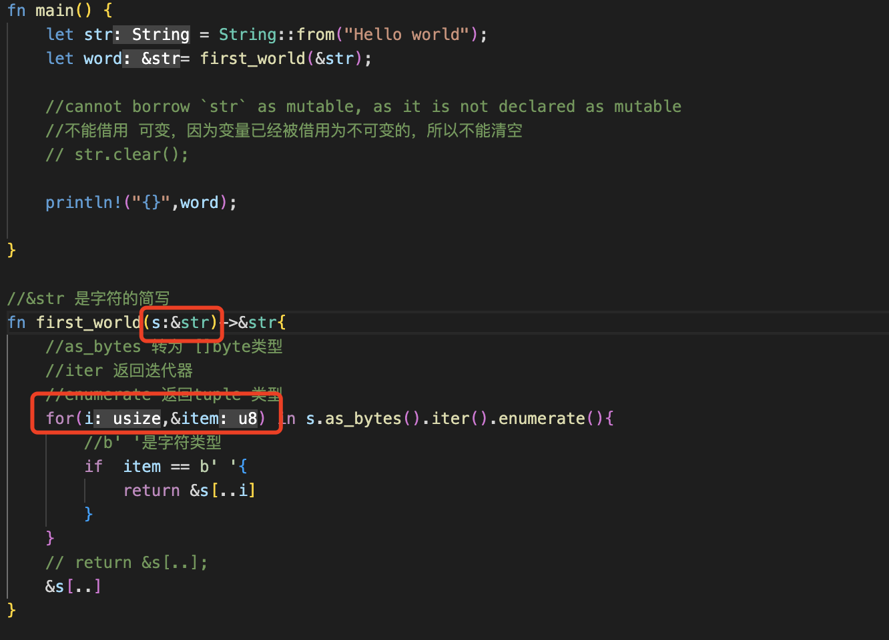
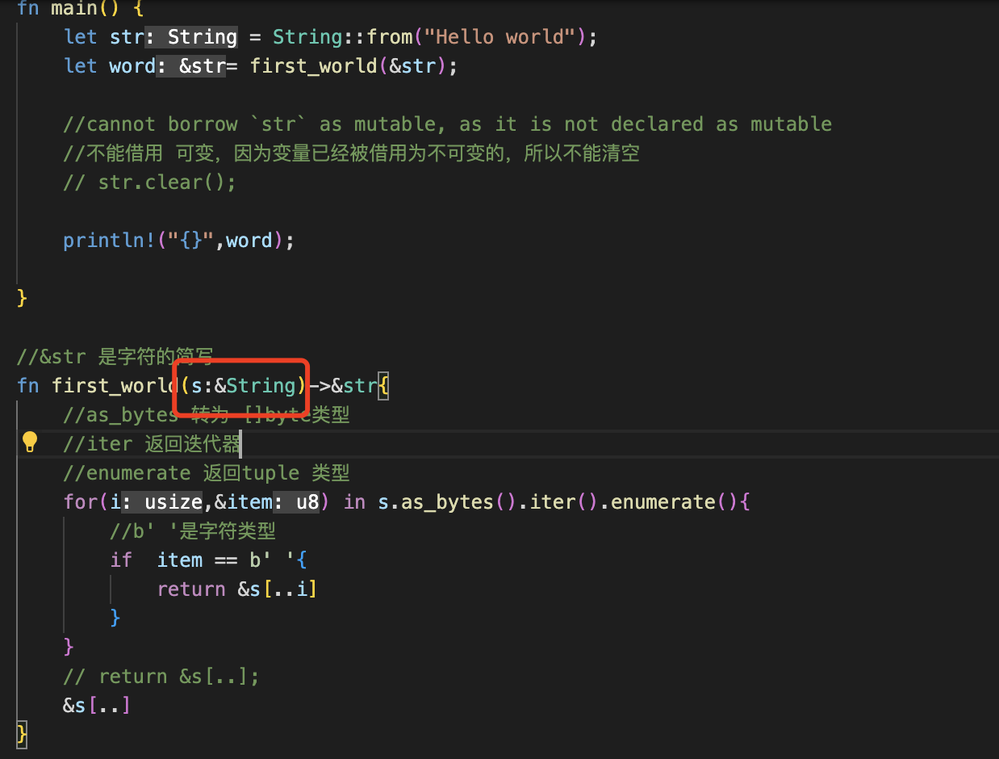
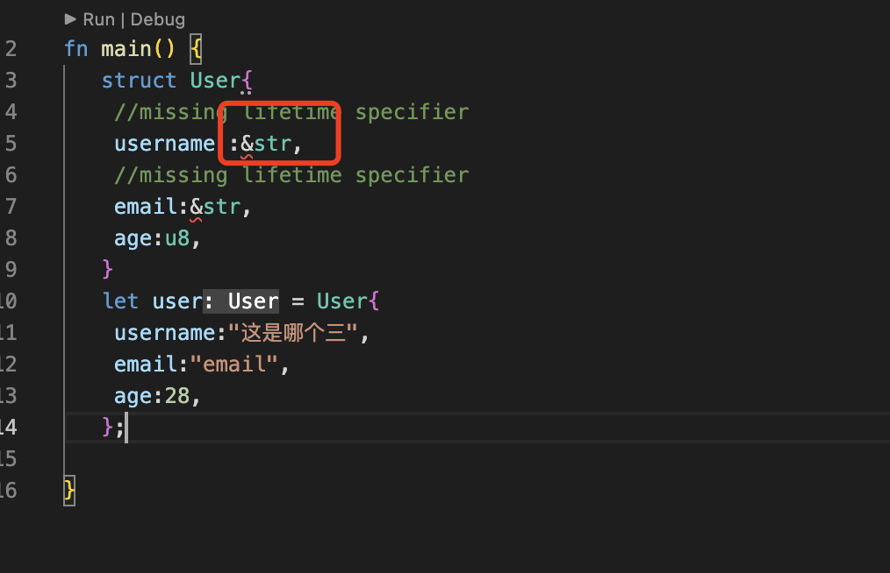
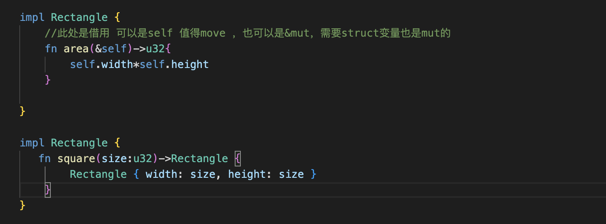
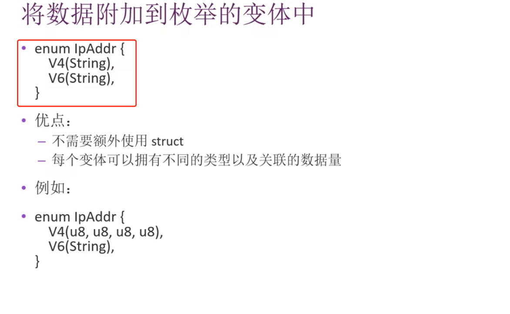
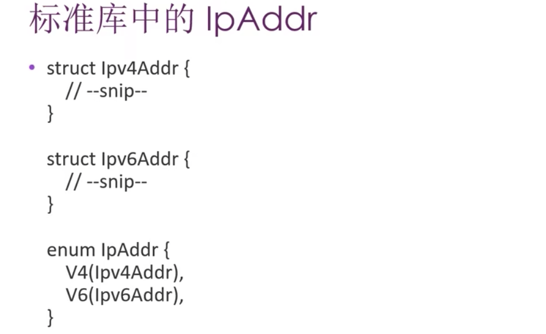

# 1. 安装rust

```
curl https://sh.rustup.rs -sSf | sh

输入1

Current installation options:


   default host triple: aarch64-apple-darwin
     default toolchain: stable (default)
               profile: default
  modify PATH variable: yes

1) Proceed with installation (default)
2) Customize installation
3) Cancel installation
>1
```

[其他方法](https://forge.rust-lang.org/infra/other-installation-methods.html)

验证

```
Rust is installed now. Great!

To get started you may need to restart your current shell.
This would reload your PATH environment variable to include
Cargo's bin directory ($HOME/.cargo/bin).

To configure your current shell, run:
source $HOME/.cargo/env
执行
source $HOME/.cargo/env

rustc -version

rustc --version        
rustc 1.58.1 (db9d1b20b 2022-01-20)
```

卸载

```
rustup self uninstall
```

# 2. rustup安装

rustup 是rust官方的版本管理工具。应当作为安装 Rust 的首选。

项目主页是: https://github.com/rust-lang-nursery/rustup.rs

卸载

```
rustup self uninstall
```


# 3. 安装vscode编译器

下载 VScode 请打开官网 https://code.visualstudio.com/ 下载编辑器。

依赖 如本章第一节所述，准备好 racer，rust 源代码，rustfmt，rls 这四样东西，并且配置好相应的环境变量，此不赘述。

安装 Rust 扩展 Rust 打开 VScode 编辑器； 按 Ctrl + p 打开命令面板； 在编辑器中上部浮现出的输入框中，输入 ext install vscode-rust，会自动搜索可用的插件，搜索出来后，点击进行安装；使用VScode打开任意一个.rs文件，插件首次启动会自动引导用户完成配置。 注:推荐使用RLS模式，即使用Rust Langular Server提供各项功能支持

[](https://github.com/zqlpaopao/rust/blob/main/readme/readme.assets/image-20220214112618639.png)

[](https://github.com/zqlpaopao/rust/blob/main/readme/readme.assets/image-20220214112931446.png)

[](https://github.com/zqlpaopao/rust/blob/main/readme/readme.assets/image-20220214113058105.png)

安装完毕

```
$ cargo new code
     Created binary (application) `code` package
$ cargo build   
   Compiling code v0.1.0 (/Users/xxx/Desktop/rust/code)
    Finished dev [unoptimized + debuginfo] target(s) in 1.15s
$ cargo run  
    Finished dev [unoptimized + debuginfo] target(s) in 0.00s
     Running `target/debug/code`
Hello, world!
```


# 4. Cargo 教程

## 4.1 Cargo 是什么

Cargo 是 Rust 的构建系统和包管理器。

Rust 开发者常用 Cargo 来管理 Rust 工程和获取工程所依赖的库。在上个教程中我们曾使用 cargo new greeting 命令创建了一个名为 greeting 的工程，Cargo 新建了一个名为 greeting 的文件夹并在里面部署了一个 Rust 工程最典型的文件结构。这个 greeting 文件夹就是工程本身。

## 4.2 Cargo 功能

Cargo 除了创建工程以外还具备构建（build）工程、运行（run）工程等一系列功能，构建和运行分别对应以下命令：

```
cargo build 
cargo run 
```

Cargo 还具有获取包、打包、高级构建等功能，详细使用方法参见 Cargo 命令。

# 5. 运行代码方式

## 5.1 cargo

不用生成二进制文件的

```
cargo build
cargo build —release # 这个属于优化编译
cargo run 可直接运行
cargo run # 编译和运行合在一起
```

## 5.2 rustc

生成二进制文件的

```
rustc helloworld.rs
rustc helloworld.rs -O # 也可以选择优化编译
```

## 5.3 使用cargo创建项目

- 创建项目 hellorust

```
ps: cargo new hellorust —bin
```

- 查看目录结构

```
ps: tree # win10 powershell 自带有 tree 查看文件目录结构的功能  
└─hellorust  
——└─src
```

这里显示的目录结构，在hellorust目录下有 src 文件夹和 Cargo.toml 文件，同时这个目录会初始化为 git 项目

- 查看Cargo.toml文件

```
ps: cat Cargo.toml  
[package]  
name = “hellorust”  //包名
version = “0.1.”  //包的版本
authors = [“YourName “]  //作者
edition = "2021" //rust的发布版本
[dependencies]//依赖的包
```

- 编辑src目录下的main.rs文件

```
ps: subl ./src/main.rs
```

cargo 创建的项目，在src目录下会有一个初始化的main.rs文件，内容为：

```
fn main() {
println!("Hello, world!");
}
```

现在我们编辑这个文件，改为：

```
fn main() {
let rust = "Rust";
println!("Hello, {}!", rust);
}
```

这里的 `let rust = "Rust"` 是把 rust 变量绑定为 “Rust” ，
`println!("Hello, {}!", rust);`里把 rust 变量的值代入到`"Hello, {}!"`中的`{}`。

- 编译和运行

```
ps: cargo build  
ps: cargo build —release # 这个属于优化编译  
ps: ./target/debug/hellorust.exe  
ps: ./target/release/hellorust.exe # 如果前面是优化编译，则这样运行  
ps: cargo run # 编译和运行合在一起  
ps: cargo run —release # 同上，区别是是优化编译的
```

## 5.4 cargo run

会直接运行

```
cargo run  
    Finished dev [unoptimized + debuginfo] target(s) in 0.03s
     Running `target/debug/cargo_new`
```

如果没有改遍会直接运行 如果有改变会编译在运行

## 5.5 cargo check

此命令是检测程序是否有错误的，和buil的的区别在于，此命令不回进行编译，因此更快

```
$ cargo check
    Checking cargo_new v0.1.0 (/Users/zql/Desktop/rust/cargo_new)
    Finished dev [unoptimized + debuginfo] target(s) in 0.41s
```

## 5.6 为发布构建

```
cargo build --ralease
```

会进行代码优化，编译较慢，但是程序运行较快，进行代码优化 会在target/release下生成可执行文件，不是target/debug [](https://user-images.githubusercontent.com/43371021/230619487-a4f687d9-171e-48ee-ac80-8e7544266089.png)

## 5.7 猜数游戏

```
use std::io;

//use 是引入库
//std 标准库 的io

fn main() {
    println!("猜数游戏!");

    //let 是定义变量
    //mut 是可引用的 
    //: String 是数据类型，自动推导的
    //任何变量是不可变的 immutable 加上mut是可变的
    // let mut foo = 1;
    // let bar = foo;
    // foo = 2;//cannot mutate immutable variable `foo`
    // foo= 2; 加上mut 是可变的

    //String utf8 可自懂扩展大小 标准库
    let mut guess = String::new();

    //io stdin 是控制台输入  read
    io::stdin().read_line(&mut guess).expect("无法读取行");//不使用expect 也可以，会提示为对异常进行处理
    //mut 是可变的 &引用默认也是不可变的，只能引用&mut 就是引用可变的
    //如果不用use 引入 可以这样写// &mut 引用可变对象，否则是错误的
    // std::io::stdin().read_line(guess).expect("错误信息并且推出")

    //read_line返回的是io::Result 枚举类型
    //io::Result Ok Err 也可以写成这昂
   match  std::io::stdin().read_line(&mut guess){
        Ok(n)=>{
            println!("{n} byte read" )
        }
        Err(error)=>{
            println!("read{error}")
        }
   }
    

    println!("你猜测的数是 {}",guess);
}
```

## 5.8 包的crate的管理

在cargo.toml中引入

```
rand = "0.3.14"
rand = "^0.3.14"
^代表和此版本兼容的所有版本都可以
```

然后会在cargo build的下载 https://crates.io/search?q=rand [](https://user-images.githubusercontent.com/43371021/230626714-86eaa893-eb1f-4b4f-8e27-af80afae5735.png)

修改下载源

```
首先进入电脑的cargo目录，MAC OS 默认安装在 ~/.cargo下：

cd ~/.cargo

创建一个config文件，这里使用vim编辑器：

vim config

进到编辑界面后，键入i，切换到插入模式

将下面的代码贴进去：

[source.crates-io]

registry = "https://github.com/rust-lang/crates.io-index"

replace-with = 'ustc'

[source.ustc]

registry = "git://mirrors.ustc.edu.cn/crates.io-index"

此步骤相当于修改了crates的下载源，切换到国内镜像。

按esc退出编辑模式，键入:wq，表示保存并退出即可。

再次尝试，就可以愉快的下载安装依赖啦~！
```

## 5.9 cargo.lock

是符合本项目的包的版本 如果存在会优先使用 如果想升级的话在cargo.toml中国呢指定版本 运行

```
cargo update
```

或者直接执行cargo build 会自动进行升级 升级会覆盖cargo.lock

## 5.10 生成随机数

```
use std::io;

use rand::Rng;//trait 相当于interface
fn main(){
    println!("猜数游戏-rand");

    let mut guess = String::new();

    let rand_num = rand::thread_rng().gen_range(1, 101);
    println!("s随机数为{}",rand_num);
    
    match io::stdin().read_line(&mut guess) {
        Ok(n)=>{
            println!("read {n} byte" );
        }
        Err(error)=>{
            println!("read {error}")
        }
        
    }
    println!("猜的数字为{}",guess)
}
```

## 5.11 比较输入和随机数大小

```
use rand::Rng;
fn main(){
    println!("猜数游戏");

    let rand_num = rand::thread_rng().gen_range(1, 100);
    println!("生成的随机数是{}",rand_num);


//loop是循环
loop {
    let mut guess = String::new();

    match std::io::stdin().read_line(&mut guess){
        Ok(n)=>println!("read {n} byte"),
        Err(error)=>println!("read err:{error}")
    }

    let guess:u32 = match  guess.trim().parse() {
        Ok(n)=>n,
        Err(error)=>{
            println!("error - err {error}");
            //continue是跳出当前
           continue;
        },
        
    };

    println!("输入的参数是{} rand的📖是{}",guess,rand_num);

    match guess.cmp(&rand_num){
        //break是终止loop循环
        //返回的是Ordering类型
        std::cmp::Ordering::Equal => {println!("win");break},
        std::cmp::Ordering::Greater=> println!("is max"),
        std::cmp::Ordering::Less =>  println!("is less"),
        //都没匹配
        // Other => {println!("other")},
    }
}
   
}
```


# 6. 数据类型

### 整数型（Integer）

整数型简称整型，按照比特位长度和有无符号分为一下种类：

| 位长度  | 有符号 | 无符号 |
| ------- | ------ | ------ |
| 8-bit   | i8     | u8     |
| 16-bit  | i16    | u16    |
| 32-bit  | i32    | u32    |
| 64-bit  | i64    | u64    |
| 128-bit | i128   | u128   |
| arch    | isize  | usize  |

isize 和 usize 两种整数类型是用来衡量数据大小的，它们的位长度取决于所运行的目标台，如果是 32 位架构的处理器将使用 32 位位长度整型。

整数的表述方法有以下几种：

| 进制                 | 例          |
| -------------------- | ----------- |
| 十进制               | 98_222      |
| 十六进制             | 0xff        |
| 八进制               | 0o77        |
| 二进制               | 0b1111_0000 |
| 字节(只能表示 u8 型) | b'A'        |

很显然，有的整数中间存在一个下划线，这种设计可以让人们在输入一个很大的数字时更容易判断数字的值大概是多少。 [](https://user-images.githubusercontent.com/43371021/230719314-8bb2ca3e-cc22-44c9-b8f4-a1bdee7f05dd.png)

整数溢出

- u8的范围是0-255，如果把一个u8变量值变为256，那么
- 调试模式下编译 rust会检测证书溢出，如果溢出就会报错
- 发布模式下 --release 编译不会检测panic发生 如果发生溢出 就会 发生环绕操作
- 256 变为 0 257 变为1 但是程序不回panic

## 6.1 浮点数型（Floating-Point）

Rust 与其它语言一样支持 32 位浮点数（f32）和 64 位浮点数（f64）。默认情况下，64.0 将表示 64 位浮点数，因为现代计算机处理器对两种浮点数计算的速度几乎相同，但 64 位浮点数精度更高。 float64精度更高，也是默认类型

#### 实例

```
fn main() {  
 let x = 2.0; // f64  
 let y: f32 = 3.0; // f32  
}
```

## 6.2 布尔型

布尔型用 bool 表示，值只能为 true 或 false。

## 6.3 字符型

字符型用 char 表示。

Rust的 char 类型大小为 4 个字节，代表 Unicode标量值，这意味着它可以支持中文，日文和韩文字符等非英文字符甚至表情符号和零宽度空格在 Rust 中都是有效的 char 值。

**注意** 由于中文文字编码有两种（GBK 和 UTF-8），所以编程中使用中文字符串有可能导致乱码的出现，这是因为源程序与命令行的文字编码不一致，所以在 Rust 中字符串和字符都必须使用 UTF-8 编码，否则编译器会报错。

```
fn main() {

// string types
let str = "Hello, world!";
let  strings  = str.to_string();//to_string转换为队字符串
// let  mut strings  = str.to_string();//加了mut 后 warning: variable does not need to be mutable 因为String就是可变的，不需要加mut
println!("{}",str);
println!("{}",strings);
}
```

## 6.4 字符串类型

最底层的是不定长类型`str`，更常用的是字符串切片`&str`和堆分配字符串`String`

其中字符串切片是静态分配的，有固定的大小，并且不可变，而堆分配字符串是可变的。

```
fn main() {


// tuples
let tuple: (i32, &str) = (50, "hello");
println!("{}",tuple.0);
println!("{}",tuple.1);
let (fifty, _) = tuple;
println!("{}",fifty);
let hello = tuple.1;
println!("{}",hello);

let mut to_str = hello.to_string();

to_str.pop();//尾部推出一个元素
println!("{}",to_str);
to_str.clear();//清空元素
to_str.push_str("string");

println!("{}",to_str);
}
```

## 6.5 元组

具有固定大小的有序列表，每个元素都有自己的类型，通过解构或者索引来获得每个元素的值。

- 元组不可修改，长度不可修改
- 元组的数据访问使用tup.0 tup.1

```
fn main() {
    let tup: (i32, f64, u8) = (500, 6.4, 1);
// tup.0 等于 500
// tup.1 等于 6.4
// tup.2 等于 1
println!("{},{},{}",tup.0,tup.1,tup.2);
let (x,y,z) = tup;
// y 等于 6.4
println!("{},{},{}",x,y,z)
}
500,6.4,1
500,6.4,1
```

## 6.6 数组

具有固定大小，并且元素都是同种类型，可表示为`[T; N]`。

- 数组的长度不可变
- 数组访问用下标
- 数据存在stack上 不是堆上
- vector 也是数组 长度可变
- 数组类型[类型;长度]
- 超过索引的范围编译不会报错，运行会报错

```
fn main() {
   let a = [1,2,3,4,5];//a 是一个长度为 5 的整型数组
   println!("{}",a[0]);//注意此处和元组的访问方式不一样，元组是.

   let b = ["aaa","bbb","ccc"];//b 是一个长度为 3 的字符串数组
   println!("{}",b[1]);

   let c:[i32; 5] = [1,2,3,4,5];//c 是一个长度为 5 的 i32 数组
   println!("{}",c[2]);

   let d:[i32;5] = [3;5];//等同于 let d = [3, 3, 3, 3, 3];
   println!("{}",d[3]);

   let first = a[0];
   let second = a[1];

   println!("{}",first);
   println!("{}",second);

//    a[1]= 123;//错误，不可变元素
   let mut  a = [1,2,3];
   a[0]= 4;//正确
   println!("{}",a[0])

}
1
bbb
3
3
1
2
4
```

## 6.7 切片

引用一个数组的部分数据并且不需要拷贝，可表示为`&[T]`。

```
fn main() {


let a = [0, 1, 2, 3, 4];
let mut middle = &a[1..4];
// middle[2] = 10; middle` is a `&` reference, so the data it refers to cannot be written 切片是引用类型，不能重写原来的
println!("{}",middle[2]);

// let mut ten_zeros: [i64; 10] = [0; 10];//数组是不可变的，如果后边没有改变行为最好不要用mut，warning: variable does not need to be mutable
let  mut ten_zeros: [i64; 10] = [0; 10];//数组是不可变的，不能用mut

println!("{}",ten_zeros[0]);
ten_zeros[0] = 9;
println!("{}",ten_zeros[0]);


    //注意要&用 用1..2  go的是1:2 但是都是前闭后开的
    let arr = &arr[1..2];

    println!("{}",arr[0]);
    // println!("{}",arr[1]);//thread 'main' panicked at 'index out of bounds: the len is 1 but the index is 1', src/main.rs:13:19
   
}
3
0
9

2
```

## 6.8 指针和引用

- 解除引用使用 `*`
- 构析使用 `&`, `ref`, 和 `ref mut`

```
fn main() {


// raw pointers
let x = 5;
let raw = &x as *const i32;

let x1 = "hello";
let raw1 = &x1;
println!("{}",x1);//hello
println!("{}",*raw1);//hello 和go一样 可以识别第一层 但是第二层就是数据的地址了
println!("{}",raw1);//hello 和go一样 可以识别第一层 但是第二层就是数据的地址了

let points_at = unsafe { *raw };
let points_at1 =  *raw1 ;
println!("{}",points_at);
println!("{}",points_at1)
// // functions
// fn foo(x: i32) -> i32 { x }
// let bar: fn(i32) -> i32 = foo;

}
hello
hello
5
hello
```

## 6.9 函数

：具有函数类型的变量实质上是一个函数指针

- 声明使用fn
- 使用蛇形命令_ 分割
- 形参数必须指明类型
- 语句是执行动作的一些指令
- 表达式会计算产生一个值

```
fn main(){
    let x = 5;

    let y = {
        let x= 1;
        //如果没加;就是一个表达式
        //加了就是一个语句，是没有值的 是 `()`
        //语句没有返回值，是一些指令的操作
        //表达式才会产生结果
        x+3
    };
    println!("y is {}",y)
   
}
```

返回返回值

- 函数->符号声明返回值的类型，但是不恶意为返回值命名 ，和go是有区别的
- 在rust 返回值就是最后一个表达值的值
- 如果想提前返回 使用return

```
fn main(){
 let five = five();
 println!("return value is {}",five);

}


fn five()->i32{
    //此时是一个表达式
    5

    //return 也可以,有return的时候是可以加;的 
    // return 5;
    // return 5

    //此时是一个语句,返回时（）
    // 5;
}
```

# 7.注释

- 文档注释

# 8. if 表达式

```
if five ==3 {

    }else if five == 4 {
        
    }else{
        
    }
```

如果代码的if esle 比较多 使用match 会比较整洁

## 8.1 match 重构

```
fn main(){
    let five = five();

    match five {
        3 => println!("is 3"),
        4 => println!("is 4"),
	//都不满足走 相当于else
        _ => println!("is 5 good")
    }

    println!("return value is {}",five);

}


fn five()->i32{
    //此时是一个表达式
    5

    //return 也可以,有return的时候是可以加;的 
    // return 5;
    // return 5

    //此时是一个语句,返回时（）
    // 5;
}
```

## 8.2 在let 中使用if

因为if是一个表达式，所以可以将它放在let的右边

```
fn main(){
    let value = if true { 5} else{6};
    println!("{}",value);

}
```

# 9. 循环

rust 提供了三种循环 loop while for

loop 循环珂使用break 终止循环 return 也是可以的 ,可以使用

```
fn main(){
    
    let mut i = 0;
    let num = loop {
        i += 1;

        if i == 2{
            println!("is continue {}",i);
            continue;
        }else if i == 3{
        println!("is break {}",i);

            break i * 10;
            //return也可以
        }
        println!("is loop {}",i);
        
    };
    println!("is num {}",num);

}

s loop 1
is continue 2
is break 3
is num 30
```

while 每次循环之前判断一次条件，符合预期才会执行

```
fn main(){
    
    let mut i = 3;
    
    // while 是没有返回值的 因为条件先判断了
    // let num = while i != 3 {
    //     i -= 1;
    // };


     while i != 0 {
        i -= 1;
    };

}
```

for 遍历集合

range 指定开始和结束数字，但是不包含结束数字 rev 可以反转range

```
fn main(){
    
    //实现倒计时

    let num = [1,2,3];

    for v in num.iter(){
        println!("for in {}",v)
    }
    //for in 1
    // for in 2
    // for in 3

    //rev可以反转
    for num in (1..4).rev(){
        println!("for in  () {}",num)

    }
    //for in  () 3
    //for in  () 2
    //for in  () 1

}
```

# 10. 所有权

- 每个值都有一个变量，这个变量是这个值的所有者
- 每个值同时只有一个所有者
- 当超出所有者作用域（scope）时候，该值被删除

## 10.1 String

- 分配在heap上

- 是可变的

- from 创建

  ```
   fn main(){
  
      let mut s = String::from("Hello ");
      s.push_str("word");
  
      println!("{}",s)
  
   }
   
   Hello word
  ```

- 可需改原因

  - 字符串字面值在编译的时候就知道大小，被硬编码到可执行文件中，速度更快
  - String 为支持其可变性，需要在heap分配内存
  - Rust 的String 是所有者原则，当内存数据在不需要的时候就会立即释放，自动调用drop自动释放

## 10.2 数据move

- 多个数据可以使用同一种方式来move 例如 x的变量的所有权交给y

```
	let y = 5;
	x= 5
```

因为是基本类型 都会被压入stack

- String 是在堆上分配
- stack 上的数据是复制，基本数据类型

```
	fn main(){
    
		let y = 5;
		let x= 5;

		println!("y is {},x is {}",y,x);
		//y is 5,x is 5

		let s = String::from("string");
		let z1 = s.clone();
		println!("za is {}",z1);
		//za is string 如果同时使用两个 可以使用clone 在heap上重新clone一份

		let z = s;


		//println!("s is {}, z is {}",s,z);// ^ value borrowed here after move s把所有权给了z 所有s被清楚了，在打印就会报错

	}
```

[](https://user-images.githubusercontent.com/43371021/230769808-567a3695-fb52-4e7e-8057-7afbaafdc806.png) [](https://user-images.githubusercontent.com/43371021/230769864-dfb594c1-8e28-46e1-9210-948b878f7b67.png) [](https://user-images.githubusercontent.com/43371021/230770075-fcd04468-019c-4d10-b8eb-e500f867091a.png) [](https://user-images.githubusercontent.com/43371021/230770100-9910b88d-8989-4445-9f49-c54cc9d05982.png) [](https://user-images.githubusercontent.com/43371021/230770169-19e7b1d8-b4fe-4ceb-80de-b5996fe6bd54.png)

- 基本数据类型都是可以copy的
- 整数类型、char、bool、元组tpule，也是不可变的，但是全部是才可以 [](https://user-images.githubusercontent.com/43371021/230770313-dac8b8ca-863b-4a3f-84ec-91803f9bd15a.png)

## 10.3 所有权与函数

- 在语义上，将值传给函数或者赋值给变量是一样的
- 将值传递给函数也会发生**移动**或者**复制**
- 返回值也会发生所有权的move

```
fn main(){
    let s = String::from("Hello World");
    println!("s is {}",s);

    let s1 = take_ownership(s);

    /*
         - move occurs because `s` has type `String`, which does not implement the `Copy` trait
...
5  |     let s1 = take_ownership(s);
   |                             - value moved here
6  |     println!("s is {}",s);
   |                        ^ value borrowed here after move
     */
    //println!("s is {}",s);//报错 因为 s在调用函数的时候已经发生移动，此处不能使用
    println!("s1 is {}",s1);//s1可以使用是在函数处理完毕后 将变量的所有权交给了s1


    let i1 : i32 = 5;//i32是基本类型 自动实现了copy trait的这个copy接口 所以要所有权还在 只是在stakcopy了一份
    makes_copy(i1);
    println!("i1 is {}",i1);
}

//返回值也会发生所有权的move
fn take_ownership(str:String)->String{
    println!("take_ownership str {}",str);
    str
}

fn makes_copy(i:i32){
    println!("makes_copy i is {}",i);
}

//s is Hello World
//take_ownership str Hello World
//s1 is Hello World
//makes_copy i is 5
//i1 is 5
```

[](https://user-images.githubusercontent.com/43371021/230770870-9bb86ecb-dff7-4d3c-a83c-db0d0ed7bd7f.png)

## 10.4 引用和借用

### 10.4.1 引用

- 引用就是获取某些值但是不获取变量的所有权
- 引用是&,相当于是取址操作

```
fn main(){
    let s = String::from("Hello world");
    println!("引用之前的s-{}",s);
    //次数的函数调用传入的& 引用 就是取址操作 
    let l = calculate_length(&s);
    println!("引用之后s-{}，长度是-{}",s,l);

}

fn calculate_length(s :&String)->usize{
    s.len()
}

引用之前的s-Hello world
引用之后s-Hello world，长度是-11
```

### 10.4.2 借用

-把引用给函数参数的这个行为就是借用 &操作

- 是否可以修改 借用的值？

```
fn main(){
    let s = String::from("Hello world");
    println!("引用之前的s-{}",s);
    //次数的函数调用传入的& 引用 就是取址操作 
    let l = calculate_length(&s);
    println!("引用之后s-{}，长度是-{}",s,l);

}

fn calculate_length(s :&String)->usize{
    //s.push_str("!!");
    //     ^^^^^^^^^^^^^^^^ `s` is a `&` reference, so the data it refers to cannot be borrowed as mutable
    // s.push_str("!!");

    //借用是不可以修改这个值的 ,
    s.len()
}
```

## 10.5 可变引用

- 可变引用 就是引用的变量是可变的 就可以修改
- 变量为可变mut 其次是& 传参和入参 都是&mut
- 可变引用另一种 此值就是可变的，也是不可以的，这种属于借用，借用和引用都是不可以的，只有可变引用才可以 &mut
- 在一个作用域内只能有一个可变引用，好处是在编译就能保证不会产生data race
- 不同的作用域是可以同时有两个可变引用的
- 不可以同时拥有一个可变引用和一个不可变引用，保证不可变引用数据的一致性

```
fn main(){
    let mut s = String::from("Hello world");
    println!("引用之前的s-{}",s);
    //次数的函数调用传入的& 引用 就是取址操作 

    //传参，首先是可变变量 mut 其次是& 或者直接是可变变量传入String 本身就是可变的 所有不回加mut
    let l = calculate_length(&mut s);
    println!("引用之后s-{}，长度是-{}",s,l);

    //引用之前的s-Hello world
    //引用之后s-Hello world!!，长度是-13      

    let s1 = String::from("可变的变量");

}

//注意此处是&mut 传参的时候也是这样
fn calculate_length(s :&mut String)->usize{
    //s.push_str("!!");
    //     ^^^^^^^^^^^^^^^^ `s` is a `&` reference, so the data it refers to cannot be borrowed as mutable
    s.push_str("!!");

    //借用是不可以修改这个值的 ,
    s.len()
}

fn ke_bian(s:String)->usize{

    //因为即使没加引用 这个是借用的变量 也是不能修改的
    //s.push_str("，可变的变量的后缀");//s.push_str("，可变的变量的后缀");
    // |     ^^^^^^^^^^^^^^^^^^^^^^^^^^^^^^^^ cannot borrow as mutable
    s.len()
}
```

同一作用域只能有一个可变引用 不同作用域的同时存在的可变引用

```
fn main(){
    let mut s = String::from("Hello world");
    println!("引用之前的s-{}",s);
    
    {
        let s1 =&mut s;
    }

    let s2 = &mut s;

}
```

{}是一个作用域

不可以同时拥有一个可变引用和一个不可变引用 保证不可变引用的数据一致性

```
fn main(){
    let mut s = String::from("Hello world");
    println!("引用之前的s-{}",s);

    //同一作用域
    let s1 =&s;
    let s3 =&s;
    //s2.push_str("string");
    // 10 |     println!("引用之后的s-{}",s);
    // |                               ^ immutable borrow occurs here
    // let s2 = &mut s;//前面有不变引用 ，此处如果有可变引用 保证不了引用的数据一致性
    s2.push_str("string");
    println!("引用之后的s-{}",s);
    
    println!("s-{},s1-{},s3-{},s2-{}",s,s1,s3,s2);

}
```

## 10.5 悬空引用 dangling references

- 一个指针引用了内存中的某个地址，但是这块地址已经释放给别人使用了
- 在rust 保证永远不会产生悬空引用

```
fn main(){
    let s = dangle();

}
fn dangle()->String{
    let mut s = String::from("Hello world");
    //^^ expected struct `String`, found `&String`
    &s //因为在返回返回的时候会把变量move到新的变量上 s是个空 在引用的话会出现悬空引用
}
```


# 11. 切片

rust的另一种不吃油所有权的数据类型：切片(slice)

- 字符串切片是只想字符串一部分内容的引用
- 形式：[开始索引...结束索引]
- 前闭后开
- 

```
fn main() {
    let str = String::from("Hello world");

    //如果从0开始，可以省略
    // let hello = &str[0..5];
    let hello = &str[..5];

    //如果末尾包含在内，可以不写末尾索引
    // let world = &str[6..11];
    // let world = &str[6..str.len()];
    let world = &str[6..];

    println!("{},{}",hello,world);
}

Hello,world
```


**返回字符串第一个出现空格的前面字符串**

```
fn main() {
    let str = String::from("Hello world");
    let word= first_world(&str);

    //cannot borrow `str` as mutable, as it is not declared as mutable
    //不能借用 可变，因为变量已经被借用为不可变的，所以不能清空
    // str.clear();

    println!("{}",word);

}

//&str 是字符的简写
fn first_world(s:&String)->&str{
    //as_bytes 转为 []byte类型
    //iter 返回迭代器
    //enumerate 返回tuple 类型
    for(i,&item) in s.as_bytes().iter().enumerate(){
        //b' '是字符类型
        if  item == b' '{
            return &s[..i]
        }
    }
    // return &s[..];
    &s[..]
}
Hello
```


- 字符串字面值是切片
- 字符串字面值被直接编译进二进制程序中，是不可变的 str
- let  str= "Hello World"

```

fn main() {
    // &str 是引用字符串切片值
    //同一作用域内不能同时存在可变引用和不可变引用 所以不能改变
    let str = "hello world";

    //mut variable does not need to be mutable
    // let mut str1 = "hello world";
    let str1 = "hello world";
    //warning: value assigned to `str1` is never read
    //str1 永远只是可读，不可写，但是结果是可以的
    // str1 = "hh";
    println!("str- {},str1- {}",str,str1);

}
变量str是&str ，是指向二进制程序特定的位置的切片
&str是不可变引用，所以字符串字面值是不可变的
```


**将字符串切片作为参数传递**

- fn first_world(s:&String)->&str
- 有经验的开发者回采用&str作为参数类型，因为这样接可以同时接受 == String和&str == 的参数
- fn first_world(s:&str)->&str
- 使用字符串切片，直接调用该函数
- String 要as_bytes然后嗲用该函数
- 定义字符切片来代替字符串回使我们的api更加通用






## 11.1 其它类型的切片

和字符串切片是适用的

```
fn main() {
    let a = [1,2,3,4,5];
    let slice = &a[1..5];
    
}
```


# 12. struct

- 使用struct关键字定义整个struct命名，和go的区别是有：指定类型

```
struct User{
	username :String,
	emial :String,
	sign_in_count : u64,
	active:bool,
}
```


- 想要使用struct，就必须创建struct的实例，为每个字段指定初始值,**必须全部制定初始值**
- 值的顺序不重要

```

fn main() {
   struct User {
        username:String,
        email:String,
        age:u8,
    }

    //必须全部都要指定初始值
    //missing structure fields:
    //- email
    //- age
    let user = User{
        username:String::from("zhangsan"),
        email:String::from("email"),
        age:28,
    };

    println!("user-username-{}",user.username);
     println!("user-email-{}",user.email);
     println!("user-age-{}",user.age);
}

user-username-zhangsan
user-email-email
user-age-28
```


- ==一但struct的实例是可变的，那么实例中的所有字段都是可变的==
- struct 可以作为函数返回值
- 字段初始化简写

```

fn main() {
   struct User {
        username:String,
        email:String,
        age:u8,
    }

    //必须全部都要指定初始值
    //missing structure fields:
    //- email
    //- age
    let username = String::from("zhangsan");
    let email = String::from("email");
    let user = User{
        username,
        email,
        age:28,
    };

    println!("user-username-{}",user.username);
    println!("user-email-{}",user.email);
    println!("user-age-{}",user.age);

}

user-username-zhangsan
user-email-email
user-age-28
```


- struct 更新语法

```

fn main() {
   struct User {
        username:String,
        email:String,
        age:u8,
    }

    //必须全部都要指定初始值
    //missing structure fields:
    //- email
    //- age

    let user2 = User{
        username:String::from("user2"),
        email:String::from("user2-email"),
        age:8,
    };
    let username = String::from("zhangsan");
    let user = User{
        username,
        ..user2
    };

    println!("user-username-{}",user.username);
    println!("user-email-{}",user.email);
    println!("user-age-{}",user.age);

}

user-username-zhangsan
user-email-user2-email
user-age-8
```


## 12.1 tuple struct

- 可以定义tuple struct

- tuple struct整体有名，但是字段没名

  适用：正给整个struct起名，但是不想给内部元素起名

```rust
struct Color(i32,i32,i32);
struct Point(i32,i32,i32);

let black = Color(0,0,0);
let origin = Point(0,0,0);

```

Black 和origin 是不同类型

访问 .下标

```

fn main() {
   struct Color (i32,i32,i32);
   let black = Color(9,9,9);
   println!("black-first-{}",black.0);

    let b1 = Color(3,4,5);
    //这样是不行的
    //expected struct `Color`, found tuple
//    let (b1,b2,b3) = bb;
    println!("black-b1-{}",b1.0);
     println!("black-b2-{}",b1.1);
      println!("black-b3-{}",b1.2);

}
```


## 12.1 unit-like-struct

struct () 没有任何字段的

- ==适用于某个类型实现trait，但是里面没有任何的存储数据==


## 12.3 struct数据的所有权

```
struct User{
	username:String,
	email:String,
	age:u8,
}
```

- 这里的字段使用了String而不是&str
- 该struct实例拥有其所有的数据
- 只要改struct实例是有效的，那么里面的字段也是有效的
- struct里面也可以存放引用，需要用到生命周期
- ==声明周期保证，只要struct是有效的，里面的引用也是有效的==
- 如果struct里面存储引用，但是没有使用生命周期，就会报错




## 12.4 struct例子

```

//#[derive(Debug)] derive是派生的意思
#[derive(Debug)]
struct Rectangle {
    width:u32,
    height:u32,
}
fn main() {
   let rect = Rectangle{
    width:30,
    height:50,
   };

   //此处是借用，所有权还在
   println!("{}",area(&rect));

   //打印结构化数据
    //    println!("{:?}",rect)
    /*
    16 |    println!("{:?}",rect)
    |                    ^^^^ `Rectangle` cannot be formatted using `{:?}`
    |
    = help: the trait `Debug` is not implemented for `Rectangle`
    = note: add `#[derive(Debug)]` to `Rectangle` or manually `impl Debug for Rectangle`
    */

   println!("{:?}",rect);
   println!("{:#?}",rect)

}

fn area(rect :&Rectangle)->u32{
    rect.width*rect.height
}


1500
Rectangle { width: 30, height: 50 }
Rectangle {
    width: 30,
    height: 50,
}
```


## 12.5 struct 的方法

- 方法和实例类似：fn关键字、名称、参数、返回值
- 不同之处
- 方法在struct的上下文中定义
- 第一个参数是self，表示方法被调用的struct实例

```

//#[derive(Debug)] derive是派生的意思
#[derive(Debug)]
struct Rectangle {
    width:u32,
    height:u32,
}

impl Rectangle {
    //此处是借用 可以是self 值得move ，也可以是&mut，需要struct变量也是mut的
    fn area(&self)->u32{
        self.width*self.height
    }
}

fn main() {
   let rect = Rectangle{
    width:30,
    height:50,
   };

   //此处是借用，所有权还在
   println!("{}",rect.area());


   println!("{:?}",rect);
   println!("{:#?}",rect)

}

1500
Rectangle { width: 30, height: 50 }
Rectangle {
    width: 30,
    height: 50,
}

```

- 定义方法在impl块里面定义
- 方法调用，如果调用的是方法是.，如果不是方法是::


**方法调用的运算符**

- rust会自动引用或者解引用
- 在调用方法的时候发生这种行为
- 在调用方法时候，会自动添加&、&mut或者*

下边的代码效果相同

P1.distance(&p2)

(&p1).disance(&p2)


## 12.6 关联函数

- 可以在impl块定义，但是不把self当作第一个参数
- 调用时::，而方法是.

```


//#[derive(Debug)] derive是派生的意思
#[derive(Debug)]
struct Rectangle {
    width:u32,
    height:u32,
}

impl Rectangle {
    //此处是借用 可以是self 值得move ，也可以是&mut，需要struct变量也是mut的
    fn area(&self)->u32{
        self.width*self.height
    }
    fn square(size:u32)->Rectangle {
        Rectangle { width: size, height: size }
    }
}

fn main() {
   let rect = Rectangle{
    width:30,
    height:50,
   };

   //此处是借用，所有权还在
   println!("{}",rect.area());


   println!("{:?}",rect);
   println!("{:#?}",rect);

   let square = Rectangle::square(40);
      println!("{:#?}",square)
}

1500
Rectangle { width: 30, height: 50 }
Rectangle {
    width: 30,
    height: 50,
}
Rectangle {
    width: 40,
    height: 40,
}
```

- 每个stauct 允许有多个impl块




# 13 枚举

- 关键字 enum 名字

```
#[derive(Debug)]
enum IpAddrKind{
    V4,
    V6,
}

fn main(){
    let four = IpAddrKind::V4;
    let six = IpAddrKind::V6;

    route(four);
    route(six);
    route(IpAddrKind::V4)

}

fn route(ip_kind:IpAddrKind){
println!("{:#?}",ip_kind)
}

V4
V6
V4
```


## 13.1 添加数据到枚举变体中



```
#[derive(Debug)]
enum IpAddrKind{
    V4(u8,u8,u8,u8),
    V6(String),
}

fn main(){
    let four = IpAddrKind::V4;
    let six = IpAddrKind::V6;

    route(four(127,1,1,0));
    route(six(String::from("aaa:kkk:kkk")));

}

fn route(ip_kind:IpAddrKind){
println!("{:#?}",ip_kind)
}

V4(
    127,
    1,
    1,
    0,
)
V6(
    "aaa:kkk:kkk",
)

```


## 13.2 标准库中的struct





## 13.3 为枚举定义方法

```
#[derive(Debug)]
enum IpAddrKind{
    V4(u8,u8,u8,u8),
    V6(String),
}

impl IpAddrKind {
    fn ip_addr(&self){
        println!("{:#?}",self)
    }
}

fn main(){
    let four = IpAddrKind::V4(127,1,1,0);
    let six = IpAddrKind::V6(String::from("value"));

    four.ip_addr();
    six.ip_addr();

}


V4(
    127,
    1,
    1,
    0,
)
V6(
    "value",
)
```


# 14. Option<T>
- option 枚举有Some<T>和None
```
enum Option <T>{
	Some<T>,
	None,
}
```

	
```
	// #[derive(Debug)]
fn main(){
    let some = Option::Some(String::from("hello World"));
    is_some(some);


    // let no = None;
    // is_some(no)
}

//让T派生debug这个trait，就可以打印了
fn is_some<T:std::fmt::Debug>(op:Option<T>){
    match op {
        Some(op)=> println!("{:#?}",op),
        None=>println!("none"),
    }
}
"hello World"

```

# 15 match
- match 必须穷举所有情况
	
```

#![allow(unused)]
fn main() {
match target {
    模式1 => 表达式1,
    模式2 => {
        语句1;
        语句2;
        表达式2
    },
    _ => 表达式3
}
}
```

## 15.1 使用 match 表达式赋值
```
//同意所有没使用的代码
#[allow(dead_code)]
enum IpAddr{
    V4,
    V6,
}
fn main(){
    let addr = IpAddr::V4;
    let some = match addr {
        IpAddr::V4=>"127.0.0.1",
        _ => "::1",
    };
    println!("{}",some)
}
```\


