# 1. 安装rust

```
curl https://sh.rustup.rs -sSf | sh

输入1

Current installation options:


   default host triple: aarch64-apple-darwin
     default toolchain: stable (default)
               profile: default
  modify PATH variable: yes

1) Proceed with installation (default)
2) Customize installation
3) Cancel installation
>1
```

[其他方法](https://forge.rust-lang.org/infra/other-installation-methods.html)

验è¯

```
Rust is installed now. Great!

To get started you may need to restart your current shell.
This would reload your PATH environment variable to include
Cargo's bin directory ($HOME/.cargo/bin).

To configure your current shell, run:
source $HOME/.cargo/env
执行
source $HOME/.cargo/env

rustc -version

rustc --version        
rustc 1.58.1 (db9d1b20b 2022-01-20)
```

å¸è½½

```
rustup self uninstall
```

# 2. rustup安装

rustup 是rust官方的版本管ç†å·¥å…·ã€‚应当作为安装 Rust 的首选。

项目主页是: https://github.com/rust-lang-nursery/rustup.rs

å¸è½½

```
rustup self uninstall
```


# 3. 安装vscode编译器

下载 VScode 请打开官网 https://code.visualstudio.com/ 下载编辑器。

ä¾èµ– 如本章第一节所述，准备好 racer，rust æºä»£ç ï¼Œrustfmt，rls 这四样东西，并且é…置好相应的ç¯å¢ƒå˜é‡ï¼Œæ­¤ä¸èµ˜è¿°ã€‚

安装 Rust 扩展 Rust 打开 VScode 编辑器； 按 Ctrl + p 打开命令é¢æ¿ï¼› 在编辑器中上部浮ç°å‡ºçš„输入框中，输入 ext install vscode-rust，会自动æœç´¢å¯ç”¨çš„æ’件，æœç´¢å‡ºæ¥å，点击进行安装；使用VScode打开任æ„一个.rs文件，æ’件首次å¯åŠ¨ä¼šè‡ªåŠ¨å¼•å¯¼ç”¨æˆ·å®Œæˆé…置。 注:æ¨è使用RLS模å¼ï¼Œå³ä½¿ç”¨Rust Langular Serveræä¾›å„项功能支æŒ

[](https://github.com/zqlpaopao/rust/blob/main/readme/readme.assets/image-20220214112618639.png)

[](https://github.com/zqlpaopao/rust/blob/main/readme/readme.assets/image-20220214112931446.png)

[](https://github.com/zqlpaopao/rust/blob/main/readme/readme.assets/image-20220214113058105.png)

安装完毕

```
$ cargo new code
     Created binary (application) `code` package
$ cargo build   
   Compiling code v0.1.0 (/Users/xxx/Desktop/rust/code)
    Finished dev [unoptimized + debuginfo] target(s) in 1.15s
$ cargo run  
    Finished dev [unoptimized + debuginfo] target(s) in 0.00s
     Running `target/debug/code`
Hello, world!
```


# 4. Cargo 教程

## 4.1 Cargo 是什么

Cargo 是 Rust çš„æ„建系统和包管ç†å™¨ã€‚

Rust å¼€å‘者常用 Cargo æ¥ç®¡ç† Rust 工程和è·å–工程所ä¾èµ–的库。在上个教程中我们曾使用 cargo new greeting 命令创建了一个å为 greeting 的工程，Cargo 新建了一个å为 greeting 的文件夹并在里é¢éƒ¨ç½²äº†ä¸€ä¸ª Rust 工程最典å‹çš„文件结æ„。这个 greeting 文件夹就是工程本身。

## 4.2 Cargo 功能

Cargo 除了创建工程以外还具备æ„建（build）工程ã€è¿è¡Œï¼ˆrun）工程等一系列功能，æ„建和è¿è¡Œåˆ†åˆ«å¯¹åº”以下命令：

```
cargo build 
cargo run 
```

Cargo 还具有è·å–包ã€æ‰“包ã€é«˜çº§æ„建等功能，详细使用方法å‚è§ Cargo 命令。

# 5. è¿è¡Œä»£ç æ–¹å¼

## 5.1 cargo

ä¸ç”¨ç”ŸæˆäºŒè¿›åˆ¶æ–‡ä»¶çš„

```
cargo build
cargo build —release # 这个å±äºä¼˜åŒ–编译
cargo run å¯ç›´æ¥è¿è¡Œ
cargo run # 编译和è¿è¡Œåˆåœ¨ä¸€èµ·
```

## 5.2 rustc

生æˆäºŒè¿›åˆ¶æ–‡ä»¶çš„

```
rustc helloworld.rs
rustc helloworld.rs -O # 也å¯ä»¥é€‰æ‹©ä¼˜åŒ–编译
```

## 5.3 使用cargo创建项目

- 创建项目 hellorust

```
ps: cargo new hellorust —bin
```

- 查看目录结æ„

```
ps: tree # win10 powershell 自带有 tree 查看文件目录结æ„的功能  
└─hellorust  
——└─src
```

这里显示的目录结æ„，在hellorust目录下有 src 文件夹和 Cargo.toml 文件，åŒæ—¶è¿™ä¸ªç›®å½•ä¼šåˆå§‹åŒ–为 git 项目

- 查看Cargo.toml文件

```
ps: cat Cargo.toml  
[package]  
name = “hellorust† //包å
version = “0.1.† //包的版本
authors = [“YourName “]  //作者
edition = "2021" //rustçš„å‘布版本
[dependencies]//ä¾èµ–的包
```

- 编辑src目录下的main.rs文件

```
ps: subl ./src/main.rs
```

cargo 创建的项目，在src目录下会有一个åˆå§‹åŒ–çš„main.rs文件，内容为：

```
fn main() {
println!("Hello, world!");
}
```

ç°åœ¨æˆ‘们编辑这个文件，改为：

```
fn main() {
let rust = "Rust";
println!("Hello, {}!", rust);
}
```

这里的 `let rust = "Rust"` 是把 rust å˜é‡ç»‘定为 “Rust†，
`println!("Hello, {}!", rust);`里把 rust å˜é‡çš„值代入到`"Hello, {}!"`中的`{}`。

- 编译和è¿è¡Œ

```
ps: cargo build  
ps: cargo build —release # 这个å±äºä¼˜åŒ–编译  
ps: ./target/debug/hellorust.exe  
ps: ./target/release/hellorust.exe # 如æœå‰é¢æ˜¯ä¼˜åŒ–编译，则这样è¿è¡Œ  
ps: cargo run # 编译和è¿è¡Œåˆåœ¨ä¸€èµ·  
ps: cargo run —release # åŒä¸Šï¼ŒåŒºåˆ«æ˜¯æ˜¯ä¼˜åŒ–编译的
```

## 5.4 cargo run

会直æ¥è¿è¡Œ

```
cargo run  
    Finished dev [unoptimized + debuginfo] target(s) in 0.03s
     Running `target/debug/cargo_new`
```

如æœæ²¡æœ‰æ”¹é会直æ¥è¿è¡Œ 如æœæœ‰æ”¹å˜ä¼šç¼–译在è¿è¡Œ

## 5.5 cargo check

此命令是检测程åºæ˜¯å¦æœ‰é”™è¯¯çš„，和buil的的区别在äºï¼Œæ­¤å‘½ä»¤ä¸å›è¿›è¡Œç¼–译，因此更快

```
$ cargo check
    Checking cargo_new v0.1.0 (/Users/zql/Desktop/rust/cargo_new)
    Finished dev [unoptimized + debuginfo] target(s) in 0.41s
```

## 5.6 为å‘布æ„建

```
cargo build --ralease
```

会进行代ç ä¼˜åŒ–，编译较慢，但是程åºè¿è¡Œè¾ƒå¿«ï¼Œè¿›è¡Œä»£ç ä¼˜åŒ– 会在target/release下生æˆå¯æ‰§è¡Œæ–‡ä»¶ï¼Œä¸æ˜¯target/debug [](https://user-images.githubusercontent.com/43371021/230619487-a4f687d9-171e-48ee-ac80-8e7544266089.png)

## 5.7 猜数游æˆ

```
use std::io;

//use 是引入库
//std 标准库 的io

fn main() {
    println!("猜数游æˆ!");

    //let 是定义å˜é‡
    //mut 是å¯å¼•ç”¨çš„ 
    //: String 是数æ®ç±»å‹ï¼Œè‡ªåŠ¨æ¨å¯¼çš„
    //任何å˜é‡æ˜¯ä¸å¯å˜çš„ immutable 加上mut是å¯å˜çš„
    // let mut foo = 1;
    // let bar = foo;
    // foo = 2;//cannot mutate immutable variable `foo`
    // foo= 2; 加上mut 是å¯å˜çš„

    //String utf8 å¯è‡ªæ‡‚æ‰©å±•å¤§å° æ ‡å‡†åº“
    let mut guess = String::new();

    //io stdin 是æ§åˆ¶å°è¾“å…¥  read
    io::stdin().read_line(&mut guess).expect("无法读å–è¡Œ");//ä¸ä½¿ç”¨expect 也å¯ä»¥ï¼Œä¼šæ示为对异常进行处ç†
    //mut 是å¯å˜çš„ &引用默认也是ä¸å¯å˜çš„，åªèƒ½å¼•ç”¨&mut 就是引用å¯å˜çš„
    //如æœä¸ç”¨use 引入 å¯ä»¥è¿™æ ·å†™// &mut 引用å¯å˜å¯¹è±¡ï¼Œå¦åˆ™æ˜¯é”™è¯¯çš„
    // std::io::stdin().read_line(guess).expect("错误信æ¯å¹¶ä¸”æ¨å‡º")

    //read_lineè¿”å›çš„是io::Result æšä¸¾ç±»å‹
    //io::Result Ok Err 也å¯ä»¥å†™æˆè¿™æ˜‚
   match  std::io::stdin().read_line(&mut guess){
        Ok(n)=>{
            println!("{n} byte read" )
        }
        Err(error)=>{
            println!("read{error}")
        }
   }
    

    println!("你猜测的数是 {}",guess);
}
```

## 5.8 包的crate的管ç†

在cargo.toml中引入

```
rand = "0.3.14"
rand = "^0.3.14"
^代表和此版本兼容的所有版本都å¯ä»¥
```

然å会在cargo build的下载 https://crates.io/search?q=rand [](https://user-images.githubusercontent.com/43371021/230626714-86eaa893-eb1f-4b4f-8e27-af80afae5735.png)

修改下载æº

```
首先进入电脑的cargo目录，MAC OS 默认安装在 ~/.cargo下：

cd ~/.cargo

创建一个config文件，这里使用vim编辑器：

vim config

进到编辑界é¢å，键入i，切æ¢åˆ°æ’入模å¼

将下é¢çš„代ç è´´è¿›å»ï¼š

[source.crates-io]

registry = "https://github.com/rust-lang/crates.io-index"

replace-with = 'ustc'

[source.ustc]

registry = "git://mirrors.ustc.edu.cn/crates.io-index"

此步骤相当äºä¿®æ”¹äº†crates的下载æºï¼Œåˆ‡æ¢åˆ°å›½å†…é•œåƒã€‚

按esc退出编辑模å¼ï¼Œé”®å…¥:wq，表示ä¿å­˜å¹¶é€€å‡ºå³å¯ã€‚

å†æ¬¡å°è¯•ï¼Œå°±å¯ä»¥æ„‰å¿«çš„下载安装ä¾èµ–啦~ï¼
```

## 5.9 cargo.lock

是符åˆæœ¬é¡¹ç›®çš„包的版本 如æœå­˜åœ¨ä¼šä¼˜å…ˆä½¿ç”¨ 如æœæƒ³å‡çº§çš„è¯åœ¨cargo.toml中国呢指定版本 è¿è¡Œ

```
cargo update
```

或者直æ¥æ‰§è¡Œcargo build 会自动进行å‡çº§ å‡çº§ä¼šè¦†ç›–cargo.lock

## 5.10 生æˆéšæœºæ•°

```
use std::io;

use rand::Rng;//trait 相当äºinterface
fn main(){
    println!("猜数游æˆ-rand");

    let mut guess = String::new();

    let rand_num = rand::thread_rng().gen_range(1, 101);
    println!("séšæœºæ•°ä¸º{}",rand_num);
    
    match io::stdin().read_line(&mut guess) {
        Ok(n)=>{
            println!("read {n} byte" );
        }
        Err(error)=>{
            println!("read {error}")
        }
        
    }
    println!("猜的数字为{}",guess)
}
```

## 5.11 比较输入和éšæœºæ•°å¤§å°

```
use rand::Rng;
fn main(){
    println!("猜数游æˆ");

    let rand_num = rand::thread_rng().gen_range(1, 100);
    println!("生æˆçš„éšæœºæ•°æ˜¯{}",rand_num);


//loop是循ç¯
loop {
    let mut guess = String::new();

    match std::io::stdin().read_line(&mut guess){
        Ok(n)=>println!("read {n} byte"),
        Err(error)=>println!("read err:{error}")
    }

    let guess:u32 = match  guess.trim().parse() {
        Ok(n)=>n,
        Err(error)=>{
            println!("error - err {error}");
            //continue是跳出当å‰
           continue;
        },
        
    };

    println!("输入的å‚数是{} rand的📖是{}",guess,rand_num);

    match guess.cmp(&rand_num){
        //break是终止loop循ç¯
        //è¿”å›çš„是Orderingç±»å‹
        std::cmp::Ordering::Equal => {println!("win");break},
        std::cmp::Ordering::Greater=> println!("is max"),
        std::cmp::Ordering::Less =>  println!("is less"),
        //都没匹é…
        // Other => {println!("other")},
    }
}
   
}
```


# 6. æ•°æ®ç±»å‹

### æ•´æ•°å‹ï¼ˆInteger）

æ•´æ•°å‹ç®€ç§°æ•´å‹ï¼ŒæŒ‰ç…§æ¯”特ä½é•¿åº¦å’Œæœ‰æ— ç¬¦å·åˆ†ä¸ºä¸€ä¸‹ç§ç±»ï¼š

| ä½é•¿åº¦  | æœ‰ç¬¦å· | æ— ç¬¦å· |
| ------- | ------ | ------ |
| 8-bit   | i8     | u8     |
| 16-bit  | i16    | u16    |
| 32-bit  | i32    | u32    |
| 64-bit  | i64    | u64    |
| 128-bit | i128   | u128   |
| arch    | isize  | usize  |

isize å’Œ usize 两ç§æ•´æ•°ç±»å‹æ˜¯ç”¨æ¥è¡¡é‡æ•°æ®å¤§å°çš„，它们的ä½é•¿åº¦å–决äºæ‰€è¿è¡Œçš„目标å°ï¼Œå¦‚æœæ˜¯ 32 ä½æ¶æ„的处ç†å™¨å°†ä½¿ç”¨ 32 ä½ä½é•¿åº¦æ•´å‹ã€‚

整数的表述方法有以下几ç§ï¼š

| 进制                 | 例          |
| -------------------- | ----------- |
| å进制               | 98_222      |
| å六进制             | 0xff        |
| 八进制               | 0o77        |
| 二进制               | 0b1111_0000 |
| 字节(åªèƒ½è¡¨ç¤º u8 å‹) | b'A'        |

很显然，有的整数中间存在一个下划线，这ç§è®¾è®¡å¯ä»¥è®©äººä»¬åœ¨è¾“入一个很大的数字时更容易判断数字的值大概是多少。 [](https://user-images.githubusercontent.com/43371021/230719314-8bb2ca3e-cc22-44c9-b8f4-a1bdee7f05dd.png)

整数溢出

- u8的范围是0-255，如æœæŠŠä¸€ä¸ªu8å˜é‡å€¼å˜ä¸º256，那么
- 调试模å¼ä¸‹ç¼–译 rust会检测è¯ä¹¦æº¢å‡ºï¼Œå¦‚æœæº¢å‡ºå°±ä¼šæŠ¥é”™
- å‘布模å¼ä¸‹ --release 编译ä¸ä¼šæ£€æµ‹panicå‘生 如æœå‘生溢出 就会 å‘生ç¯ç»•æ“作
- 256 å˜ä¸º 0 257 å˜ä¸º1 但是程åºä¸å›panic

## 6.1 浮点数å‹ï¼ˆFloating-Point）

Rust ä¸å…¶å®ƒè¯­è¨€ä¸€æ ·æ”¯æŒ 32 ä½æµ®ç‚¹æ•°ï¼ˆf32）和 64 ä½æµ®ç‚¹æ•°ï¼ˆf64）。默认情况下，64.0 将表示 64 ä½æµ®ç‚¹æ•°ï¼Œå› ä¸ºç°ä»£è®¡ç®—机处ç†å™¨å¯¹ä¸¤ç§æµ®ç‚¹æ•°è®¡ç®—的速度几ä¹ç›¸åŒï¼Œä½† 64 ä½æµ®ç‚¹æ•°ç²¾åº¦æ›´é«˜ã€‚ float64精度更高，也是默认类å‹

#### å®ä¾‹

```
fn main() {  
 let x = 2.0; // f64  
 let y: f32 = 3.0; // f32  
}
```

## 6.2 布尔å‹

布尔å‹ç”¨ bool 表示，值åªèƒ½ä¸º true 或 false。

## 6.3 字符å‹

字符å‹ç”¨ char 表示。

Rustçš„ char ç±»å‹å¤§å°ä¸º 4 个字节，代表 Unicodeæ ‡é‡å€¼ï¼Œè¿™æ„味ç€å®ƒå¯ä»¥æ”¯æŒä¸­æ–‡ï¼Œæ—¥æ–‡å’ŒéŸ©æ–‡å­—符等é英文字符甚至表情符å·å’Œé›¶å®½åº¦ç©ºæ ¼åœ¨ Rust 中都是有效的 char 值。

**注æ„** ç”±äºä¸­æ–‡æ–‡å­—ç¼–ç æœ‰ä¸¤ç§ï¼ˆGBK å’Œ UTF-8），所以编程中使用中文字符串有å¯èƒ½å¯¼è‡´ä¹±ç çš„出ç°ï¼Œè¿™æ˜¯å› ä¸ºæºç¨‹åºä¸å‘½ä»¤è¡Œçš„文字编ç ä¸ä¸€è‡´ï¼Œæ‰€ä»¥åœ¨ Rust 中字符串和字符都必须使用 UTF-8 ç¼–ç ï¼Œå¦åˆ™ç¼–译器会报错。

```
fn main() {

// string types
let str = "Hello, world!";
let  strings  = str.to_string();//to_string转æ¢ä¸ºé˜Ÿå­—符串
// let  mut strings  = str.to_string();//加了mut å warning: variable does not need to be mutable 因为String就是å¯å˜çš„，ä¸éœ€è¦åŠ mut
println!("{}",str);
println!("{}",strings);
}
```

## 6.4 字符串类å‹

最底层的是ä¸å®šé•¿ç±»å‹`str`，更常用的是字符串切片`&str`和堆分é…字符串`String`

其中字符串切片是é™æ€åˆ†é…的，有固定的大å°ï¼Œå¹¶ä¸”ä¸å¯å˜ï¼Œè€Œå †åˆ†é…字符串是å¯å˜çš„。

```
fn main() {


// tuples
let tuple: (i32, &str) = (50, "hello");
println!("{}",tuple.0);
println!("{}",tuple.1);
let (fifty, _) = tuple;
println!("{}",fifty);
let hello = tuple.1;
println!("{}",hello);

let mut to_str = hello.to_string();

to_str.pop();//尾部æ¨å‡ºä¸€ä¸ªå…ƒç´ 
println!("{}",to_str);
to_str.clear();//清空元素
to_str.push_str("string");

println!("{}",to_str);
}
```

## 6.5 元组

具有固定大å°çš„有åºåˆ—表，æ¯ä¸ªå…ƒç´ éƒ½æœ‰è‡ªå·±çš„ç±»å‹ï¼Œé€šè¿‡è§£æ„或者索引æ¥è·å¾—æ¯ä¸ªå…ƒç´ çš„值。

- 元组ä¸å¯ä¿®æ”¹ï¼Œé•¿åº¦ä¸å¯ä¿®æ”¹
- 元组的数æ®è®¿é—®ä½¿ç”¨tup.0 tup.1

```
fn main() {
    let tup: (i32, f64, u8) = (500, 6.4, 1);
// tup.0 ç­‰äº 500
// tup.1 ç­‰äº 6.4
// tup.2 ç­‰äº 1
println!("{},{},{}",tup.0,tup.1,tup.2);
let (x,y,z) = tup;
// y ç­‰äº 6.4
println!("{},{},{}",x,y,z)
}
500,6.4,1
500,6.4,1
```

## 6.6 数组

具有固定大å°ï¼Œå¹¶ä¸”元素都是åŒç§ç±»å‹ï¼Œå¯è¡¨ç¤ºä¸º`[T; N]`。

- 数组的长度ä¸å¯å˜
- 数组访问用下标
- æ•°æ®å­˜åœ¨stack上 ä¸æ˜¯å †ä¸Š
- vector 也是数组 长度å¯å˜
- 数组类å‹[ç±»å‹;长度]
- 超过索引的范围编译ä¸ä¼šæŠ¥é”™ï¼Œè¿è¡Œä¼šæŠ¥é”™

```
fn main() {
   let a = [1,2,3,4,5];//a 是一个长度为 5 çš„æ•´å‹æ•°ç»„
   println!("{}",a[0]);//注æ„此处和元组的访问方å¼ä¸ä¸€æ ·ï¼Œå…ƒç»„是.

   let b = ["aaa","bbb","ccc"];//b 是一个长度为 3 的字符串数组
   println!("{}",b[1]);

   let c:[i32; 5] = [1,2,3,4,5];//c 是一个长度为 5 的 i32 数组
   println!("{}",c[2]);

   let d:[i32;5] = [3;5];//ç­‰åŒäº let d = [3, 3, 3, 3, 3];
   println!("{}",d[3]);

   let first = a[0];
   let second = a[1];

   println!("{}",first);
   println!("{}",second);

//    a[1]= 123;//错误，ä¸å¯å˜å…ƒç´ 
   let mut  a = [1,2,3];
   a[0]= 4;//正确
   println!("{}",a[0])

}
1
bbb
3
3
1
2
4
```

## 6.7 切片

引用一个数组的部分数æ®å¹¶ä¸”ä¸éœ€è¦æ‹·è´ï¼Œå¯è¡¨ç¤ºä¸º`&[T]`。

```
fn main() {


let a = [0, 1, 2, 3, 4];
let mut middle = &a[1..4];
// middle[2] = 10; middle` is a `&` reference, so the data it refers to cannot be written 切片是引用类å‹ï¼Œä¸èƒ½é‡å†™åŸæ¥çš„
println!("{}",middle[2]);

// let mut ten_zeros: [i64; 10] = [0; 10];//数组是ä¸å¯å˜çš„，如æœå边没有改å˜è¡Œä¸ºæœ€å¥½ä¸è¦ç”¨mut，warning: variable does not need to be mutable
let  mut ten_zeros: [i64; 10] = [0; 10];//数组是ä¸å¯å˜çš„，ä¸èƒ½ç”¨mut

println!("{}",ten_zeros[0]);
ten_zeros[0] = 9;
println!("{}",ten_zeros[0]);


    //注æ„è¦&用 用1..2  go的是1:2 但是都是å‰é—­å开的
    let arr = &arr[1..2];

    println!("{}",arr[0]);
    // println!("{}",arr[1]);//thread 'main' panicked at 'index out of bounds: the len is 1 but the index is 1', src/main.rs:13:19
   
}
3
0
9

2
```

## 6.8 指针和引用

- 解除引用使用 `*`
- æ„æ使用 `&`, `ref`, å’Œ `ref mut`

```
fn main() {


// raw pointers
let x = 5;
let raw = &x as *const i32;

let x1 = "hello";
let raw1 = &x1;
println!("{}",x1);//hello
println!("{}",*raw1);//hello å’Œgo一样 å¯ä»¥è¯†åˆ«ç¬¬ä¸€å±‚ 但是第二层就是数æ®çš„地å€äº†
println!("{}",raw1);//hello å’Œgo一样 å¯ä»¥è¯†åˆ«ç¬¬ä¸€å±‚ 但是第二层就是数æ®çš„地å€äº†

let points_at = unsafe { *raw };
let points_at1 =  *raw1 ;
println!("{}",points_at);
println!("{}",points_at1)
// // functions
// fn foo(x: i32) -> i32 { x }
// let bar: fn(i32) -> i32 = foo;

}
hello
hello
5
hello
```

## 6.9 函数

：具有函数类å‹çš„å˜é‡å®è´¨ä¸Šæ˜¯ä¸€ä¸ªå‡½æ•°æŒ‡é’ˆ

- 声æ˜ä½¿ç”¨fn
- 使用蛇形命令_ 分割
- å½¢å‚数必须指æ˜ç±»å‹
- 语å¥æ˜¯æ‰§è¡ŒåŠ¨ä½œçš„一些指令
- 表达å¼ä¼šè®¡ç®—产生一个值

```
fn main(){
    let x = 5;

    let y = {
        let x= 1;
        //如æœæ²¡åŠ ;就是一个表达å¼
        //加了就是一个语å¥ï¼Œæ˜¯æ²¡æœ‰å€¼çš„ 是 `()`
        //语å¥æ²¡æœ‰è¿”å›å€¼ï¼Œæ˜¯ä¸€äº›æŒ‡ä»¤çš„æ“作
        //表达å¼æ‰ä¼šäº§ç”Ÿç»“æœ
        x+3
    };
    println!("y is {}",y)
   
}
```

è¿”å›è¿”å›å€¼

- 函数->符å·å£°æ˜è¿”å›å€¼çš„ç±»å‹ï¼Œä½†æ˜¯ä¸æ¶æ„为返å›å€¼å‘½å ，和go是有区别的
- 在rust è¿”å›å€¼å°±æ˜¯æœ€å一个表达值的值
- 如æœæƒ³æå‰è¿”å› ä½¿ç”¨return

```
fn main(){
 let five = five();
 println!("return value is {}",five);

}


fn five()->i32{
    //此时是一个表达å¼
    5

    //return 也å¯ä»¥,有return的时候是å¯ä»¥åŠ ;çš„ 
    // return 5;
    // return 5

    //此时是一个语å¥,è¿”å›æ—¶ï¼ˆï¼‰
    // 5;
}
```

# 7.注释

- 文档注释

# 8. if 表达å¼

```
if five ==3 {

    }else if five == 4 {
        
    }else{
        
    }
```

如æœä»£ç çš„if esle 比较多 使用match 会比较整æ´

## 8.1 match é‡æ„

```
fn main(){
    let five = five();

    match five {
        3 => println!("is 3"),
        4 => println!("is 4"),
	//都ä¸æ»¡è¶³èµ° 相当äºelse
        _ => println!("is 5 good")
    }

    println!("return value is {}",five);

}


fn five()->i32{
    //此时是一个表达å¼
    5

    //return 也å¯ä»¥,有return的时候是å¯ä»¥åŠ ;çš„ 
    // return 5;
    // return 5

    //此时是一个语å¥,è¿”å›æ—¶ï¼ˆï¼‰
    // 5;
}
```

## 8.2 在let 中使用if

因为if是一个表达å¼ï¼Œæ‰€ä»¥å¯ä»¥å°†å®ƒæ”¾åœ¨letçš„å³è¾¹

```
fn main(){
    let value = if true { 5} else{6};
    println!("{}",value);

}
```

# 9. 循ç¯

rust æ供了三ç§å¾ªç¯ loop while for

loop 循ç¯ç‚使用break ç»ˆæ­¢å¾ªç¯ return 也是å¯ä»¥çš„ ,å¯ä»¥ä½¿ç”¨

```
fn main(){
    
    let mut i = 0;
    let num = loop {
        i += 1;

        if i == 2{
            println!("is continue {}",i);
            continue;
        }else if i == 3{
        println!("is break {}",i);

            break i * 10;
            //return也å¯ä»¥
        }
        println!("is loop {}",i);
        
    };
    println!("is num {}",num);

}

s loop 1
is continue 2
is break 3
is num 30
```

while æ¯æ¬¡å¾ªç¯ä¹‹å‰åˆ¤æ–­ä¸€æ¬¡æ¡ä»¶ï¼Œç¬¦åˆé¢„期æ‰ä¼šæ‰§è¡Œ

```
fn main(){
    
    let mut i = 3;
    
    // while 是没有返å›å€¼çš„ 因为æ¡ä»¶å…ˆåˆ¤æ–­äº†
    // let num = while i != 3 {
    //     i -= 1;
    // };


     while i != 0 {
        i -= 1;
    };

}
```

for éå†é›†åˆ

range 指定开始和结æŸæ•°å­—，但是ä¸åŒ…å«ç»“æŸæ•°å­— rev å¯ä»¥å转range

```
fn main(){
    
    //å®ç°å€’计时

    let num = [1,2,3];

    for v in num.iter(){
        println!("for in {}",v)
    }
    //for in 1
    // for in 2
    // for in 3

    //revå¯ä»¥å转
    for num in (1..4).rev(){
        println!("for in  () {}",num)

    }
    //for in  () 3
    //for in  () 2
    //for in  () 1

}
```

# 10. 所有æƒ

- æ¯ä¸ªå€¼éƒ½æœ‰ä¸€ä¸ªå˜é‡ï¼Œè¿™ä¸ªå˜é‡æ˜¯è¿™ä¸ªå€¼çš„所有者
- æ¯ä¸ªå€¼åŒæ—¶åªæœ‰ä¸€ä¸ªæ‰€æœ‰è€…
- 当超出所有者作用域（scope）时候，该值被删除

## 10.1 String

- 分é…在heap上

- 是å¯å˜çš„

- from 创建

  ```
   fn main(){
  
      let mut s = String::from("Hello ");
      s.push_str("word");
  
      println!("{}",s)
  
   }
   
   Hello word
  ```

- å¯éœ€æ”¹åŸå› 

  - 字符串字é¢å€¼åœ¨ç¼–译的时候就知é“大å°ï¼Œè¢«ç¡¬ç¼–ç åˆ°å¯æ‰§è¡Œæ–‡ä»¶ä¸­ï¼Œé€Ÿåº¦æ›´å¿«
  - String 为支æŒå…¶å¯å˜æ€§ï¼Œéœ€è¦åœ¨heap分é…内存
  - Rust çš„String 是所有者åŸåˆ™ï¼Œå½“内存数æ®åœ¨ä¸éœ€è¦çš„时候就会立å³é‡Šæ”¾ï¼Œè‡ªåŠ¨è°ƒç”¨drop自动释放

## 10.2 æ•°æ®move

- 多个数æ®å¯ä»¥ä½¿ç”¨åŒä¸€ç§æ–¹å¼æ¥move 例如 xçš„å˜é‡çš„所有æƒäº¤ç»™y

```
	let y = 5;
	x= 5
```

å› ä¸ºæ˜¯åŸºæœ¬ç±»å‹ éƒ½ä¼šè¢«å‹å…¥stack

- String 是在堆上分é…
- stack 上的数æ®æ˜¯å¤åˆ¶ï¼ŒåŸºæœ¬æ•°æ®ç±»å‹

```
	fn main(){
    
		let y = 5;
		let x= 5;

		println!("y is {},x is {}",y,x);
		//y is 5,x is 5

		let s = String::from("string");
		let z1 = s.clone();
		println!("za is {}",z1);
		//za is string 如æœåŒæ—¶ä½¿ç”¨ä¸¤ä¸ª å¯ä»¥ä½¿ç”¨clone 在heap上é‡æ–°clone一份

		let z = s;


		//println!("s is {}, z is {}",s,z);// ^ value borrowed here after move s把所有æƒç»™äº†z 所有s被清楚了，在打å°å°±ä¼šæŠ¥é”™

	}
```

[](https://user-images.githubusercontent.com/43371021/230769808-567a3695-fb52-4e7e-8057-7afbaafdc806.png) [](https://user-images.githubusercontent.com/43371021/230769864-dfb594c1-8e28-46e1-9210-948b878f7b67.png) [](https://user-images.githubusercontent.com/43371021/230770075-fcd04468-019c-4d10-b8eb-e500f867091a.png) [](https://user-images.githubusercontent.com/43371021/230770100-9910b88d-8989-4445-9f49-c54cc9d05982.png) [](https://user-images.githubusercontent.com/43371021/230770169-19e7b1d8-b4fe-4ceb-80de-b5996fe6bd54.png)

- 基本数æ®ç±»å‹éƒ½æ˜¯å¯ä»¥copyçš„
- æ•´æ•°ç±»å‹ã€charã€boolã€å…ƒç»„tpule，也是ä¸å¯å˜çš„，但是全部是æ‰å¯ä»¥ [](https://user-images.githubusercontent.com/43371021/230770313-dac8b8ca-863b-4a3f-84ec-91803f9bd15a.png)

## 10.3 所有æƒä¸å‡½æ•°

- 在语义上，将值传给函数或者赋值给å˜é‡æ˜¯ä¸€æ ·çš„
- 将值传递给函数也会å‘生**移动**或者**å¤åˆ¶**
- è¿”å›å€¼ä¹Ÿä¼šå‘生所有æƒçš„move

```
fn main(){
    let s = String::from("Hello World");
    println!("s is {}",s);

    let s1 = take_ownership(s);

    /*
         - move occurs because `s` has type `String`, which does not implement the `Copy` trait
...
5  |     let s1 = take_ownership(s);
   |                             - value moved here
6  |     println!("s is {}",s);
   |                        ^ value borrowed here after move
     */
    //println!("s is {}",s);//报错 因为 s在调用函数的时候已ç»å‘生移动，此处ä¸èƒ½ä½¿ç”¨
    println!("s1 is {}",s1);//s1å¯ä»¥ä½¿ç”¨æ˜¯åœ¨å‡½æ•°å¤„ç†å®Œæ¯•å å°†å˜é‡çš„所有æƒäº¤ç»™äº†s1


    let i1 : i32 = 5;//i32æ˜¯åŸºæœ¬ç±»å‹ è‡ªåŠ¨å®ç°äº†copy trait的这个copyæ¥å£ 所以è¦æ‰€æœ‰æƒè¿˜åœ¨ åªæ˜¯åœ¨stakcopy了一份
    makes_copy(i1);
    println!("i1 is {}",i1);
}

//è¿”å›å€¼ä¹Ÿä¼šå‘生所有æƒçš„move
fn take_ownership(str:String)->String{
    println!("take_ownership str {}",str);
    str
}

fn makes_copy(i:i32){
    println!("makes_copy i is {}",i);
}

//s is Hello World
//take_ownership str Hello World
//s1 is Hello World
//makes_copy i is 5
//i1 is 5
```

[](https://user-images.githubusercontent.com/43371021/230770870-9bb86ecb-dff7-4d3c-a83c-db0d0ed7bd7f.png)

## 10.4 引用和借用

### 10.4.1 引用

- 引用就是è·å–æŸäº›å€¼ä½†æ˜¯ä¸è·å–å˜é‡çš„所有æƒ
- 引用是&,相当äºæ˜¯å–å€æ“作

```
fn main(){
    let s = String::from("Hello world");
    println!("引用之å‰çš„s-{}",s);
    //次数的函数调用传入的& 引用 就是å–å€æ“作 
    let l = calculate_length(&s);
    println!("引用之ås-{}，长度是-{}",s,l);

}

fn calculate_length(s :&String)->usize{
    s.len()
}

引用之å‰çš„s-Hello world
引用之ås-Hello world，长度是-11
```

### 10.4.2 借用

-把引用给函数å‚数的这个行为就是借用 &æ“作

- 是å¦å¯ä»¥ä¿®æ”¹ 借用的值？

```
fn main(){
    let s = String::from("Hello world");
    println!("引用之å‰çš„s-{}",s);
    //次数的函数调用传入的& 引用 就是å–å€æ“作 
    let l = calculate_length(&s);
    println!("引用之ås-{}，长度是-{}",s,l);

}

fn calculate_length(s :&String)->usize{
    //s.push_str("!!");
    //     ^^^^^^^^^^^^^^^^ `s` is a `&` reference, so the data it refers to cannot be borrowed as mutable
    // s.push_str("!!");

    //借用是ä¸å¯ä»¥ä¿®æ”¹è¿™ä¸ªå€¼çš„ ,
    s.len()
}
```

## 10.5 å¯å˜å¼•ç”¨

- å¯å˜å¼•ç”¨ 就是引用的å˜é‡æ˜¯å¯å˜çš„ å°±å¯ä»¥ä¿®æ”¹
- å˜é‡ä¸ºå¯å˜mut 其次是& ä¼ å‚å’Œå…¥å‚ éƒ½æ˜¯&mut
- å¯å˜å¼•ç”¨å¦ä¸€ç§ 此值就是å¯å˜çš„，也是ä¸å¯ä»¥çš„，这ç§å±äºå€Ÿç”¨ï¼Œå€Ÿç”¨å’Œå¼•ç”¨éƒ½æ˜¯ä¸å¯ä»¥çš„，åªæœ‰å¯å˜å¼•ç”¨æ‰å¯ä»¥ &mut
- 在一个作用域内åªèƒ½æœ‰ä¸€ä¸ªå¯å˜å¼•ç”¨ï¼Œå¥½å¤„是在编译就能ä¿è¯ä¸ä¼šäº§ç”Ÿdata race
- ä¸åŒçš„作用域是å¯ä»¥åŒæ—¶æœ‰ä¸¤ä¸ªå¯å˜å¼•ç”¨çš„
- ä¸å¯ä»¥åŒæ—¶æ‹¥æœ‰ä¸€ä¸ªå¯å˜å¼•ç”¨å’Œä¸€ä¸ªä¸å¯å˜å¼•ç”¨ï¼Œä¿è¯ä¸å¯å˜å¼•ç”¨æ•°æ®çš„一致性

```
fn main(){
    let mut s = String::from("Hello world");
    println!("引用之å‰çš„s-{}",s);
    //次数的函数调用传入的& 引用 就是å–å€æ“作 

    //ä¼ å‚，首先是å¯å˜å˜é‡ mut 其次是& 或者直æ¥æ˜¯å¯å˜å˜é‡ä¼ å…¥String 本身就是å¯å˜çš„ 所有ä¸å›åŠ mut
    let l = calculate_length(&mut s);
    println!("引用之ås-{}，长度是-{}",s,l);

    //引用之å‰çš„s-Hello world
    //引用之ås-Hello world!!，长度是-13      

    let s1 = String::from("å¯å˜çš„å˜é‡");

}

//注æ„此处是&mut ä¼ å‚的时候也是这样
fn calculate_length(s :&mut String)->usize{
    //s.push_str("!!");
    //     ^^^^^^^^^^^^^^^^ `s` is a `&` reference, so the data it refers to cannot be borrowed as mutable
    s.push_str("!!");

    //借用是ä¸å¯ä»¥ä¿®æ”¹è¿™ä¸ªå€¼çš„ ,
    s.len()
}

fn ke_bian(s:String)->usize{

    //因为å³ä½¿æ²¡åŠ å¼•ç”¨ 这个是借用的å˜é‡ 也是ä¸èƒ½ä¿®æ”¹çš„
    //s.push_str("，å¯å˜çš„å˜é‡çš„åç¼€");//s.push_str("，å¯å˜çš„å˜é‡çš„åç¼€");
    // |     ^^^^^^^^^^^^^^^^^^^^^^^^^^^^^^^^ cannot borrow as mutable
    s.len()
}
```

åŒä¸€ä½œç”¨åŸŸåªèƒ½æœ‰ä¸€ä¸ªå¯å˜å¼•ç”¨ ä¸åŒä½œç”¨åŸŸçš„åŒæ—¶å­˜åœ¨çš„å¯å˜å¼•ç”¨

```
fn main(){
    let mut s = String::from("Hello world");
    println!("引用之å‰çš„s-{}",s);
    
    {
        let s1 =&mut s;
    }

    let s2 = &mut s;

}
```

{}是一个作用域

ä¸å¯ä»¥åŒæ—¶æ‹¥æœ‰ä¸€ä¸ªå¯å˜å¼•ç”¨å’Œä¸€ä¸ªä¸å¯å˜å¼•ç”¨ ä¿è¯ä¸å¯å˜å¼•ç”¨çš„æ•°æ®ä¸€è‡´æ€§

```
fn main(){
    let mut s = String::from("Hello world");
    println!("引用之å‰çš„s-{}",s);

    //åŒä¸€ä½œç”¨åŸŸ
    let s1 =&s;
    let s3 =&s;
    //s2.push_str("string");
    // 10 |     println!("引用之åçš„s-{}",s);
    // |                               ^ immutable borrow occurs here
    // let s2 = &mut s;//å‰é¢æœ‰ä¸å˜å¼•ç”¨ ，此处如æœæœ‰å¯å˜å¼•ç”¨ ä¿è¯ä¸äº†å¼•ç”¨çš„æ•°æ®ä¸€è‡´æ€§
    s2.push_str("string");
    println!("引用之åçš„s-{}",s);
    
    println!("s-{},s1-{},s3-{},s2-{}",s,s1,s3,s2);

}
```

## 10.5 悬空引用 dangling references

- 一个指针引用了内存中的æŸä¸ªåœ°å€ï¼Œä½†æ˜¯è¿™å—地å€å·²ç»é‡Šæ”¾ç»™åˆ«äººä½¿ç”¨äº†
- 在rust ä¿è¯æ°¸è¿œä¸ä¼šäº§ç”Ÿæ‚¬ç©ºå¼•ç”¨

```
fn main(){
    let s = dangle();

}
fn dangle()->String{
    let mut s = String::from("Hello world");
    //^^ expected struct `String`, found `&String`
    &s //因为在返å›è¿”å›çš„时候会把å˜é‡move到新的å˜é‡ä¸Š s是个空 在引用的è¯ä¼šå‡ºç°æ‚¬ç©ºå¼•ç”¨
}
```


# 11. 切片

rustçš„å¦ä¸€ç§ä¸åƒæ²¹æ‰€æœ‰æƒçš„æ•°æ®ç±»å‹ï¼šåˆ‡ç‰‡(slice)

- 字符串切片是åªæƒ³å­—符串一部分内容的引用
- å½¢å¼ï¼š[开始索引...结æŸç´¢å¼•]
- å‰é—­åå¼€
- 

```
fn main() {
    let str = String::from("Hello world");

    //如æœä»0开始，å¯ä»¥çœç•¥
    // let hello = &str[0..5];
    let hello = &str[..5];

    //如æœæœ«å°¾åŒ…å«åœ¨å†…，å¯ä»¥ä¸å†™æœ«å°¾ç´¢å¼•
    // let world = &str[6..11];
    // let world = &str[6..str.len()];
    let world = &str[6..];

    println!("{},{}",hello,world);
}

Hello,world
```


**è¿”å›å­—符串第一个出ç°ç©ºæ ¼çš„å‰é¢å­—符串**

```
fn main() {
    let str = String::from("Hello world");
    let word= first_world(&str);

    //cannot borrow `str` as mutable, as it is not declared as mutable
    //ä¸èƒ½å€Ÿç”¨ å¯å˜ï¼Œå› ä¸ºå˜é‡å·²ç»è¢«å€Ÿç”¨ä¸ºä¸å¯å˜çš„，所以ä¸èƒ½æ¸…空
    // str.clear();

    println!("{}",word);

}

//&str 是字符的简写
fn first_world(s:&String)->&str{
    //as_bytes 转为 []byteç±»å‹
    //iter è¿”å›è¿­ä»£å™¨
    //enumerate è¿”å›tuple ç±»å‹
    for(i,&item) in s.as_bytes().iter().enumerate(){
        //b' '是字符类å‹
        if  item == b' '{
            return &s[..i]
        }
    }
    // return &s[..];
    &s[..]
}
Hello
```


- 字符串字é¢å€¼æ˜¯åˆ‡ç‰‡
- 字符串字é¢å€¼è¢«ç›´æ¥ç¼–译进二进制程åºä¸­ï¼Œæ˜¯ä¸å¯å˜çš„ str
- let  str= "Hello World"

```

fn main() {
    // &str 是引用字符串切片值
    //åŒä¸€ä½œç”¨åŸŸå†…ä¸èƒ½åŒæ—¶å­˜åœ¨å¯å˜å¼•ç”¨å’Œä¸å¯å˜å¼•ç”¨ 所以ä¸èƒ½æ”¹å˜
    let str = "hello world";

    //mut variable does not need to be mutable
    // let mut str1 = "hello world";
    let str1 = "hello world";
    //warning: value assigned to `str1` is never read
    //str1 永远åªæ˜¯å¯è¯»ï¼Œä¸å¯å†™ï¼Œä½†æ˜¯ç»“æœæ˜¯å¯ä»¥çš„
    // str1 = "hh";
    println!("str- {},str1- {}",str,str1);

}
å˜é‡str是&str ，是指å‘二进制程åºç‰¹å®šçš„ä½ç½®çš„切片
&str是ä¸å¯å˜å¼•ç”¨ï¼Œæ‰€ä»¥å­—符串字é¢å€¼æ˜¯ä¸å¯å˜çš„
```


**将字符串切片作为å‚数传递**

- fn first_world(s:&String)->&str
- 有ç»éªŒçš„å¼€å‘者å›é‡‡ç”¨&str作为å‚æ•°ç±»å‹ï¼Œå› ä¸ºè¿™æ ·æ¥å¯ä»¥åŒæ—¶æ¥å— == Stringå’Œ&str == çš„å‚æ•°
- fn first_world(s:&str)->&str
- 使用字符串切片，直æ¥è°ƒç”¨è¯¥å‡½æ•°
- String è¦as_bytes然å嗲用该函数
- 定义字符切片æ¥ä»£æ›¿å­—符串å›ä½¿æˆ‘们的api更加通用


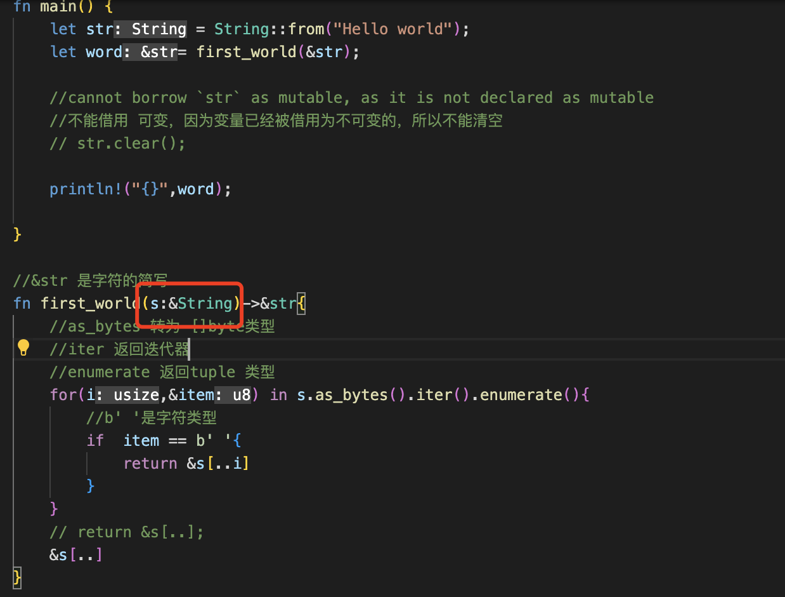


## 11.1 其它类å‹çš„切片

和字符串切片是适用的

```
fn main() {
    let a = [1,2,3,4,5];
    let slice = &a[1..5];
    
}
```


# 12. struct

- 使用struct关键字定义整个struct命å，和go的区别是有：指定类å‹

```
struct User{
	username :String,
	emial :String,
	sign_in_count : u64,
	active:bool,
}
```


- 想è¦ä½¿ç”¨struct，就必须创建structçš„å®ä¾‹ï¼Œä¸ºæ¯ä¸ªå­—段指定åˆå§‹å€¼,**必须全部制定åˆå§‹å€¼**
- 值的顺åºä¸é‡è¦

```

fn main() {
   struct User {
        username:String,
        email:String,
        age:u8,
    }

    //必须全部都è¦æŒ‡å®šåˆå§‹å€¼
    //missing structure fields:
    //- email
    //- age
    let user = User{
        username:String::from("zhangsan"),
        email:String::from("email"),
        age:28,
    };

    println!("user-username-{}",user.username);
     println!("user-email-{}",user.email);
     println!("user-age-{}",user.age);
}

user-username-zhangsan
user-email-email
user-age-28
```


- ==一但structçš„å®ä¾‹æ˜¯å¯å˜çš„，那么å®ä¾‹ä¸­çš„所有字段都是å¯å˜çš„==
- struct å¯ä»¥ä½œä¸ºå‡½æ•°è¿”å›å€¼
- 字段åˆå§‹åŒ–简写

```

fn main() {
   struct User {
        username:String,
        email:String,
        age:u8,
    }

    //必须全部都è¦æŒ‡å®šåˆå§‹å€¼
    //missing structure fields:
    //- email
    //- age
    let username = String::from("zhangsan");
    let email = String::from("email");
    let user = User{
        username,
        email,
        age:28,
    };

    println!("user-username-{}",user.username);
    println!("user-email-{}",user.email);
    println!("user-age-{}",user.age);

}

user-username-zhangsan
user-email-email
user-age-28
```


- struct 更新语法

```

fn main() {
   struct User {
        username:String,
        email:String,
        age:u8,
    }

    //必须全部都è¦æŒ‡å®šåˆå§‹å€¼
    //missing structure fields:
    //- email
    //- age

    let user2 = User{
        username:String::from("user2"),
        email:String::from("user2-email"),
        age:8,
    };
    let username = String::from("zhangsan");
    let user = User{
        username,
        ..user2
    };

    println!("user-username-{}",user.username);
    println!("user-email-{}",user.email);
    println!("user-age-{}",user.age);

}

user-username-zhangsan
user-email-user2-email
user-age-8
```


## 12.1 tuple struct

- å¯ä»¥å®šä¹‰tuple struct

- tuple struct整体有å，但是字段没å

  适用：正给整个structèµ·å，但是ä¸æƒ³ç»™å†…部元素起å

```rust
struct Color(i32,i32,i32);
struct Point(i32,i32,i32);

let black = Color(0,0,0);
let origin = Point(0,0,0);

```

Black å’Œorigin 是ä¸åŒç±»å‹

访问 .下标

```

fn main() {
   struct Color (i32,i32,i32);
   let black = Color(9,9,9);
   println!("black-first-{}",black.0);

    let b1 = Color(3,4,5);
    //这样是ä¸è¡Œçš„
    //expected struct `Color`, found tuple
//    let (b1,b2,b3) = bb;
    println!("black-b1-{}",b1.0);
     println!("black-b2-{}",b1.1);
      println!("black-b3-{}",b1.2);

}
```


## 12.1 unit-like-struct

struct () 没有任何字段的

- ==适用äºæŸä¸ªç±»å‹å®ç°trait，但是里é¢æ²¡æœ‰ä»»ä½•çš„存储数æ®==


## 12.3 structæ•°æ®çš„所有æƒ

```
struct User{
	username:String,
	email:String,
	age:u8,
}
```

- 这里的字段使用了String而ä¸æ˜¯&str
- 该structå®ä¾‹æ‹¥æœ‰å…¶æ‰€æœ‰çš„æ•°æ®
- åªè¦æ”¹structå®ä¾‹æ˜¯æœ‰æ•ˆçš„，那么里é¢çš„字段也是有效的
- struct里é¢ä¹Ÿå¯ä»¥å­˜æ”¾å¼•ç”¨ï¼Œéœ€è¦ç”¨åˆ°ç”Ÿå‘½å‘¨æœŸ
- ==声æ˜å‘¨æœŸä¿è¯ï¼Œåªè¦struct是有效的，里é¢çš„引用也是有效的==
- 如æœstruct里é¢å­˜å‚¨å¼•ç”¨ï¼Œä½†æ˜¯æ²¡æœ‰ä½¿ç”¨ç”Ÿå‘½å‘¨æœŸï¼Œå°±ä¼šæŠ¥é”™

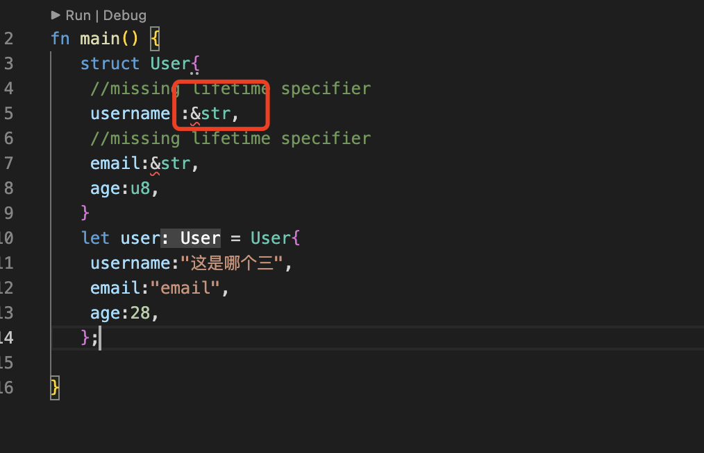


## 12.4 struct例å­

```

//#[derive(Debug)] derive是派生的æ„æ€
#[derive(Debug)]
struct Rectangle {
    width:u32,
    height:u32,
}
fn main() {
   let rect = Rectangle{
    width:30,
    height:50,
   };

   //此处是借用，所有æƒè¿˜åœ¨
   println!("{}",area(&rect));

   //打å°ç»“æ„化数æ®
    //    println!("{:?}",rect)
    /*
    16 |    println!("{:?}",rect)
    |                    ^^^^ `Rectangle` cannot be formatted using `{:?}`
    |
    = help: the trait `Debug` is not implemented for `Rectangle`
    = note: add `#[derive(Debug)]` to `Rectangle` or manually `impl Debug for Rectangle`
    */

   println!("{:?}",rect);
   println!("{:#?}",rect)

}

fn area(rect :&Rectangle)->u32{
    rect.width*rect.height
}


1500
Rectangle { width: 30, height: 50 }
Rectangle {
    width: 30,
    height: 50,
}
```


## 12.5 struct 的方法

- 方法和å®ä¾‹ç±»ä¼¼ï¼šfn关键字ã€å称ã€å‚æ•°ã€è¿”å›å€¼
- ä¸åŒä¹‹å¤„
- 方法在struct的上下文中定义
- 第一个å‚数是self，表示方法被调用的structå®ä¾‹

```

//#[derive(Debug)] derive是派生的æ„æ€
#[derive(Debug)]
struct Rectangle {
    width:u32,
    height:u32,
}

impl Rectangle {
    //此处是借用 å¯ä»¥æ˜¯self 值得move ，也å¯ä»¥æ˜¯&mut，需è¦structå˜é‡ä¹Ÿæ˜¯mutçš„
    fn area(&self)->u32{
        self.width*self.height
    }
}

fn main() {
   let rect = Rectangle{
    width:30,
    height:50,
   };

   //此处是借用，所有æƒè¿˜åœ¨
   println!("{}",rect.area());


   println!("{:?}",rect);
   println!("{:#?}",rect)

}

1500
Rectangle { width: 30, height: 50 }
Rectangle {
    width: 30,
    height: 50,
}

```

- 定义方法在implå—里é¢å®šä¹‰
- 方法调用，如æœè°ƒç”¨çš„是方法是.，如æœä¸æ˜¯æ–¹æ³•æ˜¯::


**方法调用的è¿ç®—符**

- rust会自动引用或者解引用
- 在调用方法的时候å‘生这ç§è¡Œä¸º
- 在调用方法时候，会自动添加&ã€&mut或者*

下边的代ç æ•ˆæœç›¸åŒ

P1.distance(&p2)

(&p1).disance(&p2)


## 12.6 å…³è”函数

- å¯ä»¥åœ¨implå—定义，但是ä¸æŠŠself当作第一个å‚æ•°
- 调用时::，而方法是.

```


//#[derive(Debug)] derive是派生的æ„æ€
#[derive(Debug)]
struct Rectangle {
    width:u32,
    height:u32,
}

impl Rectangle {
    //此处是借用 å¯ä»¥æ˜¯self 值得move ，也å¯ä»¥æ˜¯&mut，需è¦structå˜é‡ä¹Ÿæ˜¯mutçš„
    fn area(&self)->u32{
        self.width*self.height
    }
    fn square(size:u32)->Rectangle {
        Rectangle { width: size, height: size }
    }
}

fn main() {
   let rect = Rectangle{
    width:30,
    height:50,
   };

   //此处是借用，所有æƒè¿˜åœ¨
   println!("{}",rect.area());


   println!("{:?}",rect);
   println!("{:#?}",rect);

   let square = Rectangle::square(40);
      println!("{:#?}",square)
}

1500
Rectangle { width: 30, height: 50 }
Rectangle {
    width: 30,
    height: 50,
}
Rectangle {
    width: 40,
    height: 40,
}
```

- æ¯ä¸ªstauct å…许有多个implå—


# 13 æšä¸¾

- 关键字 enum åå­—

```
#[derive(Debug)]
enum IpAddrKind{
    V4,
    V6,
}

fn main(){
    let four = IpAddrKind::V4;
    let six = IpAddrKind::V6;

    route(four);
    route(six);
    route(IpAddrKind::V4)

}

fn route(ip_kind:IpAddrKind){
println!("{:#?}",ip_kind)
}

V4
V6
V4
```


## 13.1 添加数æ®åˆ°æšä¸¾å˜ä½“中


```
#[derive(Debug)]
enum IpAddrKind{
    V4(u8,u8,u8,u8),
    V6(String),
}

fn main(){
    let four = IpAddrKind::V4;
    let six = IpAddrKind::V6;

    route(four(127,1,1,0));
    route(six(String::from("aaa:kkk:kkk")));

}

fn route(ip_kind:IpAddrKind){
println!("{:#?}",ip_kind)
}

V4(
    127,
    1,
    1,
    0,
)
V6(
    "aaa:kkk:kkk",
)

```


## 13.2 标准库中的struct


## 13.3 为æšä¸¾å®šä¹‰æ–¹æ³•

```
#[derive(Debug)]
enum IpAddrKind{
    V4(u8,u8,u8,u8),
    V6(String),
}

impl IpAddrKind {
    fn ip_addr(&self){
        println!("{:#?}",self)
    }
}

fn main(){
    let four = IpAddrKind::V4(127,1,1,0);
    let six = IpAddrKind::V6(String::from("value"));

    four.ip_addr();
    six.ip_addr();

}


V4(
    127,
    1,
    1,
    0,
)
V6(
    "value",
)
```


# 14. Option<T>
- option æšä¸¾æœ‰Some<T>å’ŒNone
```
enum Option <T>{
	Some<T>,
	None,
}
```


```
	// #[derive(Debug)]
fn main(){
    let some = Option::Some(String::from("hello World"));
    is_some(some);


    // let no = None;
    // is_some(no)
}

//让T派生debug这个trait，就å¯ä»¥æ‰“å°äº†
fn is_some<T:std::fmt::Debug>(op:Option<T>){
    match op {
        Some(op)=> println!("{:#?}",op),
        None=>println!("none"),
    }
}
"hello World"

```

# 15 match
- match 必须穷举所有情况
	
```

#![allow(unused)]
fn main() {
match target {
    模å¼1 => 表达å¼1,
    模å¼2 => {
        语å¥1;
        语å¥2;
        表达å¼2
    },
    _ => 表达å¼3
}
}
```

## 15.1 使用 match 表达å¼èµ‹å€¼
```
//åŒæ„所有没使用的代ç 
#[allow(dead_code)]
enum IpAddr{
    V4,
    V6,
}
fn main(){
    let addr = IpAddr::V4;
    let some = match addr {
        IpAddr::V4=>"127.0.0.1",
        _ => "::1",
    };
    println!("{}",some)
}
```

# 16.  if let

- å’Œmatch相比。match需è¦å¯¹æ‰€æœ‰çš„情况进行匹é…，if let是å¯ä»¥å¯¹ä¸€ç§æƒ…况进行匹é…，其余情况ä¸éœ€è¦å¤„ç†çš„时候
```

//åŒæ„所有没使用的代ç 
#[allow(dead_code)]
enum IpAddr{
    V4,
    V6,
}
fn main(){
   let three = Some(3u8);

    match three {
        Some(3)=>println!("three"),
        _ => println!("none"),
    }

    //irrefutable `if let` pattern
    // this pattern will always match, so the `if let` is useless
    // if let three = Some(3){
    
    //如此写诗没有问题的，上边的有赋值的歧义
    if let Some(3) = three{
        println!("if let three");
    }else{
    
    }
}
```

# 17. matches!å®

matches!(expr,pattern)
- expr:是指æ¡ä»¶åˆ¤æ–­çš„å…¥å‚
- pattern 是期待为true的匹é…模å¼ã€‚

	
```

//åŒæ„所有没使用的代ç 
#[allow(dead_code)]
#[derive(PartialEq)]
#[derive(Debug)]
enum IpAddr{
    V4,
    V6,
}
fn main(){
   let options = [IpAddr::V4,IpAddr::V6];

   //传统的match
   for (_,v) in options.iter().enumerate()  {
       match v {
        IpAddr::V4 =>{
            println!("v4")
        },
        _ => println!("other"),
       } 
   }

   //filter
   //IpAddr å¿…é¡»å®ç° #[derive(PartialEq)] å¦åˆ™x == IpAddr::V4 会报错
   let filter = options.iter().filter(|x| **x == IpAddr::V4);
   println!("{:?}",filter);

   //使用matches!
   let b = options.iter().filter(|x| matches!(x,IpAddr::V4));

   println!("b-{:?}",b.);

}
v4
other
Filter { iter: Iter([V4, V6]) }
b-Filter { iter: Iter([V4, V6]) }

```

```

//åŒæ„所有没使用的代ç 
#[allow(dead_code)]
#[derive(PartialEq)]
#[derive(Debug)]
enum IpAddr{
    V4,
    V6,
}
fn main(){
   let f = 'f';

   let bo = matches!(f,'A'..='Z'|'a'..='z');
    println!("bo-{}",bo);

    let some = Some(4);

    //匹é…到Some(x) if x > 2的值代ç å¦‚下，其中这里的匹é…模å¼:匹é…å®ˆå« if x > 2
    //Some(x)是pattern匹é…模å¼
    //if x > 2表示guard的匹é…守å«(match guard)
    //这里的get_bar匹é…守å«åˆ°å…¶ä¸­ä¸€ä¸ªæ¨¡å¼å，返å›true,未匹é…到返å›fasle
    assert!(matches!(some,Some(x) if x > 2 ));

}

//bo-true
```


# 18. Package ã€crateã€module

rust的代ç ç»„织

- 模å—系统
- package(包)：cargo的特性，让你æ„建ã€æµ‹è¯•ã€å…±äº«crate
- crate(å•å…ƒåŒ…)：一个模å—树，它å¯ä»¥äº§ç”Ÿä¸€ä¸ªlibary或者å¯æ‰§è¡Œæ–‡ä»¶
- module(模å—)：use：让你æ§åˆ¶ä»£ç çš„组织ã€ä½œç”¨åŸŸã€ç§æœ‰è·¯å¾„
- path(路径)：为structã€function或者module等项命åçš„æ–¹å¼


## 18.1 package å’Œcrate

crateçš„ç±»å‹

- binary
- libary

crate root

- 是æºä»£ç æ–‡ä»¶
- rust编译器ä»è¿™é‡Œå¼€å§‹ï¼Œç»„æˆä½ çš„çš„crateçš„æ ¹module

package

- 包å«ä¸€ä¸ªcargo.toml，它æ述了如何æ„建这些crates
- åªèƒ½åŒ…å«0-1个libary crate
- å¯ä»¥åŒ…å«å¤šä¸ªbinary crate
- 但是至少包å«ä¸€ä¸ªcrate（libraryã€binary）


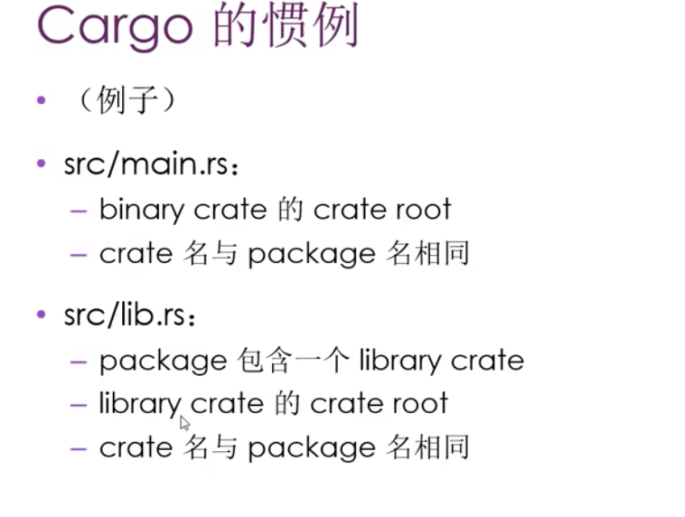

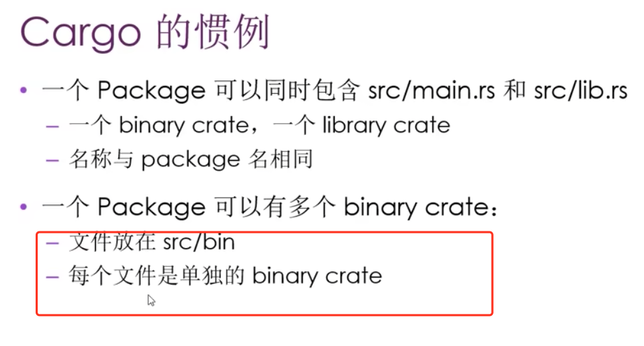

## 18.2 module

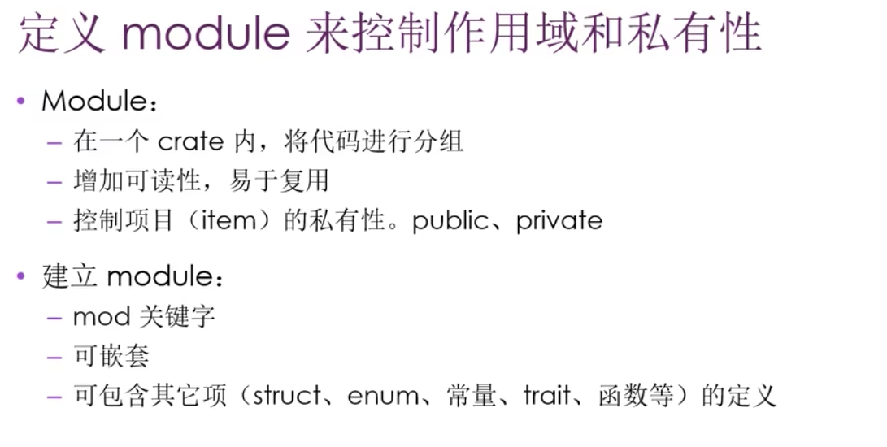


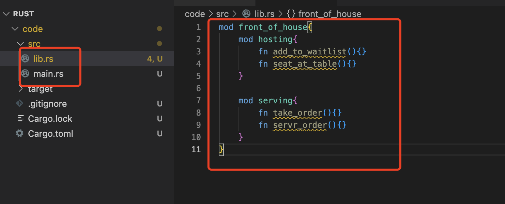

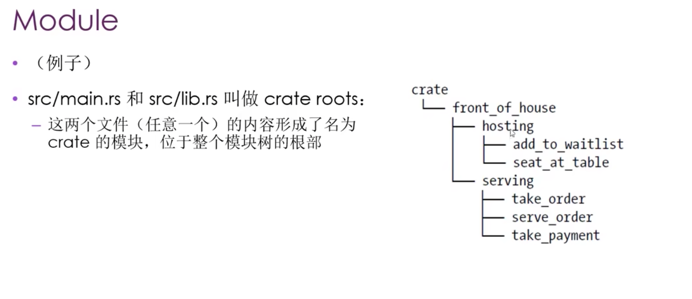

## 18.3 path路径

- ç»å¯¹è·¯å¾„：ä»crate开始，使用crate或者字é¢å€¼crate
- 相对路径：ä»å½“å‰æ¨¡å—开始，使用self，super或者当å‰æ¨¡å—的标识符

路径至少由一个标识符组æˆï¼Œæ ‡è¯†ç¬¦ä¹‹å‰ä½¿ç”¨::

```
mod front_of_house{
    mod hosting{
        fn add_to_waitlist(){}
        fn seat_at_table(){}
    }

    mod serving{
        fn take_order(){}
        fn servr_order(){}
    }
}

pub fn eat_at_restaurant(){
    //ç»å¯¹è·¯å¾„
    //ç»å¯¹è·¯å¾„使用crate这个字é¢å€¼ï¼Œå…³é”®å­—
    crate::front_of_house::hosting::add_to_waitlist();

    //相对路径
    front_of_house::hosting::add_to_waitlist()
}
```

### 18.3.1  ç§æœ‰è¾¹ç•Œ

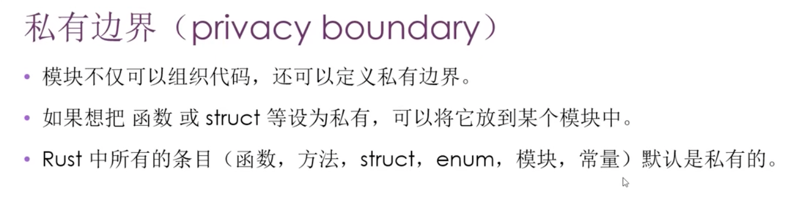

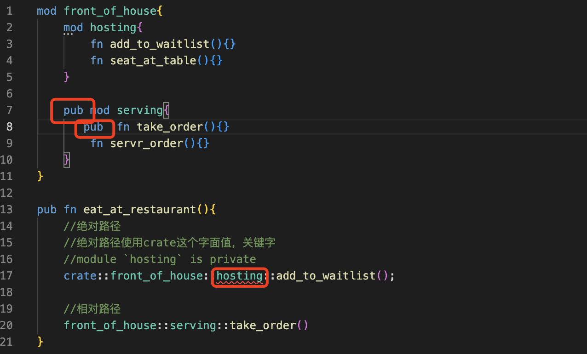


### 18.3.2 super

- Super æ¥è®¿é—®çˆ¶çº§çš„内容

```
fn serve_order() {
    
}

mod back_of_house{
    fn six_int_order(){
        super::serve_order()
    }
}
```


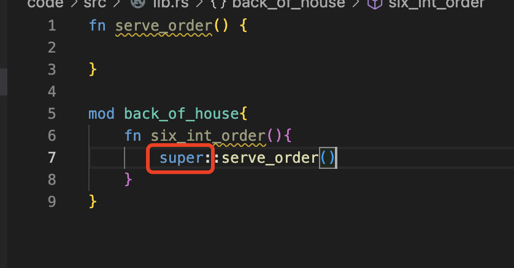


# 19. Pub

## 19.1 pub struct


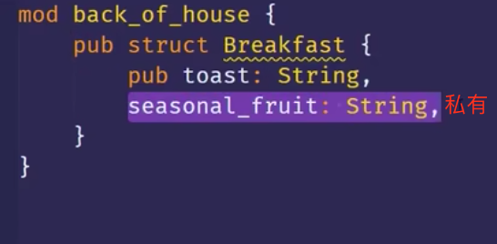

```
mod back_of_house{
    pub struct Breakfast{
        pub toast:String,
        seasonal_fruit:String,
    }

    impl Breakfast {
        pub fn summer(toast:&str)->Breakfast {
            Breakfast { 
                toast: String::from(toast), 
                seasonal_fruit: String::from("peaches") }
        }
    }
}

pub fn eat_at(){
    let mut meal = back_of_house::Breakfast::summer("tye");
    //共有的是å¯ä»¥è®¿é—®çš„，meal String是å¯å˜çš„ ，因为加了mut
    meal.toast = String::from("wheat");
    println!("like {}",meal.toast);
    //ç§æœ‰çš„ä¸å¯è®¿é—®
    //field `seasonal_fruit` of `Breakfast` is private
    meal.seasonal_fruit = String::from("value")
}
```


## 19.2 pub enum

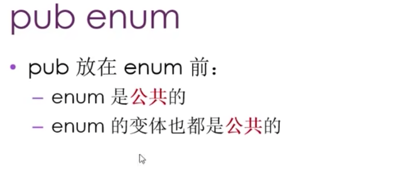


# 20. use

## 20.1 基本引入模å¼

相对路径和ç»å¯¹è·¯å¾„

**ç»å¯¹è·¯å¾„引入-相对路径引入**

```
mod front_of_house{
    pub mod hosting{
        pub fn add_to_waitlist(){}
    }
}

//ç»å¯¹è·¯å¾„ 引入，ç»å¯¹è·¯å¾„çš„root crate
use  crate::front_of_house::hosting::add_to_waitlist;


//相对路径引入
use front_of_house::hosting::add_to_waitlist;
```

## 20.2 引入函数

```
//此时引入到了HashMap函数
use std::collections::HashMap;

fn main(){
    let mut mp = HashMap::new();
    mp.insert(1, 2);
    println!("{:?}",mp);
}
```

## 20.3 as别åé¿å…é‡å引入

未é¿å…引入的包的åŒå å¯ä»¥ä½¿ç”¨asåšåˆ«å使用

```
//此时引入到了HashMap函数
use std::io::Result as IoResult;
use std::fmt::Result;

fn main(){
    
}


fn function1()->Result{
    ...
}

fn function2()->IoResult>{
    ...
}
```

## 20.4 ==pub use引入项å†å¯¼å‡º==

当外部的模å—项 `A` 被引入到当å‰æ¨¡å—中时，它的å¯è§æ€§è‡ªåŠ¨è¢«è®¾ç½®ä¸ºç§æœ‰çš„，如æœä½ å¸Œæœ›å…许其它外部代ç å¼•ç”¨æˆ‘们的模å—项 `A`，那么å¯ä»¥å¯¹å®ƒè¿›è¡Œå†å¯¼å‡ºï¼š

```
#![allow(unused)]
fn main() {
mod front_of_house {
    pub mod hosting {
        pub fn add_to_waitlist() {}
    }
}

pub use crate::front_of_house::hosting;

pub fn eat_at_restaurant() {
    hosting::add_to_waitlist();
    hosting::add_to_waitlist();
    hosting::add_to_waitlist();
}
}
```


## 20.5 使用 `{}` 简化引入方å¼

对äºä»¥ä¸‹ä¸€è¡Œä¸€è¡Œçš„引入方å¼ï¼š

```
use std::collections::HashMap;
use std::collections::BTreeMap;
use std::collections::HashSet;

use std::cmp::Ordering;
use std::io;
```

å¯ä»¥ä½¿ç”¨ `{}` æ¥ä¸€èµ·å¼•å…¥è¿›æ¥ï¼Œåœ¨å¤§å‹é¡¹ç›®ä¸­ï¼Œä½¿ç”¨è¿™ç§æ–¹å¼æ¥å¼•å…¥ï¼Œå¯ä»¥å‡å°‘å¤§é‡ `use` 的使用：

```
use std::collections::{HashMap,BTreeMap,HashSet};
use std::{cmp::Ordering, io};
```

对äºä¸‹é¢çš„åŒæ—¶å¼•å…¥æ¨¡å—和模å—中的项：

```
use std::io;
use std::io::Write;
```

å¯ä»¥ä½¿ç”¨ `{}` çš„æ–¹å¼è¿›è¡Œç®€åŒ–:

```
use std::io::{self, Write};
```

## 20.6 self

上é¢ä½¿ç”¨åˆ°äº†æ¨¡å—章节æ到的 `self` 关键字，用æ¥æ›¿ä»£æ¨¡å—自身，结åˆä¸Šä¸€èŠ‚中的 `self`，å¯ä»¥å¾—出它在模å—中的两个用途：

- `use self::xxx`，表示加载当å‰æ¨¡å—中的 `xxx`。此时 `self` å¯çœç•¥
- `use xxx::{self, yyy}`，表示，加载当å‰è·¯å¾„ä¸‹æ¨¡å— `xxx` 本身，以åŠæ¨¡å— `xxx` 下的 `yyy`

## 20.7 使用 `*` 引入模å—下的所有项

对äºä¹‹å‰ä¸€è¡Œä¸€è¡Œå¼•å…¥ `std::collections` çš„æ–¹å¼ï¼Œæˆ‘们还å¯ä»¥ä½¿ç”¨

```
use std::collections::*;
```

以上这ç§æ–¹å¼æ¥å¼•å…¥ `std::collections` 模å—下的所有公共项，这些公共项自然包å«äº† `HashMap`，`HashSet` 等想手动引入的集åˆç±»å‹ã€‚

当使用 `*` æ¥å¼•å…¥çš„时候è¦æ ¼å¤–å°å¿ƒï¼Œå› ä¸ºä½ å¾ˆéš¾çŸ¥é“到底哪些被引入到了当å‰ä½œç”¨åŸŸä¸­ï¼Œæœ‰å“ªäº›ä¼šå’Œä½ è‡ªå·±ç¨‹åºä¸­çš„å称相冲çªï¼š

```
use std::collections::*;

struct HashMap;
fn main() {
   let mut v =  HashMap::new();
   v.insert("a", 1);
}
```

以上代ç ä¸­ï¼Œ`std::collection::HashMap` 被 `*` 引入到当å‰ä½œç”¨åŸŸï¼Œä½†æ˜¯ç”±äºå­˜åœ¨å¦ä¸€ä¸ªåŒå的结æ„体，因此 `HashMap::new` 根本ä¸å­˜åœ¨ï¼Œå› ä¸ºå¯¹äºç¼–译器æ¥è¯´ï¼Œæœ¬åœ°åŒåç±»å‹çš„优先级更高。

在å®é™…项目中，这ç§å¼•ç”¨æ–¹å¼å¾€å¾€ç”¨äºå¿«é€Ÿå†™æµ‹è¯•ä»£ç ï¼Œå®ƒå¯ä»¥æŠŠæ‰€æœ‰ä¸œè¥¿ä¸€æ¬¡æ€§å¼•å…¥åˆ° `tests` 模å—中。

# 21. å—é™çš„å¯è§æ€§

在上一节中，我们学习了[å¯è§æ€§](https://course.rs/basic/crate-module/module.html#代ç å¯è§æ€§)这个概念，这也是模å—体系中最为核心的概念，æ§åˆ¶äº†æ¨¡å—中哪些内容å¯ä»¥è¢«å¤–部看è§ï¼Œä½†æ˜¯åœ¨å®é™…使用时，光被外é¢çœ‹åˆ°è¿˜ä¸è¡Œï¼Œæˆ‘们还想æ§åˆ¶å“ªäº›äººèƒ½çœ‹ï¼Œè¿™å°±æ˜¯ Rust æ供的å—é™å¯è§æ€§ã€‚

例如，在 Rust 中，包是一个模å—树，我们å¯ä»¥é€šè¿‡ `pub(crate) item;` è¿™ç§æ–¹å¼æ¥å®ç°ï¼š`item` 虽然是对外å¯è§çš„，但是åªåœ¨å½“å‰åŒ…内å¯è§ï¼Œå¤–部包无法引用到该 `item`。

所以，如æœæˆ‘们想è¦è®©æŸä¸€é¡¹å¯ä»¥åœ¨æ•´ä¸ªåŒ…中都å¯ä»¥è¢«ä½¿ç”¨ï¼Œé‚£ä¹ˆæœ‰ä¸¤ç§åŠæ³•ï¼š

- 在包根中定义一个é `pub` ç±»å‹çš„ `X`(父模å—的项对å­æ¨¡å—都是å¯è§çš„，因此包根中的项对模å—树上的所有模å—都å¯è§)
- 在å­æ¨¡å—中定义一个 `pub` ç±»å‹çš„ `Y`，åŒæ—¶é€šè¿‡ `use` 将其引入到包根

```
mod a {
    pub mod b {
        pub fn c() {
            println!("{:?}",crate::X);
        }

        #[derive(Debug)]
        pub struct Y;
    }
}

#[derive(Debug)]
struct X;
use a::b::Y;
fn d() {
    println!("{:?}",Y);
}
```

以上代ç å……分说æ˜äº†ä¹‹å‰ä¸¤ç§åŠæ³•çš„使用方å¼ï¼Œä½†æ˜¯æœ‰æ—¶æˆ‘们会é‡åˆ°è¿™ä¸¤ç§æ–¹æ³•éƒ½ä¸å¤ªå¥½ç”¨çš„时候。例如希望对äºæŸäº›ç‰¹å®šçš„模å—å¯è§ï¼Œä½†æ˜¯å¯¹äºå…¶ä»–模å—åˆä¸å¯è§ï¼š

```
// 目标：`a` 导出 `I`ã€`bar` and `foo`，其他的ä¸å¯¼å‡º
pub mod a {
    pub const I: i32 = 3;

    fn semisecret(x: i32) -> i32 {
        use self::b::c::J;
        x + J
    }

    pub fn bar(z: i32) -> i32 {
        semisecret(I) * z
    }
    pub fn foo(y: i32) -> i32 {
        semisecret(I) + y
    }

    mod b {
        mod c {
            const J: i32 = 4;
        }
    }
}
```

这段代ç ä¼šæŠ¥é”™ï¼Œå› ä¸ºä¸çˆ¶æ¨¡å—中的项对å­æ¨¡å—å¯è§ç›¸å，å­æ¨¡å—中的项对父模å—是ä¸å¯è§çš„。这里 `semisecret` 方法中，`a` -> `b` -> `c` å½¢æˆäº†çˆ¶å­æ¨¡å—链，那 `c` 中的 `J` 自然对 `a` 模å—ä¸å¯è§ã€‚

如æœä½¿ç”¨ä¹‹å‰çš„å¯è§æ€§æ–¹å¼ï¼Œé‚£ä¹ˆæƒ³ä¿æŒ `J` ç§æœ‰ï¼ŒåŒæ—¶è®© `a` 继续使用 `semisecret` 函数的åŠæ³•æ˜¯å°†è¯¥å‡½æ•°ç§»åŠ¨åˆ° `c` 模å—中，然å用 `pub use` å°† `semisecret` 函数进行å†å¯¼å‡ºï¼š

```
pub mod a {
    pub const I: i32 = 3;

    use self::b::semisecret;

    pub fn bar(z: i32) -> i32 {
        semisecret(I) * z
    }
    pub fn foo(y: i32) -> i32 {
        semisecret(I) + y
    }

    mod b {
        pub use self::c::semisecret;
        mod c {
            const J: i32 = 4;
            pub fn semisecret(x: i32) -> i32 {
                x + J
            }
        }
    }
}
```

这段代ç è¯´å®è¯é—®é¢˜ä¸å¤§ï¼Œä½†æ˜¯æœ‰äº›ç ´å了我们之å‰çš„逻辑，如æœæƒ³ä¿æŒä»£ç é€»è¾‘，åŒæ—¶åˆåªè®© `J` 在 `a` 内å¯è§è¯¥æ€ä¹ˆåŠï¼Ÿ

```
pub mod a {
    pub const I: i32 = 3;

    fn semisecret(x: i32) -> i32 {
        use self::b::c::J;
        x + J
    }

    pub fn bar(z: i32) -> i32 {
        semisecret(I) * z
    }
    pub fn foo(y: i32) -> i32 {
        semisecret(I) + y
    }

    mod b {
        pub(in crate::a) mod c {
            pub(in crate::a) const J: i32 = 4;
        }
    }
}
```

通过 `pub(in crate::a)` çš„æ–¹å¼ï¼Œæˆ‘ä»¬æŒ‡å®šäº†æ¨¡å— `c` å’Œå¸¸é‡ `J` çš„å¯è§èŒƒå›´éƒ½åªæ˜¯ `a` 模å—中，`a` 之外的模å—是完全访问ä¸åˆ°å®ƒä»¬çš„。

## 21.2 é™åˆ¶å¯è§æ€§è¯­æ³•

`pub(crate)` 或 `pub(in crate::a)` 就是é™åˆ¶å¯è§æ€§è¯­æ³•ï¼Œå‰è€…是é™åˆ¶åœ¨æ•´ä¸ªåŒ…内å¯è§ï¼Œå者是通过ç»å¯¹è·¯å¾„，é™åˆ¶åœ¨åŒ…内的æŸä¸ªæ¨¡å—内å¯è§ï¼Œæ€»ç»“一下：

- `pub` æ„味ç€å¯è§æ€§æ— ä»»ä½•é™åˆ¶
- `pub(crate)` 表示在当å‰åŒ…å¯è§
- `pub(self)` 在当å‰æ¨¡å—å¯è§
- `pub(super)` 在父模å—å¯è§
- `pub(in <path>)` 表示在æŸä¸ªè·¯å¾„代表的模å—中å¯è§ï¼Œå…¶ä¸­ `path` 必须是父模å—或者祖先模å—

```
//一个å为my_mod的模å—
mod my_mod{
    //在模å—中的项默认具有ç§æœ‰å¯è§æ€§
    fn private_function(){
        println!("called `my_mod::private_function`");
    }

    //使用pub 修饰语æ¥æ”¹å˜é»˜è®¤å¯è§æ€§
    pub fn function(){
        println!("called my_mod::function()");
    }

    //在åŒä¸€æ¨¡å—中，项å¯ä»¥è®¿é—®å…¶ä»–å˜é‡ï¼Œå³æ—¶ä»–是ç§æœ‰çš„
    pub fn indirect_access(){
        println!("called my_mod::indirect_access() that");
        private_function()
    }


    pub mod nested{
        pub fn function(){
            println!("called my_mod::nested::function()");
        }
        #[allow(dead_code)]
        fn private_function(){
            println!("called my_mod::nested::public_function()");
        }
    

   

        //使用`pub(in path)`语法定义的函数åªåœ¨ç»™å®šçš„路径中å¯è§
        pub(in crate::my_mod) fn public_function_in_my_mod(){
            println!("called my_mod::nested::public_function_in_mod()");
            public_function_nested()
        }

        //使用`pub(self)`语法定义的函数规则åªåœ¨å½“å‰å‡½æ•°å¯è§
        pub(self) fn public_function_nested(){
            println!("called `my_mod::nested::public_function_in_nested");
        }

        //使用`pub(super))`语法定义的函数则åªåœ¨å½“å‰æ¨¡å—å¯è§
        pub(super) fn public_function_in_super_mod(){
            println!("called `my_mod::nested::public_function_in_super_mod`")
        }

        
    }
    pub fn call_public_function_in_my_mod() {
        print!("called `my_mod::call_public_funcion_in_my_mod()`, that\n> ");
        nested::public_function_in_my_mod();
        print!("> ");
        nested::public_function_in_super_mod();
    }

    pub fn call_public_function_in_super_mod(){
        print!("called `my_mod::call_public_funcion_in_my_mod()`, that\n> ");
        nested::public_function_in_my_mod();
        print!("> ");
        nested::public_function_in_super_mod();
    }

    //`pub(crate)`使得函数åªåœ¨å½“å‰åŒ…å¯è§
    pub(crate) fn public_function_in_crate(){
        println!("called `my_mod::public_function_in_crate()");
    }
    // 嵌套模å—çš„å¯è§æ€§éµå¾ªç›¸åŒçš„规则
    mod private_nested {
        #[allow(dead_code)]
        pub fn function() {
            println!("called `my_mod::private_nested::function()`");
        }
    }
}


fn function() {
    println!("called `function()`");
}
    
fn main() {
    // 模å—机制消除了相åŒå字的项之间的歧义。
    function();
    my_mod::function();

    // 公有项，包括嵌套模å—内的，都å¯ä»¥åœ¨çˆ¶æ¨¡å—外部访问。
    my_mod::indirect_access();
    my_mod::nested::function();
    my_mod::call_public_function_in_my_mod();

    // pub(crate) 项å¯ä»¥åœ¨åŒä¸€ä¸ª crate 中的任何地方访问
    my_mod::public_function_in_crate();

    // pub(in path) 项åªèƒ½åœ¨æŒ‡å®šçš„模å—中访问
    // 报错ï¼å‡½æ•° `public_function_in_my_mod` 是ç§æœ‰çš„
    //pub(in crate::my_mod) åªæœ‰åœ¨è¿™ä¸ªå—里é¢æ‰å¯ä»¥è®¿é—®
    // my_mod::nested::public_function_in_my_mod();
    // 试一试 ^ å–消该行的注释

    // 模å—çš„ç§æœ‰é¡¹ä¸èƒ½ç›´æ¥è®¿é—®ï¼Œå³ä¾¿å®ƒæ˜¯åµŒå¥—在公有模å—内部的

    // 报错ï¼`private_function` 是ç§æœ‰çš„
    // my_mod::private_function();
    // 试一试 ^ å–消此行注释

    // 报错ï¼`private_function` 是ç§æœ‰çš„
    // my_mod::nested::private_function();
    // 试一试 ^ å–消此行的注释

    // æŠ¥é”™ï¼ `private_nested` 是ç§æœ‰çš„
    // my_mod::private_nested::function();
    // 试一试 ^ å–消此行的注释
}
```


# 22. 将模å—拆分为ä¸åŒçš„文件

- 模å—定义的时候，如æœæ¨¡å—åå边是";",而ä¸æ˜¯ä»£ç å—
- rust会ä»ä¸æ¨¡å—åŒå的文件中加载内容
- 模å—树的结æ„ä¸ä¼šå‘生å˜åŒ–


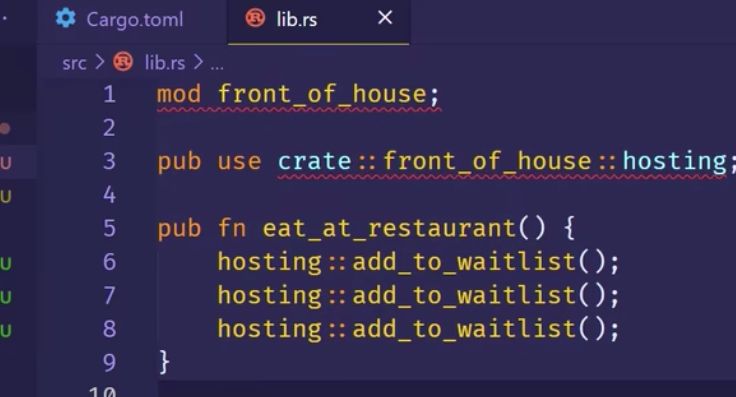

- 创建åŒåçš„front_os_house,rust 会自动查找这个文件

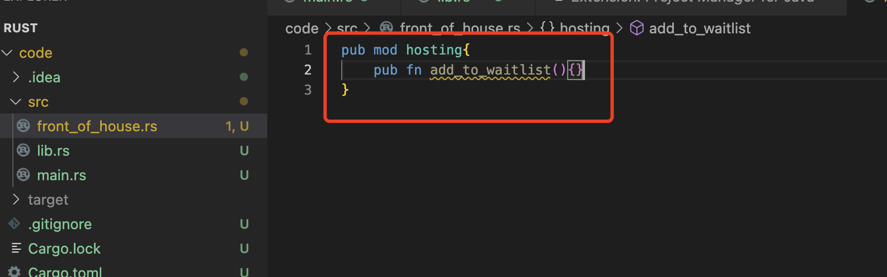

- 文件中添加模å—的内容

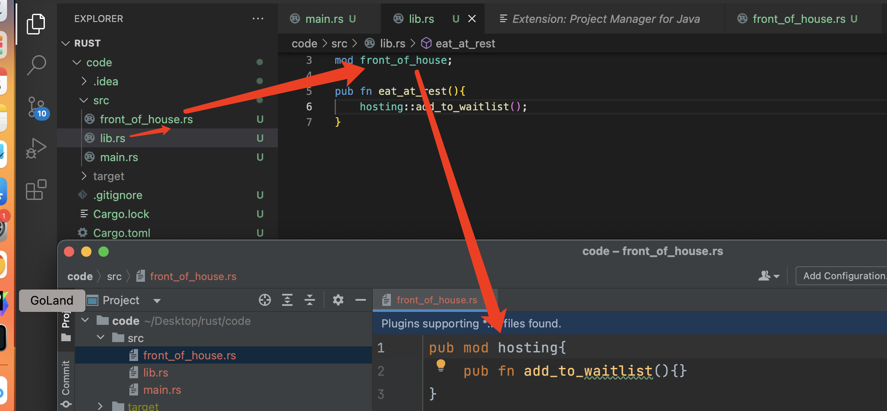


**多级目录**

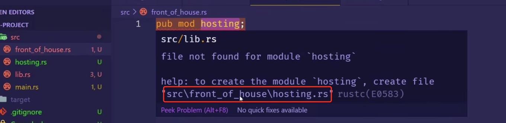


- 创建对应的包åŠæ–‡ä»¶

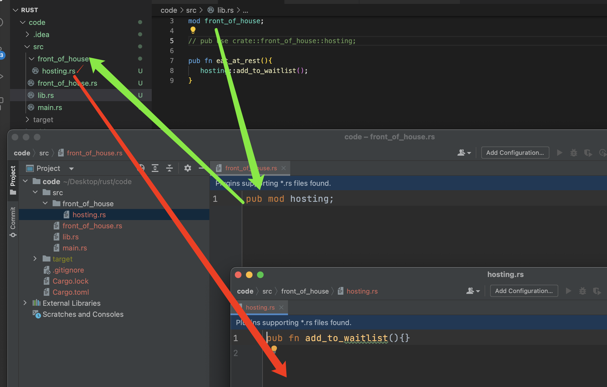


- Lib.rs 是library的根
- lib.rs里é¢çš„mod front_of-house;会查找==本路径的front_of_hous文件==
- 在本路径的front_of_house文件中加载了pub mod hosting;,==会加载本文件路径下的hosting.rs文件==


# 23. 动æ€æ•°æ®Vector

动æ€æ•°ç»„å…许你存储多个值，这些值在内存中一个紧挨ç€å¦ä¸€ä¸ªæ’列，因此访问其中æŸä¸ªå…ƒç´ çš„æˆæœ¬é常ä½ã€‚动æ€æ•°ç»„åªèƒ½==存储相åŒç±»å‹çš„元素==，如æœä½ æƒ³å­˜å‚¨ä¸åŒç±»å‹çš„元素，å¯ä»¥ä½¿ç”¨ä¹‹å‰è®²è¿‡çš„æšä¸¾ç±»å‹æˆ–者特å¾å¯¹è±¡ã€‚

## 23.1 创建vector

**第一ç§åˆå§‹åŒ–赋值**

```
fn main(){
    let mut er = vec![1,2,3];
    //cannot mutate immutable variable `er`
    er.push(4);
    println!("{:?}",er)
}
```


**åˆå§‹åŒ–åfuzhi**

```
fn main(){
    let mut ve: Vec<u32> = Vec::new();
    ve.push(21);

    println!("{:?}",ve);
}
```

## 23.2 Vector ä¸å…¶å…ƒç´ å…±å­˜äº¡

跟结æ„体一样，`Vector` ç±»å‹åœ¨è¶…出作用域范围å，会被自动删除：

```rust
{
    let v = vec![1, 2, 3];

    // ...
} // <- v超出作用域并在此处被删除
```

当 `Vector` 被删除å，它内部存储的所有内容也会éšä¹‹è¢«åˆ é™¤ã€‚ç›®å‰æ¥çœ‹ï¼Œè¿™ç§è§£å†³æ–¹æ¡ˆç®€å•ç›´ç™½ï¼Œä½†æ˜¯å½“ `Vector` 中的元素被引用å，事情å¯èƒ½ä¼šæ²¡é‚£ä¹ˆç®€å•ã€‚

## 23.3 ä»Vevtor读å–æ•°æ®

**使用下标读å–æ•°æ®**

```
fn main(){
    let mut er = vec![1,2,3];
    //cannot mutate immutable variable `er`
    er.push(4);
    println!("{:?}",er);

    //使用下标读å–æ•°æ®
    let three = er[2];
    println!("three-{}",three);

    //下标å»è¯»æ•°æ®è¶…过范围
    //thread 'main' panicked at 'index out of bounds: the len is 4 but the index is 4', src/main.rs:13:17
    //超过数æ®èŒƒå›´çš„会报错，阻止程åºæ‰§è¡Œ
    // let range = er[er.len()];
    // println!("读å–超过vecçš„æ•°æ®-{}",range);

    //使用.get读å–æ•°æ®
    let three_index_get  = er.get(2);
    println!("使用get读å–çš„æ•°æ®æ˜¯-{:?}",three_index_get);

    //使用.getè·å–超过数æ®èŒƒå›´çš„æ•°æ®
    let get_range = er.get(100);
    println!("getè·å–超过数æ®èŒƒå›´çš„æ•°æ®-{:?}",get_range);
}

[1, 2, 3, 4]
three-3
使用get读å–çš„æ•°æ®æ˜¯-Some(3)
getè·å–超过数æ®èŒƒå›´çš„æ•°æ®-None
```

- å¯ä»¥ä½¿ç”¨ä¸‹æ ‡è·å–æ•°æ®-[index]
- ==如æœä¸‹æ ‡è·å–æ•°æ®è¶…过范围，会报错，阻止程åºæ‰§è¡Œ==
- 也å¯ä»¥ä½¿ç”¨.getè·å–æ•°æ®
- 使用.getè·å–æ•°æ®==è¿”å›çš„是Option==，超过范围会返å›None

## 23.4 借用ä¸å¯å˜å€Ÿç”¨ä¸å¯åŒæ—¶å­˜åœ¨

```
fn main(){
    let mut er = vec![1,2,3];
    let first = &er[0];
    println!("借用的第一个元素{}",first);

    //cannot borrow `er` as mutable because it is also borrowed as immutable
    //因为下边ä»ç„¶å­˜åœ¨ä¸å¯å˜å¼•ç”¨ï¼Œæ–°å¢æ•°æ®å¯¼è‡´Vecå‘生内存copy，数æ®è¦copy到新的内存上，地å€å‘生å˜åŒ–
    //所以ä¸èƒ½å‘生å¯å˜å¼•ç”¨
    er.push(8);

    //上é¢å¦‚æœfirst ä¸åœ¨pushå使用，生命周期到println之å就结æŸäº†
    //å³ä½¿æ˜¯push了元素产生了å¯å˜å¼•ç”¨ï¼Œä¹Ÿä¸ä¼šå½±å“
    //但是在push之åfirstä»ç„¶é€‚用
    println!("借用的第一个元素{}",first);
}
```

- 如æœä¸å¯å˜å¼•ç”¨åœ¨å¯å˜è¡Œä¸ºçš„上é¢ï¼Œ==是å¯ä»¥çš„==
- 但是如æœåœ¨å¯å˜è¡Œä¸ºçš„åé¢ä½¿ç”¨ä¸å¯å˜æ•°æ®æ˜¯==ä¸è¡Œçš„==，因为数æ®åœ¨å†…存是è¿ç»­æ’列的，当数æ®å‘生新å¢ä¼šæ–°å¼€è¾Ÿåœ°å€ï¼Œå°†è€çš„æ•°æ®copy过å»ï¼Œæ­¤æ—¶æ•°æ®åœ°å€ä¼šå‘生å˜åŒ–

**如æœä¸æ˜¯ä¸å¯å˜å¼•ç”¨å‘¢**

```
fn main(){
    let mut er = vec![1,2,3];
    let first = er[0];
    println!("借用的第一个元素{}",first);

    //cannot borrow `er` as mutable because it is also borrowed as immutable
    //因为下边ä»ç„¶å­˜åœ¨ä¸å¯å˜å¼•ç”¨ï¼Œæ–°å¢æ•°æ®å¯¼è‡´Vecå‘生内存copy，数æ®è¦copy到新的内存上，地å€å‘生å˜åŒ–
    //所以ä¸èƒ½å‘生å¯å˜å¼•ç”¨
    er.push(8);

    //上é¢å¦‚æœfirst ä¸åœ¨pushå使用，生命周期到println之å就结æŸäº†
    //å³ä½¿æ˜¯push了元素产生了å¯å˜å¼•ç”¨ï¼Œä¹Ÿä¸ä¼šå½±å“
    //但是在push之åfirstä»ç„¶é€‚用
    println!("借用的第一个元素{}",first);


    //如æœæ˜¯heapçš„æ•°æ®
    let mut str = vec![String::from("first"),String::from("two")];
    //move occurs because value has type `String`, which does not implement the `Copy` trait
    //是ä¸å¯ä»¥moveçš„ å¯ä»¥ä½¿ç”¨&,但是就和基本类å‹ä¸€æ ·äº†
    let heap_first = str[0];
    println!("heap_firstçš„move-{}",heap_first);

    //进行数æ®å¯å˜
    // str.push(String::from("three"));

    // println!("heap_firstçš„move-{}",heap_first);
}
```


## 23.5 vec的迭代

```
fn main(){
    let er = vec![1,2,3];
    
    for i in er{
        println!("迭代的元素-{}",i);
    }
    //迭代的元素-1
    // 迭代的元素-2
    // 迭代的元素-3

    //迭代中改å˜å…ƒç´ 
    let mut num = vec![1,2,3,4,5];

    for i in &mut num{
         *i  *= 10;
         println!("迭代中改å˜å…ƒç´ -{}",i);
    }
    println!("迭代中改å˜å…ƒç´ çš„数组-{:?}",num)

}

迭代的元素-1
迭代的元素-2
迭代的元素-3
迭代中改å˜å…ƒç´ -10
迭代中改å˜å…ƒç´ -20
迭代中改å˜å…ƒç´ -30
迭代中改å˜å…ƒç´ -40
迭代中改å˜å…ƒç´ -50
迭代中改å˜å…ƒç´ çš„数组-[10, 20, 30, 40, 50]
```


## 23.6 存储ä¸åŒç±»å‹

```
#[derive(Debug)]
struct Type(String,u32);
fn main(){
    let mut t  = Vec::new();
    let t1 = Type(String::from("str"),32);
    t.push(t1);

    println!("{:?}",t);

    //åˆå§‹åŒ–
    let ts :Vec<Type> = vec![Type(String::from("str"),32),Type(String::from("str2"),34)];
    println!("{:?}",ts);
}

[Type("str", 32)]
[Type("str", 32), Type("str2", 34)]
```

# 24. String

- 基äº[]byte的集åˆ
- rust的核心语言层é¢ï¼Œåªæœ‰ä¸€ä¸ªå­—符串类å‹ï¼Œå­—符串切片str或者&str
- 字符串切片，对存储在其他地方ã€UTF-8ç¼–ç çš„字符串的引用
- ==字符串字é¢å€¼ï¼Œå­˜å‚¨åœ¨äºŒè¿›åˆ¶ä¸­ï¼Œä¹Ÿæ˜¯å­—符串切片==
- String 是å¯å¢é•¿çš„ã€å¯ä¿®æ”¹çš„ã€å¯æ‹¥æœ‰çš„
- Stringä¸æ˜¯rust的核心语言层é¢çš„
- String是UTF-8ç±»å‹çš„

**其他类å‹çš„标准库字符串**

- OsString
- OsStr
- CString
- CStr

万般无奈的情况下，åªå¥½æ–°è®¾è®¡ä¸€å¥—新的字符串类å‹ï¼Œç”¨æ¥åœ¨åš FFI æ¥å£çš„时候放弃字符串åˆæ³•æ€§æ£€æŸ¥ï¼Œå¹¶æŠŠè¿™ç§å…许é法字符存在的编ç æ ¼å¼ç¾å…¶å曰——WTF-8。

```
use std::ffi::OsStr;
use std::ffi::OsString;
 
fn main() {
    let a_str: &str = "Hello Str!"; 
    let an_os_str: &OsStr = OsStr::new(a_str); 
    println!("{:?}", an_os_str); 
 
    let a_string = String::from("Hello, String!");
    let an_os_string = OsString::from(a_string); 
    println!("{:?}", an_os_string); 
}
```


## 24.1 slice

切片并ä¸æ˜¯ Rust 独有的概念，在 Go 语言中就é常æµè¡Œï¼Œå®ƒå…许你引用集åˆä¸­éƒ¨åˆ†è¿ç»­çš„元素åºåˆ—，而ä¸æ˜¯å¼•ç”¨æ•´ä¸ªé›†åˆã€‚

对äºå­—符串而言，切片就是对 `String` ç±»å‹ä¸­æŸä¸€éƒ¨åˆ†çš„引用，它看起æ¥åƒè¿™æ ·ï¼š

```
#[derive(Debug)]
struct Type(String,u32);
fn main(){

  let s : String = String::from("hello world");

//   let word = &s[0..6];
  let hello = &s[..6];
  let world = &s[6..];

  println!("hello-{}",hello);
  println!("world-{}",world)


}

hello-hello 
world-world
```


## 24.2 字符串字é¢é‡æ˜¯åˆ‡ç‰‡

==字符串字é¢é‡æ˜¯ç¼–译到二进制中的，因此ä¸å¯å˜==

之å‰æ到过字符串字é¢é‡,但是没有æ到它的类å‹ï¼š

```rust
let s = "Hello, world!";
```

å®é™…上，`s` çš„ç±»å‹æ˜¯ `&str`，因此你也å¯ä»¥è¿™æ ·å£°æ˜ï¼š

```rust
let s: &str = "Hello, world!";
```

该切片指å‘了程åºå¯æ‰§è¡Œæ–‡ä»¶ä¸­çš„æŸä¸ªç‚¹ï¼Œè¿™ä¹Ÿæ˜¯ä¸ºä»€ä¹ˆå­—符串字é¢é‡æ˜¯ä¸å¯å˜çš„，因为 `&str` 是一个ä¸å¯å˜å¼•ç”¨ã€‚


## 24.3 String

**Rust 中的字符是 Unicode ç±»å‹ï¼Œå› æ­¤æ¯ä¸ªå­—符å æ® 4 个字节内存空间，但是在字符串中ä¸ä¸€æ ·ï¼Œå­—符串是 UTF-8 ç¼–ç ï¼Œä¹Ÿå°±æ˜¯å­—符串中的字符所å çš„字节数是å˜åŒ–çš„(1 - 4)**，这样有助äºå¤§å¹…é™ä½å­—符串所å ç”¨çš„内存空间。


## 24.4 String ä¸ &str 的转æ¢

在之å‰çš„代ç ä¸­ï¼Œå·²ç»è§åˆ°å¥½å‡ ç§ä» `&str` ç±»å‹ç”Ÿæˆ `String` ç±»å‹çš„æ“作：

- `String::from("hello,world")`
- `"hello,world".to_string()` //将&str转为String

那么如何将 `String` ç±»å‹è½¬ä¸º `&str` ç±»å‹å‘¢ï¼Ÿç­”案很简å•ï¼Œå–引用å³å¯ï¼š

```
#[derive(Debug)]
struct Type(String,u32);
fn main(){

    let s = String::from("hello world");
    say(&s[..6]);

    say(s.as_str());
	
		//as_str 将String转为 &str
		//to_String 将String转为&str
    let str = s.as_str().to_string();
    println!("{}",str)
}

fn say(s:&str){
    println!("say-{}",s)
}

say-hello 
say-hello world
hello world
```
## 24.5 [字符串索引](https://course.rs/basic/compound-type/string-slice.html#字符串索引)

在其它语言中，使用索引的方å¼è®¿é—®å­—符串的æŸä¸ªå­—符或者å­ä¸²æ˜¯å¾ˆæ­£å¸¸çš„行为，但是在 Rust 中就会报错：

```rust
   let s1 = String::from("hello");
   let h = s1[0];
```

该代ç ä¼šäº§ç”Ÿå¦‚下错误：


[字符串的ä¸åŒè¡¨ç°å½¢å¼](https://course.rs/basic/compound-type/string-slice.html#字符串的ä¸åŒè¡¨ç°å½¢å¼)

ç°åœ¨çœ‹ä¸€ä¸‹ç”¨æ¢µæ–‡å†™çš„字符串 `“नमसà¥à¤¤à¥‡â€`, 它底层的字节数组如下形å¼ï¼š

```rust
[224, 164, 168, 224, 164, 174, 224, 164, 184, 224, 165, 141, 224, 164, 164,
224, 165, 135]
```

长度是 18 个字节，这也是计算机最终存储该字符串的形å¼ã€‚如æœä»å­—符的形å¼å»çœ‹ï¼Œåˆ™æ˜¯ï¼š

```rust
['न', 'म', 'स', 'à¥', 'त', 'े']
```

但是这ç§å½¢å¼ä¸‹ï¼Œç¬¬å››å’Œå…­ä¸¤ä¸ªå­—æ¯æ ¹æœ¬å°±ä¸å­˜åœ¨ï¼Œæ²¡æœ‰ä»»ä½•æ„义，æ¥ç€å†ä»å­—æ¯ä¸²çš„å½¢å¼å»çœ‹ï¼š

```rust
["न", "म", "सà¥", "ते"]
```

所以，å¯ä»¥çœ‹å‡ºæ¥ Rust æ供了ä¸åŒçš„字符串展ç°æ–¹å¼ï¼Œè¿™æ ·ç¨‹åºå¯ä»¥æŒ‘选自己想è¦çš„æ–¹å¼å»ä½¿ç”¨ï¼Œè€Œæ— éœ€å»ç®¡å­—符串ä»äººç±»è¯­è¨€è§’度看长什么样。

还有一个åŸå› å¯¼è‡´äº† Rust ä¸å…许å»ç´¢å¼•å­—符串：因为索引æ“作，我们总是期望它的性能表ç°æ˜¯ O(1)ï¼Œç„¶è€Œå¯¹äº `String` ç±»å‹æ¥è¯´ï¼Œæ— æ³•ä¿è¯è¿™ä¸€ç‚¹ï¼Œå› ä¸º Rust å¯èƒ½éœ€è¦ä» 0 开始å»éå†å­—符串æ¥å®šä½åˆæ³•çš„字符。


## 24.6 字符串æ“作

### 24.6.1 追加push

- 在字符串尾部å¯ä»¥ä½¿ç”¨ `push()` 方法追加==字符 `char`==
- 也å¯ä»¥ä½¿ç”¨ `push_str()` 方法追加字符串字é¢é‡ã€‚
- 这两个方法都是==**在åŸæœ‰çš„字符串上追加，并ä¸ä¼šè¿”å›æ–°çš„字符串**==。
- ç”±äºå­—符串追加æ“作è¦ä¿®æ”¹åŸæ¥çš„字符串，==则该字符串必须是å¯å˜çš„，å³**字符串å˜é‡å¿…须由 `mut` 关键字修饰**。==

```
#[derive(Debug)]
struct Type(String,u32);
fn main(){

    let mut str = String::from("pushå‰çš„字符长");
    say(&str);
    str.push_str("pushå的字符长-push_str");
    say(&str);

    //追加字符
    str.push('!');
    say(&str);


}

fn say(s:&str){
    println!("say-{}",s)
}

say-pushå‰çš„字符长
say-pushå‰çš„字符长pushå的字符长-push_str
say-pushå‰çš„字符长pushå的字符长-push_str!
```

### 24.6.2 insert æ’å…¥

- insertæ’å…¥==å•ä¸ªå­—符==
- insert_stræ’入字符串
- 两个方法都需è¦ä¸¤ä¸ªå‚数，第一个å‚数是æ’入的ä½ç½®ï¼Œç¬¬äºŒä¸ªæ˜¯æ’入的数æ®

```
fn main() {
    let mut str= String::from("hello world");
    str.insert(5, ',');

    str.insert_str(str.len(), "!");

    println!("str-{}   ",str)
}

str-hello, world! 
```


### 24.6.3 æ›¿æ¢ replace全部ã€replacen个数ã€replace_range范围

==replace== 全部替æ¢

- 此方法适用äº&strå’ŒString两ç§
- 此方法会有返å›å€¼ï¼Œè¿”å›æ–°çš„，==有&str==肯定返å›æ–°çš„
- å‚æ•°1是è¦ä¿®æ”¹çš„字符串，å‚æ•°2是è¦ä¿®æ”¹å的字符串

```
fn main() {
    let  str= String::from("I  like rust");
    let str = str.replace("rust", "RUST");

    println!("{}   ",str);

    //替æ¢&str
    let str = "I like rust";

    let str = str.replace("rust", "RUST");

    println!("{}   ",str);
}

I  like RUST   
I like RUST   
```


==replacen== 指定替æ¢çš„个数

- 适用äºStringã€&str
- å‰ä¸¤ä¸ªå‚æ•°å’Œreplace是一样的，第三个是替æ¢çš„个数

```
fn main() {
    let  str= String::from("I  like rust,must rust");
    let str = str.replacen("rust", "RUST",1);

    println!("{}   ",str);

    //替æ¢&str
    let str = "I like rust,must rust";

    let str = str.replacen("rust", "RUST",2);

    println!("{}   ",str);
}

I  like RUST,must rust   
I like RUST,must RUST   
```


==replace_range== 指定范围替æ¢æ•°æ®

- 此方法ä¸ä¼šè¿”å›æ–°å€¼ï¼Œæ‰€ä»¥åªèƒ½é€‚用äºString ，还必须是mutçš„
- 第一个是替æ¢çš„范围，第二个是è¦æ›¿æ¢å的内容

```
fn main() {
    let  mut str= String::from("I like rust,must rust");
    str.replace_range(7..10, "RUST");

    println!("{}   ",str);

}
I like RUSTt,must rust   
```

### 24.6.4 删除

ä¸å­—符串删除相关的方法有 4 个，他们分别是 `pop()`，`remove()`，`truncate()`，`clear()`。这四个方法仅适用äº== `String` ==ç±»å‹ã€‚


==pop==--删除并返å›å­—符串的最å一个字符

- **该方法是直æ¥æ“作åŸæ¥çš„字符串**。但是存在返å›å€¼ï¼Œå…¶è¿”å›å€¼æ˜¯ä¸€ä¸ª `Option` ç±»å‹ï¼Œå¦‚æœå­—ç¬¦ä¸²ä¸ºç©ºï¼Œåˆ™è¿”å› `None`。 示例代ç å¦‚下：

```
fn main() {
    let   mut str= String::from("I like rust,must rust 中文!");
    let pop = str.pop();
    let pop1 = str.pop();
    dbg!(str);
    dbg!(pop);
    dbg!(pop1);

}

[src/main.rs:5] str = "I like rust,must rust 中"
[src/main.rs:6] pop = Some(
    '!',
)
[src/main.rs:7] pop1 = Some(
    'æ–‡',
)
```


**`remove` —— 删除并返å›å­—符串中指定ä½ç½®çš„==字符==**

- 有返å›å€¼
- æ“作åŸæ¥çš„æ•°æ®
- åªæ¥å—一个å‚数，è¦åˆ é™¤ä½ç½®

**该方法是直æ¥æ“作åŸæ¥çš„字符串**。但是存在返å›å€¼ï¼Œå…¶è¿”å›å€¼æ˜¯åˆ é™¤ä½ç½®çš„字符串，åªæ¥æ”¶ä¸€ä¸ªå‚数，表示该字符起始索引ä½ç½®ã€‚`remove()` 方法是按照字节æ¥å¤„ç†å­—符串的，如æœå‚数所给的ä½ç½®ä¸æ˜¯åˆæ³•çš„字符边界，则会å‘生错误。

```
fn main() {
    let mut str = String::from("remve测试!");
    println!("length-{}",str.len());

    let remove = str.remove(str.len()-1);
    println!("length-{}",str.len());
    println!("{}",str);

    //hread 'main' panicked at 'byte index 10 is not a char boundary; it is inside '试' (bytes 8..11) of `remve测试`',
    //弹出的是字节,但是中文å¼ä¸‰å­èŠ‚，å–ä¸å‡ºä¸€ä¸ªå®Œæ•´çš„，所以报错
    let remove1 = str.remove(str.len()-1);
    println!("{}",str);
    println!("{}",remove);
    println!("{}",str);
    println!("{}",remove1);


}

length-12
length-11
remve测试
thread 'main' panicked at 'byte index 10 is not a char boundary; it is inside '试' (bytes 8..11) of `remve测试`', /rustc/9eb3afe9ebe9c7d2b84b71002d44f4a0edac95e0/library/alloc/src/string.rs:1336:24
note: run with `RUST_BACKTRACE=1` environment variable to display a backtrace
```


`truncate` —— 删除字符串中ä»==指定ä½ç½®å¼€å§‹åˆ°ç»“尾的全部字符==

**该方法是直æ¥æ“作åŸæ¥çš„字符串**。无返å›å€¼ã€‚该方法 `truncate()` 方法是按照字节æ¥å¤„ç†å­—符串的，如æœå‚数所给的ä½ç½®ä¸æ˜¯åˆæ³•çš„字符边界，则会å‘生错误。

```
fn main() {
    let mut str = String::from("remve测试!");
    
    println!("length-{}",str.len());
    println!("{}",str);

    //truncate
    //thread 'main' panicked at 'assertion failed: self.is_char_boundary(new_len)', /rustc/9eb3afe9ebe9c7d2b84b71002d44f4a0edac95e0/library/alloc/src/string.rs:1279:13
    //note: run with `RUST_BACKTRACE=1` environment variable to display a backtrace
    //åŸå› æ˜¯5到末尾11都是中文，这里是ä»å­—符开始的所以这个范围的都会报错
    // str.truncate(7);
    str.truncate(2);
    println!("length-{}",str.len());
    println!("{}",str);


}

length-12
remve测试!
length-2
re
```


==`clear` —— 清空字符串== 此方法一看就是åªèƒ½æ˜¯String

- 清空åŸæ¥çš„字符串
- 必须是mut

```
fn main() {
    let mut str = String::from("remve测试!");
    
    println!("length-{}",str.len());
    println!("{:p}",&str);
    println!("{}",&str);

   str.clear();
   println!("{:p}",&str);
   println!("{}",&str);


}

length-12
0x16f95ab80
remve测试!
0x16f95ab80

```

å¯ä»¥çœ‹åˆ°åœ°å€æ²¡å˜ï¼Œå†…容å˜ä¸ºç©ºäº†


### 24.6.5 è¿æ¥ (Concatenate)

1ã€ä½¿ç”¨ `+` 或者 `+=` è¿æ¥å­—符串


2ã€ä½¿ç”¨ format! è¿æ¥å­—符串

format! è¿™ç§æ–¹å¼é€‚ç”¨äº String å’Œ &str 。format! çš„ç”¨æ³•ä¸ print! 的用法类似，详è§æ ¼å¼åŒ–输出。

示例代ç å¦‚下：

```
fn main() {
    let s1 = "hello";
    let s2 = String::from("rust");
    let s = format!("{} {}!", s1, s2);
    println!("{}", s);
}
```
代ç è¿è¡Œç»“æœï¼š
```
hello rust!
```

### 24.6.6 字符串转义
我们å¯ä»¥é€šè¿‡è½¬ä¹‰çš„æ–¹å¼ \ 输出 ASCII å’Œ Unicode 字符。

```
fn main() {
    // 通过 \ + 字符的å六进制表示，转义输出一个字符
    let byte_escape = "I'm writing \x52\x75\x73\x74!";
    println!("What are you doing\x3F (\\x3F means ?) {}", byte_escape);

    // \u å¯ä»¥è¾“出一个 unicode 字符
    let unicode_codepoint = "\u{211D}";
    let character_name = "\"DOUBLE-STRUCK CAPITAL R\"";

    println!(
        "Unicode character {} (U+211D) is called {}",
        unicode_codepoint, character_name
    );

    // æ¢è¡Œäº†ä¹Ÿä¼šä¿æŒä¹‹å‰çš„字符串格å¼
    let long_string = "String literals
                        can span multiple lines.
                        The linebreak and indentation here ->\
                        <- can be escaped too!";
    println!("{}", long_string);
}
```

当然，在æŸäº›æƒ…况下，å¯èƒ½ä½ ä¼šå¸Œæœ›ä¿æŒå­—符串的åŸæ ·ï¼Œä¸è¦è½¬ä¹‰ï¼š

```
fn main() {
    println!("{}", "hello \\x52\\x75\\x73\\x74");
    let raw_str = r"Escapes don't work here: \x3F \u{211D}";
    println!("{}", raw_str);

    // 如æœå­—符串包å«åŒå¼•å·ï¼Œå¯ä»¥åœ¨å¼€å¤´å’Œç»“尾加 #
    let quotes = r#"And then I said: "There is no escape!""#;
    println!("{}", quotes);

    // 如æœè¿˜æ˜¯æœ‰æ­§ä¹‰ï¼Œå¯ä»¥ç»§ç»­å¢åŠ ï¼Œæ²¡æœ‰é™åˆ¶
    let longer_delimiter = r###"A string with "# in it. And even "##!"###;
    println!("{}", longer_delimiter);
}
```

### 24.6.7 æ“作UTF-8æ•°æ®
- 使用.chars()


# 25 字符串深度解æ


# 26. HashMap

- H a sh M a p<K,V>
- 所有的K必须是åŒä¸€ä¸ªç±»å‹
- 所有的V也必须是åŒä¸€ä¸ªç±»å‹

```
use std::collections::HashMap;

fn main(){
    //type annotations needed for `HashMap<K, V>`
    //空的是ä¸èƒ½æ¨æ–­ï¼Œä¼šæœ‰é”™è¯¯
    // let mut map =HashMap::new();

    //å¯ä»¥å…ˆåˆ›å»º 空的 添加值å会æ¨æ–­å‡º
    let mut map =HashMap::new();

    //这样ä¸æ”¯æŒ
        // map[String::from("key")] = u8;
    map.insert(String::from("key"), 8);
    dbg!(map);

}

[src/main.rs:14] map = {
    "key": 8,
}
```


**å¦ä¸€ç§åˆ›å»ºcollect**

```
use std::collections::HashMap;

fn main(){
    let teams  = vec![String::from("blue"),String::from("yellow")];
    let intial_scores = vec![10,50];

    //å‰è¾¹éœ€è¦ä¹‹åè¿”å›ç±»å‹
    //因为collect会返å›å¾ˆå¤šç§çš„ç±»å‹æ•°æ®
    let scores : HashMap<_,_> = teams.iter().zip(intial_scores.iter()).collect();
    dbg!(scores);

}

[src/main.rs:8] scores = {
    "blue": 10,
    "yellow": 50,
}
```


## 26.1 所有全的移动

```
use std::collections::HashMap;

fn main(){
    let field_name = String::from("key");

    let field_value = String::from("value");

    let mut  map = HashMap::new();

    map.insert(field_name, field_value);

    dbg!(map);

    //此时访问
    //borrow of moved value: `field_name`
    //因为是heap分é…çš„æ•°æ®ï¼Œä¼šå‘生所有全的移动
    // println!("{}",field_name);

    // 但是如æœæ˜¯å¼•ç”¨ç±»å‹å°±æ˜¯å¯ä»¥çš„

    let field_name = String::from("key");

    let field_value = String::from("value");

    let mut  map = HashMap::new();

    map.insert(&field_name, &field_value);

    dbg!(map);
    println!("{}",field_name);

}

[src/main.rs:12] map = {
    "key": "value",
}
[src/main.rs:29] map = {
    "key": "value",
}
key
```


## 26.2 è·å–值

- å¯ä½¿ç”¨map[k]，è·å–,但是当getä¸å­˜åœ¨çš„时候会报错
- å¯ä½¿ç”¨map。get,ä¸å­˜åœ¨çš„时候会返å›None

```
use std::collections::HashMap;

fn main(){
    let field_name = String::from("key");

    let field_value = String::from("value");

    let mut  map = HashMap::new();

    map.insert(&field_name, &field_value);

    // dbg!(map);


    let m1 = map[&field_name];
    println!("{}",m1);
    
    //thread 'main' panicked at 'no entry found for key', src/main.rs:15:14
		//note: run with `RUST_BACKTRACE=1` environment variable to display a backtrace
    let m1 = map[&String::from("value")];
    println!("{}",m1);

    //没有此方法
    // let m1 = map[&field_name];

    let m =map.get(&field_name);
     match m{
        Some(s)=> println!("{}",s),
        None=>println!("empty",)
    };
    dbg!(m);

}

value
value
[src/main.rs:27] m = Some(
    "value",
)
```


## 26.3 éå†

- å¯ä½¿ç”¨tupleçš„å½¢å¼è¿›è¡Œéå†è·å–

```
use std::collections::HashMap;

fn main(){
    let field_name = String::from("key");

    let field_value = String::from("value");

    let mut  map = HashMap::new();

    map.insert(&field_name, &field_value);

   for (k,v) in map{
    println!("{}",k);
    println!("{}",v);
   }

}

key
value
```


## 26.4 æ›´æ–°hashmap

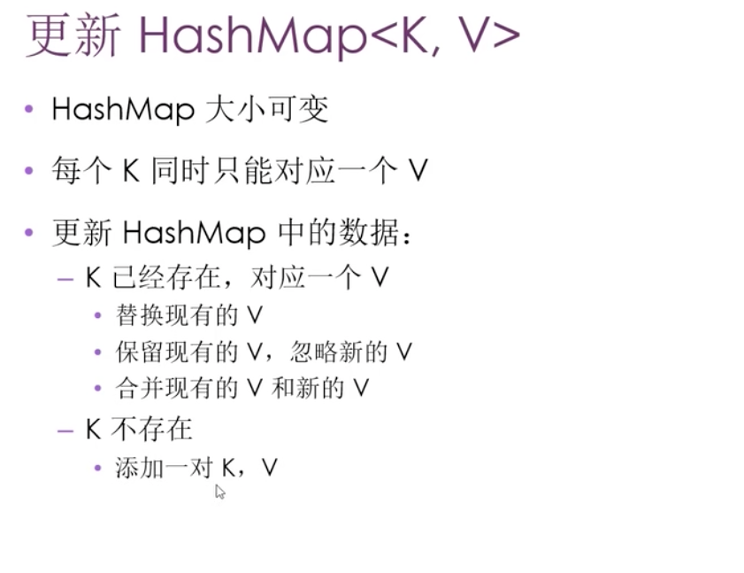

**覆盖ç°æœ‰çš„值**

```
use std::collections::HashMap;

fn main(){
    let field_name = String::from("key");

    let field_value = String::from("value");

    let mut  map = HashMap::new();

    map.insert(&field_name, &field_value);


    let field_value1 = String::from("kkkk");
    map.insert(&field_name,&field_value1);
    dbg!(map);

}

[src/main.rs:15] map = {
    "key": "kkkk",
}
```


**当值存在ä¸æ›¿æ¢**

- entry:检查指定的K是å¦å¯¹åº”一个V
- Or_insert æ’入值，如æœä¸å­˜åœ¨

```
use std::collections::HashMap;

fn main(){
    let mut scores = HashMap::new();
    scores.insert(String::from("blue"), 10);

    let e =scores.entry(String::from("blue"));

    e.or_insert(50);
    dbg!(scores);
    //[src/main.rs:10] scores = {
    //    "blue": 10,
    //}

    let mut s = HashMap::new();
    s.insert(String::from("keu"), String::from("value"));


    let ec = s.entry(String::from("kes"));

    ec.or_insert(String::from("kkkk"));
    // dbg!(ec);
    println!("{:?}",s);
}

[src/main.rs:10] scores = {
    "blue": 10,
}
{"keu": "value", "kes": "kkkk"}
```


**基äºç°æœ‰çš„值进行更新**

```
use std::collections::HashMap;

fn main(){
    let text = "hello world wonderful world";

    let mut map = HashMap::with_capacity(4);

    for word in text.split_whitespace(){
        let count = map.entry(word).or_insert(0);
        *count +=1;
    }
    print!("{:?}",map)
}

{"hello": 1, "wonderful": 1, "world": 2}%   
```


## 26.5  hash函数-docs攻击

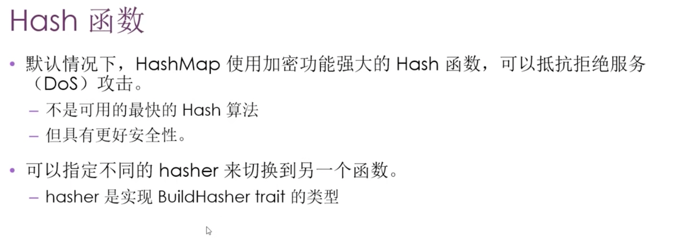


# 27 rust错误处ç†æ¦‚è¿°

- rustå¯é æ€§-错误处ç†
- 大部分情况下；在编译阶段æ示错误，并处ç†

- 错误氛围å¯æ¢å¤å’Œä¸å¯æ¢å¤çš„错误

- **å¯å¹æ‹‚的错误Result<F,E>**


## 27.1 ä¸å¯æ¢å¤çš„错误

- 打å°é”™è¯¯ä¿¡æ¯åŠè°ƒç”¨æ ˆä¿¡æ¯
- å‘生panic的时候沿ç€è°ƒç”¨æ ˆå¾€å›èµ°ï¼Œæ¸…ç†æ¯ä¸ªé‡åˆ°çš„函数，**工作é‡å¤§**
- ç«‹å³ç»ˆæ­¢ç¨‹åº
- 内存由os进行å›æ”¶


==**想让二进制更å°**==

- 在cargo.toml中适当profileçš„ä½ç½®è®¾ç½®
  - panic='about',å‘生æ慌，立å³ç»ˆæ­¢æ‰§è¡Œï¼Œç”±os进行å›æ”¶

```
[package]
name = "code"
version = "0.1.0"
edition = "2021"

# See more keys and their definitions at https://doc.rust-lang.org/cargo/reference/manifest.html

[dependencies]

[profile.release]
panic = 'abort'
```


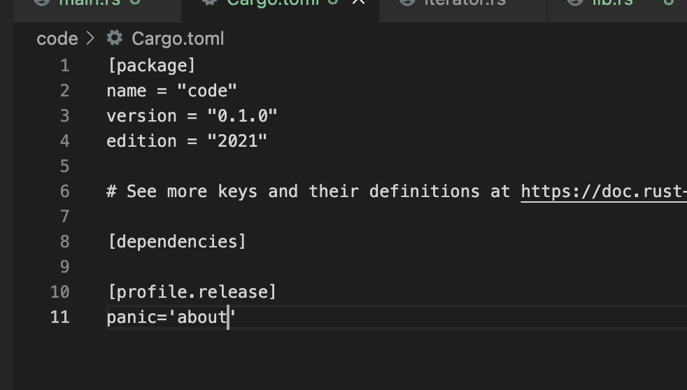


## 27.2 RUST_BACKTRACE 追踪错误

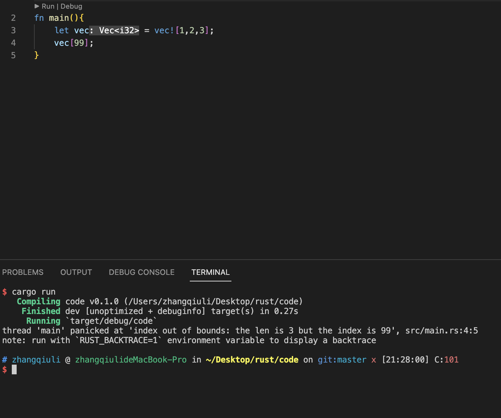


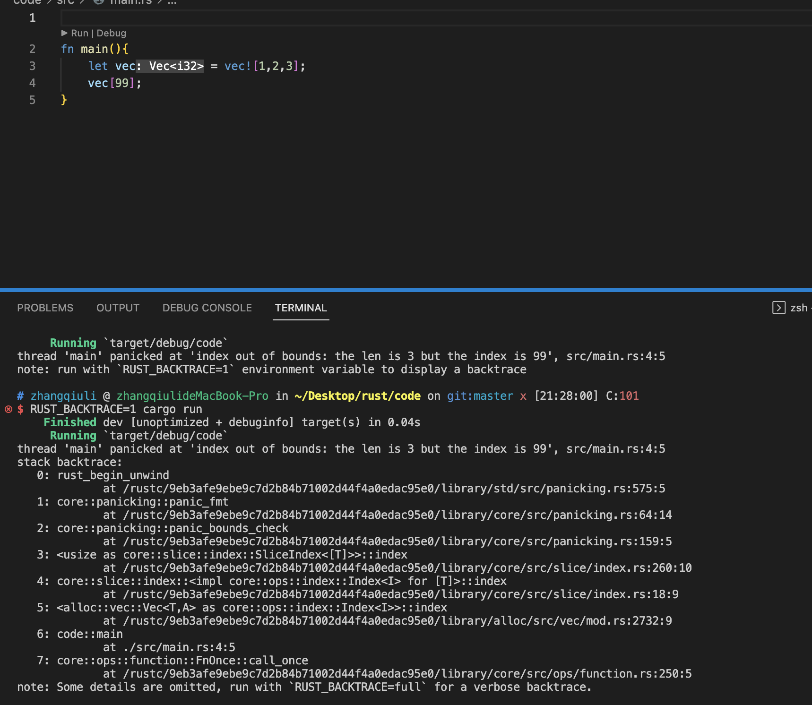


ç°å®è°ƒç”¨çš„堆栈信æ¯

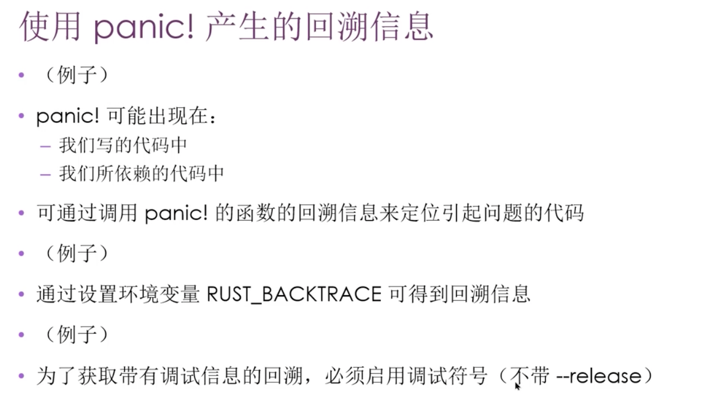

## 27.3 å¯æ¢å¤çš„错误Resultæšä¸¾


```

use std::{fs::File};
fn main(){
   let f = File::open("hello.txt");

   let _f = match f {
       Ok(file)=>file,
       Err(error)=> match error.kind() {
           std::io::ErrorKind::NotFound=> match File::create("hello.txt") {
               Ok(fc)=>fc,
               Err(e)=>panic!("not found file {:?}",e),
           },
           other_err => panic!("error opening file {:?}",other_err),
       },
      
   };
   
}
```


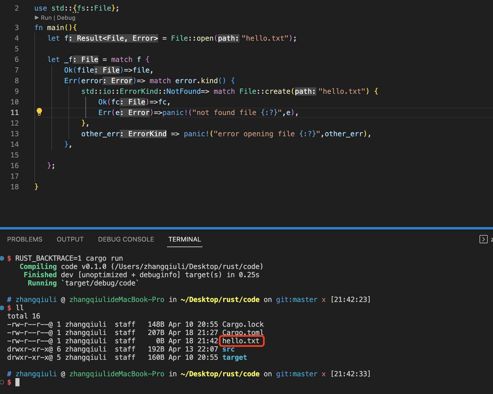


## 27.4 闭包å®ç° 让带阿妹更简æ´

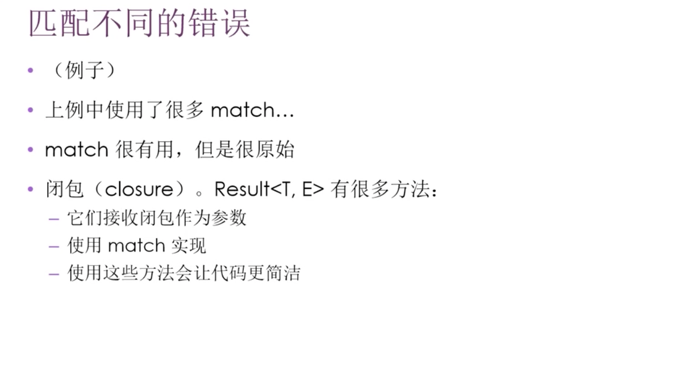

```

use std::{fs::File, io::ErrorKind};
fn main(){
    let _f = File::open("hello.txt").unwrap_or_else(|error|{
        if error.kind() == ErrorKind::NotFound{
            File::create("hello.txt").unwrap_or_else(|error|{
                panic!("create file is error {:?}",error);
            })
        }else{
            panic!("error open file error {:?}",error);
        }
    }) ;
}
```


## 27.5 unwrap

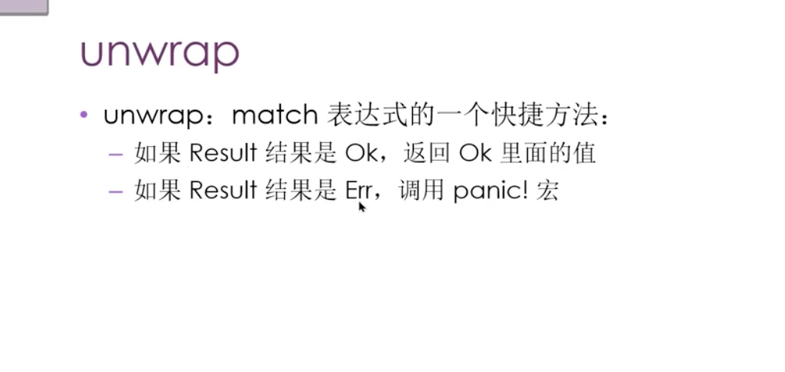

```

use std::{fs::File};
fn main(){
    // let f = File::open("hello.txt");

    // let f = match f {
    //     Ok(file)=>file,
    //     Err(error)=>panic!("{:?}",error),
    // };

    //相当äº
    let f = File::open("hello.txt").unwrap();

}


```


## 27.6 expect

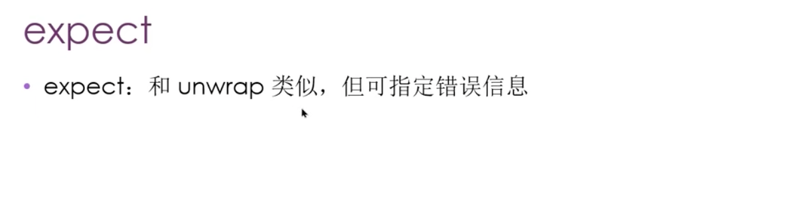

```

use std::{fs::File};
fn main(){
    // let f = File::open("hello.txt");

    // let f = match f {
    //     Ok(file)=>file,
    //     Err(error)=>panic!("{:?}",error),
    // };

    //相当äº
    let f = File::open("hello.txt").expect("无法打开文件");

}
```


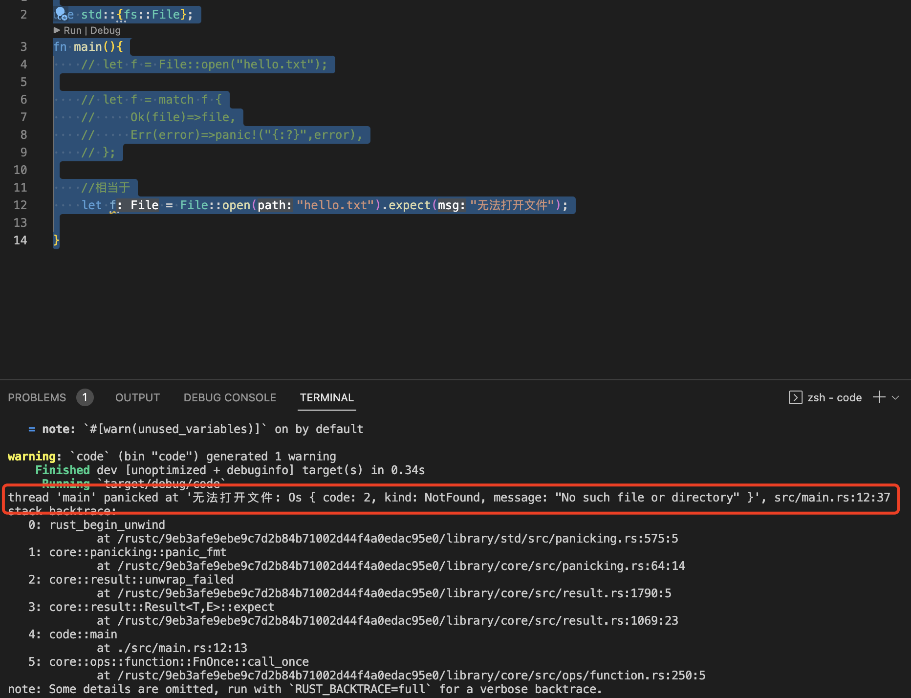


## 27.7 传播错误 ？

- 将错误返å›ç»™è°ƒç”¨è€…


传统的错误

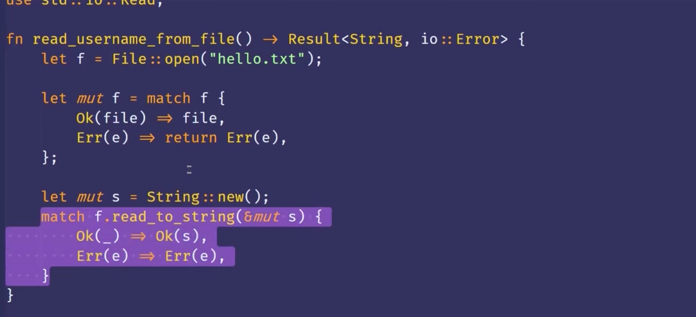


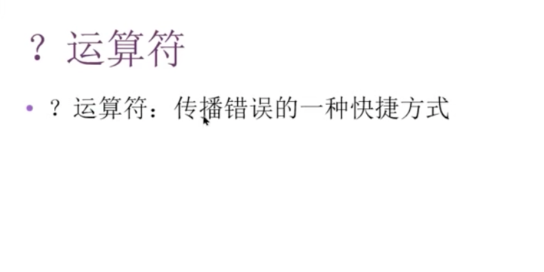

```

use std::{fs::File};
use std::io::{self, Read};
fn main(){
    
    let res = read_file();
    println!("{:?}",res);
}

fn read_file()->Result<String,io::Error>{
    let mut f = File::open("hello.txt")?;
    let mut s =String::with_capacity(100);

    f.read_to_string(&mut s)?;
    Ok(s)
}
```

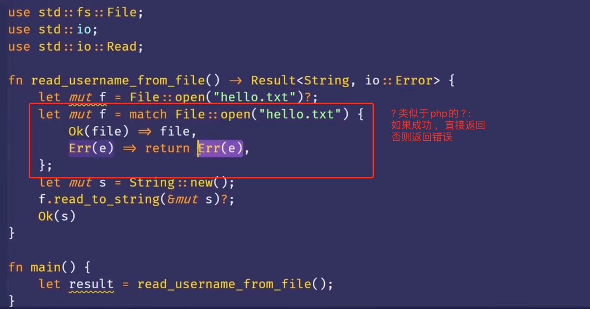


## 27.8 ？ from

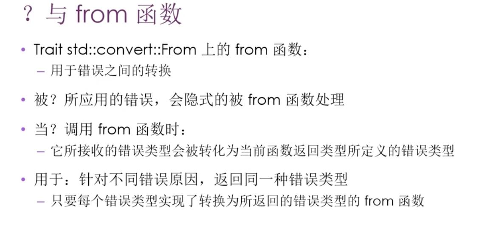

## 27.8 链å¼è°ƒç”¨

```

use std::{fs::File};
use std::io::{self, Read};
fn main(){
    
    let res = read_file();
    println!("{:?}",res);
}

fn read_file()->Result<String,io::Error>{
    let mut s =String::with_capacity(100);

    File::open("hello.txt")?.read_to_string(&mut s)?;
    Ok(s)
}
```

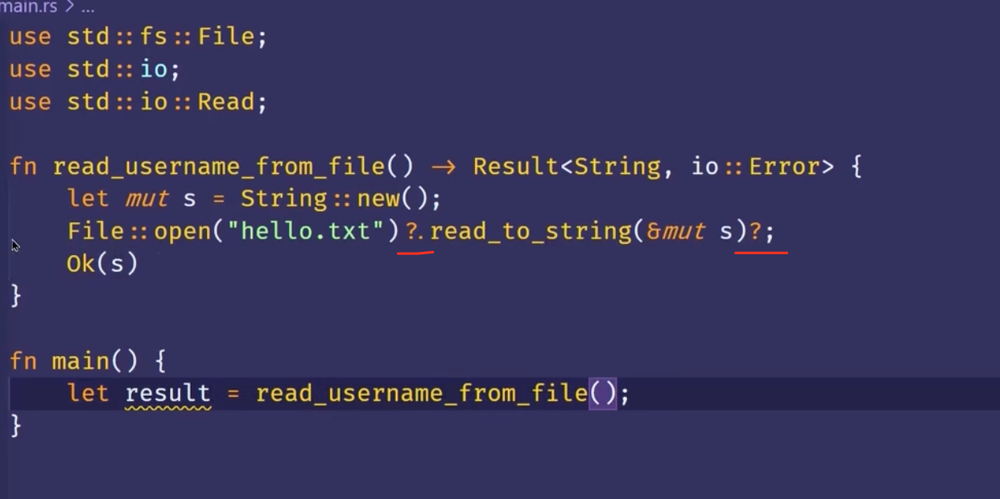


## 27.9 ?åªèƒ½ç”¨äºResult<F,E>


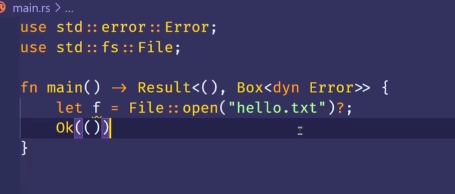


